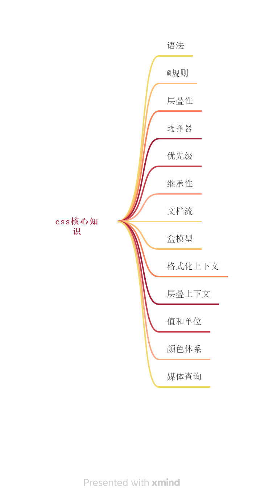
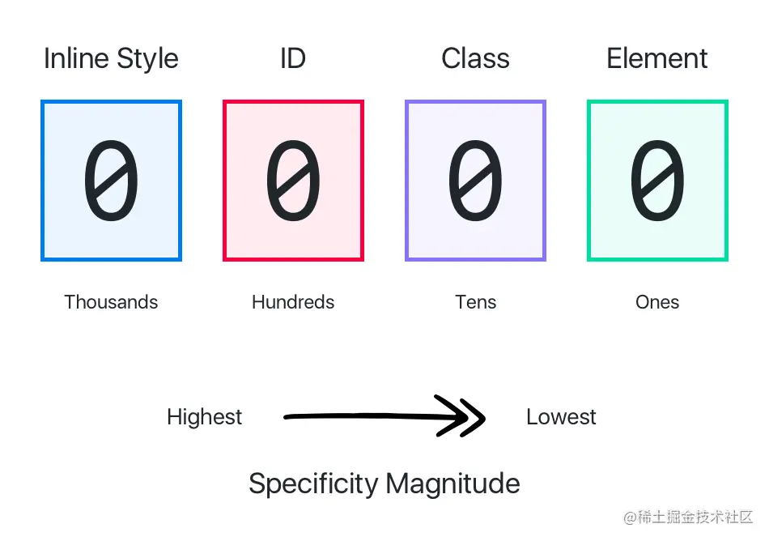
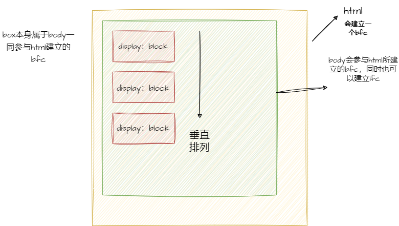
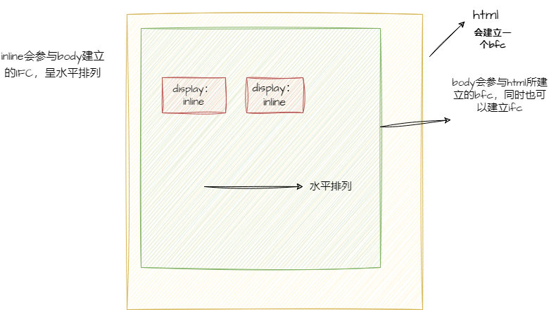
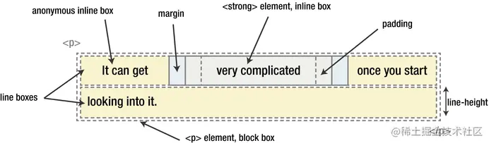
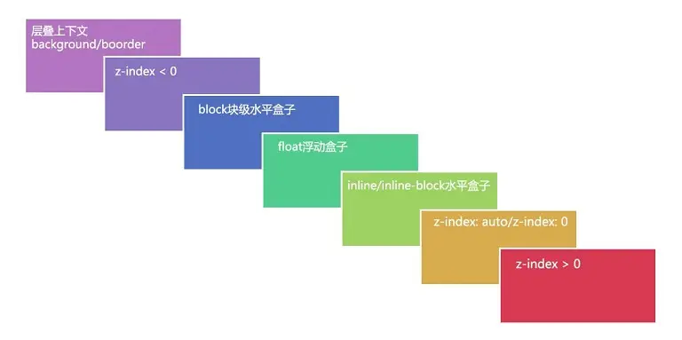
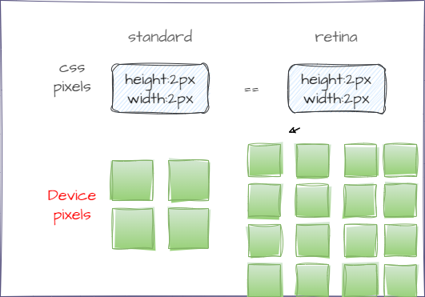
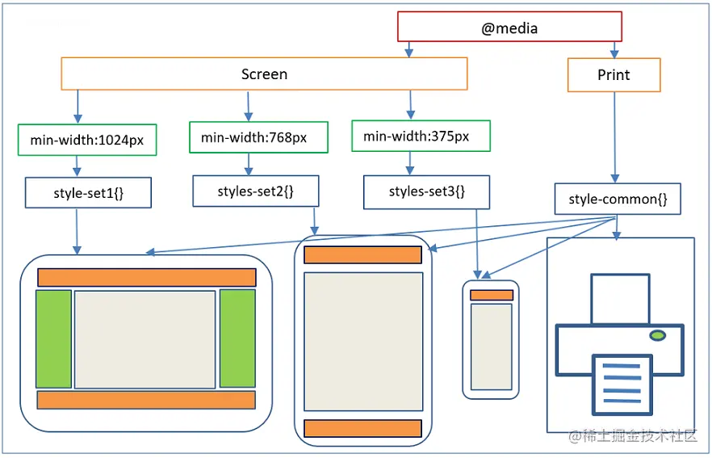

# css基础概览

本篇文章主要介绍css的基础核心知识点。css看起来很简单，其实细节非常多哈哈。先上概览图!


## css语法

css的核心功能是将css属性设定为特定的值
```css
  span {
    color: red;
    text-align: center;
  }
```
css的语法规则集主要包括选择器**span**和声明块**key:value**  

## @规则

除了常规的样式表，有时候需要引入其他信息，比如 ==字符集== ，==其他样式表== ，==字体== ，==媒体查询== ，==动画== 等。
- @namespace 告诉 CSS 引擎必须考虑XML命名空间。
- @media, 如果满足媒体查询的条件则条件规则组里的规则生效。
- @page, 描述打印文档时布局的变化.
- @font-face, 描述将下载的外部的字体。
- @keyframes, 描述 CSS 动画的关键帧。
- @document, 如果文档样式表满足给定条件则条件规则组里的规则生效。 (推延至 CSS Level 4 规范)
- ==@import==  ,用于导入一个外部样式文件
- @support，用于查询特定的 CSS 是否生效，可以结合 not、and 和 or 操作符进行后续的操作。

```css
/* 如果支持自定义属性，则把 body 颜色设置为变量 varName 指定的颜色 */
  @support(--foo:green) {
    body {
      color: var(--varName)
    }
  }
```

link 和 @import 都能导入一个样式文件，它们有什么区别嘛？

- link 是 HTML 标签，除了能导入 CSS 外，还能导入别的资源，比如图片、脚本和字体等；而 @import 是 CSS 的语法，只能用来导入 CSS；
- link 导入的样式会在页面加载时同时加载，@import 导入的样式需等页面加载完成后再加载；
- link 没有兼容性问题，@import 不兼容 ie5 以下；
- link 可以通过 JS 操作 DOM 动态引入样式表改变样式，而@import不可以。


## 层叠性

css简称层叠样式表，简单来说，某个标签的样式有许多的css声明来源都能用到时，按照一定的规则进行层叠，优先级高的起作用。

- 用户代理样式表中的声明(例如，浏览器的默认样式，在没有设置其他样式时使用)。
- 用户样式表中的常规声明(由用户设置的自定义样式。由于 Chrome 在很早的时候就放弃了用户样式表的功能，所以这里将不再考虑它的排序。)。
- 作者样式表中的常规声明(这些是我们 Web 开发人员设置的样式)。
- 作者样式表中的 !important 声明。
- 用户样式表中的 !important 声明S。

## 选择器

css选择器是核心哈哈

### 基础选择器

- 标签选择器: h1
- 类选择器: .checked
- id选择器: #picker
- 通配选择器: *

### 属性选择器

- [attr]：指定属性的元素；
- [attr=val]：属性等于指定值的元素；
- [attr*=val]：属性包含指定值的元素；
- [attr^=val]	：属性以指定值开头的元素；
- [attr$=val]：属性以指定值结尾的元素；
- [attr~=val]：属性包含指定值(完整单词)的元素(不推荐使用)；
- [attr|=val]：属性以指定值(完整单词)开头的元素(不推荐使用)；

### 组合选择器

- 相邻兄弟选择器：A + B
- 普通兄弟选择器：A ~ B
- 子选择器：A > B
- 后代选择器：A B

### 伪类

#### 条件伪类

- :lang()：基于元素语言来匹配页面元素；
- :dir()：匹配特定文字书写方向的元素；
- :has()：匹配包含指定元素的元素；
- :is()：匹配指定选择器列表里的元素；
- :not()：用来匹配不符合一组选择器的元素；

#### 行为伪类

- :active：鼠标激活的元素；
- :hover： 鼠标悬浮的元素；
- ::selection：鼠标选中的元素；

#### 状态伪类

- :target：当前锚点的元素；
- :link：未访问的链接元素；
- :visited：已访问的链接元素；
- :focus：输入聚焦的表单元素；
- :required：输入必填的表单元素；
- :valid：输入合法的表单元素；
- :invalid：输入非法的表单元素；
- :in-range：输入范围以内的表单元素；
- :out-of-range：输入范围以外的表单元素；
- :checked：选项选中的表单元素；
- :optional：选项可选的表单元素；
- :enabled：事件启用的表单元素；
- :disabled：事件禁用的表单元素；
- :read-only：只读的表单元素；
- :read-write：可读可写的表单元素；
- :blank：输入为空的表单元素；
- :current()：浏览中的元素；
- :past()：已浏览的元素；
- :future()：未浏览的元素；

#### 结构伪类

- :root：文档的根元素；
- :empty：无子元素的元素；
- :first-letter：元素的首字母；
- :first-line：元素的首行；
- :nth-child(n)：元素中指定顺序索引的元素；
- :nth-last-child(n)：元素中指定逆序索引的元素；；
- :first-child	：元素中为首的元素；
- :last-child	：元素中为尾的元素；
- :only-child：父元素仅有该元素的元素；
- :nth-of-type(n)	：标签中指定顺序索引的标签；
- :nth-last-of-type(n)：标签中指定逆序索引的标签；
- :first-of-type	：标签中为首的标签；
- :last-of-type：标签中为尾标签；
- :only-of-type：父元素仅有该标签的标签；

#### 伪元素

- ::before：在元素前插入内容；
- ::after：在元素后插入内容；

## 优先级



优先级就是分配给指定的 CSS 声明的一个权重，它由匹配的选择器中的每一种选择器类型的数值决定。为了记忆，可以把权重分成如下几个等级，数值越大的权重越高：

- 10000：!important；
- 01000：内联样式；
- 00100：ID 选择器；
- 00010：类选择器、伪类选择器、属性选择器；
- 00001：元素选择器、伪元素选择器；
- 00000：通配选择器、后代选择器、兄弟选择器；

## 继承性

在 CSS 中有一个很重要的特性就是子元素会继承父元素对应属性计算后的值。比如页面根元素 html 的文本颜色默认是黑色的，页面中的所有其他元素都将继承这个颜色，当申明了如下样式后，box 文本将变成橙色。

```css
body {
  color: orange;
}
.box {
  color: inherit;
}
```
设想一下，如果 CSS 中不存在继承性，那么我们就需要为不同文本的标签都设置一下 color，这样一来的后果就是 CSS 的文件大小就会无限增大。

CSS 属性很多，但并不是所有的属性默认都是能继承父元素对应属性的，那哪些属性存在默认继承的行为呢？一定是那些不会影响到页面布局的属性，可以分为如下几类：

* 字体相关：font-family、font-style、font-size、font-weight 等；
* 文本相关：text-align、text-indent、text-decoration、text-shadow、letter-spacing、word-spacing、white-space、line-height、color 等；
* 列表相关：list-style、list-style-image、list-style-type、list-style-position 等；
* 其他属性：visibility、cursor 等；

对于其他默认不继承的属性也可以通过以下几个属性值来控制继承行为：

* inherit：继承父元素对应属性的计算值；
* initial：应用该属性的默认值，比如 color 的默认值是 #000；
* unset：如果属性是默认可以继承的，则取 inherit 的效果，否则同 initial；
* revert：效果等同于 unset，兼容性差。

## 文档流

css的流式布局会把内容从左到右，从上到下的顺序进行排列展示

- 块级元素默认会占满整行，所以多个块级盒子之间是从上到下排列的；
- 内联元素默认会在一行里一列一列的排布，当一行放不下的时候，会自动切换到下一行继续按照列排布；

### 如何脱离文档流？

脱流文档流指节点脱流正常文档流后，在正常文档流中的其他节点将忽略该节点并填补其原先空间。文档一旦脱流，计算其父节点高度时不会将其高度纳入，脱流节点不占据空间。有两种方式可以让元素脱离文档流：浮动和定位。

- 使用浮动（float）会将元素脱离文档流，移动到容器左/右侧边界或者是另一个浮动元素旁边，该浮动元素之前占用的空间将被别的元素填补，另外浮动之后所占用的区域不会和别的元素之间发生重叠；
- 使用绝对定位（position: absolute;）或者固定定位（position: fixed;）也会使得元素脱离文档流，且空出来的位置将自动被后续节点填补。

## 盒模型

在 CSS 中任何元素都可以看成是一个盒子，而一个盒子是由 4 部分组成的：内容（content）、内边距（padding）、边框（border）和外边距（margin）。

盒模型有 2 种：标准盒模型和 IE 盒模型，分别是由 W3C 和 IExplore 制定的标准。
```css
.box {
  width: 200px;
  height: 200px;
  padding: 10px;
  border: 1px solid #eee;
  margin: 10px;
}
```
标准盒模型认为：盒子的实际尺寸 = 内容（设置的宽/高） + 内边距 + 边框
所以 .box 元素内容的宽度就为 200px，而实际的宽度则是 width + padding-left + padding-right + border-left-width + border-right-width = 200 + 10 + 10 + 1 + 1 = 222。
IE 盒模型认为：盒子的实际尺寸 = 设置的宽/高 = 内容 + 内边距 + 边框
.box 元素所占用的实际宽度为 200px，而内容的真实宽度则是 width - padding-left - padding-right - border-left-width - border-right-width = 200 - 10 - 10 - 1 - 1 = 178。

## 格式化上下文

格式化上下文（Formatting Context）是 CSS2.1 规范中的一个概念，大概说的是页面中的一块渲染区域，规定了渲染区域内部的子元素是如何排版以及相互作用的。

不同类型的盒子有不同格式化上下文，大概有这 4 类：

BFC (Block Formatting Context) 块级格式化上下文；
IFC (Inline Formatting Context) 行内格式化上下文；
FFC (Flex Formatting Context) 弹性格式化上下文；
GFC (Grid Formatting Context) 格栅格式化上下文；

其中 BFC 和 IFC 在 CSS 中扮演着非常重要的角色，因为它们直接影响了网页布局，所以需要深入理解其原理。

### BFC

块格式化上下文，它是一个独立的渲染区域，只有块级盒子参与，它规定了内部的块级盒子如何布局，并且与这个区域外部毫不相干。



### BFC渲染规则

* 内部的盒子会在垂直方向，一个接一个地放置；
* 盒子垂直方向的距离由 margin 决定，属于同一个 BFC 的两个相邻盒子的 margin 会发生重叠；
* 每个元素的 margin 的左边，与包含块 border 的左边相接触(对于从左往右的格式化，否则相反)，即使存在浮动也是如此；
* BFC 的区域不会与 float 盒子重叠；
* BFC 就是页面上的一个隔离的独立容器，容器里面的子元素不会影响到外面的元素。反之也如此。
* 计算 BFC 的高度时，浮动元素也参与计算。

### 如何创建BFC

- 根元素：html
- 非溢出的可见元素：overflow 不为 visible
- 设置浮动：float 属性不为 none
- 设置定位：position 为 absolute 或 fixed
- 定义成块级的非块级元素：display: inline-block/table-cell/table-caption/flex/inline-flex/grid/inline-grid

### BFC应用场景

1、 自适应两栏布局

应用原理：BFC 的区域不会和浮动区域重叠，所以就可以把侧边栏固定宽度且左浮动，而对右侧内容触发 BFC，使得它的宽度自适应该行剩余宽度。

2、清除内部浮动

浮动造成的问题就是父元素高度坍塌，所以清除浮动需要解决的问题就是让父元素的高度恢复正常。而用 BFC 清除浮动的原理就是：计算 BFC 的高度时，浮动元素也参与计算。只要触发父元素的 BFC 即可。

3、 防止垂直 margin 合并

BFC 渲染原理之一：同一个 BFC 下的垂直 margin 会发生合并。所以如果让 2 个元素不在同一个 BFC 中即可阻止垂直 margin 合并。那如何让 2 个相邻的兄弟元素不在同一个 BFC 中呢？可以给其中一个元素外面包裹一层，然后触发其包裹层的 BFC，这样一来 2 个元素就不会在同一个 BFC 中了。

### IFC

IFC 的形成条件非常简单，块级元素中仅包含内联级别元素，需要注意的是当IFC中有块级元素插入时，会产生两个匿名块将父元素分割开来，产生两个 IFC。



### IFC渲染规则

- 子元素在水平方向上一个接一个排列，在垂直方向上将以容器顶部开始向下排列；
- 节点无法声明宽高，其中 margin 和 padding 在水平方向有效在垂直方向无效；
- 节点在垂直方向上以不同形式对齐；
- 能把在一行上的框都完全包含进去的一个矩形区域，被称为该行的线盒（line box）。线盒的宽度是由包含块（containing box）和与其中的浮动来决定；
- IFC 中的 line box 一般左右边贴紧其包含块，但 float 元素会优先排列。
- IFC 中的 line box 高度由 line-height 计算规则来确定，同个 IFC 下的多个 line box 高度可能会不同；
- 当内联级盒子的总宽度少于包含它们的 line box 时，其水平渲染规则由 text-align 属性值来决定；
- 当一个内联盒子超过父元素的宽度时，它会被分割成多盒子，这些盒子分布在多个 line box 中。如果子元素未设置强制换行的情况下，inline box 将不可被分割，将会溢出父元素

```html
<p>It can get <strong>very complicated</storng> once you start looking into it.</p>
```


对应上面这样一串 HTML 分析如下：

p 标签是一个 block container，对内将产生一个 IFC；
由于一行没办法显示完全，所以产生了 2 个线盒（line box）；线盒的宽度就继承了 p 的宽度；高度是由里面的内联盒子的 line-height 决定；
It can get：匿名的内联盒子；
very complicated：strong 标签产生的内联盒子；
once you start：匿名的内联盒子；
looking into it.：匿名的内联盒子

### IFC 应用场景

- 水平居中：当一个块要在环境中水平居中时，设置其为 inline-block 则会在外层产生 IFC，通过 text-align 则可以使其水平居中。
- 垂直居中：创建一个 IFC，用其中一个元素撑开父元素的高度，然后设置其 vertical-align: middle，其他行内元素则可以在此父元素下垂直居中。

## 层叠上下文

特定的 HTML 元素或者 CSS 属性产生层叠上下文，MDN 中给出了这么一个列表，符合以下任一条件的元素都会产生层叠上下文：

- html 文档根元素
- 声明 position: absolute/relative 且 z-index 值不为 auto 的元素；
- 声明 position: fixed/sticky 的元素；
- flex 容器的子元素，且 z-index 值不为 auto；
- grid 容器的子元素，且 z-index 值不为 auto；
- opacity 属性值小于 1 的元素；
- mix-blend-mode 属性值不为 normal 的元素；
- 以下任意属性值不为 none 的元素：
  * transform
  * filter
  * perspective
  * clip-path
  * mask / mask-image / mask-border
- isolation 属性值为 isolate 的元素；
- -webkit-overflow-scrolling 属性值为 touch 的元素；
- will-change 值设定了任一属性而该属性在 non-initial 值时会创建层叠上下文的元素；
- contain 属性值为 layout、paint 或包含它们其中之一的合成值（比如 contain: strict、contain: content）的元素。

### 层叠等级

层叠等级指节点在三维空间 Z 轴上的上下顺序。它分两种情况：

* 在同一个层叠上下文中，它描述定义的是该层叠上下文中的层叠上下文元素在 Z 轴上的上下顺序；
* 在其他普通元素中，它描述定义的是这些普通元素在 Z 轴上的上下顺序；

普通节点的层叠等级优先由其所在的层叠上下文决定，层叠等级的比较只有在当前层叠上下文中才有意义，脱离当前层叠上下文的比较就变得无意义了。

### 层叠顺序

在同一个层叠上下文中如果有多个元素，那么他们之间的层叠顺序是怎么样的呢？



以下这个列表越往下层叠优先级越高，视觉上的效果就是越容易被用户看到（不会被其他元素覆盖）：

* 层叠上下文的 border 和 background
* z-index < 0 的子节点
* 标准流内块级非定位的子节点
* 浮动非定位的子节点
* 标准流内行内非定位的子节点
* z-index: auto/0 的子节点
* z-index > 0的子节点

参考:[彻底搞懂css层叠上下文，层叠等级，层叠顺序，z-index](https://juejin.cn/post/6844903667175260174)

## 值和单位

CSS 的声明是由属性和值组成的，而值的类型有许多种：

- 数值：长度值 ，用于指定例如元素 width、border-width、font-size 等属性的值；
- 百分比：可以用于指定尺寸或长度，例如取决于父容器的 width、height 或默认的 font-size；
- 颜色：用于指定 background-color、color 等；
- 坐标位置：以屏幕的左上角为坐标原点定位元素的位置，比如常见的 background-position、top、right、bottom 和 left 等属性；
- 函数：用于指定资源路径或背景图片的渐变，比如 url()、linear-gradient() 等；

### px

屏幕分辨率是指在屏幕的横纵方向上的像素点数量，比如分辨率 1920×1080 意味着水平方向含有 1920 个像素数，垂直方向含有 1080 个像素数



而 px 表示的是 CSS 中的像素，在 CSS 中它是绝对的长度单位，也是最基础的单位，其他长度单位会自动被浏览器换算成 px。但是对于设备而言，它其实又是相对的长度单位，比如宽高都为 2px，在正常的屏幕下，其实就是 4 个像素点，而在设备像素比(devicePixelRatio) 为 2 的 Retina 屏幕下，它就有 16 个像素点。所以屏幕尺寸一致的情况下，屏幕分辨率越高，显示效果就越细腻。

### 设备像素（Device pixels）

设备屏幕的物理像素，表示的是屏幕的横纵有多少像素点；和屏幕分辨率是差不多的意思。

### 设备像素比（DPR）

设备像素比表示 1 个 CSS 像素等于几个物理像素。

计算公式：DPR = 物理像素数 / 逻辑像素数；

在浏览器中可以通过 window.devicePixelRatio 来获取当前屏幕的 DPR。

### em

em 是 CSS 中的相对长度单位中的一个

- 在 font-size 中使用是相对于父元素的 font-size 大小，比如父元素 font-size: 16px，当给子元素指定 font-size: 2em 的时候，经过计算后它的字体大小会是 32px；
- 在其他属性中使用是相对于自身的字体大小，如 width/height/padding/margin 等；

em 在计算的时候是会层层计算的，比如：

```html
  <div>
    <p></p>
  </div>
```
```css
  div{font-size:2em}
  p{font-size:2em}
```

我们们都知道每个浏览器都会给 HTML 根元素 html 设置一个默认的 font-size，而这个值通常是  ==16px==,所以 p 标签最终计算出来后的字体大小会是 16 * 2 * 2 = 64px

### rem

rem(root em) 和 em 一样，也是一个相对长度单位，不过 rem 相对的是 HTML 的根元素 html。
rem 由于是基于 html 的 font-size 来计算，所以通常用于自适应网站或者 H5 中。
比如在做 H5 的时候，前端通常会让 UI 给 750px 宽的设计图，而在开发的时候可以基于 iPhone X 的尺寸 375px * 812px 来写页面，这样一来的话，就可以用下面的 JS 依据当前页面的视口宽度自动计算出根元素 html 的基准 font-size 是多少。

```js
(function (doc, win) {
    var docEl = doc.documentElement,
        resizeEvt = 'orientationchange' in window ? 'orientationchange' : 'resize',
        psdWidth = 750,  // 设计图宽度
        recalc = function () {
            var clientWidth = docEl.clientWidth;
            if ( !clientWidth ) return;
            if ( clientWidth >= 640 ) {
                docEl.style.fontSize = 200 * ( 640 / psdWidth ) + 'px';
            } else {
                docEl.style.fontSize = 200 * ( clientWidth / psdWidth ) + 'px';
            }
        };

    if ( !doc.addEventListener ) return;
    // 绑定事件的时候最好配合防抖函数
    win.addEventListener( resizeEvt, debounce(recalc, 1000), false );
    doc.addEventListener( 'DOMContentLoaded', recalc, false );
    
    function debounce(func, wait) {
        var timeout;
        return function () {
            var context = this;
            var args = arguments;
            clearTimeout(timeout)
            timeout = setTimeout(function(){
                func.apply(context, args)
            }, wait);
        }
    }
})(document, window);
```
比如当视口是 375px 的时候，经过计算 html 的 font-size 会是 100px，这样有什么好处呢？好处就是方便写样式，比如从设计图量出来的 header 高度是 50px 的，那我们写样式的时候就可以直接写：

```css
header {
    height: 0.5rem;
}
```

### vm/vh

vw 和 vh 分别是相对于屏幕视口宽度和高度而言的长度单位：

1vw = 视口宽度均分成 100 份中 1 份的长度；
1vh = 视口高度均分成 100 份中 1 份的长度；

在 JS 中 100vw = window.innerWidth，100vh = window.innerHeight。

vw/vh 的出现使得多了一种写自适应布局的方案，开发者不再局限于 rem 了。

相对视口的单位，除了 vw/vh 外，还有 vmin 和 vmax：

vmin：取 vw 和 vh 中值较小的；
vmax：取 vw 和 vh 中值较大的；

## 颜色体系

根据 CSS 颜色草案 中提到的颜色值类型，大概可以把它们分为这几类：

- 颜色关键字(white,black,orange...)
- transparent 关键字
- currentColor 关键字
- RGB 颜色
- HSL 颜色

### currentColor 关键字
currentColor 会取当前元素继承父级元素的文本颜色值或声明的文本颜色值，即 computed 后的 color 值。

比如，对于如下 CSS，该元素的边框颜色会是 red：

```css
.btn {
    color: red;
    border: 1px solid currentColor;
}
```
### 十六进制

十六进制 中的每种颜色的值范围是 00~ff，值越大表示颜色越深。所以一个颜色正常是 6 个十六进制字符加上 # 组成，比如红色就是 #ff0000。
如果 十六进制 颜色需要加上不透明度，那就需要加上 alpha 通道的值，它的范围也是 00~ff，比如一个带不透明度为 67% 的红色可以这样写 #ff0000aa。
使用十六进制符号表示颜色的时候，都是用 2 个十六进制表示一个颜色，如果这 2 个字符相同，还可以缩减成只写 1 个，比如，红色 #f00；带 67% 不透明度的红色 #f00a。

作者：大海我来了
链接：https://juejin.cn/post/6941206439624966152
来源：稀土掘金
著作权归作者所有。商业转载请联系作者获得授权，非商业转载请注明出处。

### rgb

当 RGB 用函数表示的时候，每个值的范围是 0~255 或者 0%~100%，所以红色是 rgb(255, 0, 0)， 或者 rgb(100%, 0, 0)。
如果需要使用函数来表示带不透明度的颜色值，值的范围是 0~1 及其之间的小数或者 0%~100%，比如带 67% 不透明度的红色是 rgba(255, 0, 0, 0.67) 或者 rgba(100%, 0%, 0%, 67%)

::: tip

需要注意的是 RGB 这 3 个颜色值需要保持一致的写法，要嘛用数字要嘛用百分比，而不透明度的值的可以不用和 RGB 保持一致写法。比如 rgb(100%, 0, 0) 这个写法是无效的；而 rgb(100%, 0%, 0%, 0.67) 是有效的。

:::

### HSL[A] 颜色

HSL[A] 颜色是由色相(hue)-饱和度(saturation)-亮度(lightness)-不透明度组成的颜色体系。

- 色相（H）是色彩的基本属性，值范围是 0360 或者 0deg360deg， 0 (或 360) 为红色, 120 为绿色, 240 为蓝色；
- 饱和度（S）是指色彩的纯度，越高色彩越纯，低则逐渐变灰，取 0~100% 的数值；0% 为灰色， 100% 全色；
- 亮度（L），取 0~100%，0% 为暗，100% 为白；
- 不透明度（A），取 0100%，或者01及之间的小数；

给一个按钮设置不透明度为 67% 的红色的 color 的写法，以下全部写法效果一致：
```css
  button {
    color: #ff0000aa;
    color: #f00a;
    color: rgba(255, 0, 0, 0.67);
    color: rgb(100% 0% 0% / 67%);
    color: hsla(0, 100%, 50%, 67%);
    color: hsl(0deg 100% 50% / 67%);
}
```

## 媒体查询

媒体查询是指针对不同的设备、特定的设备特征或者参数进行定制化的修改网站的样式。

你可以通过给 <link> 加上 media 属性来指定该样式文件只能对什么设备生效，不指定的话默认是 all，即对所有设备都生效：

```html
<link rel="stylesheet" src="styles.css" media="screen" />
<link rel="stylesheet" src="styles.css" media="print" />
```

都支持哪些设备类型？

- all：适用于所有设备；
- print：适用于在打印预览模式下在屏幕上查看的分页材料和文档；
- screen：主要用于屏幕；
- speech：主要用于语音合成器。



除了通过 <link> 让指定设备生效外，还可以通过 @media 让 CSS 规则在特定的条件下才能生效。响应式页面就是使用了 @media 才让一个页面能够同时适配 PC、Pad 和手机端。

```css
@media (min-width: 1024px) {}
```
媒体查询支持逻辑操作符：

and：查询条件都满足的时候才生效；
not：查询条件取反；
only：整个查询匹配的时候才生效，常用语兼容旧浏览器，使用时候必须指定媒体类型；
逗号或者 or：查询条件满足一项即可匹配；

媒体查询还支持众多的[媒体特性](https://developer.mozilla.org/zh-CN/docs/Web/CSS/CSS_media_queries/Using_media_queries#%E5%AA%92%E4%BD%93%E7%89%B9%E6%80%A7)，使得它可以写出很复杂的查询条件：


