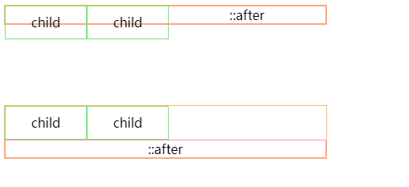

# css常见需求

## 自定义属性

之前我们通常是在less scss这些预处理器里才可以使用变量，而现在css里也支持了变量的用法。通过自定义属性就可以在想要使用的地方引用它。

自定义属性也和普通属性一样具有级联性，申明在 :root 下的时候，在全文档范围内可用，而如果是在某个元素下申明自定义属性，则只能在它及它的子元素下才可以使用。

自定义属性必须通过 --x 的格式申明，比如：--theme-color: red; 使用自定义属性的时候，需要用 var 函数。比如：

```css
<!-- 定义自定义属性 -->
:root {
    --theme-color: red;
}

<!-- 使用变量 -->
h1 {
    color: var(--theme-color);
}
```

如果想通过js来改变这些变量，可以通过 ==document.documentElement.style.setProperty()== 来修改--theme-color的值

## 1px 边框解决方案

Retina 显示屏比普通的屏幕有着更高的分辨率，所以在移动端的 1px 边框就会看起来比较粗，为了美观通常需要把这个线条细化处理。这里有篇文章列举了 7 中方案可以参考一下：[7种方法解决移动端Retina屏幕1px边框问题](https://link.juejin.cn/?target=https%3A%2F%2Fwww.jianshu.com%2Fp%2F7e63f5a32636)

而这里附上最后一种通过伪元素和 transform 实现的相对完美的解决方案：

只设置单条底部边框：
```css
.scale-1px-bottom {
    position: relative;
    border:none;
}
.scale-1px-bottom::after {
    content: '';
    position: absolute;
    left: 0;
    bottom: 0;
    background: #000;
    width: 100%;
    height: 1px;
    -webkit-transform: scaleY(0.5);
    transform: scaleY(0.5);
    -webkit-transform-origin: 0 0;
    transform-origin: 0 0;
}
```

同时设置 4 条边框：

```css
.scale-1px {
    position: relative;
    margin-bottom: 20px;
    border:none;
}
.scale-1px::after {
    content: '';
    position: absolute;
    top: 0;
    left: 0;
    border: 1px solid #000;
    -webkit-box-sizing: border-box;
    box-sizing: border-box;
    width: 200%;
    height: 200%;
    -webkit-transform: scale(0.5);
    transform: scale(0.5);
    -webkit-transform-origin: left top;
    transform-origin: left top;
}
```

## 清除浮动

什么是浮动：浮动元素会脱离文档流并向左/向右浮动，直到碰到父元素或者另一个浮动元素。
为什么要清楚浮动，它造成了什么问题？
因为浮动元素会脱离正常的文档流，并不会占据文档流的位置，所以如果一个父元素下面都是浮动元素，那么这个父元素就无法被浮动元素所撑开，这样一来父元素就丢失了高度，这就是所谓的浮动造成的父元素高度坍塌问题。
父元素高度一旦坍塌将对后面的元素布局造成影响，为了解决这个问题，所以需要清除浮动，让父元素恢复高度，那该如何做呢？
这里介绍两种方法：通过 BFC 来清除、通过 clear 来清除。

### BFC清除浮动

面介绍 BFC 的时候提到过，计算 BFC 高度的时候浮动子元素的高度也将计算在内，利用这条规则就可以清楚浮动。
假设一个父元素 parent 内部只有 2 个子元素 child，且它们都是左浮动的，这个时候 parent 如果没有设置高度的话，因为浮动造成了高度坍塌，所以 parent 的高度会是 0，此时只要给 parent 创造一个 BFC，那它的高度就能恢复了。
而产生 BFC 的方式很多，我们可以给父元素设置overflow: auto 来简单的实现 BFC 清除浮动，但是为了兼容 IE 最好用 overflow: hidden。

### 通过 clear 清除浮动

```html
<div class="parent">
  <div class="child">child</div>
  <div class="child">child</div>
</div>

<div class="parent mart100 clearfix">
  <div class="child">child</div>
  <div class="child">child</div>
</div>
```

```css
.mart100 {
  margin-top: 100px;
}
.parent {
  width: 400px;
  border: 1px solid #FFB366;
}
.child {
  float: left;
  width: 100px;
  height: 40px;
  line-height: 40px;
  text-align: center;
  border: 1px solid #79e679;
}
.parent::after {
  content: "::after";
  text-align: center;
  display: block;
  border: 1px solid #FF9999;
}
.clearfix::after {
  clear: both;
}
```
效果如下：



## 消除浏览器默认样式

针对同一个类型的 HTML 标签，不同的浏览器往往有不同的表现，所以在网站制作的时候，开发者通常都是需要将这些浏览器的默认样式清除，让网页在不同的浏览器上能够保持一致。

一堆通用的样式用来重置浏览器默认样式，这些样式通常会放到一个命名为 reset.css 文件中

```css
html, body, div, span, applet, object, iframe,
h1, h2, h3, h4, h5, h6, p, blockquote, pre,
a, abbr, acronym, address, big, cite, code,
del, dfn, em, img, ins, kbd, q, s, samp,
small, strike, strong, sub, sup, tt, var,
b, u, i, center,
dl, dt, dd, ol, ul, li,
fieldset, form, label, legend,
table, caption, tbody, tfoot, thead, tr, th, td,
article, aside, canvas, details, embed, 
figure, figcaption, footer, header, hgroup, 
menu, nav, output, ruby, section, summary,
time, mark, audio, video {
    margin: 0;
    padding: 0;
    border: 0;
    font-size: 100%;
    font: inherit;
    vertical-align: baseline;
}
/* HTML5 display-role reset for older browsers */
article, aside, details, figcaption, figure, 
footer, header, hgroup, menu, nav, section {
    display: block;
}
body {
    line-height: 1;
}
ol, ul {
    list-style: none;
}
blockquote, q {
    quotes: none;
}
blockquote:before, blockquote:after,
q:before, q:after {
    content: '';
    content: none;
}
table {
    border-collapse: collapse;
    border-spacing: 0;
}
```

Normalize.css 是一种现代的、为 HTML5 准备的优质替代方案，现在已经有很多知名的框架和网站在使用它了。

区别于 reset.css，Normalize.css 有如下特点：

- reset.css 几乎为所有标签都设置了默认样式，而 Normalize.css 则是有选择性的保护了部分有价值的默认值；
- 修复了很多浏览器的 bug，而这是 reset.css 没做到的；
- 不会让你的调试工具变的杂乱，相反 reset.css 由于设置了很多默认值，所以在浏览器调试工具中往往会看到一大堆的继承样式，显得很杂乱；
- Normalize.css 是模块化的，所以可以选择性的去掉永远不会用到的部分，比如表单的一般化；
- Normalize.css 有详细的说明文档；

## 长文本处理

默认：字符太长溢出了容器

### 字符超出部分换行

```css
.wrap {
  overflow-wrap: break-word;
}
```

### 字符超出位置使用连字符

```css
.hyphens {
  hyphens: auto;
}
```

### 单行文本超出省略
```css
.ellipsis {
  white-space: nowrap;
  overflow: hidden;
  text-overflow: ellipsis;
}
```

### 多行文本超出省略

```css
.line-clamp {
  overflow: hidden;
  text-overflow: ellipsis;
  display: -webkit-box;
  -webkit-line-clamp: 2;
  -webkit-box-orient: vertical;
}
```

### 整块文本溢出处理

```css
.block-line-clamp {
  width: 200px;
  white-space: normal;
  overflow : hidden;
  text-overflow: ellipsis;
  display: -webkit-box;
  -webkit-line-clamp: 1;
  -webkit-box-orient: vertical;
}
.block-line-clamp span {
  display: inline-block;
}
```
如下图


## 水平垂直居中

让元素在父元素中呈现出水平垂直居中的形态，无非就 2 种情况：

* 单行的文本、inline 或者 inline-block 元素；
* 固定宽高的块级盒子；
* 不固定宽高的块级盒子；

### 单行的文本.inline或者inline-block

#### 水平居中

```css
.parent{
  text-align: center;
}
```

#### 垂直居中

```css
.single-line {
    padding-top: 10px;
    padding-bottom: 10px;
}
/**或者*/
.single-line {
    height: 100px;
    line-height: 100px;
}
```

### 固定宽高的块级盒子

```css
/**absolute + 负margin*/
.parent {
  position: relative;
}
.child {
  width: 100px;
  height: 100px;
  position: absolute;
  left: 50%;
  top: 50%;
  margin: -50px 0 0 -50px;
}

/**absolute + margin auto*/
.parent {
  position: relative;
}
.child {
  width: 100px;
  height: 100px;
  position: absolute;
  left: 0;
  right: 0;
  top: 0;
  bottom: 0;
  margin: auto;
}

/**absolute + calc*/
.parent {
  position: relative;
}
.child {
  width: 100px;
  height: 100px;
  position: absolute;
  left: calc(50% - 50px);
  height: calc(50% - 50px);
}
```
::: tip

需要注意的是 calc(50% - 50px) 不要写成calc(50%-50px),否则不生效, 不留空格的话css解析将 减号(-)有可能识别为负号(-)

:::

### 不固定的宽高的块级盒子

```css
/**absolute + transform*/
.parent {
  position: relative;
}
.child {
  position: absolute;
  left: 50%;
  top: 50%;
  transform: translate(-50%,-50%);
}

/**line-height + vertical-align*/
.parent {
  line-height: 150px;
  text-align: center;
}
.child {
  display: inline-block;
  line-height: initial;
  vertical-align: middle;
}

/**writing-mode*/
.parent {
  writing-mode: vertical-lr;
  text-align: center;
}
.middle {
  display: inline-block;
  writing-mode: horizontal-tb;
  text-align: center;
  width: 100%;
}
.child {
  display: inline-block;
}

/**table-cell*/
.parent {
  display: table-cell;
  vertical-align: middle;
  text-align: center;
}
.child {
  display: inline-block;
}

/**flex*/
.parent {
  display: flex;
  justify-content: center;
  align-items: center;
}

/**grid*/
.parent {
  display: grid;
}
.child {
  justify-self: center;
  align-self: center;
}
```