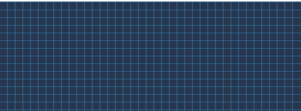
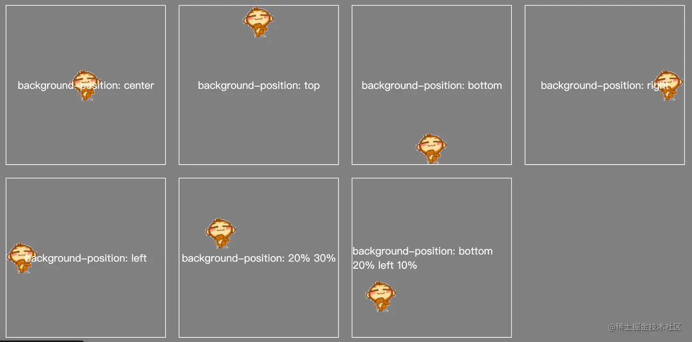

# background属性简介

## 概览

background一共有8个属性，css2.1中5个，css3中加了3个。

### css2.1

- background-color: 背景颜色
- background-image: 背景图片
- background-repeat: 重复背景图片
- background-attachment: 是否固定或者随着页面的其余部分滚动
- background-position: 背景图片的位置

### css3

- background-size: 背景的尺寸
- background-origin: 背景图片定位区域
- background-clip: 背景图片绘制区域

background的可以简写为 :
```css
.bg{
    background : [background-color] [background-image] [background-repeat] [background-attachment] [background-position] / [background-size] [background-origin] [background-clip]
}
```


## 属性简介

### **background-color**

背景颜色 支持多种类型

- color_name 规定颜色值为颜色名称的背景颜色（比如 red）。
- hex_number 规定颜色值为十六进制值的背景颜色（比如 #ff0000）。
- rgb_number 规定颜色值为 rgb 代码的背景颜色（比如 rgb(255,0,0)）。
- transparent 默认值。背景颜色为透明。
- inherit 规定应该从父元素继承背景颜色。

### **background-image**

背景图片 尽量用引号包起来

```css
.div1{
    /** 能识别 **/ 
    background-image: url(http://xxxxxxxxx123.jpg);
    /** 识别不了 **/
    background-image: url(http://xxxxxxxxx-(1)-600x600.jpg);
    /** 加了引号 能识别 **/
    background-image: url('http://xxxxxxxxx-(1)-600x600.jpg');
    /**base64**/
    background-image: url('base64');
}
```
```css
.bg {
    background-image: url('images/1.png'),
                      url('images/2.png'),
                      url('images/3.png');
    background-repeat: no-repeat,no-repeat,no-repeat;
    background-position: center top,center bottom,center top;
}
```
* 当background-color和background-image同时存在时，backgroun-image会覆盖背景色。
* 也可以支持插入多张背景图，须用逗号分割起来。

### **background-repeat**

background-repeat属性实际上也是一个简写，其规则为：若只有一值，则为设置X和Y轴（水平和垂直）方向上背景图宽高大小不足的时候，是否复制该图片。(默认值为xy轴平铺)



像这种风格的背景图一般是平铺出来的，优点就是适应各种尺寸的背景，同时也可以减小引入图片的体积。

### **background-attachment**

滚动或者固定背景
- scroll 默认值。背景图像会随着页面其余部分的滚动而移动。
- fixed 当页面的其余部分滚动时，背景图像不会移动。
- local：背景图片会随着元素的内容滚动而滚动。
- inherit 规定应该从父元素继承 background-attachment属性的设置。

:thinking:解释很抽象，看看下面这个，其实就是父元素与body元素的滚动区别


|      |  滚动内容所在元素的滚动条 |  滚动页面滚动条 | 描述 |
| ---- | ---- | ---- | ---- |
| scroll | 背景图片不滚动 | 背景图片滚动 | |
| fixed | 背景图片不滚动 | 背景图片不滚动 | 此时背景图片贴着窗口 |
| local | 背景图片滚动 | 背景图片滚动 |  |

---

::: normal-demo clip-path

```html
<div class="one">
  <h1>Hello World!</h1>
  <p>背景图片不重复，设置 position 实例。</p>
  <p>背景图片只显示一次，并与文本分开。</p>
  <p>实例中还添加了 margin-right 属性用于让文本与图片间隔开。</p>
  <p>实例中还添加了 margin-right 属性用于让文本与图片间隔开。</p>
  <p>实例中还添加了 margin-right 属性用于让文本与图片间隔开。</p>
  <p>实例中还添加了 margin-right 属性用于让文本与图片间隔开。</p>
</div>
<div class="two"></div>
```

```css
.one{
	height: 200px;
	overflow-y: auto;
	background-color: cornflowerblue;
	background-image:url('/assets/images/cover1.jpg');
	background-repeat:no-repeat;
	background-position:right top;
	background-size:163px 150px;
	background-attachment:scroll;
}
.two{
	height: 1000px;
}
```

:::

### **background-position**

图片位置支持3种类型: 百分比，单位，英文关键字。三种类型能混合着写，默认值为 0% 0%;

#### **单位**

可以是px或其他单位。第一个值是水平位置，第二个值是垂直位置。
左上角是 0 0。遵循水平向右为x正方向，垂直向下为y正方向坐标系。
如果仅定义一个值，另外一个为50%。
```css
.bg {
    /* 意味着背景图左上角从坐标(0,0)移动到坐标为(10,50),表现为背景图右移10下移50 */
    background-position: 10px 50px;
     /* 意味着背景图左上角从坐标(0,0)移动到坐标为(-10,50)，表现为背景图左移10下移50 */
    background-position：-10px 50px;
}
```

#### **百分比单位**

第一个值是水平位置，第二个值是垂直位置。
左上角是 0% 0%。右下角是 100% 100%。
如果仅定义一个值，另外一个为50%。

首先我们来思考一个问题:thinking:
```css
.bg {
    background-position: -50px 20px;
    background-position: -50% -20%;
}
```
- 当写具体数值的时候，负号一定是像相反方向的运动，因为水平向右为正，所以-50表示左移50px
  这种判断方式很常见，比如position的定位也是类似的，left值表示以父元素左侧为基准，负号表示像左移动，正号向右移动
- 但如果是==百分比单位负号==还符合向左移动吗？答案是不一定,很多人有惯性思维(还以为向左，本人就犯过这种错):cry:

这是因为background-position的百分号负值怎么移动和平常的margin，position负值表现不太一样

实际上是有一个公式的：(此公式来自css2规范)
==positionX = (容器的宽度-图片的宽度) * percentX;==
==positionY = (容器的高度-图片的高度) * percentY;==

这里的positionX和positionY的值就是背景图像左上角最终坐标。而当percentX为负时，positionX一定为负吗，显然还要看容器的宽度和图片的宽度谁大谁小。也就是说通过计算后，positionX为负才真正表现为向左移动，而percentX为负表现为向左向右都有可能

所以当==容器宽度大于图片宽度==时，background-position：100% 100% 表示左上角向右移动(容器的宽度-图片的宽度)px,向左移动(容器的宽度-图片的宽度)px,这样刚好移动到右下角

#### **英文关键字**

如果仅定义了一个关键字，另外一个为center
值: center top bottom left right
效果如下



由此可以推出
```text
left left等价于0% 0%  left center等价于 0% 50%  bottom bottom 等价于 100% 100%等等
```

### **background-size**

背景大小 有四种类型

```css
.div1{
  background-size: auto auto|100% 100%|contain|cover;
}
```

#### **值**

设置背景图像的高度和宽度。
第一个值设置宽度，第二个值设置高度。
如果只设置一个值，则第二个值会被设置为 "auto"，auto会自适应长度或者宽度以保持原来图像宽高比；

#### **百分比**

以父元素的百分比来设置背景图像的宽度和高度。
第一个值设置宽度，第二个值设置高度。
如果只设置一个值，则第二个值会被设置为 "auto"。

#### **cover**

把背景图像扩展至足够大，以使背景图像完全覆盖背景区域。
背景图像的某些部分也许无法显示在背景定位区域中。

#### **contain**

把图像扩展至原图像宽高比，以使其宽度和高度完全适应内容区域。

### **background-origin**

背景的相对定位
背景图像的 background-attachment属性为 fixed，则该属性没有效果。

- padding-box 背景图像相对于内边距框来定位。
- border-box 背景图像相对于边框盒来定位。
- content-box 背景图像相对于内容框来定位。

也可以理解为background从哪个地方开始绘制,默认从padding区域（包含padding）开始往内绘制背景-paddingbox

### **background-clip**

规定背景的绘制区域

- border-box:此值为默认值，背景从border区域向外裁剪，也就是超出部分将被裁剪掉
- padding-box：背景从padding区域向外裁剪，超过padding区域的背景将被裁剪掉
- context-box：背景从content区域向外裁剪，超过context区域的背景将被裁剪掉
- text 文字以外的区域被裁减

::: playground#vue 渐变文字

@file App.vue

```vue
<script setup>
</script>

<template>
<div id="test">
测试文字测试文字测试文字测试文字
</div>
</template>
<style scoped>
#test{
    margin: 0 auto;
    width: 300px;
    height: 100px;
    /*重点下面三个*/
    background: -webkit-linear-gradient(left,red,orange,blue,green);
    -webkit-background-clip: text;
    color: transparent;
}
</style>
```
@file style.css

```css
#test{
    margin: 0 auto;
    width: 300px;
    height: 100px;
    /*重点下面三个*/
    background: -webkit-linear-gradient(left,red,orange,blue,green);
    -webkit-background-clip: text;
    color: transparent;
}
```


@import

```json
{
  "imports": {
    "vue": "https://sfc.vuejs.org/vue.runtime.esm-browser.js"
  }
}
```

:::


