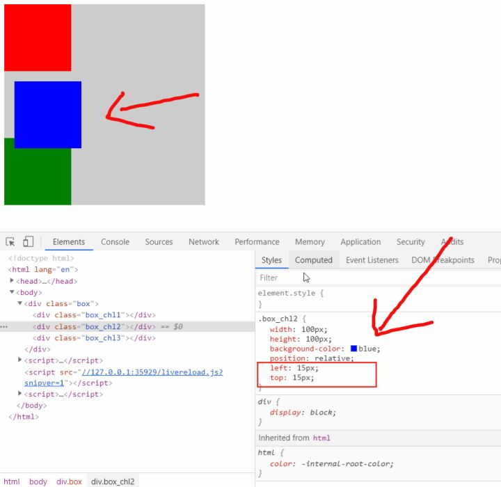

# position属性简介

先来看看什么是文档流：

w3c里面的解释是：正常流中的框属于格式化上下文，它可以是块的或内联的，但不能同时出现。块级框参与块格式化上下文。内联级别的框参与内联格式上下文。

有三种情况将使得元素脱离文档流而存在，分别是 float，absolute ，fixed

position属性在通常情况下有4个可选值，分别是：static、relative、absolute、fixed。还有第5个属性sticky，因部分浏览器可能还不支持，所以就先不介绍

## static 默认值

该关键字指定元素使用正常的布局行为，遵循正常的文档流对象。此时 top、right、bottom、left 属性无效

```html
<style>
	.box {
		width: 300px;
		height: 300px;
		background-color: #ccc;
	}

	.box_chl {
		width: 100px;
		height: 100px;
		background-color: red;

		position: static;
		/* 这个left没有起作用 */
		left: 10px;
	}
</style>
<body>
	<div class="box">
		<div class="box_chl">
		</div>
	</div>
</body>

```

## relative 相对定位

```html
<style>
	.box {
		width: 300px;
		height: 300px;
		background-color: #ccc;
	}

	.box_chl1 {
		width: 100px;
		height: 100px;
		background-color: red;
	}
	.box_chl2 {
		width: 100px;
		height: 100px;
		background-color: blue;
		
		position: relative;
	}
	.box_chl3 {
		width: 100px;
		height: 100px;
		background-color: green;
	}
</style>
<body>
	<div class="box">
		<div class="box_chl1"></div>
		<div class="box_chl2"></div>
		<div class="box_chl3"></div>
	</div>
</body>
```



## absolute 绝对定位

绝对定位的元素的位置相对于最近的已定位父元素，如果元素没有已定位的父元素，那么它的位置相对于html

absolute 定位使元素的位置与文档流无关，因此不占据空间。绝对定位后会脱离文档流

absolute 定位的元素和其他元素重叠。

```html
<style>
	.box {
		width: 300px;
		height: 300px;
		background-color: #ccc;
	}

	.box_chl1 {
		width: 100px;
		height: 100px;
		background-color: red;
		margin-left: 50px;
	}
	
	.box_chl1_demo{
		width: 50px;
		height: 50px;
		background: #00FFFF;
		position: absolute;
		left: 30px;
	}
</style>

<body>
	<div class="box">
		<div class="box_chl1">
			<div class="box_chl1_demo">
				
			</div>
		</div>
	</div>
</body>
```

## fixed 固定定位

元素的位置相对于浏览器窗口是固定位置。即使窗口是滚动的它也不会移动。

Fixed定位使元素的位置与文档流无关，因此不占据空间。

Fixed定位的元素和其他元素重叠。

```html
<style>
	.box {
		width: 100%;
		height: 4000px;
		background-color: #ccc;
		background: linear-gradient(to top,#ffff00,#5500ff);
	}

	.box_chl1 {
		width: 100px;
		height: 100px;
		background-color: red;
		position: fixed;
		right: 50px;
		top: 50px;
	}
</style>

<body>
	<div class="box">
		<div class="box_chl1"></div>
	</div>
</body>
```

## sticky 粘性定位

position：sticky又称为粘性定位，是css3新增的。粘性定位的元素依赖于用户的滚动，在相对定位（relative）与固定定位（fixed）之间进行切换，基于位偏移的值进行偏移。
粘性定位可以被认为是相对定位和固定定位的混合
元素在跨越特定位偏移之前为相对定位，之后为固定定位。

示例：
```css
.div{ position: sticky; top: 50px; }
```

设置了以上元素，在屏幕范围（viewport）视口滚动到元素top距离小于50px之前，div为相对定位。之后元素将固定在与顶部距离50px的位置，直到viewport视口回滚到50px以内。
特点：

该元素并不脱离文档流，仍然保留元素原本在文档流中的位置。

元素固定的相对偏移是相对于离它最近的具有滚动框的祖先元素，如果祖先元素都不可以滚动，那么是相对于viewport来计算元素的偏移量

当元素在容器中被滚动超过指定的偏移值时，元素在容器内固定在指定位置。亦即如果你设置了top:
50px，那么在sticky元素到达距离相对定位的元素顶部50px的位置时固定，不再向上移动。

### 不生效的情况
- 情况1: 未指定 top, right, top 和 bottom 中的任何一个值
此时，设置 position: sticky 相当于设置 position: relative。
要生效，要指定 top, right, top 或 bottom 中的任何一个值。

- 情况2: 垂直滚动时，粘性约束元素高度小于等于 sticky 元素高度
不生效的原因：当粘性约束元素滚出视口时，sticky 元素也会滚出视口。粘性约束元素比 sticky 元素还小，sticky 元素没有显示固定定位状态的机会。
同样的，水平滚动时，粘性约束元素宽度小于等于 sticky 元素宽度时，也不会生效。

- 情况3: 粘性约束元素和容器元素之间存在 overflow: hidden 的元素


::: normal-demo sticky

```html
<div class="container">
    <div class="top"></div>
    <div class="sticky"> shunyun</div>
</div>
<div class="container">
    <div class="top"></div>
    <div class="sticky"> shunyun</div>
</div>
```

```css
.container {
    height: 300vh;
    position: relative;
}

.top {
    height: 500px;
}

.outer {
    height: 120vh;
}

.sticky {
    top: 0;
    position: sticky;
    height: 100vh;
    line-height: 100vh;
    font-size: 20px;
    font-weight: 600;
    color: #1345B7;
    text-align: center;
    background: #000000;
}
```

:::


