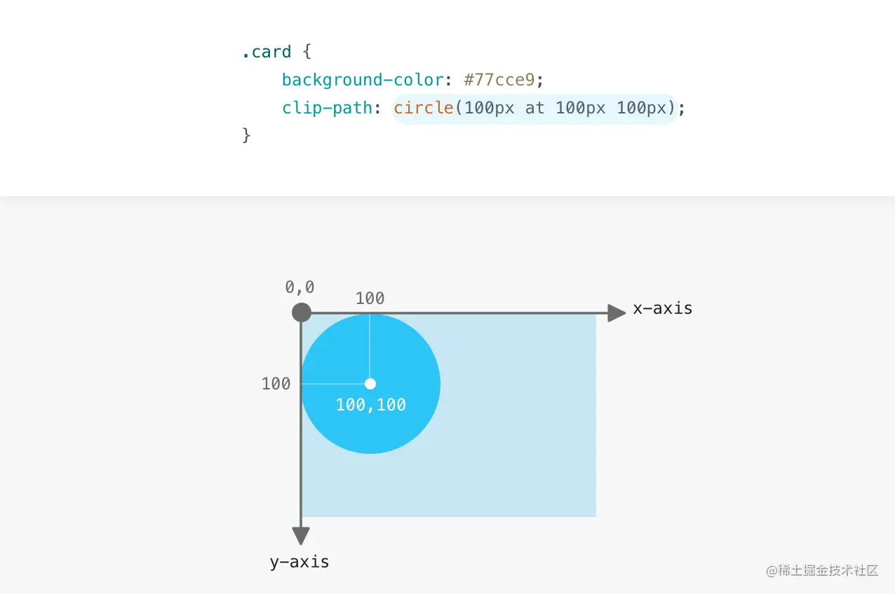

# clip-path属性详解

## 定义

使用裁剪方式创建元素的可显示区域。区域内的部分显示，区域外的隐藏。

```css
clip-path: <clip-source> | [ <basic-shape> || <geometry-box> ] | none 默认值为 none。
```

## clip-source： 用表示剪切元素的svg路径

```css
clip-path: url(resources.svg#c1);
```

## basic-shape：使用一些基本的形状函数创建的一个形状

```css
clip-path: inset(10px 5px round 10px); // 矩形，和SVG不同的是，矩形用的是inset而不是rect
clip-path: circle(50px at 0 100px); // 圆
clip-path: ellipse(25% 40% at 50% 50%); // 椭圆
clip-path: polygon(50% 0%, 100% 50%, 50% 100%, 0% 50%); // 多边形
```

### 坐标系

在深入了解 clip-path 的细节前，值得提下直角坐标系的运作。原点是左上角，x 轴向右，y 轴向下;


### inset

inset里面值的写法遵循css的上右下左，4值,3值,2值，一个值的写法均一致。比如inset(20px,10px)等价于inset(20px,10px,20px,10px)


### circle

注意只有强调区域(暗蓝色)是用户可见的，圆之外的区域被裁剪了。



### ellipse


### polygon


## geometry-box

如果与 basic-shape一起声明，它将为基本形状提供相应的参考盒子。通过自定义，它将利用确定的盒子边缘包括任何形状边角（比如说，被border-radius定义的剪切路径）。几何体盒子将会有以下的值：

```css
clip-path: fill-box;
clip-path: stroke-box;
clip-path: view-box;
clip-path: margin-box
clip-path: border-box
clip-path: padding-box
clip-path: content-box
```

## 使用clip-path做出的动画效果

::: normal-demo clip-path

```html
<div>xiaokai_icon</div>
```

```css
div {
    position: relative;
    width: 220px;
    height: 64px;
    line-height: 64px;
    text-align: center;
    color: #fff;
    font-size: 20px;
    background: #55557f;
    cursor: pointer;
    border-radius: 10px;
    /* 添加过渡效果 */
    transition: all 0.5s;
    margin: 50px auto;
}
div::after,
div::before {
    content: "";
    position: absolute;
    border: 2px solid #55557f;
    width: 240px;
    height: 84px;
    border-radius: 10px;
    /* top：-10px;bottom:-10px;left:-10px;right:-10px; 的简写*/
    inset: -10px; 
    /* 添加动画 */
    animation: pathRotate 3s infinite linear;
}
@keyframes pathRotate {
    0%,
    100% {
    clip-path: inset(0 0 98% 0);
    }
    25% {
    clip-path: inset(0 98% 0 0);
    }
    50% {
    clip-path: inset(98% 0 0 0);
    }
    75% {
    clip-path: inset(0 0 0 98%);
    }
}
div::after {
    animation-delay: -1.5s;
}
div:hover {
    filter: brightness(1.5);
}
```

:::

分析：
0-25%: 第二个值由0-98% 第三个值由98%-0过渡，同时进行表现为向逆时针流动的效果
其它动画帧亦是如此。

