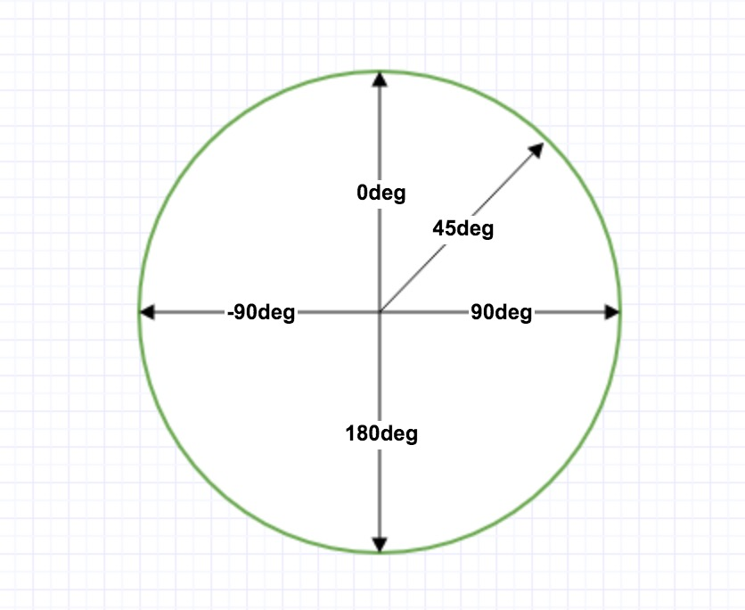
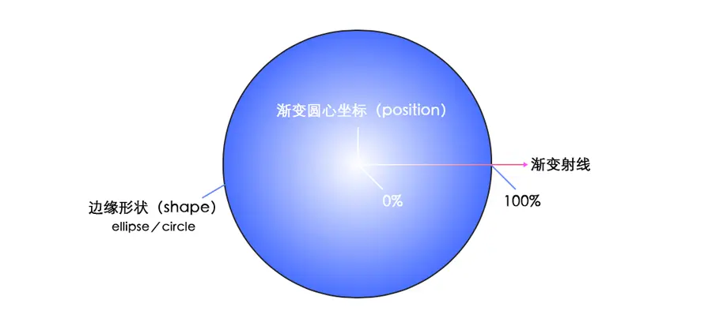
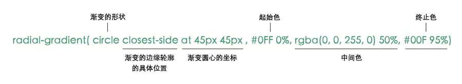
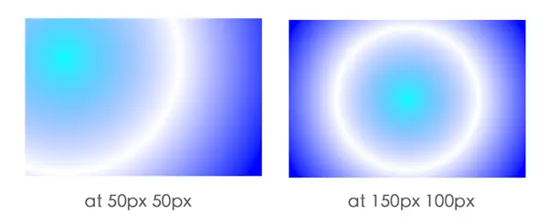
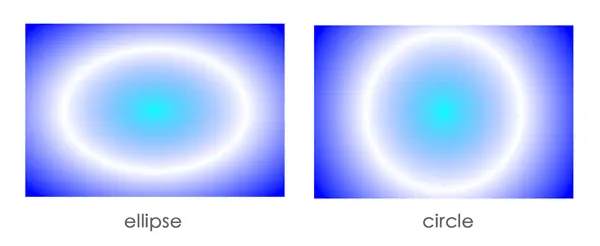
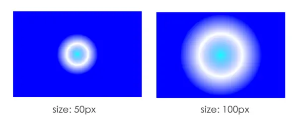
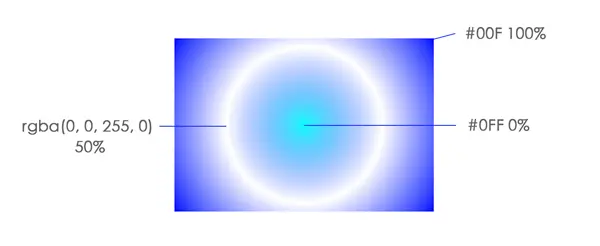
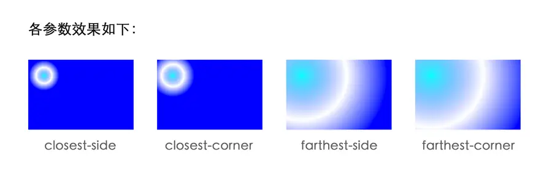
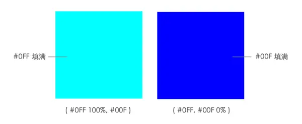

# gradients属性简介

## 线性渐变（Linear Gradients）

线性渐变(linear gradients)沿着一根轴线改变颜色，从起点到终点颜色进行顺序渐变。

方向符合的坐标如下



```css
background-image: linear-gradient(direction, color-stop1, color-stop2, ...); //可定义多种颜色节点
```

### 线性渐变 - 从上到下（默认情况下）

```css
background-image: linear-gradient(red, blue);
```

### 线性渐变 - 从左到右

```css
background-image: linear-gradient(to right, red , yellow);
```

### 线性渐变 - 对角

```css
background-image: linear-gradient(to bottom right, red, yellow);
```

### 角度

```css
background-image: linear-gradient(135deg, red, yellow);
```

::: normal-demo liner-gradient

```html
<div class="container">
</div>
```

```css
.container {
    height: 100vh;
    background: linear-gradient(red, blue);
    /* background-image: linear-gradient(to right, red , yellow); */
    /* background-image: linear-gradient(to bottom right, red, yellow); */
    /* background-image: linear-gradient(135deg, red, yellow); */
}
```
:::


## 径向渐变（radial-gradient）

径向渐变(Radial gradients)由其中心点、边缘形状轮廓及位置、色值结束点（color stops）定义而成。



当我们为一个渐变设置多个颜色时，它们会平分这个100%的区域来渐变。当然除了百分比，我们也可以使用具体的像素来设置这个大小。像素设置的大小指的是从渐变圆心向外延伸的距离。



### position:渐变圆心坐标

如缺少，默认为中心点



### shape:渐变的形状。圆形或椭圆形。默认值为椭圆。



### size：渐变的尺寸大小。




### color-stop

表示某个确定位置的固定色值。color值加上可选的位置值。百分比值0%，或者长度值0，表示渐变中心点；百分比值100%表示渐变射线与边缘形状相交的点。 其间的百分比值线性对应渐变射线上的点。



### extent-keyword

关键字用于描述边缘轮廓的具体位置。

| 常量   |  描述 | 
| ---- | ---- |
| closest-side | 渐变的边缘形状与容器距离渐变中心点最近的一边相切（圆形）或者至少与距离渐变中心点最近的垂直和水平边相切（椭圆） | 
| closest-corner | 渐变的边缘形状与容器距离渐变中心点最近的一个角相交 |
| farthest-side | 与closest-side相反，边缘形状与容器距离渐变中心点最远的一边相切 |
| farthese-corner | 渐变的边缘形状与容器距离渐变中心点最远的一个角相交 |



::: normal-demo radial-gradient

```html
<div class="container">
</div>
```

```css
.container {
    height: 100vh;
    /* size 与 extent-keyword不要同时设置，extent-keyword可以决定径向渐变圆的大小，让其最近最远边相切或者最近最远角相交 */
    background: radial-gradient(circle closest-side at 50px 50px, #0FF 0%,rgba(0,0,225,0) 50%,#00F 99%);
}
```
:::

### 举栗子

```
radial-gradient( #0FF 100%, #00F)
radial-gradient( #0FF, #00F 0%)
```


**规则：颜色的分布是从0%（渐变圆心）的位置到100%的位置的（100%的位置也就是渐变的半径），默认情况下，第一个颜色的位置是0%，最后一个颜色是100%。超出这个范围的用距离最近的颜色来填充**

- 在第一个例子中，#0FF设置了100%，所以它的颜色是从最外面的边框往外蔓延，所以框里就没有颜色了，于是就用靠近的颜色 #0FF来填充，所以，最后框里的颜色还是它。
- 在第二个例子中，#00F设置成了0%，于是#0FF就变成了 0%-0%，无法填充，所以从 #00F 开始填充 0%-100%。所以是深蓝色的。

::: normal-demo 购物券外形

```html
<div class="container">
</div>
```

```css
/* body {
    background: #000;
} */
.container {
    height: 200px;
    background: radial-gradient(circle at 50% 0px, transparent 0%, transparent 50px, #000 51px, #000 100%);
}
```
:::


