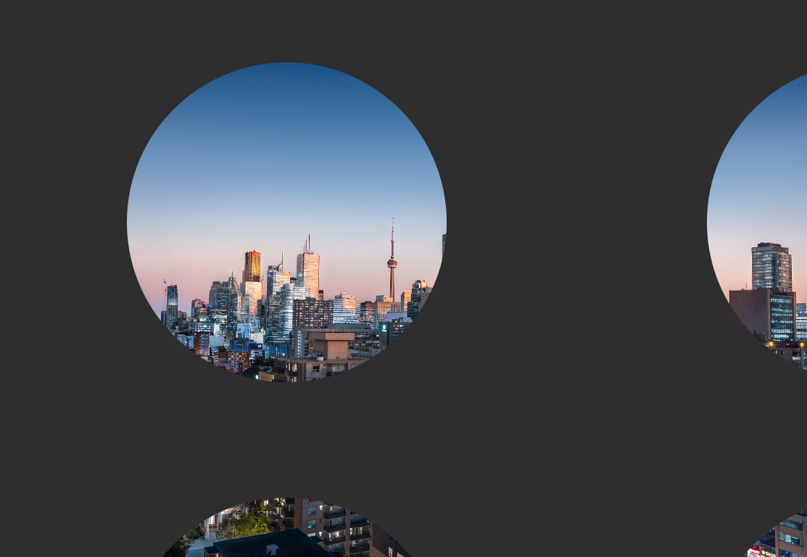
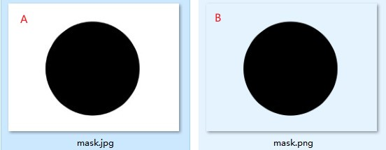
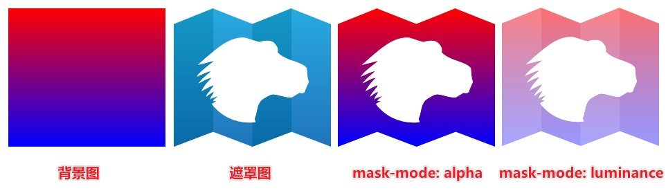
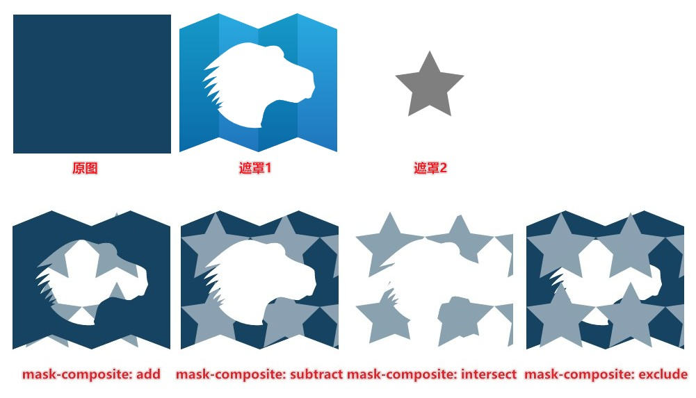
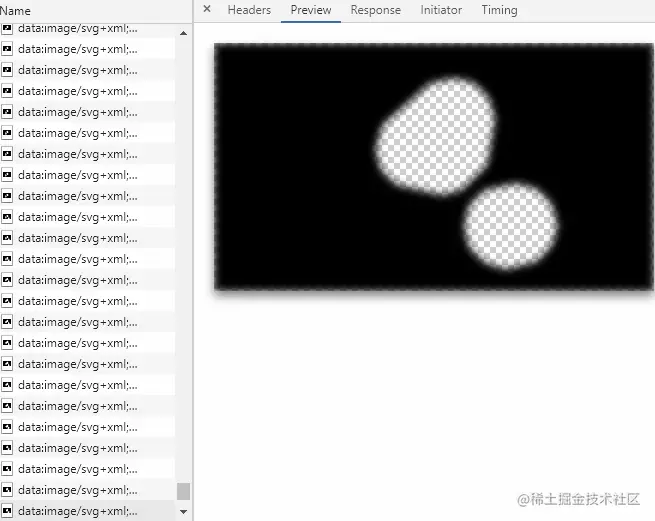

# mask属性简介

mask 属性允许使用者通过遮罩或者裁切特定区域的图片的方式来隐藏一个元素的部分或者全部可见区域。

## 语法

```css
mask: [mask-image] [mask-repeat] [mask-position] / [ mask-size];
```

## 使用方式

```html

```
```css
.mask{
    width:100vw;
    height:100vh;
    -webkit-mask: url(./mask.png); 
    mask: url(./mask.png); 
    display: block;
}
```
效果：



遮罩图片



只有透明底的PNG图片才可以应用上遮罩，图片A尝试多次都不可以应用上。这是因为mask属性是通过遮罩层的alpha(透明)来实现遮罩功能,也就是说mask透明的部分应用到其他元素就会被"裁剪",而非透明的部分(任何颜色)则会被展示。

- A图片不起作用的原因就是因为都是纯色部分(白加黑),这个遮罩放在图片上时，图片都会被展示。
- B图片黑圈外都是透明色，这个遮罩放在图片时，黑圈内都展示，黑圈外都被"裁剪"

mask属性也可以支持svg图形

```svg
<svg xmlns="http://www.w3.org/2000/svg" version="1.1">
  <circle cx="400" cy="400" r="300" fill="black"/>
</svg>
```

## 相关属性

- mask-image: 遮罩图像;
- mask-mode: 遮罩图像的模式;
- mask-repeat: 遮罩图像的重复方式(同bg-repeat);
- mask-position: 遮罩图像的定位(同bg-position);
- mask-clip: 遮罩图像应用区域(同bg-clip);
- mask-origin: 遮罩图像应用原点(同bg-origin);
- mask-size: 遮罩图像尺寸大小(同bg-size);
- mask-composite: 遮罩图像的叠加方式。

基本上可以与 background 属性一样来理解并且语法相通，只有两个属性需要单独去尝试

mask-mode - 遮罩图像的模式;
mask-composite - 遮罩图像的叠加方式。

### mask-mode

- alpha: 使用遮罩层图像的透明度(alpha)值作为掩码值;
- luminance: 遮罩层图像的亮度值应用作掩码值;
- match-source: 资源的类型自动采用合适的遮罩模式。
    - 如果 mask-image 属性是 mask-source 类型，遮罩层的亮度值会被作为掩码值;
    - 如果它是类型 image，遮罩层的 alpha 值作为掩码值。



mask-mode:match-source

如果我们的遮罩使用的是SVG中的defs中的mask元素，则此时的mask-mode属性的计算值是luminance，表示基于亮度遮罩。如果是其他场景，则计算值是alpha，表示基于透明度遮罩。

### mask-composite

```css
mask-composite: add;         // 叠加(遮罩累加/并集)
mask-composite: subtract;    // 相减(遮罩相减/补集)
mask-composite: intersect;   // 相交(遮罩重叠部分/交集)
mask-composite: exclude;     // 排除（非重叠区域的合并/对称差）
```



## 相关应用-直播网站的弹幕遮罩效果

对于运用了这项技术的直播网站，我们可以审查元素，看到包裹弹幕的容器的 mask 属性，每时每刻都在发生变化：
后台根据实时解析视频返回相应的弹幕遮罩



