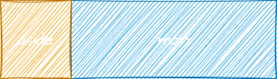
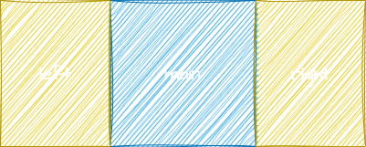
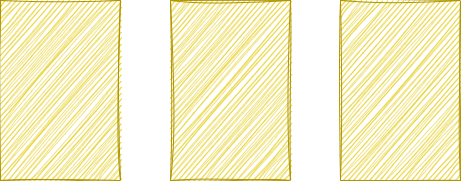
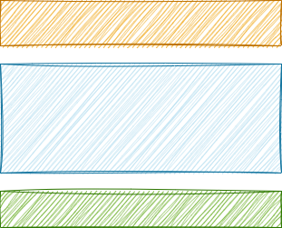

# css常用布局

## 两栏布局（边栏定宽主栏自适应）



### float + overflow(BFC原理)
```html
<div class="layout">
  <aside></aside>
  <main></main>
</div>
```
```css
aside {
  float: left;
  width: 200px;
}
main {
  overflow: hidden;
}
```

### float + margin

```html
<div class="layout">
  <aside></aside>
  <main></main>
</div>
```
```css
aside {
  float: left;
  width: 200px;
}
main {
  margin-left: 200px;
}
```

### flex

```html
<div class="layout">
  <aside></aside>
  <main></main>
</div>
```
```css
.layout {
  display: flex;
}
aside {
  width: 200px;
}
main {
  flex: 1;
}
```

### grid

```html
<div class="layout">
  <aside></aside>
  <main></main>
</div>
```
```css
.layout {
  display: grid;
  grid-template-columns: 200px auto;
}
```

## 三栏布局（两侧栏定宽主栏自适应）



### 圣杯布局(float+padding+relative+负magin)

```html
<div class="layout">
  <main></main>
  <div class='left'></div>
  <div class='right'></div>
</div>
```
```css
.layout {
    padding: 0 200px;
    /* overflow: hidden;
    min-width: 200px; */
}
main {
    float: left;
    height: 100px;
    width: 100%;
    background-color: aqua;
    height: 100px;
}
.left {
    float: left;
    background-color: bisque;
    height: 100px;
    width: 200px;
    position: relative;
    left: -200px;
    margin-left: -100%;
}
.right {
    float: left;
    background-color: azure;
    height: 100px;
    width: 200px;
    position: relative;
    margin-left: -200px;
    right: -200px;
}
```

### 双飞翼布局(float+内部容器margin+负margin)

```html
<div class="layout">
  <main><div class='inner'></div></main>
  <div class='left'></div>
  <div class='right'></div>
</div>
```
```css
.layout {
    /* overflow: hidden; */
    /* min-width: 600px; */
}
main {
    float: left;
    height: 100px;
    width: 100%;
}
.inner {
    background-color: aqua;
    height: 100px;
    margin: 0 200px;
}
.left {
    float: left;
    background-color: bisque;
    height: 100px;
    width: 200px;
    margin-left: -100%;
}
.right {
    float: left;
    background-color: azure;
    height: 100px;
    width: 200px;
    margin-left: -200px;
}
footer {
    background-color: brown;
    height: 100px;
}
```

### float+overflow(BFC原理)
```html
<div class="layout">
  <div class='left'></div>
  <div class='right'></div>
  <main></main>
</div>
```
```css
.layout {
}
main {
    overflow: hidden;
    background-color: aquamarine;
    height: 100px;
}
.left {
    float: left;
    background-color: bisque;
    height: 100px;
    width: 200px;
}
.right {
    float: right;
    background-color: azure;
    height: 100px;
    width: 200px;
}
```

### flex

```html
<div class="layout">
  <div class='left'></div>
  <main></main>
  <div class='right'></div>
</div>
```
```css
.layout {
  display: flex;
}
main {
    flex: 1;
    background-color: aquamarine;
    height: 100px;
}
.left {
    background-color: bisque;
    height: 100px;
    width: 200px;
}
.right {
    background-color: azure;
    height: 100px;
    width: 200px;
}
```

### grid

```html
<div class="layout">
  <div class='left'></div>
  <main></main>
  <div class='right'></div>
</div>
```
```css
.layout {
  display: grid;
  grid-template-columns: 200px auto 200px;
}
main {
    background-color: aquamarine;
    height: 100px;
}
.left {
    background-color: bisque;
    height: 100px;
}
.right {
    background-color: azure;
    height: 100px;
}
```

## 多列等高布局



### padding + 负margin

```html
<div class="layout">
  <div class='left col'>
      <p>1</p>
      <p>2</p>
      <p>3</p>
      <p>4</p>
      <p>5</p>
  </div>
  <main class="col">
      <p>1</p>
  </main>
  <div class='right col'>
      <p>1</p>
      <p>2</p>
  </div>
</div>
```
```css
.layout {
    overflow: hidden;
}
main {
    background-color: aquamarine;
    width: 33.33%;
    float: left;
}
.left {
    background-color: bisque;
    width: 33.33%;
    float: left;
}
.right {
    background-color: azure;
    width: 33.33%;
    float: left;
}
.col {
    padding-bottom: 1000px;
    margin-bottom: -1000px;
}
```

### 设置父级背景图片

```html
<div class="layout">
  <div class='left'>
      <p>1</p>
      <p>2</p>
      <p>3</p>
      <p>4</p>
      <p>5</p>
  </div>
  <main>
      <p>1</p>
  </main>
  <div class='right'>
      <p>1</p>
      <p>2</p>
  </div>
</div>
```
```css
.layout {
  background: url('./bg.png') repeat-y;
  background-size: 100%;
}
main {
    width: 33.33%;
    float: left;
}
.left {
    width: 33.33%;
    float: left;
}
.right {
    width: 33.33%;
    float: left;
}
```

## 三行布局（头尾定高主栏自适应）



### calc

```html
<div class='layout'>
  <header></header>
  <main></main>
  <footer></footer>
</div>
```
```css
.layout {
  height: 100%;
}
header,
footer {
  height: 50px;
}
main {
  overflow-y: auto;
  height: calc(100% - 50px - 50px)
}
```

### absolute + padding

```html
<div class='layout'>
  <header></header>
  <main></main>
  <footer></footer>
</div>
```
```css
.layout {
  position: relative;
}
header {
  position: absolute;
  top: 0;
  width: 100%;
  height: 50px;
}
footer {
  position: absolute;
  width: 100%;
  height: 50px;
  bottom: 0;
}
main {
  height: 100%;
  padding: 50px 0;
  box-sizing: border-box;
}
```

### flex

```html
<div class='layout'>
  <header></header>
  <main></main>
  <footer></footer>
</div>
```
```css
.layout {
  display: flex;
  flex-direction: column;
}
header {
  width: 100%;
  height: 50px;
}
footer {
  width: 100%;
  height: 50px;
}
main {
  flex: 1;
}
```

### grid


```html
<div class='layout'>
  <header></header>
  <main></main>
  <footer></footer>
</div>
```
```css
.layout {
  display: grid;
  grid-template-rows: 50px 1fr 50px;
}
```


