# 深入理解css中vertical-align属性

css中的文字属性line-height,vertical-align等我们经常或用到,当我们还原ui图上的文字对齐，往往会出现一些意想不到的细微差距，这就需要咱们深究这些细节了

先放一些概念图:grin:

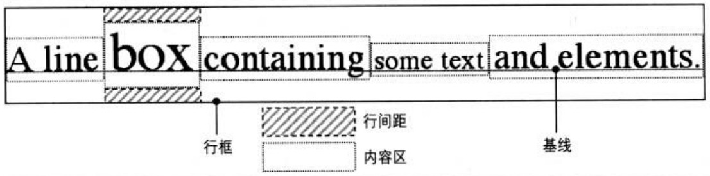

要深入理解line-height，需要理解关于行框构建的常用术语

## 行类框

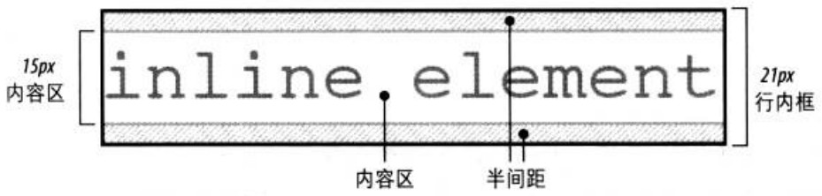

内容区加上行间距等于行内框。如果一个行内非替换元素的font-size为15px，line-height为21px，则相差6px。用户代理将这6像素一分为二，将其一半分别应用到内容区的顶部和底部，这就得到了行内框

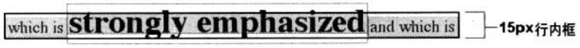

当line-height小于font-size时，行内框实际上小于内容区


## 内容区与font-size

对于行内非替换元素或匿名文本某一部分，font-size和font-family确定了内容区的高度。在宋体情况下，如果一个行内元素的font-size为15px，则内容区的高度为15px；而在其他字体情况下，内容区的高度并不等于字体大小

* 只有宋体的时候font-size的大小是等于内容区的大小，一般来说font-fmaily不同，font-size相同，内容区的高度是不同的，可以拿两个不同的字体库做对比得出结论，
* font-size的高度近似等于内容区高度，相差值来自于各个设计的字体标准，也可以说font-size越大，内容区越大
* 不同字体的contentAreaHeight = fontSize的高度(书写字母三线图的高度) + 字体到内容区的上下间距(与字体不同设计有关)
* 内容区也是文字backgrount-color渲染的区域

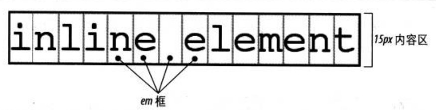

## 行内框与内容区小结

* 行类框的高度由line-height大小决定，行类框在文档上会占据布局空间，影响布局
* 内容区的高度跟font-size成正相关
* 内边距、外边距和边框不影响行框的高度，即不影响行高
* 行内元素的边框边界(内容区边界)由font-size而不是line-height控制

## 行内框中的各种线

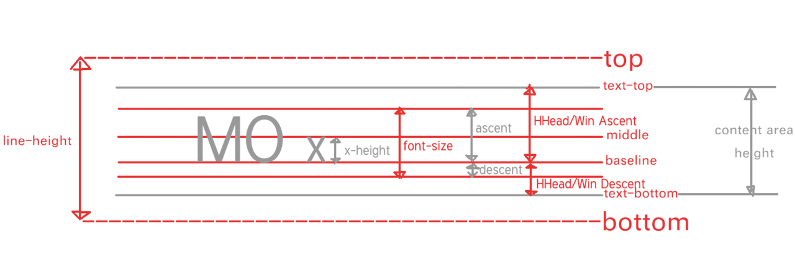

* 字母x的下边缘（线）就是基线。不是字母s之类下面有尾巴的字母
* top和bottom对应line-height的上下边界
* text-bottom和text-top对于内容区的上下边界
* contentArea的height = Win Ascent + Win Desent(和字体如何设计有关) >= font-size的大小


## baseline的确定规则

* 规则1：inline-block元素，如果内部有line box，则inline-block元素的baseline就是最后一个作为内容存在的元素[inline box]的baseline，而这个元素的baseline的确定就要根据它自身来定了。
* 规则2：inline-block元素，如果其内部没有line box或它的overflow属性不是visible，那么baseline将是这个inline-block元素的底margin边界。
### 例子1

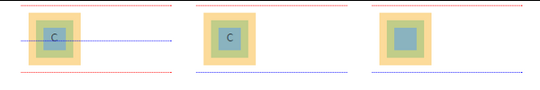

上图中从左到右都是line-block元素，红线代表margin-box的边界，蓝线代表baseline；黄色为border，绿色为padding，蓝色为content。

左边元素包含着没有脱离正常流的内容c，中间元素除了没有脱离正常流的内容c外还增加了overflow:hidden，右边元素没有内容，但是内容区有宽高。

分析图中各种情况inline-block元素的baseline：

上图左图，inline-block元素有处于正常流的内容，根据规则1，所以inline-block的baseline就是最后一个作为内容存在的元素的baseline，也就是内容c的baseline，而c的baseline根据自身定，就是图中蓝色。

上图中图，inline-block元素overflow:hidden不为visible，根据规则2，该inline-block元素baseline就是inline-block元素的margin-box的下边界了，即图中蓝线。

上图右图，inline-block元素没有内容，根据规则2，所以其baseline为margin-box的下边界，即蓝线。

### 例子2

```css 
 .ctn-block{
    display: block;
    background-color: #bbb;
    line-height: 200px;
    font-size: 50px;
}
```
```html
<div class="ctn-block">
    <!-- <div class="child1"></div> -->
    <span>Ggx</span>
</div>
```
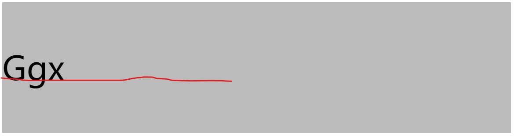
符合规则1，所以父元素(.ctn-block)的base-line是Ggx这个内联元素的baseline，也就是那条红线

### 例子3

```css 
 .ctn-block{
    display: block;
    background-color: #bbb;
    line-height: 200px;
    font-size: 50px;
}
.ctn-block .child1{
    display: inline-block;
    width: 100px;
    height: 100px;
    margin:10px 0;
    vertical-align: baseline;
    background-color: aliceblue;
}
```
```html
<div class="ctn-block">
    <div class="child1"></div>
    <span>Gg</span>
</div>
```
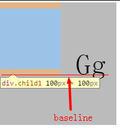
分析：

* 父元素（.ctn-block）的base-line是Gg的baseline(上面已经分析过)
* inline-block元素因为没有内部line box，也没有设置overflow:visible，所以其baseline是底margin边界。（规则2）

这样inline-block元素margin边界与父元素的baseline对齐

### 例子4

```html
<div style="display:inline-block;width:100px;height:100px;word-wrap:break-word;
background-color: hsl(2, 86%, 58%);color:#fff;">
    <span>
        MOMOMOMOMOMOMOOMOM
    </span>
</div>
<span style="color:#fff">MOMO</span>
```
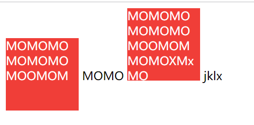
红色块1和红色块2都符合规则1,父元素的baseline为jklx的baseline，所有元素按baseline线对齐

### 例子5

```html
<span class="dib-baseline"></span>
<span class="dib-baseline">x-baseline</span>
```

```css
.dib-baseline {
  display: inline-block; width: 150px; height: 150px;
  border: 1px solid #cad5eb; background-color: #f0f3f9;
}
```

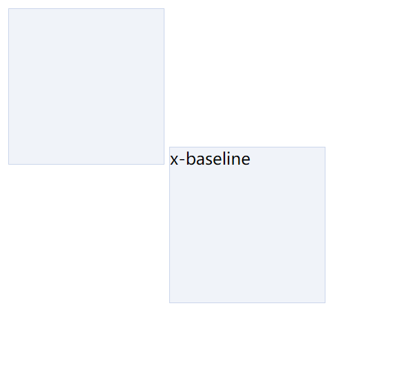

左边的盒子符合规则2其baseline为magin下边界
右边盒子符合规则1其baseline为行内元素最后一行的baseline


## vertical-align的各个属性值含义

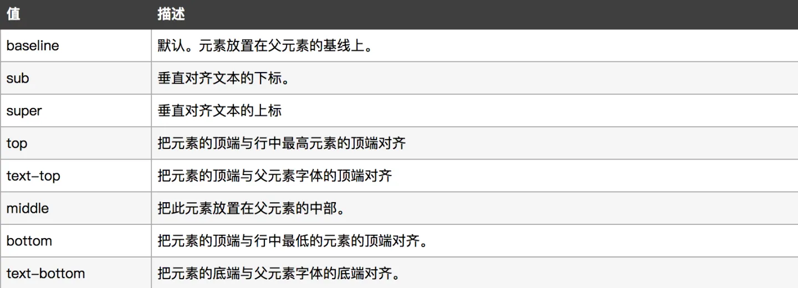

前面我们已经分析baseline的对齐，接下来会告诉vertical-align其他值的各种规则

### middle

规则：将元素盒子的垂直中点与父盒子的baseline加上父盒子的x-height的一半位置(x字母交叉处）对齐

::: warning
这里的middle属性值与行类框各种线图中的middle不是同一个概念，也不会去对齐这个线
:::

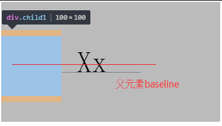

### text-top

规则：将盒子的顶端(margin-top边界)与父盒子的文本区域顶端对齐


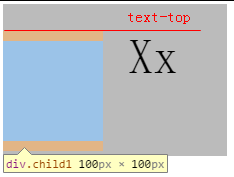

### text-bottom

规则：将盒子的低端(margin-top边界)与父盒子的文本区域顶端对齐


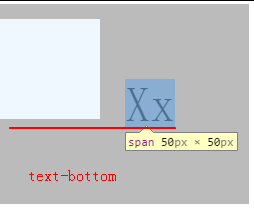

### sub

子元素的baseline已经确定了，就是margin-bottom下边界，但是父盒子的下标位置太不好理解。。。首先需要了解下标这个概念，我们可以通过sub标签为文字添加下标，将span中的内容修改为Gg<sub>Gg</sub>，就会有如下效果。也比如我们写化学式CaCO~3~中的3就是下标
```html
<div class="ctn-block">
    <div class="child1"></div>
    <span>Gg<sub>Gg</sub></span>
</div>
```

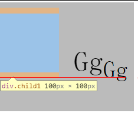

### sup
将span中的内容修改为Gg<sup>[1]</sup>,其中[1]就是上标
与sub对应，super提升到上标内容的baseline处，首先通过sup标签创建上标。
```html
<div class="ctn-block">
    <div class="child1"></div>
    <span>Gg<sup>[1]</sup></span>
</div>
```

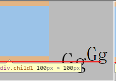

### top和bottom

当vertical-align设置为top和bottom时，其就不是按照baseline进行定位了，而是根据line box(行内框)进行定位。子元素盒子的顶部和底部也就是其上下margin外边界分别与top线和bottom线对齐。

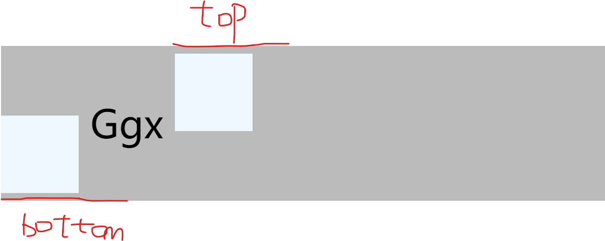


## 通过line-height来控制文字在容器中的位置

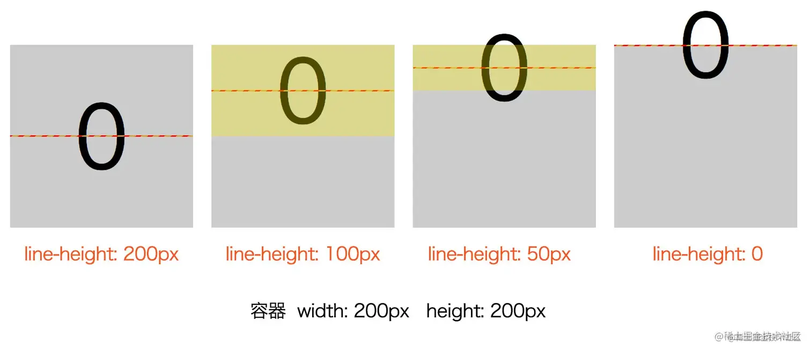

* 有时我们不一定总是让line-height与height相等让文字居中，也有可能想要像上图line-height：0的效果

* 当line-height为0时意味着行内框区域为零，top线和bottom线重合到最上边界

## img底部空白间隙问题

这个问题想必大家已经遇到过，很多人知道解决方案，但不一定能知道为什么这样可以解决:thinking:
```html
<div class="ctn-block">
    
    <span class="text">jklx</div>
</div>
```
```css
.ctn-block {
    border: 1px solid #000;
}
img {
    width: 200px;
    height: 100px;
    vertical-align: baseline;
}
.text {
    background-color: aqua;
}
```

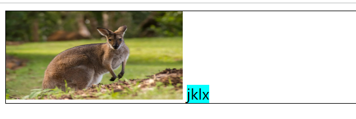

- 分析：符合规则2
    - 造成这种现象的原因就是img是inline元素底部与基线对齐(vertical:baseline是默认值)，
    - 而文字line-height的默认值为1.1-1.2,font-size的默认值为12px
    - 则line-height= 1.1*12px(天空色区域)占据一定空间,baseline到行内框低端边界是有几像素的距离的，所以导致了这种现象发生

- 解决方案

### 让vertical-align失效

图片默认是inline水平的，而vertical-align对块状水平的元素无感。因此，我们只要让图片display水平为block就可以了，我们可以直接设置display或者浮动、绝对定位等（如果布局允许）

### 使用其他vertical-align值

比如bottom/middle/top都是可以的 

```css
.ctn-block {
    border: 1px solid #000;
}
img {
    width: 200px;
    height: 100px;
    vertical-align: bottom;
    /* vertical-align: middle;
    vertical-align: top; */
}
.text {
    background-color: aqua;
}
```
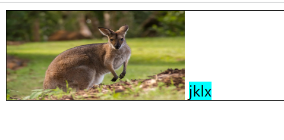

分析：符合规则2

bottom和top很好理解 img元素与行内框上下边界对齐，同时img撑开行内框，不会有间隙
middle则是根据定义  将元素的垂直中点与baseline对齐，同时img撑开行内框，不会有间隙

### 直接修改line-height的值

```css
.ctn-block {
    border: 1px solid #000;
    line-height: 5px;
}
```
下面的空隙高度，实际上是文字计算后的行高值下边界(bottom)和字母x下边缘的距离(baseline)。因此，只要行高足够小，实际文字占据的高度的底部就会在x的上面，下面没有了高度区域支撑，自然，图片就会有容器底边贴合在一起了。比方说，我们设置行高5像素

### line-height为相对单位，font-size间接控制

如果line-height是相对单位，例如line-height:1.6或者line-height:160%之类，也可以使用font-size间接控制，font-size设为0, 本质上还是改变line-height值.
line-height: 1.5  line-height: 1.5 * font-size

```css
.ctn-block {
    border: 1px solid #000;
    font-size: 0;
}
```
## 空白节点

- 这是css2规范里面的一个概念：
- 在HTML5文档声明下，块状元素内部的内联元素的行为表现，就好像块状元素内部还有一个（更有可能两个-前后）看不见摸不着没有宽度没有实体的空白节点

我们把span元素去掉
```html
<div class="ctn-block">
    
</div>
```
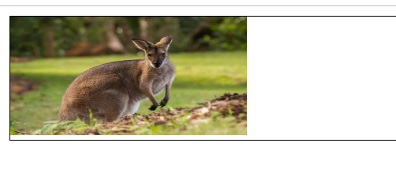
分析：符合规则2
依然是基线对齐，相当于这里有一个空白的内联元素，其对其规则和jklx内容的一致，都是基线对齐

举个例子

```html
<div class="container">
    <span class="dib-baseline"></span>
    <span class="dib-baseline dib-baseline2"></span>
</div>
```
```css
.dib-baseline {
    display: inline-block; width: 150px; height: 150px;
    border: 1px solid #cad5eb; background-color: #f0f3f9;
}
.dib-baseline2 {
    vertical-align:text-top;
}
.container {
    background-color: aqua;
}
```
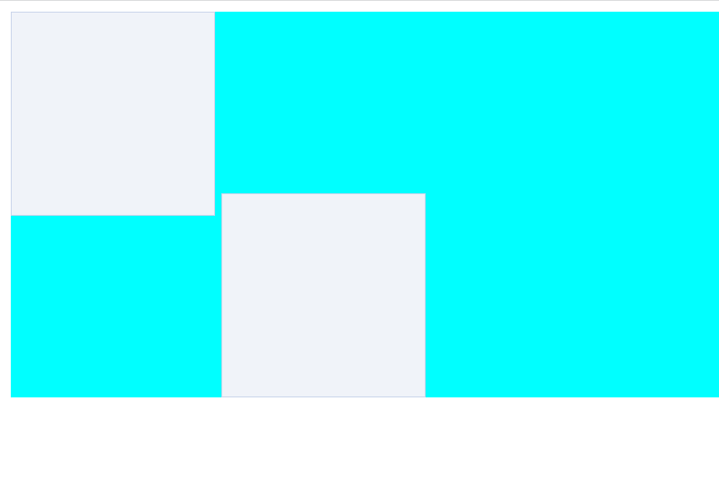

:thinking: 这里的对齐方式为什么会是这样呢，其实这里就是空白节点起作用，我们用x代替空白节点

```html
<div class="container">
    <span class="dib-baseline"></span>
    <span class="dib-baseline dib-baseline2"></span>
    xxx
</div>
```

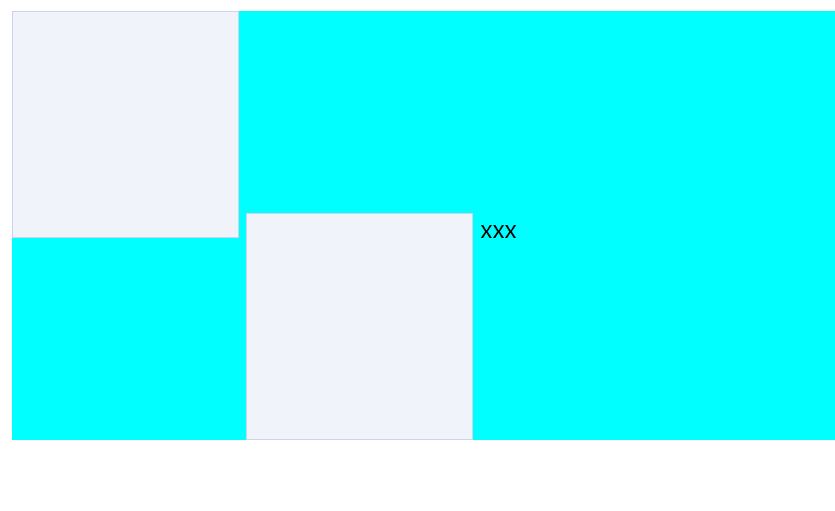

这样就可以解释为什么这样对齐了，因为空白字符行内元素，第二个盒子的上边界与空白字符的text-top对齐

## vertical-align:middle让元素下移而不居中的问题分析
```html
<div class="ctn-block">
    <div class="child child-1"></div>
    <div class="child child-2"></div>
    <div class="child child-3"></div>
</div>
```

```css
.ctn-block{
    background-color: #bbb;
}
.ctn-block .child {
    display: inline-block;
    width: 100px;
    background-color: aliceblue;
}
.ctn-block .child-1 {
    height: 100px;
    /*vertical-align: middle;*/
}
.ctn-block .child-2 {
    height: 200px;
}
.ctn-block .child-3 {
    height: 300px;
}
```
给child1设置vertical：middle，child1不居中下移

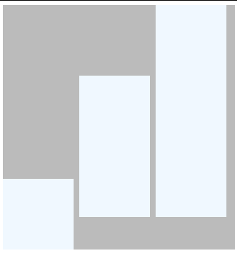

分析 child2 child3符合规则2，再由于空白节点的的作用child1的垂直中线与 child2child3的边界对齐，同时也与空白节点的baseline（x交叉处）对齐
代码加个x表示空白节点

```html
<div class="ctn-block">
    <div class="child child-1"></div>
    <div class="child child-2"></div>
    <div class="child child-3"></div>
    xxx
</div>
```
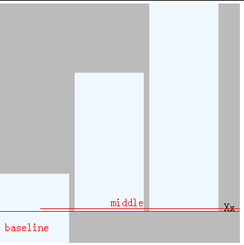

### 解决方案
因为最高元素撑起整个line-box，所以将最高元素设定为vertical-align:middle后，这个元素对于line box来说，middle线对齐。其他元素设置vertical-align:top/bottom后，它们不影响line box的baseline，所以再将需要设定垂直居中的元素也设定为vertical-align:middle。

```css
.ctn-block .child-1 {
    height: 100px;
    vertical-align: middle;
}
.ctn-block .child-2 {
    height: 200px;
    vertical-align:top;
}
.ctn-block .child-3 {
    height: 300px;
    vertical-align: middle;
}
```

### icon与文字对齐


根据上面的解决方案我们可以 将3个元素都设置成vertical-align：middle就可以对齐了 :smile:


