# Flex 布局详解

## 简介

弹性盒子是 CSS3 的一种新的布局模式。CSS3 弹性盒（ Flexible Box 或 flexbox），是一种当页面需要适应不同的屏幕大小以及设备类型时确保元素拥有恰当的行为的布局方式。引入弹性盒布局模型的目的是提供一种更加有效的方式来对一个容器中的子元素进行排列、对齐和分配空白空间。

弹性盒子由弹性容器(Flex container)和弹性子元素(Flex item)组成。弹性容器通过设置 display 属性的值为 flex 或 inline-flex将其定义为弹性容器。弹性容器内包含了一个或多个弹性子元素。

## Flex 基本概念


- 在 flex 容器中默认存在两条轴，==水平主轴(main axis) 和垂直的交叉轴(cross axis)==，这是默认的设置，当然你可以通过修改使垂直方向变为主轴，水平方向变为交叉轴。

- 在容器中的每个单元块被称之为 ==flex item==，每个项目占据的主轴空间为 (main size), 占据的交叉轴的空间为 (cross size)。

- 这里需要强调，不能先入为主认为宽度就是 main size，高度就是 cross size，这个还要取决于你主轴的方向，如果你垂直方向是主轴，那么项目的高度就是 main size。

## Flex 容器

首先，实现 flex 布局需要先指定一个容器，任何一个容器都可以被指定为 flex 布局，这样容器内部的元素就可以使用 flex 来进行布局。
```css
.container {
    display: flex | inline-flex;
}
```
分别生成一个块状或行内的 flex 容器盒子。简单说来，如果你使用块元素如 div，你就可以使用 flex，而如果你使用行内元素，你可以使用 inline-flex。

**注：当时设置 flex 布局之后，子元素的 float、clear、vertical-align 的属性将会失效。**

有下面六种属性可以设置在容器上，它们分别是：

- flex-direction
- flex-wrap
- flex-flow
- justify-content
- align-items
- align-content

### flex-direction: 决定主轴的方向(即项目的排列方向)
```css
.container {
    flex-direction: row | row-reverse | column | column-reverse;
}
```

**默认值：row，主轴为水平方向，起点在左端。**

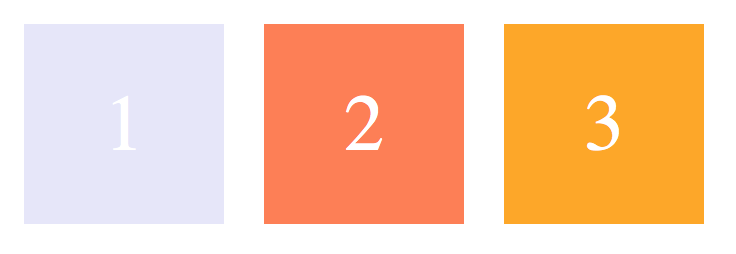

**row-reverse：主轴为水平方向，起点在右端**

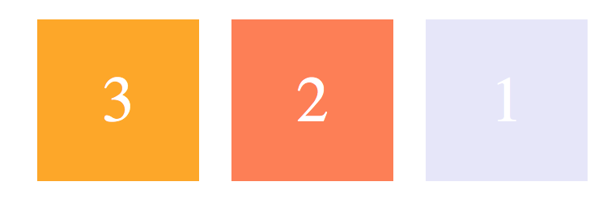

**column：主轴为垂直方向，起点在上沿**


**column-reverse：主轴为垂直方向，起点在下沿**

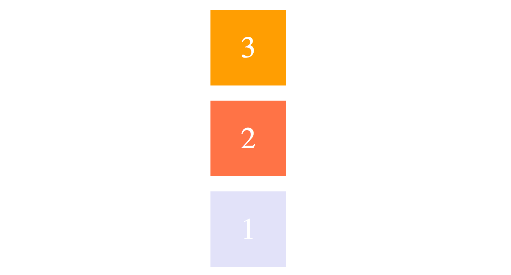

### flex-wrap: 决定容器内项目是否可换行

默认情况下，项目都排在主轴线上，使用 flex-wrap 可实现项目的换行。

**默认值：nowrap 不换行，即当主轴尺寸固定时，当空间不足时，项目尺寸会随之调整(变形)而并不会挤到下一行。**

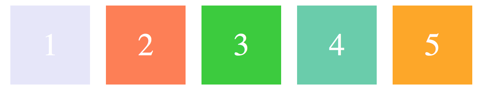

**wrap：项目主轴总尺寸超出容器时换行，第一行在上方**

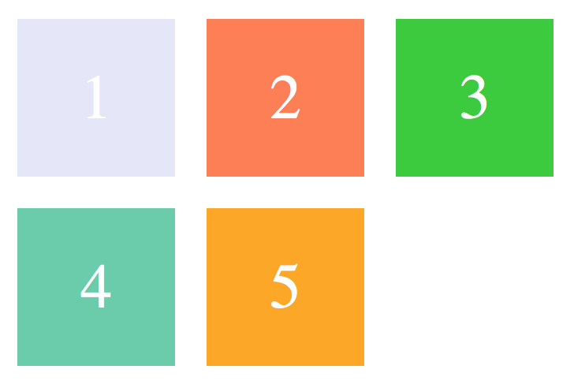

**wrap-reverse：换行，第一行在下方**

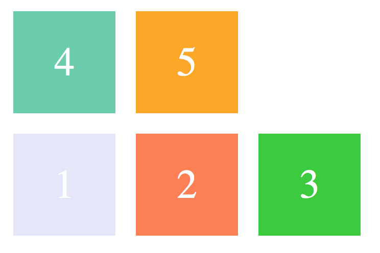

### flex-flow: flex-direction 和 flex-wrap 的简写形式
```css
.container {
    flex-flow: <flex-direction> || <flex-wrap>;
}
```

###  justify-content：定义了项目在主轴的对齐方式。
```css
.container {
    justify-content: flex-start | flex-end | center | space-between | space-around;
}
```

**建立在主轴为水平方向时测试，即 flex-direction: row**

**默认值: flex-start 左对齐**

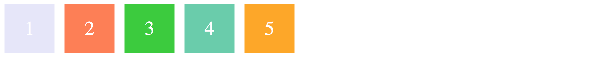

**flex-end：右对齐**

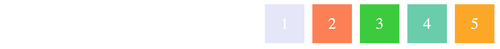

**center：居中**


**space-between：两端对齐，项目之间的间隔相等，即剩余空间等分成间隙。**

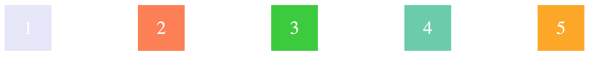

**space-around：每个项目两侧的间隔相等，所以项目之间的间隔比项目与边缘的间隔大一倍。(边0.5，间隔1)**

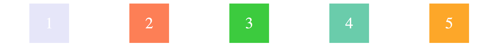

### align-items: 定义了项目在交叉轴上的对齐方式

```css
.container {
    align-items: flex-start | flex-end | center | baseline | stretch;
}
```

**建立在主轴为水平方向时测试，即 flex-direction: row**

**默认值为 stretch 即如果项目未设置高度或者设为 auto，将占满整个容器的高度。**

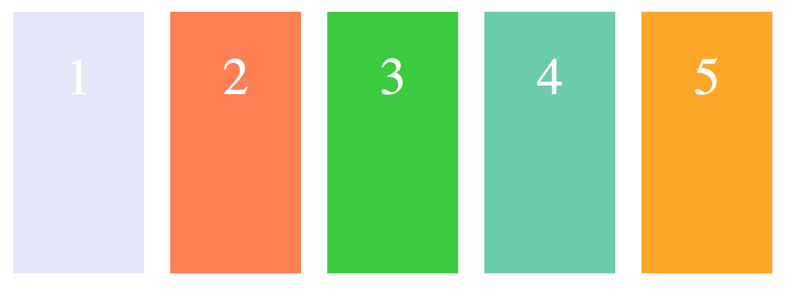

::: normal-demo stretch

```html
<div class="container">
    <div class="one">1</div>
    <div class="one two">2</div>
    <div class="one three">3</div>
    <div class="one">4</div>
    <div class="one">5</div>
</div>
```

```css
.container {
    height: 180px;
    width: 600px;
    display: flex;
    justify-content: space-between;
    font-size: 40px;
}
.one {
    background-color: aqua;
    width:100px;
    text-align: center;
}
.two {
    height: 100px;
}
.three {
    height: auto;
}


```

:::

假设容器高度设置为 180px，而项目没有设置高度的情况下，则项目的高度也为 180px。

**flex-start：交叉轴的起点对齐**

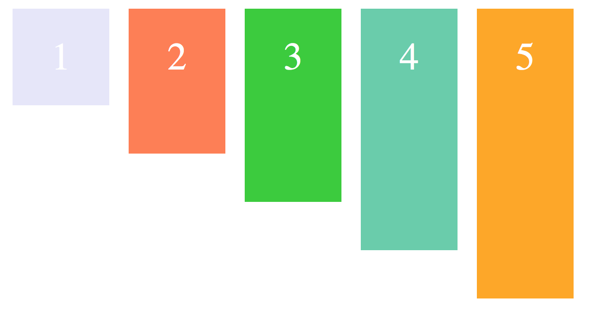

**flex-end：交叉轴的终点对齐**

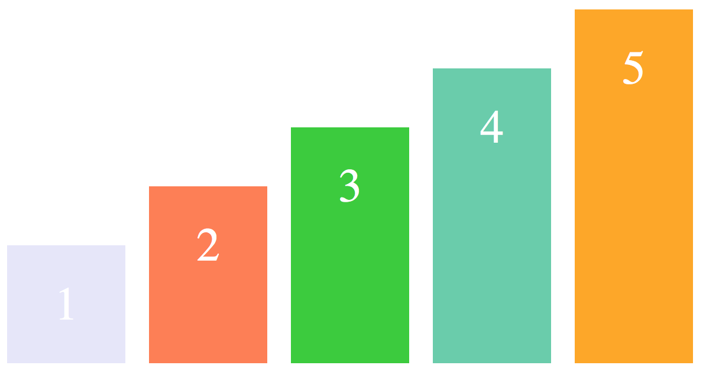

**center：交叉轴的中点对齐**

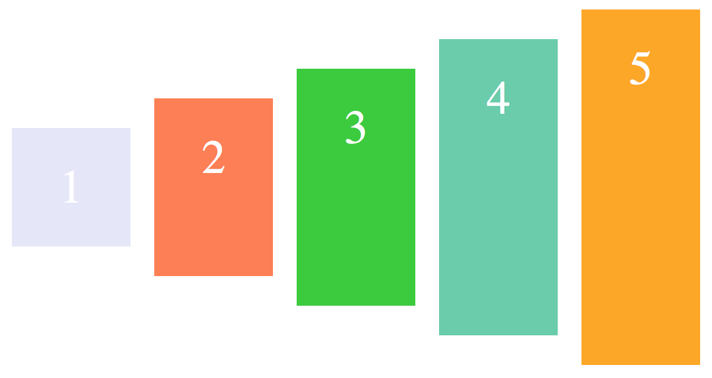

**baseline: 项目的第一行文字的基线对齐**

**以文字的baseline为主，仔细看图可以理解。**

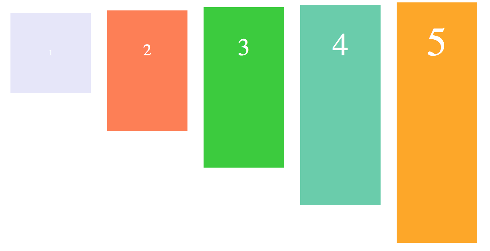

###  align-content: 定义了多根轴线的对齐方式，如果项目只有一根轴线，那么该属性将不起作用
```css
.container {
    align-content: flex-start | flex-end | center | space-between | space-around | stretch;
}
```

当你 flex-wrap 设置为 nowrap 的时候，容器仅存在一根轴线，因为项目不会换行，就不会产生多条轴线。

当你 flex-wrap 设置为 wrap 的时候，容器可能会出现多条轴线，这时候你就需要去设置多条轴线之间的对齐方式了。

建立在主轴为水平方向时测试，即 flex-direction: row, flex-wrap: wrap

**默认值为 stretch，看下面的图就很好理解了**

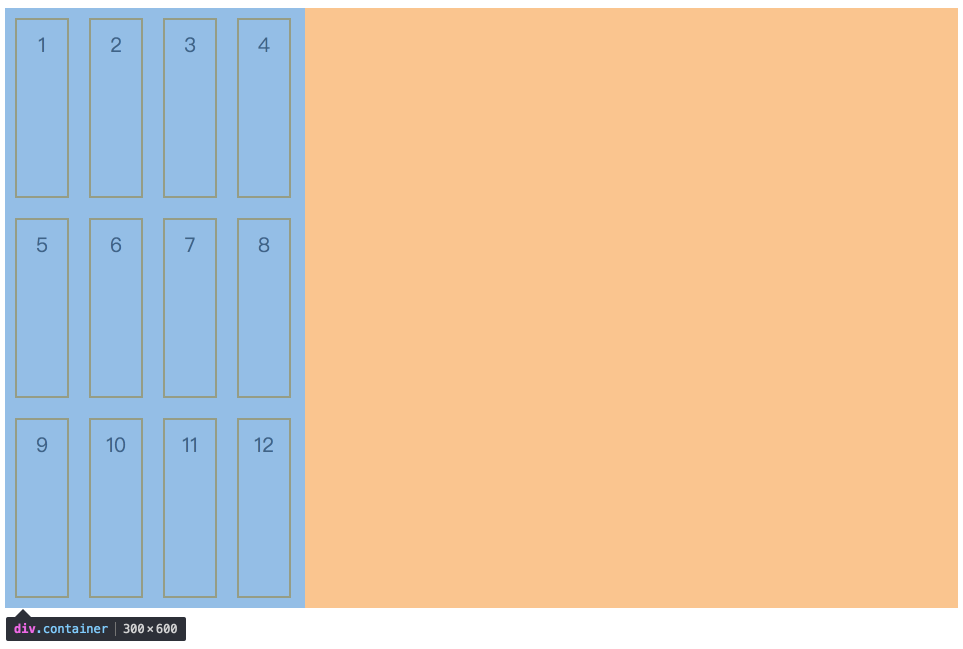

**flex-start：轴线全部在交叉轴上的起点对齐(左上角)**

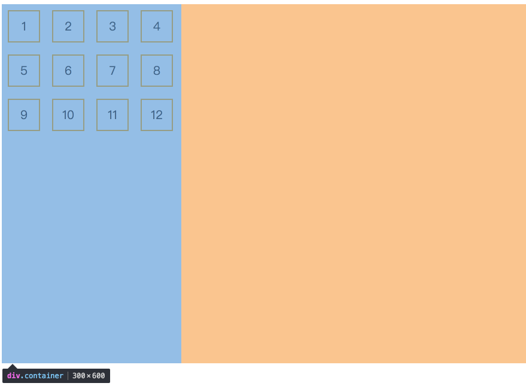

**flex-end：轴线全部在交叉轴上的终点对齐(右下角)**

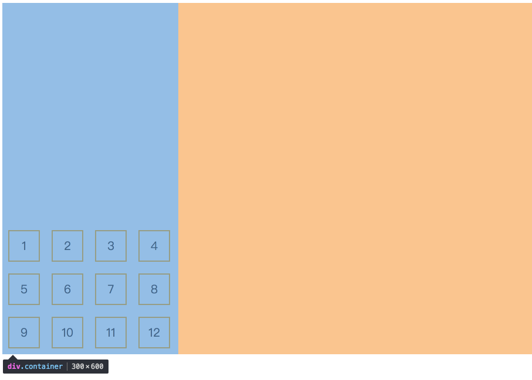

**center：轴线全部在交叉轴上的中间对齐**


**space-between：轴线两端对齐，之间的间隔相等，即剩余空间等分成间隙。(类比justify-content)**


**space-around：每个轴线两侧的间隔相等，所以轴线之间的间隔比轴线与边缘的间隔大一倍。**

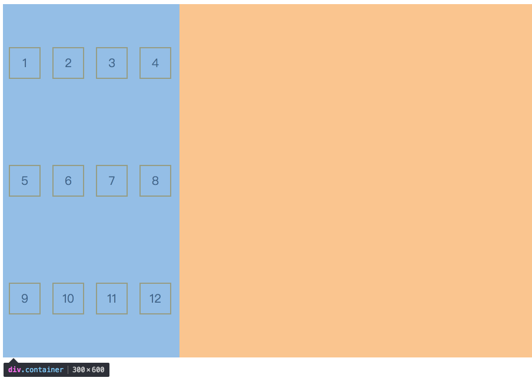

## Flex 项目属性

有六种属性可运用在 item 项目上：

- order
- flex-basis
- flex-grow
- flex-shrink
- flex
- align-self

###  order

定义项目在容器中的排列顺序，数值越小，排列越靠前，默认值为 0

```css
.item {
    order: <integer>;
}
```

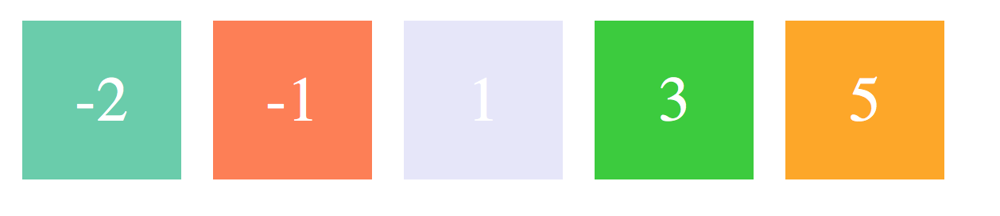

在 HTML 结构中，虽然 -2，-1 的 item 排在后面，但是由于分别设置了 order，使之能够排到最前面。

### flex-basis

定义了在分配多余空间之前，项目占据的主轴空间，浏览器根据这个属性，计算主轴是否有多余空间

```css
.item {
    flex-basis: <length> | auto;
}
```

默认值：auto，即项目本来的大小, 这时候 item 的宽高取决于 width 或 height 的值。

当主轴为水平方向的时候，当设置了 flex-basis，项目的宽度设置值会失效，flex-basis 需要跟 flex-grow 和 flex-shrink 配合使用才能发挥效果。

* 当 flex-basis 值为 0 % 时，是把该项目视为零尺寸的，故即使声明该尺寸为 140px，也并没有什么用。
* 当 flex-basis 值为 auto 时，则跟根据尺寸的设定值(假如为 100px)，则这 100px 不会纳入剩余空间。

::: normal-demo flex-basis

```html
<div class="container">
    <div class="one">1</div>
    <div class="one two">2</div>
</div>
```

```css
.container {
    height: 100px;
    width: 220px;
    display: flex;
    justify-content: space-between;
    font-size: 40px;
    line-height: 100px;
    border: 1px solid #ccc;
}
.one {
    background-color: aqua;
    /* 默认值 */
    flex-basis: auto;
    width:100px;
    text-align: center;
}
.two {
    background-color: skyblue;
    text-align: center;
    flex-basis: 70px;
    /* flex-basis已经设置，width设置无效 */
    width: 400px;
}


```

:::

### flex-grow

定义项目的放大比例

```css
.item {
    flex-grow: <number>;
}
```

默认值为 0，即如果存在剩余空间，也不放大(依照basis)

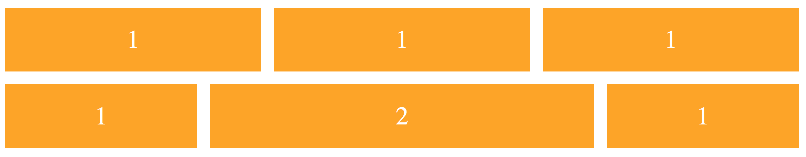

::: normal-demo flex-basis

```html
<div class="container">
    <div id="one">1</div>
    <div id="two">2</div>
    <div id="three">3</div>
    <div id="four">4</div>
    <div id="five">5</div>
</div>
```

```css
.container {
    height: 100px;
    width: 1000px;
    display: flex;
    font-size: 40px;
    line-height: 100px;
    border: 1px solid #000;
}
.container div {
    background-color: aqua;
    text-align: center;
    flex-grow: 1;
    margin-right:10px;
    flex-basis: 100px;
}

#three {
    flex-grow: 2;
}
#five {
    margin-right: 0px;
}
```

:::

- 当所有的项目都以 flex-basis 的值进行排列后，仍有剩余空间，那么这时候 flex-grow 就会发挥作用了。

- 如果所有项目的 flex-grow 属性都为 1，则它们将等分剩余空间。(如果有的话)

- 如果一个项目的 flex-grow 属性为 2，其他项目都为 1，则前者占据的剩余空间将比其他项多一倍。

- 当然如果当所有项目以 flex-basis 的值排列完后发现空间不够了，且 flex-wrap：nowrap 时，此时 flex-grow 则不起作用了，这时候就需要接下来的这个属性。

::: tip
margin的值也会占用剩余空间
```text
demo中的例子
flex-basis的剩余空间空间 width = 1000px - 100 *5px - 10*4px = 460px

flex-grow共有  1 + 1 + 2 + 1 + 1 = 6份

所以 item1 width = 100px + 460/6px = 176.67px
    item3 width = 100px + 460/6px * 2 = 253.33px  
```
:::

```text
当子元素felx-grow之和大于0时，子元素的宽度为：本身宽度+剩余宽度ｘ（flex-grow值/flex-grow值之和）
当子元素felx-grow之和小0时，宽度为：本身宽度+剩余宽度ｘflex-grow，和felx-grow之和大于0相比，把flex-grow之和看成1就好了
flex-grow 还会受到 max-width 的影响。如果最终 grow 后的结果大于 max-width 指定的值，max-width 的值将会优先使用
```

###  flex-shrink

定义了项目的缩小比例

```css
.item {
    flex-shrink: <number>;
}
```

默认值: 1，即如果空间不足，该项目将缩小，负值对该属性无效。

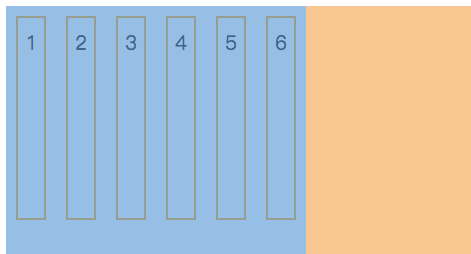

每个项目会被同比例进行缩小，因为默认值为 1。

如果所有项目的 flex-shrink 属性都为 1，当空间不足时，都将等比例缩小。
如果一个项目的 flex-shrink 属性为 0，其他项目都为 1，则空间不足时，前者不缩小。

```text
当子元素felx-grow之和大于0时，子元素的宽度为：本身宽度-溢出宽度ｘ（flex-shrink值ｘ本身宽度/各个flex-shrink值ｘ各自本身宽度之和）
当子元素felx-grow之和小于0时，子元素的宽度为：本身宽度-（溢出宽度 ｘ flex-shrink值之和）ｘ（flex-shrink值ｘ本身宽度/各个flex-shrink值ｘ各自本身宽度之和）
```

### flex

flex-grow, flex-shrink 和 flex-basis的简写

```css
.item{
    flex: none | [ <'flex-grow'> <'flex-shrink'>? || <'flex-basis'> ]
} 
```

flex 的默认值是以上三个属性值的组合。假设以上三个属性同样取默认值，则 flex 的默认值是 0 1 auto。(不放大，缩小，占据主轴空间为自身的width或者)

**有关快捷值：auto (1 1 auto) 和 none (0 0 auto)**

**当 flex 取值为一个非负数字，则该数字为 ==flex-grow== 值，flex-shrink 取 1，flex-basis 取 0%，如下是等同的：**
```css
.item {flex: 1;}
.item {
    flex-grow: 1;
    flex-shrink: 1;
    flex-basis: 0%;
}
```

**当 flex 取值为一个长度或百分比，则视为 ==flex-basis== 值，flex-grow 取 1，flex-shrink 取 1，有如下等同情况（注意 0% 是一个百分比而不是一个非负数字）**
```css
.item-1 {flex: 0%;}
.item-1 {
    flex-grow: 1;
    flex-shrink: 1;
    flex-basis: 0%;
}
​
.item-2 {flex: 24px;}
.item-2 {
    flex-grow: 1;
    flex-shrink: 1;
    flex-basis: 24px;
}
```

**当 flex 取值为两个非负数字，则分别视为 flex-grow 和 flex-shrink 的值，flex-basis 取 0%，如下是等同的：**
```css
.item {flex: 2 3;}
.item {
    flex-grow: 2;
    flex-shrink: 3;
    flex-basis: 0%;
}
```

**当 flex 取值为一个非负数字和一个长度或百分比，则分别视为 flex-grow 和 flex-basis 的值，flex-shrink 取 1，如下是等同的：**
```css
.item {flex: 11 32px;}
.item {
    flex-grow: 11;
    flex-shrink: 1;
    flex-basis: 32px;
}
```

- 建议优先使用这个属性，而不是单独写三个分离的属性。
- grow 和 shrink 是一对，grow 表示扩张因子，shrink 表示是收缩因子。

### align-self

align-self 属性则施加在 flex 容器中的 item 上，允许单个项目有与其他项目不一样的对齐方式，它覆盖了外部容器规定的 align-items 属性，同样也只规定在交叉轴上的对齐方式，如果想设置某一个item有不一样的对齐方式的时候，可以用它（图片来自阮大博客）

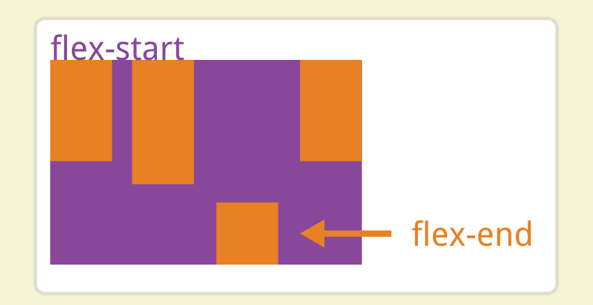

对比 align-items 和 align-self 直接移动 item 自身在交叉轴上的基线，align-content 移动的是容器自身的 flex line，并仅对多行的项目起作用（图片来自阮大博客）

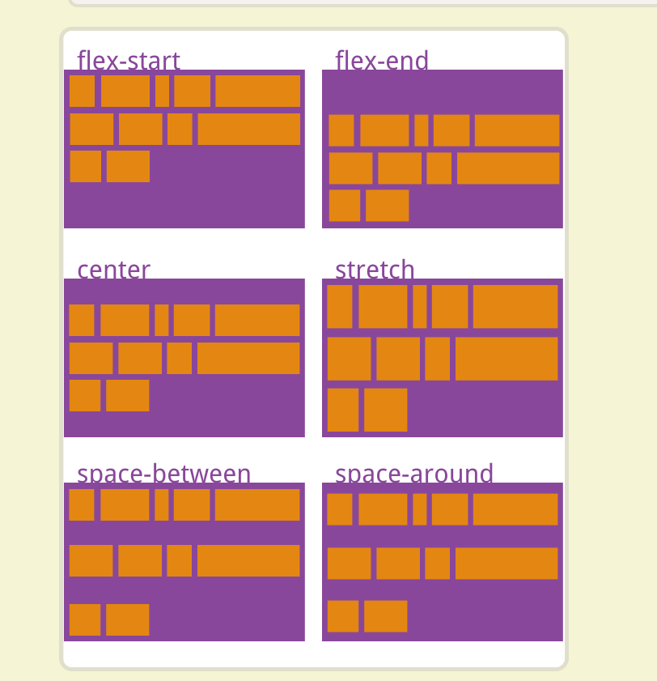


