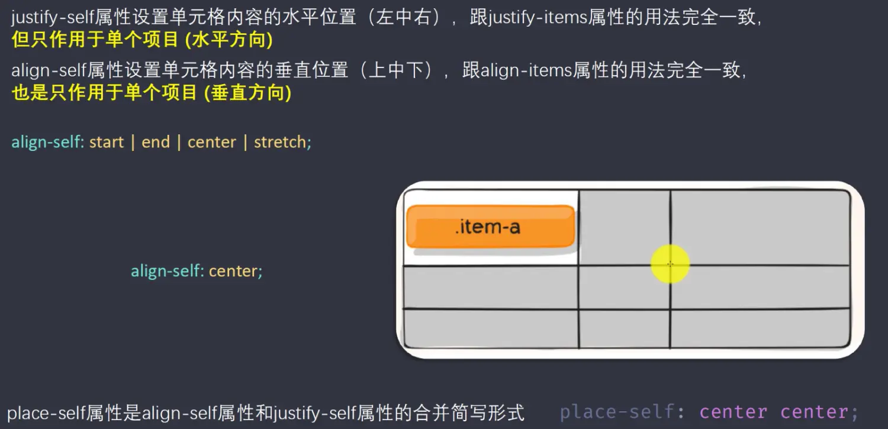

# Grid 布局详解

Flex布局是轴线布局，只能指定"项目"针对轴线的位置，可以看作是一维布局，Grid 布局则是将容器划分成“行"和“列”，产生单元格，然后指定"项目所在”的单元格，可以看作是二维布局，Grid布局远比 Flex布局强大。(不过存在兼容性问题，使用之前应看具体需求)

## 基本概念

* 容器---有容器属性(container)
* 项目---有项目属性(items)


## 容器属性

- grid-template-columns
- grid-template-rows
- grid-row-gap
- grid-column-gap
- grid-gap (3和4的简写)
- grid-template-areas
- grid-auto-flow
- justify-items
- align-items
- place-items(8和9的简写)
- justify-content
- align-content
- place-content(11和12的简写)
- grid-auto-columns
- grid-auto-rows

### grid-template-*

- 你想要多少行或者列，就填写相应属性值的个数，不填写，自动分配

```css
grid-template-columns:100px 100px 100px; // 显示为三列每一列宽度100px 
grid-template-columns:repeat(3,100px);  //同上
```


- auto-fill，有时，单元格的大小是固定的，但是容器的大小不确定，这个属性就会自动填充

```css
grid-template-columns: repeat(auto-fill,100px);
```


- fr，为了方便表示比例关系，网格布局提供了fr关键字(fraction 的缩写，意为"片段”)

```css
grid-template-columns:repeat(4,1fr); // 宽度平均分成四等份 
grid-template-columns:1fr 2fr 3fr;   // 列宽这样是分成6份各占 1 2 3 份 效果如下图 
```


- minmax()，函数产生一个长度范围，表示长度就在这个范围之中，它接受两个参数，分别为最小值和最大值

```css
grid-template-columns: 1fr minmax(150px，1fr);  // 第一个参数最小值,第二个最大值
```


- auto，表示由浏览器自己决定长度

```css
grid-template-columns: 100px auto 100px;
```


- 网格线．可以用方括号定义网格线名称，方便以后给盒子定位使用

```css
grid-template-columns: [c1] 100px [c2] 100px [c3] 100px [c4];  
```


::: normal-demo grid

```html
<div class="container">
    <div class="random-color">1</div>
    <div class="random-color">2</div>
    <div class="random-color">3</div>
    <div class="random-color">4</div>
    <div class="random-color">5</div>
    <div class="random-color">6</div>
    <div class="random-color">7</div>
    <div class="random-color">8</div>
    <div class="random-color">9</div>
    <div class="random-color">10</div>
</div>
```

```css
.container {
    display: grid;
    /* grid-template-columns: repeat(3, 100px); */
    /* grid-template-columns: repeat(auto-fill,100px); */
    /* grid-template-columns: repeat(4,1fr); */
    /* grid-template-columns:1fr 2fr 3fr; */
    /* grid-template-columns: 1fr minmax(150px , 1fr); */
    grid-template-columns: 100px auto 100px;
    font-size: 40px;
}
```
```js
var inner = document.querySelectorAll(".random-color")
for(let i=0; i<10; i++) {
    inner[i].style.backgroundColor = `rgba(${ Math.floor(Math.random() * 255)},${ Math.floor(Math.random() * 255)},${ Math.floor(Math.random() * 255)},.5)`
}
```
:::

### grid-gap / grid-column-gap

一句话解释就是，item(项目)相互之间的距离


注意:根据最新标准，上面三个属性名的grid-前缀已经删除, grid-column-gap和grid-row-gap写成==column-gap==和==row-gap==，grid-gap写成==gap==

### grid-template-areas

一个区域由单个或多个单元格组成，由你决定(具体使用，需要在项目属性里面设置)，名字相同表示在一个区域，定位或者写项目属性的时候会用到


::: normal-demo grid-template-area

```html
<div class="container">
    <div class="red"></div>
    <div class="yellow"></div>
    <div class="green"></div>
    <div class="pink"></div>
    <div class="blue"></div>
    <div class="black"></div>
</div>
```

```css
.container {
    display: grid;
    width: calc(5 * 60px);
    height: calc(5 * 60px);
    padding: 60px;
    grid-template-rows: repeat(5, 60px);
    grid-template-columns: repeat(5, 60px);
    grid-template-areas: ".  red  red  red  . "
                        "yellow .  .  .  . "
                        "green  .  black  black  . "
                        "green  .  .  .  blue "
                        ".  pink pink pink . ";
}
.red {
    grid-area: red;
    background: red;
}
.yellow {
    grid-area: yellow;
    background: yellow;
}
.green {
    grid-area: green;
    background: green;
}
.pink {
    grid-area: pink;
    background: pink;
}
.blue {
    grid-area: blue;
    background: blue;
}
.black {
    grid-area: black;
    background: black;
}

```

:::

### grid-auto-flow

划分网格以后，容器的子元素会按照顺序，自动放置在每一个网格。默认的放置顺序是"先行后列".即先填满第一行，再开始放入第二行(就是子元素的排放顺序)


row dense属性值表示换行时留下的空间可以由下面的元素填补上去

### justify-items(水平方向)/ align-items(垂直方向)

设置单元格内容的水平和垂直的对齐方式，place-items : start end； 这是两个属性的简写


### justify-content (水平方向)/ align-content(垂直方向)

设置整个内容区域（所有的项目的总和）的水平和垂直的对齐方式

```css
justify-content: start | end | center | stretch | space-around | space-between | space-evenly;   //水平方向
align-content: start | end | center | stretch | space-around | space-between | space-evenly;     // 垂直方向
```

### grid-auto-columns / grid-auto-rows

用来设置多出来的项目宽和高


## 项目属性

- grid-column-start
- grid-column-end
- grid-row-start
- grid-row-end
- grid-column(1和2的简写形式)
- grid-row(3和4的简写形式)
- grid-area
- justify-self
- align-self
- place-self (8和9的简写形式)

### grid-column-start / grid-column-end grid-row-start / grid-row-end

一句话解释，用来指定item的具体位置，根据在哪根网格线


grid-column: 1 / 3; 前两个的简写


指定了项目所占的格数，跨列数


### gird-area

- 指定项目放在哪一个区域


- grid-area 还是 grid-row-start / grid-column-start / grid-row-end / grid-column-end 的缩写形式 缩写格式如下

```css
grid-area:1 / 1 / 2 / 3;
```

### justify-self / align-self / place-self





