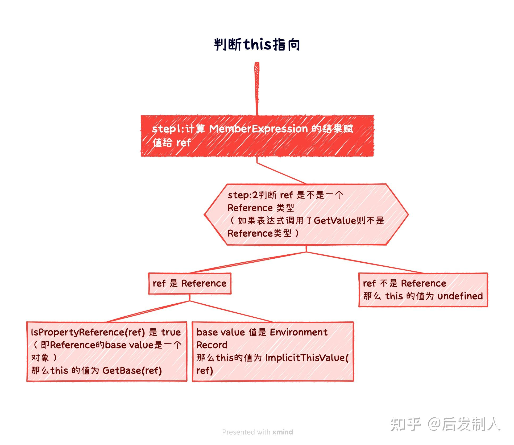
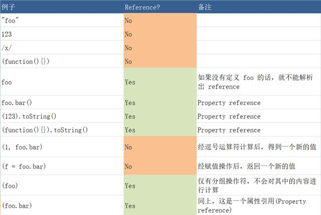

# js重点知识详解

## 原型&原型链

### 构造函数创建对象

我们先使用构造函数创建一个对象：

```js
function Person() {
  
}
var person = new Person();
person.name = 'xiaokai';
console.log(person.name)//xiaokai
```

在这个例子中,Person就是一个构造函数，我们使用一个new创建了一个实例对象person

### prototype

每个函数都有一个prototype属性，比如

```js
function Person() {

}
//prototype是函数才会有的属性
Person.prototype.name = 'xiaokai';

var person1 = new Person();
var person2 = new Person();

console.log(person1.name);//xiaokai
console.log(person2.name);//xiaokai
```

那这个函数的prototype属性到底指的什么呢？是这个函数的原型吗？

其实，函数的prototype属性指向了一个对象，这个对象正是调用该构造函数而创建的实例的原型，也就是这个例子中的person1和person2的原型。

那什么是原型呢? 你可以这样理解：每一个Javascript对象（null除外）在创建的时候就会与之关联另一个对象，这个对象就是我们所说的原型，每一个对象都会从原型继承属性。

用一张图表示构造函数和实例原型之间的关系：


那么该怎么表示实例与实例原型，也就是person和Person.prototype之间的关系

### \_proto\_

这是每一个javascript对象(除了null)都具有的一个属性，叫\_proto\_，这个属性会指向该对象的原型

```js
function Person() {

}

var person = new Person();

console.log(person.__proto__ === Person.prototype) //true
```


既然实例对象和构造函数都可以指向原型，那么原型是否有属性指向构造函数或者实例呢？

### constructor

指向实例到是没有，因为一个构造函数可以生成多个实例，但是原型指向构造函数是有的：constructor，每个原型都有一个constructor属性指向关联的构造函数

```js
function Person() {

}
console.log(Person === Person.prototype.constructor);//true

```


所以可以得到

```js
function Person() {

}

var person = new Person();

console.log(person.__proto__ == Person.prototype) // true
console.log(Person.prototype.constructor = Person)//true
console.log(Object.getPrototypeOf(person) === Person.prototype)//true
```

### 实例与原型

当读取实例的属性时，如果找不到，就会查找与对象关联的原型中的属性，如果还查不到，就去找原型的原型，一致找到最顶层为止。

```js
function Person() {

}

Person.prototype.name = 'liukai';

var person = new Person();

person.name = 'kailiu'

console.log(person.name)//kailiu

delete person.name;
console.log(person.name)//liukai
```

在这个例子中，我们给实例对象person添加了name属性，当我们打印person.name的时候，结果自然为kailiu。但是当我们删除了person的name属性时，读取person.name从person对象中找不到name属性就会从person的原型也就是person.\_proto\_,也就是Person.prototype中查找，结果为liukai


### 原型的原型

如果在原型上还没有找到呢？原型的原型又是什么?:thinking:

```js
var obj = new Object();
obj.name = 'liukai';
console.log(obj.name)//liukai
```

其实原型对象就是通过Object构造函数生成的，结合之前所讲的，实例的__proto__指向构造函数的prototype，所以我们再更新下关系图：


### 原型链

那Object.prototype的原型呢？null，我们可以打印

```js
console.log(Object.prototype.__proto__ === null)//true, null表示没有对象，即该处不应该有值
```

所以Object.prototype.__proto__的值为null跟Object.prototype没有原型，其实表达了一个意思。所以查找属性的时候查到Object.prototype就可以停止查找了，所以最后的一个关系图也可以更新为：


:::tip
其中蓝色为原型链
:::

### 其他

- constructor

首先是constructor属性

```js
function Person() {
  
}
var person = new Person();

console.log(person.constructor === Person);//true
```

当获取person.constructor时，其实person中并没有constructor属性，当不能读取到constructor属性时，会从person的原型也就是Person.prototype中读取，正好原型中有该属性，所以：

```js
person.constructor == Person.prototype.constructor
```

- \_\_proto\_\_

绝大部分浏览器都支持这个非标准的方法访问原型，然而它并不存在于Person.prototype中，实际上它是来自于Object.prototype,与其说是一个属性，不如说是一个getter/setter，当使用obj.__proto__时，可以理解成返回了Object.getPrototypeOf(obj)
## 词法作用域和动态作用域

### 作用域

作用域是指程序源代码中定义变量的区域。
作用域规定了如何查找变量，也就是确定当前执行代码对变量的访问权限。
javascript采用词法作用率（lexical scoping），也就是静态作用域。

- 静态作用域

因为javascript采用的时词法作用域，函数的作用域在函数定义的时候就决定了。而与词法作用域相对的时动态作用域，函数的作用域是在函数调用的时候才决定的

```js
var value = 1;
function foo() {
  console.log(value)
}

function bar() {
  var value = 2;
  foo()
}

bar();
//结果是？？
```

:::tip
假设JavaScript采用静态作用域，让我们分析下执行过程：

执行 foo 函数，先从 foo 函数内部查找是否有局部变量 value，如果没有，就根据书写的位置，查找上⾯⼀层的代码，也就是 value 等于 1，所以结果会打印1。

假设JavaScript采用动态作用域，让我们分析下执行过程：

执行 foo 函数，依然是从 foo 函数内部查找是否有局部变量 value。如果没有，就从调用函数的作用域，也就是 bar 函数内部查找 value 变量，所以结果会打印 2。

前⾯我们已经说了，JavaScript采用的是静态作用域，所以这个例⼦的结果是 1。
:::

- 动态作用域

什么语言是动态作用域？
bash 就是动态作用域，不信的话，把下⾯的脚本存成例如 scope.bash，然后进⼊相应的⽬录，用命令
行执行 bash ./scope.bash，看看打印的值是多少。

```bash
value = 1
function foo() {
  echo $value
}
function bar() {
  local value=2;
  foo;
}
bar
```

- 思考题:thinking:

```js
//case1
var scope = "global scope";
function checkscope() {
  var scope = "local scope";
  function f() {
    return scope
  }
  return f();
}
checkscope();

//case2
var scope = 'global scope';
function checkscope() {
  var scope = "local scope";
  function f() {
    return scope;
  }
  return f;
}
checkscope()();
```

两段代码各⾃的执行结果是多少？  local scope

因为JavaScript采用的是词法作用域，函数的作用域基于函数创建的位置。而引用《JavaScript权威指南》的回答就是：

:::tip
JavaScript 函数的执行用到了作用域链，这个作用域链是在函数定义的时候创建的。嵌套的函数 f() 定义在这个作用域链里，其中的变量 scope ⼀定是局部变量，不管何时何地执行函数 f()，这种绑定在执行 f() 时依然有效。
:::

但是在这里真正想让⼤家思考的是：
虽然两段代码执行的结果⼀样，但是两段代码究竟有哪些不同呢？请看接下来的章节

## 执行上下文

### 顺序执行

写过javascript的开发者都会有个直观的印象，那就是顺序执行：

```js
var foo = function() {
  console.log('foo1')
}
foo()//foo1

var foo = function() {
  console.log('foo2');
}

foo()//foo2
```

那这段呢？

```js
function foo() {
  console.log('foo1')
}

foo()//foo2

function foo() {
  console.log('foo2')
}

foo()//foo2

```

:::tip
打印的结果却是两个 foo2。

这是因为 JavaScript 引擎并⾮⼀行⼀行地分析和执行程序，而是⼀段⼀段地分析执行。当执行⼀段代码的时候，会进行⼀个“准备⼯作”，那这个“⼀段⼀段”中的“段”究竟是怎么划分的呢？

到底JavaScript引擎遇到⼀段怎样的代码时才会做“准备⼯作”呢？:thinking:
:::

```js
console.log(add2(1,1));//输出2
function add2(a,b) {
  return a + b;
}
console.log(add1(1,1));//报错： add1 is not a function
var add1 = function(a, b) {
  return a + b;
}
//用函数语句创建的函数add2，函数名称和函数体均被提前，在声明它之前就使用它。
//但是使用var表达式定义函数add1，只有变量声明提前了，变量初始化代码仍然在原来的位置，没法提前执行
```

### 可执行代码

这就要说到 JavaScript 的可执行代码( executable code )的类型有哪些了？

其实很简单，就三种，全局代码、函数代码、eval代码。

举个例⼦，当执行到⼀个函数的时候，就会进行准备⼯作，这里的“准备⼯作”，让我们用个更专业⼀点的说法，就叫做"执行上下文( execution context )"。

### 执行上下文栈

Javascript引擎创建了执行上下文栈（Execution context stack，ECS）来管理执行上下文。==为了模拟执行上下文栈的行为，让我们定义执行上下文是一个数组。==

```js
ECStack = [];
```

试想当javascript开始要解释执行代码的时候，最先遇到的就是全局代码，所以初始化的时候首先就会向执行上下文栈压入一个全局执行上下文，我们用globalContext表示它，并且只有当整个应用程序结束的时候，ECStack才会被清空，所以程序结束之前，ECStack最底部永远有个globalContext

```js
ECSStack = [
  globalContext
];
```

当javascript遇到下面这段代码了：

```js
function fun3() {
  console.log('fun3')
}

function fun2() {
  fun3();
}

function fun1() {
  fun2();
}

fun1();
```

==当执行一个函数的时候，就会创建一个执行上下文，并且压入执行上下文栈，当函数执行完毕时，就会将函数的执行上下文从栈中弹出==
知道了这样的工作原理，让我们来看看如何处理上面这段代码：

```js
//伪代码

//fun1()
ECStack.push(functionContext<fun1>);

//执行fun1中竟然调用了fun2，还要创建fun2的执行上下文
ECStack.push(functionContext<fun2>);

//ca，执行fun2还调用了fun3！
ECStack.push(functionContext<fun3>);

//fun3执行完毕
ECStack.pop();

//fun2执行完毕
ECStack.pop();

//fun1执行完毕
ECStack.pop();

//javascript接着执行其它代码块的代码，但是ECStack底层永远有个globalContext
```


### 回顾上下文

```js
//case1
var scope = "global scope";
function checkscope() {
  var scope = "local scope";
  function f() {
    return scope
  }
  return f();
}
checkscope();

//case2
var scope = 'global scope';
function checkscope() {
  var scope = "local scope";
  function f() {
    return scope;
  }
  return f;
}
checkscope()();
```
::: info 思考
两段代码执行的结果一样，但是两段代码究竟有哪些不同呢？
答案就是执行的上下文栈的变化不一样。
:::
模拟第一段代码：
```js
ECStack.push(functionContext<checkscope>);
ECStack.push(functionContext<f>);
ECStack.pop();
ECStack.pop();
```
模拟第二段代码：
```js
ECStack.push(functionContext<checkscope>);
ECStack.pop();
ECStack.push(functionContext<f>);
ECStack.pop();
```
根据函数执行原理：当执行一个函数的时候，就会创建一个执行上下文，并且压入执行上下文栈，当函数执行完毕时，就会将函数的执行上下文从栈中弹出

所以区别就是
case1 执行checkscope() 会依次将checkscope和f执行上下文压入执行上下文栈。然后执行。
case2 执行checkscope()()，会先将checkscope上下文压入并执行，然后再将f上下文执行压入并执行。

## 变量对象

### 基础

当javascript代码执行一段可执行代码（executable code）时，会创建对应的执行上下文(execution context)。
对于每个执行上下文，都有三个重要属性：
- 变量对象（Variable object，VO）；
- 作用域链（Scope chain）；
- this；

### 变量对象

变量对象是与执行上下文相关的数据作用域，存储了上下文中定义的变量和函数声明。

由于不同执行上下文下的变量对象稍有不同，所以我们来聊聊全局上下文下的的变量对象和函数上下文的变量对象。

### 全局上下文

1. 全局对象是预定义的对象，作为 JavaScript 的全局函数和全局属性的占位符。通过使用全局对象，
可以访问所有其他所有预定义的对象、函数和属性。
2. 在顶层 JavaScript 代码中，可以用关键字 this 引用全局对象。因为全局对象是作用域链的头，这意
味着所有⾮限定性的变量和函数名都会作为该对象的属性来查询。
3. 例如，当JavaScript 代码引用 parseInt() 函数时，它引用的是全局对象的 parseInt 属性。全局对象
是作用域链的头，还意味着在顶层 JavaScript 代码中声明的所有变量都将成为全局对象的属性。

简单点说：

- 可以通过this引用，在客户端javascript中，全局对象就是Window对象。
```js
console.log(this)
```
- 全局对象是由Object构造函数实例化的一个对象。
```js
console.log(this instanceof Object);
```
- 预定义的属性是否可用
```js
console.log(Math.random());
console.log(this.math.random());
```
- 作为全局变量的宿主
```js
var a = 1;
console.log(this.a);
```
- 客户端javascript中，全局对象有window属性指向自身
```js
var a = 1;
console.log(window.a)

this.window.b = 2;
console.log(this.b)
```

综上，对js而言，全局上下文中的变量对象就是全局对象

### 函数上下文

在函数上下文中，我们用活动对象( activation object , AO)来表示变量对象。

活动对象和变量对象其实是⼀个东⻄，只是变量对象是规范上的或者说是引擎实现上的，不可在JavaScript 环境中访问，只有到当进⼊⼀个执行上下文中，这个执行上下文的变量对象才会被激活，所以才叫 activation object，而只有被激活的变量对象，也就是活动对象上的各种属性才能被访问。

活动对象是在进⼊函数上下文时刻被创建的，它通过函数的 arguments 属性初始化。arguments 属性值是 Arguments 对象。

### 执行过程

执行上下文的代码分成两个阶段进行处理：分析和执行，我们也可以叫做：

1. 进⼊执行上下文；
2. 代码执行；


- 进入执行上下文

  当进⼊执行上下文时，这时候还没有执行代码，变量对象会包括：

  - 函数的所有形参 (如果是函数上下文)
    - 由名称和对应值组成的⼀个变量对象的属性被创建；
    - 没有实参，属性值设为 undefined；
  - 函数声明
    - 由名称和对应值（函数对象(function-object)）组成⼀个变量对象的属性被创建；
    - 如果变量对象已经存在相同名称的属性，则完全替换这个属性；
  - 变量声明
    - 由名称和对应值（undefined）组成⼀个变量对象的属性被创建；
    - 如果变量名称跟已经声明的形式参数或函数相同，则变量声明不会⼲扰已经存在的这类属性；

举个例子

```js
function foo(a) {
  var b = 2;
  function c() {}
  var d = function() {};
  b = 3;
}
foo(1);
```

在进入执行上下文后，这时的AO是：

```js
AO = {
  arguments: {
    0: 1,
    length: 1
  },
  a: 1,
  b: undefined,
  c: reference to function c(){},
  d: undefined
}

```

- 代码执行

在代码执行阶段，会顺序执行代码，根据代码，修改变量对象的值
还是上⾯的例⼦，当代码执行完后，这时候的 AO 是：

```js
AO = {
  arguments: {
    0: 1,
    length: 1
  },
  a: 1,
  b: 3,
  c: reference to function c(){},
  d: reference to FunctionExpression "d"
}
```

到这里变量对象的创建过程就介绍完了，让我们简洁的总结我们上述所说：

  1. 全局上下文的变量对象初始化是全局对象；
  2. 函数上下文的变量对象初始化只包括 Arguments 对象；
  3. 在进⼊执行上下文时会给变量对象添加形参、函数声明、变量声明等初始的属性值；
  4. 在代码执行阶段，会再次修改变量对象的属性值；


### 思考题

**example one**

```js
function foo() {
  console.log(a);
  a = 1;
}
foo(); // ???
function bar() {
  a = 1;
  console.log(a);
}
bar(); // ???
```

第⼀段会报错： Uncaught ReferenceError: a is not defined 。
第⼆段会打印：1。
这是因为函数中的 "a" 并没有通过 var 关键字声明，所有不会被存放在 AO 中。
第⼀段执行 console 的时候， AO 的值是：

```js
AO = {
  arguments: {
    length: 0
  }
}
```

没有 a 的值，然后就会到全局去找，全局也没有，所以会报错。
当第⼆段执行 console 的时候，全局对象已经被赋予了 a 属性，这时候就可以从全局找到 a 的值，所以会打印 1。

**example two**

```js
console.log(foo);

function foo(){
  console.log("foo");
}

var foo = 1;
```

会打印函数，而不是 undefined 。
这是因为在进⼊执行上下文时，⾸先会处理函数声明，其次会处理变量声明，如果变量名称跟已经声明的形式参数或函数相同，则变量声明不会⼲扰已经存在的这类属性。

## 作用域链

上文讲到，当JavaScript代码执行⼀段可执行代码( executable code )时，会创建对应的执行上下文( execution context )。

对于每个执行上下文，都有三个重要属性：
  - 变量对象(Variable object，VO)
  - 作用域链(Scope chain)
  - this

本节讲作用域链。

### 作用域链

上节讲到，当查找变量的时候，会先从当前上下文的变量对象中查找，如果没有找到，就会从⽗级(词法层⾯上的⽗级)执行上下文的变量对象中查找，⼀直找到全局上下文的变量对象，也就是全局对象。这样由多个执行上下文的变量对象构成的链表就叫做作用域链。

### 函数创建

上文的词法作用域与动态作用域中讲到，函数的作用域在函数定义的时候就决定了。

这是因为函数有⼀个内部属性 \[\[scope\]\]，当函数创建的时候，就会保存所有⽗变量对象到其中，你可以理解 \[\[scope\]\] 就是所有⽗变量对象的层级链，但是注意：\[\[scope\]\] 并不代表完整的作用域链！

举个例⼦：

```js
function foo() {
  function bar() {
    ...
  }
}
```

函数创建时，各自的\[\[scope\]\]为:

```js
foo.[[scope]] = [
  globalContext.VO
];
bar.[[scope]] = [
  fooContext.AO,
  globalContext.VO
];
```

### 函数激活

当函数激活时，进⼊函数上下文，创建 VO/AO 后，就会将活动对象添加到作用链的前端。
这时候执行上下文的作用域链，我们命名为 Scope：

```js
Scope = [AO].concat([[Scope]]);
```

至此，作用域链创建完毕。

### 总结

结合着之前讲的变量对象和执行上下文栈，我们来总结⼀下函数执行上下文中作用域链和变量对象的创建过程：

```js
var scope = "global scope";
function checkscope(){
  var scope2 = 'local scope';
  return scope2;
}
checkscope();
```

执行过程如下：

1.checkscope 函数被创建，保存作用域链到 内部属性\[\[scope\]\]

```js
checkscope.[[scope]] = [
  globalContext.VO
];

```

2.执行 checkscope 函数，创建 checkscope 函数执行上下文，checkscope 函数执行上下文被压⼊执行上下文栈

```js
ECStack = [
  checkscopeContext,
  globalContext
];
```

3.checkscope 函数并不⽴刻执行，开始做准备⼯作，第⼀步：复制函数\[\[scope\]\]属性创建作用域链

```js
checkscopeContext = {
  Scope: checkscope.[[scope]],
}
```

4.第⼆步：用 arguments 创建活动对象，随后初始化活动对象，加⼊形参、函数声明、变量声明

```js
checkscopeContext = {
  AO: {
    arguments: {
      length: 0
    },
    scope2: undefined
  }，
  Scope: checkscope.[[scope]],
}
```

5.第三步：将活动对象压⼊ checkscope 作用域链顶端

```js
checkscopeContext = {
 AO: {
  arguments: {
    length: 0
  },
  scope2: undefined
 },
 Scope: [AO, [[Scope]]]
}
```

6.准备⼯作做完，开始执行函数，随着函数的执行，修改 AO 的属性值

```js
checkscopeContext = {
 AO: {
  arguments: {
    length: 0
  },
  scope2: 'local scope'
 },
 Scope: [AO, [[Scope]]]
}
```

7.查找到 scope2 的值，返回后函数执行完毕，函数上下文从执行上下文栈中弹出

```js
ECStack = [
  globalContext
];
```

## this

对于每个执行上下文，都有三个重要属性

- 变量对象(Variable object，VO)
- 作用域链(Scope chain)
- this

本节主要讲this，有人说简单理解this的规则为谁调用，this就是谁，很形象但是不准确，透过ECMAScript规范来理解this的值:thinking:

### Types
引用ECMA规范中一句话

```text
Types are further subclassified into ECMAScript language types and specification types.
An ECMAScript language type corresponds to values that are directly manipulated by an
ECMAScript programmer using the ECMAScript language. The ECMAScript language types are
Undefined, Null, Boolean, String, Number, and Object.
A specification type corresponds to meta-values that are used within algorithms to describe
the semantics of ECMAScript language constructs and ECMAScript language types. The
specification types are Reference, List, Completion, Property Descriptor, Property Identifier,
Lexical Environment, and Environment Record.
```

我们简单的翻译⼀下：

ECMAScript 的类型分为语言类型和规范类型。

ECMAScript 语言类型是开发者直接使用 ECMAScript 可以操作的。其实就是我们常说的Undefined,Null, Boolean, String, Number, 和 Object。

而规范类型相当于 meta-values，是用来用算法描述 ECMAScript 语言结构和 ECMAScript 语言类型的。规范类型包括：Reference, List, Completion, Property Descriptor, Property Identifier, LexicalEnvironment, 和 Environment Record。==我们只要知道在 ECMAScript 规范中还有⼀种只存在于规范中的类型，它们的作用是用来描述语言底层行为逻辑。==

这里要讲的重点是便是其中的 Reference 类型。它与 this 的指向有着密切的关联。

### Reference

Reference 类型就是用来解释诸如 delete、typeof 以及赋值等操作行为的。
这里的 Reference 是⼀个 Specification Type，也就是 “只存在于规范里的抽象类型”。它们是为了更好
地描述语言的底层行为逻辑才存在的，但并不存在于实际的 js 代码中。
再看接下来的这段具体介绍 Reference 的内容：

```text
A Reference consists of three components, the base value, the referenced name and the
Boolean valued strict reference flag.
The base value is either undefined, an Object, a Boolean, a String, a Number, or an environment
record (10.2.1).
A base value of undefined indicates that the reference could not be resolved to a binding. The
referenced name is a String.
```

这段讲述了 Reference 的构成，由三个组成部分，分别是：
- base value；
- referenced name；
- strict reference；

我们简单的理解的话：

base value 就是==属性所在的对象==或者就是 EnvironmentRecord，它的值只可能是 undefined, an
Object, a Boolean, a String, a Number, or an environment record 其中的⼀种。
referenced name 就是属性的名称。

举个例子：

```js
var foo = 1;
// 对应的Reference是：
var fooReference = {
  base: EnvironmentRecord,
  name: 'foo',
  strict: false
};

var foo = {
  bar: function () {
    return this;
  }
};

foo.bar(); // foo
// bar对应的Reference是：
var BarReference = {
  base: foo,
  propertyName: 'bar',
  strict: false
}
```

而且规范中还提供了获取 Reference 组成部分的方法，比如 GetBase 和 IsPropertyReference。

#### **GetBase**

返回 reference 的 base value。

```js
var foo = 1;
var fooReference = {
  base: EnvironmentRecord,
  name: 'foo',
  strict: false
};
GetValue(fooReference) // 1;
```

**GetValue 返回对象属性真正的值，但是，调用 GetValue，返回的将是具体的值，而不再是⼀个Reference**

#### **IsPropertyReference**

```text
IsPropertyReference(V). Returns true if either the base value is an object or
HasPrimitiveBase(V) is true; otherwise returns false.
```

**如果 base value 是⼀个对象，就返回true。**

### 如何确定this的值

根据ECMAscript规范：

1. 计算 MemberExpression 的结果赋值给 ref；
2. 判断 ref 是不是⼀个 Reference 类型；

    a. 如果 ref 是 Reference，并且 IsPropertyReference(ref) 是 true, 那么 this 的值为
    GetBase(ref)

    b. 如果 ref 是 Reference，并且 base value 值是 Environment Record, 那么this的值为
    ImplicitThisValue(ref)，根据规范10.2.1.2.6，ImplicitThisValue(ref) 函数始终返回 undefined

    c. 如果 ref 不是 Reference，那么 this 的值为 undefined；




### 具体分析

#### **计算 MemberExpression 的结果赋值给 ref**

ECMAscript规范中， MemberExpression表示如下
- PrimaryExpression // 原始表达式
- FunctionExpression // 函数定义表达式
- MemberExpression [ Expression ] // 属性访问表达式
- MemberExpression . IdentifierName // 属性访问表达式
- new MemberExpression Arguments // 对象创建表达式

```js
function foo() {
  console.log(this)
}
foo(); // MemberExpression 是 foo
function foo() {
  return function() {
    console.log(this)
  }
}
foo()(); // MemberExpression 是 foo()
var foo = {
  bar: function () {
    return this;
  }
}
foo.bar(); // MemberExpression 是 foo.bar
```

所以简单理解 MemberExpression 其实就是()左边的部分

#### **判断 ref 是不是⼀个 Reference 类型**

关键就在于看规范是如何处理各种 MemberExpression ，返回的结果是不是⼀个 Reference 类型。

```js
var value = 1;
var foo = {
  value: 2,
  bar: function () {
    return this.value;
  }
}
//示例1  规范规定该表达式返回了一个Reference类型
console.log(foo.bar());
//示例2  规范规定该表达式返回了一个Reference类型
console.log((foo.bar)());
//示例3  规范规定该表达式，有赋值操作符，使用了GetValue，该表达式返回的值不是Reference类型
console.log((foo.bar = foo.bar)());
//示例4  规范规定该表达式使用了GetValue，该表达式返回的值不是Reference类型
console.log((false || foo.bar)());
//示例5  规范规定该表达式使用了GetValue，该表达式返回的值不是Reference类型
console.log((foo.bar, foo.bar)());
```

常见规范表达式中的refenence判断如下：



所以再根据this的判断规则可得出 

示例一： ref是Reference类型，IsPropertyReference(ref)是true(因为base value为foo是一个对象，所以为true)，那么this的值为GetBase(ref)为foo，打印2
```js
var Reference = { base: foo, name: 'bar', strict: false };
```

示例二：foo.bar 被 () 包住，根据规范原文，实际上 () 并没有对 MemberExpression 进行计算，所以其实跟示例 1 的结果是⼀样的，打印2

示例三四五 都符合 ref不是Reference类型，故this的值为undefind，非严格模式下，其值会被隐式转换为全局对象。打印1


## 执行上下文

### 思考题

```js
var scope = "global scope";
function checkscope(){
  var scope = "local scope";
  function f(){
    return scope;
  }
  return f();
}
checkscope();

var scope = "global scope";
function checkscope(){
  var scope = "local scope";
  function f(){
    return scope;
  }
  return f;
}
checkscope()();
```

两段代码都会打印'local scope'，在上文讲到了两者的区别在于执行上下文栈的变化不⼀样，本节会在此
基础上，详细的解析执行上下文栈和执行上下文的具体变化过程。

### 具体执行分析

我们来分析第一段代码

1. 执行全局代码，创建全局执行上下文，全局上下文被压⼊执行上下文栈
```js
ECStack = [
  globalContext
];
```
2. 全局上下文初始化
```js
globalContext = {
  VO: [global],
  Scope: [globalContext.VO],
  this: globalContext.VO
}
```
3. 初始化的同时，checkscope 函数被创建，保存作⽤域链到函数的内部属性\[\[scope\]\]
```js
checkscope.[[scope]] = [
  globalContext.VO
];
```
4. 执行 checkscope 函数，创建 checkscope 函数执行上下文，checkscope 函数执行上下文被压⼊执行上下文栈
```js
ECStack = [
  checkscopeContext,
  globalContext
];
```
5. checkscope 函数执行上下文初始化：
    a. 复制函数 \[\[scope\]\] 属性创建作⽤域链；
    b. ⽤ arguments 创建活动对象；
    c. 初始化活动对象，即加⼊形参、函数声明、变量声明；
    d. 将活动对象压⼊ checkscope 作⽤域链顶端；
    同时 f 函数被创建，保存作⽤域链到 f 函数的内部属性\[\[scope\]\]
```js
checkscopeContext = {
  AO: {
    arguments: {
    length: 0
  },
    scope: undefined,
    f: reference to function f(){}
  },
  Scope: [AO, globalContext.VO],
  this: undefined
}
```
6. f 函数执行，沿着作⽤域链查找 scope 值，返回 scope 值；
7. f 函数执行完毕，f 函数上下文从执行上下文栈中弹出；
```js
ECStack = [
  checkscopeContext,
  globalContext
];
```
8. checkscope 函数执行完毕，checkscope 执行上下文从执行上下文栈中弹出
```js
ECStack = [
  globalContext
];
```

## 闭包

:::info MDN对闭包的定义
闭包是指那些能够访问自由变量的函数。
:::

:::info 自由变量
自由变量是指在函数中使用，但既不是函数参数也不是函数的局部变量的变量
:::

:::info 闭包共有两部分
闭包 = 函数 + 函数能够访问的⾃由变量
```js
var a = 1;
function foo() {
  console.log(a);
}
foo();
```
foo 函数可以访问变量 a，但是 a 既不是 foo 函数的局部变量，也不是 foo 函数的参数，所以 a 就是⾃由变量。

所以在《JavaScript权威指南》中就讲到：从技术的⻆度讲，所有的JavaScript函数都是闭包。
但是，这是理论上的闭包，其实还有⼀个实践⻆度上的闭包。
::: 

ECMAScript中，闭包指的是：
1. 从理论角度度：所有的函数。因为它们都在创建的时候就将上层上下文的数据保存起来了。哪怕是简单的全局变量也是如此，因为函数中访问全局变量就相当于是在访问自由变量，这个时候使用最外层的作用域；
2. 从实践⻆度：以下函数才算是闭包：
a. 即使创建它的上下文已经销毁，它仍然存在（比如，内部函数从⽗函数中返回）；
b. 在代码中引用了自由变量；

接下来就来讲讲实践上的闭包。

### 分析

```js
var scope = "global scope";
function checkscope(){
  var scope = "local scope";
  function f(){
    return scope;
  }
  return f;
}
var foo = checkscope();
foo();
```

这⾥直接给出简要的执行过程：
1. 进⼊全局代码，创建全局执行上下文，全局执行上下文压⼊执行上下文栈；
2. 全局执行上下文初始化；
3. 执行 checkscope 函数，创建 checkscope 函数执行上下文， checkscope 执行上下文
被压⼊执行上下文栈；
4. checkscope 执行上下文初始化，创建变量对象、作⽤域链、this等；
5. checkscope 函数执行完毕， checkscope 执行上下文从执行上下文栈中弹出；
6. 执行 f 函数，创建 f 函数执行上下文，f 执行上下文被压⼊执行上下文栈；
7. f 执行上下文初始化，创建变量对象、作⽤域链、this等；
8. f 函数执行完毕，f 函数上下文从执行上下文栈中弹出；

了解到这个过程，我们应该思考⼀个问题：

:::warning
当 f 函数执行的时候，checkscope 函数上下⽂已经被销毁了啊(即从执行上下⽂栈中被弹出)，怎么还会读取到 checkscope 作⽤域下的 scope 值呢？:thinking:
:::

当我们了解了具体的执行过程后，我们知道 f 执行上下⽂维护了⼀个作⽤域链：

```js
fContext = {
  Scope: [AO, checkscopeContext.AO, globalContext.VO],
}
```

因为这个作⽤域链，f 函数依然可以读取到 checkscopeContext\.AO 的值，说明当 f 函数引⽤了checkscopeContext\.AO 中的值的时候，即使 checkscopeContext 被销毁了，但是JavaScript 依然会让 checkscopeContext\.AO 活在内存中，f 函数依然可以通过 f 函数的作⽤域链找到它，正是因为 JavaScript 做到了这⼀点，从⽽实现了闭包这个概念

所以，让我们再看⼀遍实践⻆度上闭包的定义：

1. 即使创建它的上下⽂已经销毁，它仍然存在（⽐如，内部函数从⽗函数中返回）；
2. 在代码中引⽤了⾃由变量；

### 思考题

```js
var data = [];
for (var i = 0; i < 3; i++) {
  data[i] = function () {
    console.log(i);
  };
}
data[0]();
data[1]();
data[2]();
//答案都是3，让我们分析下原因
```

当执行到 data[0] 函数之前，此时全局上下⽂的 VO 为：

```js
globalContext = {
  VO: {
    data: [...],
    i: 3
  }
}
```
当执行 data[0] 函数的时候，data[0] 函数的作⽤域链为：

```js
data[0]Context = {
  Scope: [AO, globalContext.VO]
}
```

data[0]Context 的 AO 并没有 i 值，所以会从 globalContext.VO 中查找，i 为 3，所以打印的结果就是 3。
data[1] 和 data[2] 是⼀样的道理。

所以改成闭包：

```js
var data = [];
for (var i = 0; i < 3; i++) {
  data[i] = (function (i) {
  return function(){
    console.log(i);
  }
  })(i);
}
data[0]();
data[1]();
data[2]();
```

当执行到 data[0] 函数之前，此时全局上下⽂的 VO 为：

```js
globalContext = {
  VO: {
    data: [...],
    i: 3
  }
}
```

跟没改之前⼀模⼀样。
当执行 data[0] 函数的时候，data[0] 函数的作⽤域链发⽣了改变：

```js
data[0]Context = {
  Scope: [AO, 匿名函数Context.AO, globalContext.VO]
}
```

匿名函数执行上下⽂的AO为：

```js
匿名函数Context = {
  AO: {
    arguments: {
      0: 0,
      length: 1
    },
    i: 0
  }
}
```

data[0]Context 的 AO 并没有 i 值，所以会沿着作⽤域链从匿名函数 Context\.AO 中查找，这时候就会找 i 为 0，找到了就不会往 globalContext.VO 中查找了，即使 globalContext.VO 也有 i 的值(值为3)，所以打印的结果就是0。
data[1] 和 data[2] 是⼀样的道理。

## 引用

[es5](http://es5.github.io/)


