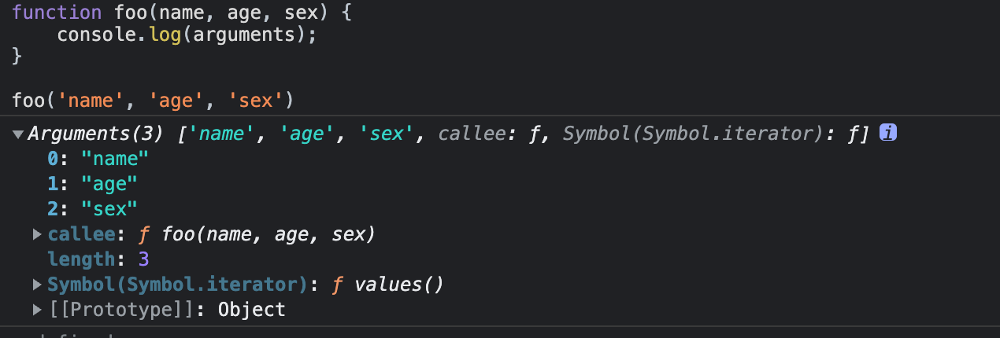

# js函数与对象

## 函数参数按值传递

:::tip 在《JavaScript高级程序设计》中提到传递参数
ECMAScript中所有函数的参数都是按值传递的。
:::

:::tip 按值传递
把函数外部的值复制给函数内部的参数，就和把值从⼀个变量复制到另⼀个变量⼀样。
:::

### 按值传递

举个简单额例子

```js
var value = 1;
function foo(v) {
    v = 2;
    console.log(v); //2
}
foo(value);
console.log(value) // 1
```

很好理解，当传递 value 到函数 foo 中，相当于拷贝了⼀份 value，假设拷贝的这份叫 _value，函数中修改的都是 _value 的值，而不会影响原来的 value 值。

### 共享传递

拷贝虽然很好理解，但是当值是⼀个复杂的数据结构的时候，拷贝会产⽣性能上的问题。这里提及⼀种：按引用传递。

所谓按引用传递，就是传递对象的引用，函数内部对参数的任何改变都会影响该对象的值，因为两者引用的是同⼀个对象。

举个:chestnut:

```js
var obj = {
    value: 1
};
function foo(o) {
    o.value = 2;
    console.log(o.value); //2
}
foo(obj);
console.log(obj.value) // 2
```

为什么《JavaScript高级程序设计》都说了 ECMAScript 中所有函数的参数都是按值传递的，那为什么能按"引用传递"成功呢？

参数如果是基本类型是按值传递，如果是引用类型按共享传递。但是因为拷贝副本也是⼀种值的拷贝，所以在高程中也直接认为是按值传递了。

换句话说，函数传递参数 ，传递的是参数的拷贝：

1. 指针拷贝，拷贝的是地址索引；
2. 常规类型拷贝，拷贝的是值 ；

所以，⼀共是两种传递方式，按值传递和按共享传递。

### 总结

javascript中数据类型分为基本类型与引用类型: 

1. 基本类型值存储于栈内存中，传递的就是当前值，修改不会影响原有变量的值；
2. 引用类型值其实也存于栈内存中，只是它的值是指向堆内存当中实际值的⼀个地址；索引引用传递传的值是栈内存当中的引用地址，当改变时，改变了堆内存当中的实际值

举个:chestnut:

```js
var value = 1;
function foo(v) {
    v = 2;
    console.log(v); //2
}
foo(value);
console.log(value) // 1
```

内存分布：

- 改变前：

<table>
  <tr>
    <th colspan='2'>栈内存</th>
    <th>堆内存</th>
  </tr>
  <tr>
    <td>value</td>
    <td>1</td>
    <td></td>
  </tr>
  <tr>
    <td>v</td>
    <td>1</td>
    <td></td>
  </tr>
</table>

- 改变后：

<table>
  <tr>
    <th colspan='2'>栈内存</th>
    <th>堆内存</th>
  </tr>
  <tr>
    <td>value</td>
    <td>1</td>
    <td></td>
  </tr>
  <tr>
    <td>v</td>
    <td>2</td>
    <td></td>
  </tr>
</table>

```js
var obj = {
  value: 1
};
function foo(o) {
  o.value = 2;
  console.log(o.value); //2
}
foo(obj);
console.log(obj.value) // 2
```

- 改变前：

<table>
  <tr>
    <th colspan='2'>栈内存</th>
    <th>堆内存</th>
  </tr>
  <tr>
    <td>obj</td>
    <td>指针地址</td>
    <td>{value: 1}</td>
  </tr>
  <tr>
    <td>o</td>
    <td>指针地址</td>
    <td>{value: 1}</td>
  </tr>
</table>

- 改变后：

<table>
  <tr>
    <th colspan='2'>栈内存</th>
    <th>堆内存</th>
  </tr>
  <tr>
    <td>obj</td>
    <td>指针地址</td>
    <td>{value: 2}</td>
  </tr>
  <tr>
    <td>o</td>
    <td>指针地址</td>
    <td>{value: 2}</td>
  </tr>
</table>

```js
var obj = {
  value: 1
};
function foo(o) {
  o = 2;
  console.log(o); //2
}
foo(obj);
console.log(obj.value) // 1
```

- 改变前：

<table>
  <tr>
    <th colspan='2'>栈内存</th>
    <th>堆内存</th>
  </tr>
  <tr>
    <td>obj</td>
    <td>指针地址</td>
    <td>{value: 1}</td>
  </tr>
  <tr>
    <td>o</td>
    <td>指针地址</td>
    <td>{value: 1}</td>
  </tr>
</table>

- 改变后：

<table>
  <tr>
    <th colspan='2'>栈内存</th>
    <th>堆内存</th>
  </tr>
  <tr>
    <td>obj</td>
    <td>指针地址</td>
    <td>{value: 1}</td>
  </tr>
  <tr>
    <td>o</td>
    <td>2</td>
    <td></td>
  </tr>
</table>

## 手写call和apply

### 手写call

:::info call()
在使用一个指定的this值和若干个指定的参数值的前提下调用某个函数或方法。
:::

```js
let foo = {
  value: 1
};

function bar(){
  console.log(this.value)
}

bar.call(foo); //1
```

注意两点：
1. call 改变了 this 的指向，指向到 foo；
2. bar 函数执行了；

#### 第一步

上述方式等同于：

```js
let foo = {
  value: 1,
  bar: function() {
    console.log(this.value)
  }
}

foo.bar();
```

这个时候this就指向了foo,但是这样却给foo对象本身添加了一个属性，所以我们用delete再删除它即可。

所以我们模拟的步骤可以分为：

1. 将函数设为对象的属性
2. 执行该函数
3. 删除该函数

```js
// 第⼀步
// fn 是对象的属性名，反正最后也要删除它，所以起什么都可以。
foo.fn = bar
// 第⼆步
foo.fn()
// 第三步
delete foo.fn
```

:::info 第一版
```js
Function.prototype.call2 = function(context) {
  //首先要获取调用call的函数，用this可以获取
  context.fn = this;
  context.fn();
  delete context.fn;
}
//测试一下
let foo = {
  value: 1
}

function bar() {
  console.log(this.value)
}

bar.call2(foo);//1
```
:::

#### 第二步

call除了可以指定this，还可以指定参数

```js
var foo = {
  value: 1
};
function bar(name, age) {
  console.log(name)
  console.log(age)
  console.log(this.value);
}
bar.call(foo, 'kevin', 18);
// kevin
// 18
// 1
//实现可以从arguments中取第二个到最后一个参数
```

:::info 第二版
```js
Function.prototype.call2 = function(context) {
  //首先要获取调用call的函数，用this可以获取
  context.fn = this;
  let args = [...argments].slice(1)
  context.fn(...args);
  delete context.fn;
}
// 测试⼀下
var foo = {
  value: 1
};
function bar(name, age) {
  console.log(name)
  console.log(age)
  console.log(this.value);
}
bar.call2(foo, 'kevin', 18);
// kevin
// 18
// 1
```
:::

#### 第三步

1. this 参数可以传 null，当为 null 的时候，视为指向 window
2. 针对函数，可以实现返回值

:::info 第三版
```js
Function.prototype.call2 = function(context) {
  var context = context || window;
  //首先要获取调用call的函数，用this可以获取
  context.fn = this;

  let args = [...argments].slice(1)
  let result = context.fn(...args);

  delete context.fn;
  return result
}
// 测试⼀下
var value = 2;
var obj = {
  value: 1
}
function bar(name, age) {
  console.log(this.value);
  return {
    value: this.value,
    name: name,
    age: age
  }
}
bar.call2(null); // 2
console.log(bar.call2(obj, 'kevin', 18));
// 1
// Object {
// value: 1,
// name: 'kevin',
// age: 18
// }
```
:::

### 手写apply

apply的实现跟call类似，知识入参不一样，apply为数组

```js
Function.prototype.apply2 = function(context, args) {
 // 判断是否是undefined和null
  if (typeof context === 'undefined' || context === null) {
    context = window
  }
  let fnSymbol = Symbol()
  context[fnSymbol] = this
  let fn = context[fnSymbol](...args)
  delete context[fnSymbol]
  return fn
}
```

## 手写bind

:::info 
bind() 方法会创建⼀个新函数。当这个新函数被调用时，bind() 的第⼀个参数将作为它运行时的 this，
之后的⼀序列参数将会在传递的实参前传⼊作为它的参数
由此我们可以⾸先得出 bind 函数的两个特点：
1. 返回⼀个函数；
2. 可以传⼊参数；
:::

### 返回函数的模拟实现

```js
var foo = {
  value: 1
}

function bar() {
  console.log(this.value);
}

//返回一个函数
var bindFoo = bar.bind(foo);

bindFoo();//1
```

关于指定this的指向，我们可以使用call或者apply实现

```js
Function.prototype.bind2 = function(context) {
  var self = this;

  //考虑到绑定函数可能是由返回值的，加上return
  return function() {
    return self.apply(context);
  }
}
```

### 传参的模拟实现

接下来，关于参数的传递

```js
var foo = {
  value: 1
}

function bar(name, age) {
  console.log(this.value);
  console.log(name);
  console.log(age);
}

var bindFoo = bar.bind(foo, 'daisy');

bindFoo('18')
//1
//daisy
//18
```

当需要传name和age两个参数时，可以在bind的时候，只传一个name，在执行返回的函数的时候，再传另一个参数age。

:::info 第二版
```js
Function.prototype.bind2 = function(context) {

  var self = this;
  //获取bind2函数从第二个参数到最后一个参数
  var args = Array.prototype.slice.call(arguments,1);
  
  return function() {
    //这个时候的arguments是指bind返回的函数传入的参数
    var bindArgs = Array.prototype.slice.call(arguments);
    return self.apply(context, args.concat(bindArgs))
  }

}
```
:::

### 构造函数效果的模拟实现

:::info bind还有一个特点
一个绑定函数也能使用new操作符创建对象：这种行为就像把原函数当成构造器。提供的this值被忽略，同时调用时的参数被提供给模拟函数。
:::

```js
var value = 2;

var foo = {
  value: 1
}

function bar(name, age) {
  this.habit = 'shopping';
  console.log(this.value)
  console.log(name)
  console.log(age)
}

bar.prototype.friend = 'kevin'

var bindFoo = bar.bind(foo, 'daisy')

var obj = new bindFoo('18');
//undefind
//daisy
//18
console.log(obj.habit);
console.log(obj.friend);
//shopping
//kevin
```

尽管在全局和 foo 中都声明了 value 值，最后依然返回了 undefind，说明绑定的 this 失效了
后⽂中new 的模拟实现，就会知道这个时候的 this 已经指向了 obj。

:::info 第三版
```js
Function.prototype.bind2 = function(context) {

  var self = this;
  //获取bind2函数从第二个参数到最后一个参数
  var args = Array.prototype.slice.call(arguments,1);
  
  var fBound = function() {
    var bindArgs = Array.prototype.slice.call(arguments);
    return self.apply(this instanceof fBound ? this : context, args.concat(bindArgs))
  }
  
  fBound.prototype = this.prototype;

  return fBound
}
```
:::

### 构造函数效果的优化实现

在这个写法中，我们直接将 fBound.prototype = this.prototype ，我们直接修改fBound.prototype 的时候，也会直接修改绑定函数的 prototype。这个时候，我们可以通过⼀个空函数来进行中转：

:::info 第四版
```js
Function.prototype.bind2 = function(context) {
  //调用 bind 的不是函数时，提示错误：
  if (typeof this !== "function") {
    throw new Error("Function.prototype.bind - what is trying to be bound is not callable");
  }
  var self = this;
  //获取bind2函数从第二个参数到最后一个参数
  var args = Array.prototype.slice.call(arguments,1);
  
  var fnop = function() {}

  var fBound = function() {
    var bindArgs = Array.prototype.slice.call(arguments);
    return self.apply(this instanceof fBound ? this : context, args.concat(bindArgs))
  }
  
  fnop.prototype = this.prototype;

  fBound.prototype = new fnop();

  return fBound
}
```
:::

:::info 最简化版
```js
Function.prototype.myBind = function(context) {
  // 判断是否是undefined 和 null
  if (typeof context === "undefined" || context === null) {
    context = window;
  }
  self = this;
  return function(...args) {
    return self.apply(context, args);
  }
}

```
:::

## 手写模拟new

new运算符创建一个用户定义的对象类型的实例或者具有构造函数的内置对象类型之一，先看看new实现了哪些功能。

```js
function Person(name,age) {
  this.name = name;
  this.age = age;
  this.habit = 'Games';
}

Person.prototype.strength = 80;
Person.prototype.sayYourName = function () {
  console.log('I am ' + this.name);
}
var person = new Person('Kevin', '18');
console.log(person.name) // Kevin
console.log(person.habit) // Games
console.log(person.strength) // 80
person.sayYourName(); // I am Kevin
```

我们可以看到，实例 person 可以：

1. 访问到 Person 构造函数里的属性；
2. 访问到 Person.prototype 中的属性；

因为 new 是关键字，所以⽆法像 bind 函数⼀样直接覆盖，所以我们写⼀个函数，命名为objectFactory，来模拟 new 的效果。

### 初步实现

:::info 第一版
```js
// 第⼀版代码
function objectFactory() {
  var obj = new Object(),
  Constructor = [].shift.call(arguments);
  obj.__proto__ = Constructor.prototype;
  Constructor.apply(obj, arguments);
  return obj;
};
```
:::

在这⼀版中，我们：
1. 用new Object() 的方式新建了⼀个对象 obj；
2. 取出第⼀个参数，就是我们要传⼊的构造函数。此外因为 shift 会修改原数组，所以 arguments 会被去除第⼀个参数；
3. 将 obj 的原型指向构造函数，这样 obj 就可以访问到构造函数原型中的属性；
4. 使用 apply，改变构造函数 this 的指向到新建的对象，这样 obj 就可以访问到构造函数中的属性；
5. 返回 obj；

测试下

:::normal-demo new
```js
function Person (name, age) {
  this.name = name;
  this.age = age;
  this.habit = 'Games';
}
Person.prototype.strength = 60;
Person.prototype.sayYourName = function () {
  console.log('I am ' + this.name);
}
function objectFactory() {
  var obj = new Object(),
  Constructor = [].shift.call(arguments);
  obj.__proto__ = Constructor.prototype;
  Constructor.apply(obj, arguments);
  return obj;
};
var person = objectFactory(Person, 'Kevin', '18')
console.log(person.name) // Kevin
console.log(person.habit) // Games
console.log(person.strength) // 60
person.sayYourName(); // I am Kevin
```
:::

### 最终实现

当构造函数中有返回值

```js
function Person (name, age) {
  this.strength = 60;
  this.age = age;
  return {
    name: name,
    habit: 'Games'
  }
}
var person = new Person('Kevin', '18');
console.log(person.name) // Kevin
console.log(person.habit) // Games
console.log(person.strength) // undefined
console.log(person.age) // undefined
```

在这个例⼦中，构造函数返回了⼀个对象，在实例 person 中只能访问返回的对象中的属性。
而且还要注意⼀点，在这里我们是返回了⼀个对象，假如我们只是返回⼀个基本类型的值呢？

举个:chestnut:

```js
function Person (name, age) {
  this.strength = 60;
  this.age = age;
  return 'handsome boy';
}
var person = new Otaku('Kevin', '18');
console.log(person.name) // undefined
console.log(person.habit) // undefined
console.log(person.strength) // 60
console.log(person.age) // 18
```

这次尽管有返回值，但是相当于没有返回值进行处理。
所以我们还需要判断返回的值是不是⼀个对象，如果是⼀个对象，我们就返回这个对象，如果没有，我们该返回什么就返回什么。

:::info 最终版
```js
// 最终版的代码
function objectFactory() {
  var obj = new Object(),
  Constructor = [].shift.call(arguments);
  obj.__proto__ = Constructor.prototype;
  var ret = Constructor.apply(obj, arguments);
  return typeof ret === 'object' ? ret : obj;
};
```
:::

## 类数组对象与arguments

### 类数组对象

所谓的类数组对象:拥有⼀个 length 属性和若⼲索引属性的对象

举个:chestnut:

```js
var array = ['name', 'age', 'sex'];
var arrayLike = {
  0: 'name',
  1: 'age',
  2: 'sex',
  length: 3
}
```

#### 读写

```js
console.log(array[0]); // name
console.log(arrayLike[0]); // name
array[0] = 'new name';
arrayLike[0] = 'new name';
```

#### 长度

```js
console.log(array.length); // 3
console.log(arrayLike.length); // 3
```

#### 遍历

```js
for(var i = 0, len = array.length; i < len; i++) {
 ……
}
for(var i = 0, len = arrayLike.length; i < len; i++) {
 ……
}

//但是调用原⽣的数组方法会报错，如push：
arrayLike.push is not a function
```

#### 调用数组方法

只能通过Function.call间接调用

```js
var arrayLike = {0: 'name', 1: 'age', 2: 'sex', length: 3 }
Array.prototype.join.call(arrayLike, '&'); // name&age&sex
Array.prototype.slice.call(arrayLike, 0); // ["name", "age", "sex"]
// slice可以做到类数组转数组
Array.prototype.map.call(arrayLike, function(item){
 return item.toUpperCase();
});
// ["NAME", "AGE", "SEX"]
```

#### 类数组转数组

```js
var arrayLike = {0: 'name', 1: 'age', 2: 'sex', length: 3 }
// 1. slice
Array.prototype.slice.call(arrayLike); // ["name", "age", "sex"]
// 2. splice
Array.prototype.splice.call(arrayLike, 0); // ["name", "age", "sex"]
// 3. ES6 Array.from
Array.from(arrayLike); // ["name", "age", "sex"]
// 4. apply
Array.prototype.concat.apply([], arrayLike)
```

### Arguments对象

Arguments 对象只定义在函数体中，包括了函数的参数和其他属性。在函数体中，arguments 指代该函数的 Arguments 对象。

```js
function foo(name, age, sex) {
 console.log(arguments);
}
foo('name', 'age', 'sex')
```



可以看到除了类数组的索引属性和length属性之外，还有⼀个callee属性

#### length属性

Arguments对象的length属性，表示实参的长度，举个:chestnut:

```js
function foo(b, c, d){
 console.log("实参的⻓度为：" + arguments.length)
}
console.log("形参的⻓度为：" + foo.length)
foo(1)
// 形参的⻓度为：3
// 实参的⻓度为：1
```

#### callee属性

Arguments 对象的 callee 属性，通过它可以调用函数⾃身。讲个闭包经典面试题使用 callee 的解决方法：

```js
var data = [];
for (var i = 0; i < 3; i++) {
 (data[i] = function () {
 console.log(arguments.callee.i)
 }).i = i;
}
data[0]();
data[1]();
data[2]();
// 0
// 1
// 2
```

#### arguments和对应参数的绑定

```js
function foo(name, age, sex, hobbit) {
  console.log(name, arguments[0]); // name name
  // 改变形参
  name = 'new name';
  console.log(name, arguments[0]); // new name new name
  // 改变arguments
  arguments[1] = 'new age';
  console.log(age, arguments[1]); // new age new age
  // 测试未传⼊的是否会绑定
  console.log(sex); // undefined
  sex = 'new sex';
  console.log(sex, arguments[2]); // new sex undefined
  arguments[3] = 'new hobbit';
  console.log(hobbit, arguments[3]); // undefined new hobbit
}
foo('name', 'age')
```

传⼊的参数，实参和 arguments 的值会共享，当没有传⼊时，实参与 arguments 值不会共享

#### 传递参数

将一个参数从一个函数传递到另一个函数

```js
// 使用 apply 将 foo 的参数传递给 bar
function foo() {
  bar.apply(this, arguments);
}
function bar(a, b, c) {
  console.log(a, b, c);
}
foo(1, 2, 3)
```

#### ES6

使用ES6的...运算符，我们可以轻松转成数组。

```js
function func(...arguments) {
  console.log(arguments); // [1, 2, 3]
}
func(1, 2, 3);
```

## 创建对象的多种方式&优缺点

### 工厂模式

```js
function createPerson(name) {
  var o = new Object();
  o.name = name;
  o.getName = function() {
    console.log(this.name)
  }

  return o;
}

var person1 = createPerson('kevin');
```
优点： 简单；
缺点： 对象无法识别，因为所有实例都指向一个原型；

### 构造函数模式

```js
function Person(name) {
  this.name = name;
  this.getName = function() {
    console.log(this.name)
  }
}

var person1 = new Person('kevin');
```
优点:实例可以识别为一个特定的类型；
缺点：每次创建实例时，每个方法都要被创建一次；

#### 构造函数优化

```js
function Person(name) {
  this.name = name;
  this.getName = getName;
}

function getName() {
  console.log(this.name)
}

var person1 = new Person('kevin');
```
解决了每个方法都要重新创建的问题

### 原型模式

```js
function Person(name) {

}
Person.prototype.name = 'xiaokai';
Person.prototype.getName = function() {
  console,log(this.name)
}
var person1 = new Person();
```
优点：方法不会重新创建；
缺点：
1. 所有的属性和方法都共享
2. 不能初始化参数；

#### 原型模式优化

```js
function Person(name) {

}
Person.prototype = {
  name: 'xiaokai',
  getName: function() {
    console.log(this.name);
  }
}
var person1 = new Person();
```
优点：封装清晰点；
缺点：重写了原型，丢失了constructor属性；

#### 原型模式优化2

```js
function Person(name) {

}
Person.prototype = {
  constructor: Person
  name: 'xiaokai',
  getName: function() {
    console.log(this.name);
  }
}
var person1 = new Person();
```
优点：实例可以通过constructor属性找到构造函数；
缺点：
1. 所有的属性和方法都共享；
2. 不能初始化参数；

### 组合模式

```js
//构造函数式
function Person(name) {
  this.name = name;
}

//原型式
Person.prototype = {
  constructor: Person
  name: 'xiaokai',
  getName: function() {
    console.log(this.name);
  }
}
var person1 = new Person();
```
优点：该共享的共享，该私有的私有，使用最广泛的方式；
缺点: 希望写在一个地方，即更好的封装性；

#### 动态原型模式

```js
function Person(name) {
  this.name = name;
  if(typeof this.getName != 'function') {
    Person.prototype.getName = function() {
      console.log(this.name);
    }
  }
}

var person1 = new Person();
```
注意：使用动态原型模式时，不能用对象字面量重写原型

```js
function Person(name) {
  this.name = name;
  if(typeof this.getName != 'function') {
    Person.prototype = {
      constructor: Person,
      getName: function() {
        console.log(this.name);
      }
    }
  }
}

var person1 = new Person('xiaokai')
var person2 = new Person('kaixiao')

//报错 并没有该方法
person1.getName();

//注释掉上面的代码，这句时可以执行的
person2.getName();
```

开始执行 var person1 = new Person('xianzao')
我们回顾下 new 的实现步骤：
1. ⾸先新建⼀个对象；
2. 然后将对象的原型指向 Person.prototype ；
3. 然后 Person.apply(obj) ；
4. 返回这个对象；

注意这个时候，回顾下 apply 的实现步骤，会执行 obj.Person 方法，这个时候就会执行 if 语句里的内容，注意构造函数的 prototype 属性指向了实例的原型，使用字面量方式直接覆盖`Person.prototype` ，并不会更改实例的原型的值，person1 依然是指向了以前的原型，而不是`Person.prototype` 。而之前的原型是没有 getName 方法的，所以就报错了。
如果你就是想用字面量方式写代码，可以尝试下这种：

```js
function Person(name) {
  this.name = name;
  if (typeof this.getName != "function") {
    Person.prototype = {
      constructor: Person,
      getName: function () {
        console.log(this.name);
      }
    }
    return new Person(name);
  }
}
var person1 = new Person('xiaokai');
var person2 = new Person('kaixiao');
person1.getName(); // xiaokai
person2.getName(); // kaixiao
```

## 继承的多种方式&优缺点

### 原型链继承

```js
function Parent() {
  this.name = 'xiaokai'
}

Parent.prototype.getName = function() {
  console.log(this.name);
}

function Child() {

}

Child.prototype = new Parent();

var child1 = new Child();

console.log(child1.getName()) //xiaokai
```
问题：引用类型的属性贝所有实例共享，举个例子：

```js
function Parent () {
  this.names = ['xiaokai', 'kaixiao'];
}
function Child () {
}
Child.prototype = new Parent();
var child1 = new Child();
child1.names.push('test');
console.log(child1.names); // ["xiaokai", "kaixiao", "test"]
var child2 = new Child();
console.log(child2.names); // ["xiaokai", "kaixiao", "test"]
```

### 构造函数继承

```js
function Parent() {
  this.names = ['xiaokai','kaixiao'];
}

function Child() {
  Parent.call(this)
}

var child1 = new Child();
child1.names.push('test');
console.log(child1.names); // ["xiaokai", "kaixiao", "test"]
var child2 = new Child();
console.log(child2.names); // ["xiaokai", "kaixiao"]
```
优点：

1. 避免了引用类型的属性被所有实例共享；
2. 可以在 Child 中向 Parent 传参；

```js
function Parent (name) {
 this.name = name;
}
function Child (name) {
 Parent.call(this, name);
}
var child1 = new Child('xiaokai');
console.log(child1.name); // xiaokai
var child2 = new Child('kaixiao');
console.log(child2.name); // kaixiao
```

缺点：
方法每次再构造函数中定义，每次创建实例都会创建一遍方法。

### 组合式继承

```js
function Parent (name) {
  this.name = name;
  this.colors = ['red', 'blue', 'green'];
}
Parent.prototype.getName = function () {
  console.log(this.name)
}
function Child (name, age) {
  Parent.call(this, name);
  this.age = age;
}
Child.prototype = new Parent();
Child.prototype.constructor = Child;
var child1 = new Child('kevin', '18');
child1.colors.push('black');
console.log(child1.name); // kevin
console.log(child1.age); // 18
console.log(child1.colors); // ["red", "blue", "green", "black"]
var child2 = new Child('daisy', '20');
console.log(child2.name); // daisy
console.log(child2.age); // 20
console.log(child2.colors); // ["red", "blue", "green"]
```

优点：融合原型链继承和构造函数的优点，是 JavaScript 中最常用的继承模式。

### 原型继承

```js
function createObj(o) {
  function F() {}
  F.prototype = o;
  return new F();
}
```
缺点：
包含引用类型的属性值始终都会共享相应的值，这点跟原型链继承⼀样。

```js
var person = {
  name: 'kevin',
  friends: ['daisy', 'kelly']
}
var person1 = createObj(person);
var person2 = createObj(person);
person1.name = 'person1';
console.log(person2.name); // kevin
person1.friends.push('taylor');
console.log(person2.friends); // ["daisy", "kelly", "taylor"]
```

### 寄生式继承

创建一个仅用于封装继承过程的函数，该函数在内部以某种形式来做增强对象，最后返回对象。

```js
function createObj(o) {
  var clone = Object.create(o);
  clone.sayName = function() {
    console.log('hi')
  }
  return clone;
}
```


