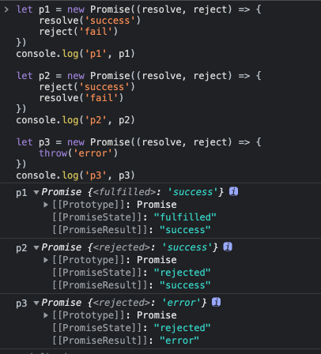
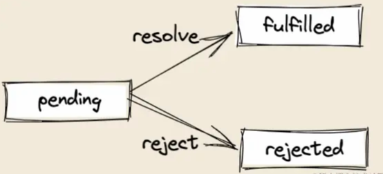
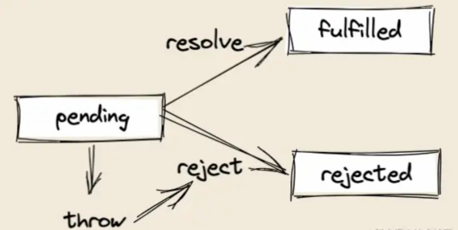
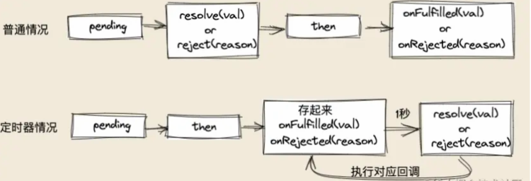
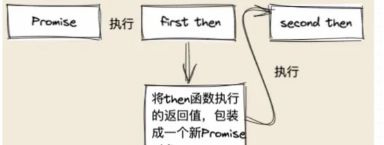

# 前端异步处理规范及应用

- 简版Promise
- Promise/A+规范解读
- async/await介绍
- generator介绍

## 简版Promise

### resolve和reject

```js
let p1 = new Promise((resolve, reject) => {
    resolve('success')
    reject('fail')
})
console.log('p1', p1)

let p2 = new Promise((resolve, reject) => {
    reject('success')
    resolve('fail')
})
console.log('p2', p2)

let p3 = new Promise((resolve, reject) => {
    throw('error')
})
console.log('p3', p3)
```



这里说明了Promise的四个特点：

1. 执行了resolve，Promise状态会变成fulfilled
2. 执行了reject，Promise状态会变成rejected
3. Promise状态不可逆，第一次成功就永久为fulfilled，第一次失败就永远状态为rejectd
4. Promise中有throw的话，就相当于执行了reject

### **实现resolve和reject**

1. Promise的初始状态式pending；
2. 需要对resolve和reject绑定this,确保resolve和reject的this指向永远指向当前的MyPromise实例，防止随着函数执行环境的改变而改变；

```js
class MyPromise {
    //构造方法
    constructor(executor) {
        //初始化值
        this.initValue()
        //初始化this指向
        this.initBind()
        //执行传进来的函数
        executor(this.resolve, this.reject)
    }

    initBind() {
        //初始化this
        this.resolve = this.resolve.bind(this)
        this.reject = this.reject.bind(this)
    }

    initValue() {
        //初始化值
        this.PromiseResult = null//终值
        this.PromiseState = 'pending'//状态
    }

    resolve(value) {
        //如果执行resolve，状态变为fulfilled
        this.PromiseState = 'fulfilled'
        //终值为传进来的值
        this.PromiseResult = value
    }

    reject(value) {
        //如果执行reject，状态变为rejected
        this.PromiseState = 'rejected'
        //终值为传进来的reason
        this.PromiseResult = value
    }
}
```

测试如下：

```js
const test1 = new MyPromise((resolve, reject) => {
    resolve('success')
})
console.log(test1) // MyPromise { PromiseState: 'fulfilled', PromiseResult: 'success' }
const test2 = new MyPromise((resolve, reject) => {
    reject('fail')
})
console.log(test2) // MyPromise { PromiseState: 'rejected', PromiseResult:'fail' }
```

### **状态不可变**

```js
const test1 = new MyPromise((resolve, reject) => {
    resolve('success')
    reject('fail')
})
console.log(test1)//MyPromise { PromiseState: 'rejected', PromiseResult: 'fail' }
```

正确的应该是状态为fulfilled，但这里状态又变成了rejected

Promise有三种状态：

 - pending：等待中，是初始状态；
 - fulfilled： 成功状态；
 - rejected： 失败状态；

一旦状态从pending变为fulfilled或者rejected，那么此Promise实例的状态就不可以改变了。



这步只需要

```js
resolve(value) {
    // state是不可变的
    + if (this.PromiseState !== 'pending') return
    // 如果执行resolve，状态变为fulfilled
    this.PromiseState = 'fulfilled'
    // 终值为传进来的值
    this.PromiseResult = value
}
reject(reason) {
    // state是不可变的
    + if (this.PromiseState !== 'pending') return
    // 如果执行reject，状态变为rejected
    this.PromiseState = 'rejected'
    // 终值为传进来的reason
    this.PromiseResult = reason
}

```

### **throw**



Promise中有throw的话，就相当于执行了reject。这就要使用try catch了

```js
try {
    // 执行传进来的函数
    executor(this.resolve, this.reject)
} catch (e) {
    // 捕捉到错误直接执行reject
    this.reject(e)
}
```

:::info 完整代码为
```js
class MyPromise {
    // 构造方法
    constructor(executor) {
        // 初始化值
        this.initValue()
        // 初始化this指向
        this.initBind()
        try {
            // 执行传进来的函数
            executor(this.resolve, this.reject)
        } catch (e) {
            // 捕捉到错误直接执行reject
            this.reject(e)
        }
    }
    initBind() {
        // 初始化this
        this.resolve = this.resolve.bind(this)
        this.reject = this.reject.bind(this)
    }
    initValue() {
        // 初始化值
        this.PromiseResult = null // 终值
        this.PromiseState = 'pending' // 状态
    }
    resolve(value) {
        // state是不可变的
        if (this.PromiseState !== 'pending') return
        // 如果执行resolve，状态变为fulfilled
        this.PromiseState = 'fulfilled'
        // 终值为传进来的值
        this.PromiseResult = value
    }
    reject(reason) {
        // state是不可变的
        if (this.PromiseState !== 'pending') return
        // 如果执行reject，状态变为rejected
        this.PromiseState = 'rejected'
        // 终值为传进来的reason
        this.PromiseResult = reason
    }
}
```
:::

### then

平时业务中then的使用一般如下：

```js
// ⻢上输出 ”success“
const p1 = new Promise((resolve, reject) => {
    resolve('success')
}).then(res => console.log(res), err => console.log(err))

// 1秒后输出 ”fail“
const p2 = new Promise((resolve, reject) => {
    setTimeout(() => {
        reject('fail')
    }, 1000)
}).then(res => console.log(res), err => console.log(err))

// 链式调用 输出 200
const p3 = new Promise((resolve, reject) => {
    resolve(100)
})
.then(res => 2 * res, err => console.log(err))
.then(res => console.log(res), err => console.log(err))

// 链式调用 输出 100
const p3 = new Promise((resolve, reject) => {
    resolve(100)
})//参数为非函数，值传递下去
.then({}, err => console.log(err))
.then(res => console.log(res), err => console.log(err))
```

根据上述代码可以确定：
1. then接收两个回调，⼀个是成功回调，⼀个是失败回调；
2. 当Promise状态为fulfilled执行成功回调，为rejected执行失败回调；
3. 如resolve或reject在定时器里，则定时器结束后再执行then；
4. then支持链式调用，下⼀次then执行受上⼀次then返回值的影响；

### **实现then**

```js
then(onFulfilled, onRejected) {
    //接受两个回调onFulfilled，onRejected

    //参数校检，确保一定是函数
    onFulfilled = typeof onFulfilled === 'function' ? onFulfilled : val => val
    onRejected = typeof onRejected === 'function' ? onRejected : reason => { throw reason}

    if(this.PromiseState === 'fulfilled') {
        //如果当前为成功状态，执行第一个回调
        onFulfilled(this.PromiseResult)
    } else if(this.promiseState === 'rejected') {
        //如果当前为失败状态，执行第二个回调
        onRejected(this.PromiseResult)
    }
}
```

测试then的结果为：

```js
// 输出 ”success“
const test = new MyPromise((resolve, reject) => {
    resolve('success')
}).then(res => console.log(res), err => console.log(err))
```

### **定时器**

如何保证下述代码能够在1s后执行then的回调？

```js
// 1秒后输出 ”fail“
const p2 = new Promise((resolve, reject) => {
    setTimeout(() => {
        reject('fail')
    }, 1000)
}).then(res => console.log(res), err => console.log(err))
```

我们不能确保1秒后才执行then函数，但是我们可以保证1秒后再执行then里的回调（后续课程的事件循环会讲到）



在这1秒时间内，我们可以先把then里的两个回调保存起来，然后等到1秒过后，执行了resolve或者reject，咱们再去判断状态，并且判断要去执行刚刚保存的两个回调中的哪⼀个回调。

那么问题来了，我们怎么知道当前1秒还没⾛完甚⾄还没开始⾛呢？其实很好判断，只要状态是pending，那就证明定时器还没跑完，因为如果定时器跑完的话，那状态肯定就不是pending，而是fulfilled或者rejected

那是用什么来保存这些回调呢？建议使用数组，因为⼀个promise实例可能会多次then，用数组就⼀个⼀个保存了

```js
class MyPromise {
    // 构造方法
    constructor(executor) {
        // 初始化值
        this.initValue()
        // 初始化this指向
        this.initBind()
        try {
            // 执行传进来的函数
            executor(this.resolve, this.reject)
        } catch (e) {
            // 捕捉到错误直接执行reject
            this.reject(e)
        }
    }
    initBind() {
        // 初始化this
        this.resolve = this.resolve.bind(this)
        this.reject = this.reject.bind(this)
    }
    initValue() {
        // 初始化值
        this.PromiseResult = null // 终值
        this.PromiseState = 'pending' // 状态
+       this.onFulfilledCallbacks = [] //保存成功回调
+       this.onRejectedCallbacks = [] //保存失败回调
    }
    resolve(value) {
        // state是不可变的
        if (this.PromiseState !== 'pending') return
        // 如果执行resolve，状态变为fulfilled
        this.PromiseState = 'fulfilled'
        // 终值为传进来的值
        this.PromiseResult = value
        //执行保存的成功回调
+       while(this.onFulFilledCallbacks.length) {
+           this.onFulFilledCallbacks.shift()(this.PromiseResult)
+       }
    }
    reject(reason) {
        // state是不可变的
        if (this.PromiseState !== 'pending') return
        // 如果执行reject，状态变为rejected
        this.PromiseState = 'rejected'
        // 终值为传进来的reason
        this.PromiseResult = reason
         //执行保存的是失败回调
+       while(this.onRejectedCallbacks.length) {
+           this.onRejectedCallbacks.shift()(this.PromiseResult)
+       }
    }
    then(onFulfilled, onRejected) {
        //接受两个回调onFulfilled，onRejected

        //参数校检，确保一定是函数
        onFulfilled = typeof onFulfilled === 'function' ? onFulfilled : val => val
        onRejected = typeof onRejected === 'function' ? onRejected : reason => { throw reason}

        if(this.PromiseState === 'fulfilled') {
            //如果当前为成功状态，执行第一个回调
            onFulfilled(this.PromiseResult)
        } else if(this.PromiseState === 'rejected') {
            //如果当前为失败状态，执行第二个回调
            onRejected(this.PromiseResult)
+       } else if(this.PromiseState === 'pending') {
+           //如果状态为待定状态，暂时保存两个回调
+           this.onFulfilledCallbacks.push(onFulfilled.bind(this))
+           this.onRejectedCallbacks.push(onRejected.bind(this))
+       }
    }
}
```

看下是否能够实现定时器的功能：

```js
const test2 = new MyPromise((resolve, reject) => {
    setTimeout(() => {
        resolve('success') // 1秒后输出 success
    }, 1000)
}).then(res => console.log(res), err => console.log(err))
```


### **链式调用**

then支持链式调用，下一次then执行受上一次then返回值的影响，给大家举个例子:

```js
//链式调用 输出200
const p3 = new Promise((resolve, reject) => {
    resolve(100)
}).then(res => 2*res, err => console.log(err))
  .then(res => console.log(res), err => console.log(err))

//链式调用 输出300
const p4 = new Promise((resolve, reject) => {
    resolve(100)
}).then(res => new Promise((resolve, reject) => resolve(3*res)), err => console.log(err))
  .then(res => console.log(res), err => console.log(err) )
```

根据上文，可以得到：

1. then方法本身会返回⼀个新的Promise对象；
2. 如果返回值是promise对象，返回值为成功，该新promise对象就是成功；
3. 如果返回值是promise对象，返回值为失败，该新promise对象就是失败；
4. 如果返回值非promise对象，新promise对象就是成功，值为此返回值；

then是Promise上的方法，那如何实现then完还能再then呢？
then执行后返回⼀个Promise对象就行了，就能保证then完还能继续执行then；




```js
then(onFulfilled, onRejected) {
    //接受两个回调onFulfilled onRejected

    //参数校检，确保一定是函数
    onFulfilled = typeof onFulfilled === 'function' ? onFulfilled : val => val
    onRejected = typeof onRejected === 'function' ? onRejected : reason => { throw reason}

    var thenPromise = new MyPromise((resolve, reject) => {
        const resolvePromise = cb => {
            try {
                const x = cb(this.PromiseResult)
                if(x === thenPromise && x) {
                    //不能返回自身哦
                    throw new Error('不能返回自身')
                }
                if(x instanceof MyPromise) {
                    // 如果返回值是Promise
                    // 如果返回值是promise对象，返回值为成功，新promise就是成功
                    // 如果返回值是promise对象，返回值为失败，新promise就是失败
                    // 谁知道返回的promise是失败成功？只有then知道
                    x.then(resolve, reject)
                } else {
                    //非promise就直接成功
                    resolve(x)
                }
            } catch(err) {
                //处理报错
                reject(err)
                throw new Error(err)
            }
        }

        if(this.PromiseState === 'fulfilled') {
            //如果当前为成功状态，执行第一个回调
            resolvePromise(onFulfilled)
        } else if(this.PromiseState === 'rejected') {
            //如果当前为失败状态，执行第二个回调
            resolvePromise(onRejected)
        } else if(this.PromiseState === 'pending') {
            //如果状态为待定状态，暂时保存两个回调
            this.onFulfilledCallbacks.push(resolvePromise.bind(this, onFulfilled))
            this.onRejectedCallbacks.push(reolsvePromise.bind(this, onRejected))
        }
    })

    //返回这个包装的Promise
    return thenPromise
}
```

完整代码为：

:::info 链式调用
```js
class MyPromise {
    // 构造方法
    constructor(executor) {
        // 初始化值
        this.initValue()
        // 初始化this指向
        this.initBind()
        try {
            // 执行传进来的函数
            executor(this.resolve, this.reject)
        } catch (e) {
            // 捕捉到错误直接执行reject
            this.reject(e)
        }
    }
    initBind() {
        // 初始化this
        this.resolve = this.resolve.bind(this)
        this.reject = this.reject.bind(this)
    }
    initValue() {
        // 初始化值
        this.PromiseResult = null // 终值
        this.PromiseState = 'pending' // 状态
        this.onFulfilledCallbacks = [] //保存成功回调
        this.onRejectedCallbacks = [] //保存失败回调
    }
    resolve(value) {
        // state是不可变的
        if (this.PromiseState !== 'pending') return
        // 如果执行resolve，状态变为fulfilled
        this.PromiseState = 'fulfilled'
        // 终值为传进来的值
        this.PromiseResult = value
        // 执行保存的成功回调
        while (this.onFulfilledCallbacks.length) {
            this.onFulfilledCallbacks.shift()(this.PromiseResult)
        }

    }
    reject(reason) {
        // state是不可变的
        if (this.PromiseState !== 'pending') return
        // 如果执行reject，状态变为rejected
        this.PromiseState = 'rejected'
        // 终值为传进来的reason
        this.PromiseResult = reason
        //执行保存的是失败回调
        while (this.onRejectedCallbacks.length) {
            this.onRejectedCallbacks.shift()(this.PromiseResult)
        }
    }
    then(onFulfilled, onRejected) {
        //接受两个回调onFulfilled onRejected
        
        //参数校检，确保一定是函数
        onFulfilled = typeof onFulfilled === 'function' ? onFulfilled : val => val
        onRejected = typeof onRejected === 'function' ? onRejected : reason => { throw reason}
        var thenPromise = new MyPromise((resolve, reject) => {
            const resolvePromise = cb => {
                try {
                    const x = cb(this.PromiseResult)
                    if(x === thenPromise && x) {
                        //不能返回自身哦
                        throw new Error('不能返回自身')
                    }
                    if(x instanceof MyPromise) {
                        // 如果返回值是Promise
                        // 如果返回值是promise对象，返回值为成功，新promise就是成功
                        // 如果返回值是promise对象，返回值为失败，新promise就是失败
                        // 谁知道返回的promise是失败成功？只有then知道
                        x.then(resolve, reject)
                    } else {
                        //非promise就直接成功
                        resolve(x)
                    }
                } catch(err) {
                    console.log(err)
                    //处理报错
                    reject(err)
                    throw new Error(err)
                }
            }

            if(this.PromiseState === 'fulfilled') {
                //如果当前为成功状态，执行第一个回调
                resolvePromise(onFulfilled)
            } else if(this.PromiseState === 'rejected') {
                //如果当前为失败状态，执行第二个回调
                resolvePromise(onRejected)
            } else if(this.PromiseState === 'pending') {
                //如果状态为待定状态，暂时保存两个回调
                this.onFulfilledCallbacks.push(resolvePromise.bind(this, onFulfilled))
                this.onRejectedCallbacks.push(resolvePromise.bind(this, onRejected))
            }
        })
        //返回这个包装的Promise
        return thenPromise
    }
}
```
:::

测试一下

```js
const test4 = new MyPromise((resolve, reject) => {
    setTimeout(() => {
        resolve(100) // 输出 状态：fail 值：200
    },1000)
   
}).then(res => new MyPromise((resolve, reject) => setTimeout(() => reject(2 * res),5000)), err => new Promise((resolve, reject) =>resolve(3 * err)))
  .then(res => console.log('success', res), err => console.log('fail', err))
  
```

### **执行顺序**

这里要了解，then方法是微任务

```js
const p = new Promise((resolve, reject) => {
    resolve(1)
}).then(res => console.log(res), err => console.log(err))

console.log(2)
//输出顺序是 2 1
```

这里为了实现类似的功能，使用setTimeout代替（setTimeout为宏任务，此处主要跟在全局上的console对⽐）

```js
const resolvePromise = cb => {
    setTimeout(() => {
        try {
            const x = cb(this.PromiseResult)
            if (x === thenPromise) {
                // 不能返回⾃身哦
                throw new Error('不能返回⾃身。。。')
            }
            if (x instanceof MyPromise) {
                // 如果返回值是Promise
                // 如果返回值是promise对象，返回值为成功，新promise就是成功
                // 如果返回值是promise对象，返回值为失败，新promise就是失败
                // 谁知道返回的promise是失败成功？只有then知道
                x.then(resolve, reject)
            } else {
                // 非Promise就直接成功
                resolve(x)
            }
        } catch (err) {
            // 处理报错
            reject(err)
            throw new Error(err)
        }
    })
}
```

### all

1. 接收⼀个Promise数组，数组中如有非Promise项，则此项当做成功；
2. 如果所有Promise都成功，则返回成功结果数组；
3. 如果有⼀个Promise失败，则返回这个失败结果；

```js
static all(promises) {
    const result = []
    let count = 0
    return new MyPromise((resolve, reject) => {
        const addData = (index, value) => {
            result[index] = value
            count++
            if(count === promises.length) resolve(result)
        }
        promises.forEach((promise, index) => {
            if(promise instanceof MyPromise) {
                promise.then(res => {
                    addData(index, res)
                }, err => reject(err))
            } else {
                addData(index, promise)
            }
        })
    })
}
```

### race

1. 接收⼀个Promise数组，数组中如有非Promise项，则此项当做成功；
2. 哪个Promise最快得到结果，就返回那个结果，无论成功失败；

```js
static race(promises) {
    return new MyPromise((resolve, reject) => {
        promises.forEach(promise => {
            if(promise instanceof MyPromise) {
                promise.then(res => {
                    resolve(res)
                }, err => {
                    reject(err)
                })
            } else {
                resolve(promise)
            }
        })
    })
}
```

### allSettled

1. 接收⼀个Promise数组，数组中如有非Promise项，则此项当做成功；
2. 把每⼀个Promise的结果，集合成数组后返回；

```js
static allSettled(promises) {
    return new Promise((resolve, reject) => {
        const res = []
        let count = 0
        const addData = (status, value, i) => {
            res[i] = {
                status,
                value
            }
            count++
            if(count === promises.length) {
                resolve(res)
            }
        }
        promises.forEach((promise, i) => {
            if(promise instanceof Promise) {
                promise.then(res => {
                    addData('fulfilled', res, i)
                }, err => {
                    addData('rejected', res, i)
                })
            } else {
                addData('fulfilled', promise, i)
            }
        })
    })
}
```

### any

与all相反

1. 接收⼀个Promise数组，数组中如有非Promise项，则此项当做成功；
2. 如果有⼀个Promise成功，则返回这个成功结果；
3. 如果所有Promise都失败，则报错；

```js
static any(promises) {
    return new Promise((resolve, reject) => {
        let count = 0
        promises.forEach((promise) => {
            promise.then(res => {
                resolve(res)
            }, err => {
                count++
                if(count === promises.length) {
                    reject(new AggregateError('All promises were rejected'))
                }
            })
        })
    })
}
```

### 异步调度器

异步调度器 Scheduler，保证同时运行的任务最多有`N`个

举个:chestnut:

JS实现一个带并发限制的异步调度器scheduler，保证同时运行的任务最多有两个。
例如目前有4个任务，完成时间分别为，`1000ms`,`500ms`,`300ms`,`400ms`
那么在该调度器中的执行完成顺序应该为2、3、1、4.
因为1、2先进入队列中，2完成则输出2，3进入，3完成输出3，此时为`800ms`，4进入后的`200ms`，1完成输出1，而后4完成输出4.

流程分析：

整个的完整执行流程：
1. 起始1、2两个任务开始执行；
2. `500ms`时，2任务执行完毕，输出2，任务3开始执行；
3. `800ms`时，3任务执行完毕，输出3，任务4开始执行；
4. `1000ms`时，1任务执行完毕，输出1，此时只剩下4任务在执行；
5. `1200ms`时，4任务执行完毕，输出4；

当资源不足时将任务加入等待队列，当资源足够时，将等待队列中的任务取出执行。

在调度器中⼀般会有⼀个等待队列queue，存放当资源不够时等待执行的任务具有并发数据限制，假设通过max设置允许同时运行的任务，还需要count表示当前正在执行的任务数量。

当需要执行⼀个任务A时，先判断count==max 如果相等说明任务A不能执行，应该被阻塞，阻塞的任务放进queue中，等待任务调度器管理如果count < max说明正在执行的任务数没有达到最⼤容量，那么count++执行任务A,执行完毕后count--。

此时如果queue中有值，说明之前有任务因为并发数量限制而被阻塞，现在count < max，任务调度器会将对头的任务弹出执行

```js
class Scheduler {
    constructor(max) {
        this.max = max;
        this.count = 0;//用来记录当前执行的异步函数
        this.queue = new Array();//表示等待队列
    }

    async add(promiseCreator) {
        /*
        此时count已经满了，不能执行本次add需要阻塞在这里，将resolve放⼊队列中等待唤醒,
        等到count<max时，从队列中取出执行resolve,执行，await执行完毕，本次add继续
        */
        if(this.count >= this.max) {
            await new Promise((resolve, reject) => this.queue.push(resolve));
        }

        this.count++;

        let res = await promiseCreator();

        this.count--;

        if(this.queue.length) {
            // 依次唤醒add
            // 若队列中有值，将其resolve弹出，并执行
            // 以便阻塞的任务，可以正常执行
            this.queue.shift()(); 
        }
        return res
    }
}

const timeout = time =>
new Promise(resolve => {
    setTimeout(resolve, time);
});

const scheduler = new Scheduler(2);

const addTask = (time, order) => {
    //add返回⼀个promise，参数也是⼀个promise
    scheduler.add(() => timeout(time)).then(() => console.log(order));
};

addTask(1000, '1');
addTask(500, '2');
addTask(300, '3');
addTask(400, '4');

//output: 2 3 1 4;
```

### Promise A+规范

[官方地址](https://promisesaplus.com/)
[github](https://github.com/promises-aplus)

## async/await

### 介绍

async/await的用处：用同步的方式，执行异步操作
async/await是⼀种语法糖，用到的是ES6里的迭代函数——generator函数

```js
function request(num) {//模拟接口请求
    return new Promise(resolve => {
        setTimeout(() => {
            resolve(num*2)
        }, 1000)
    })
}

request(1).then(res1 => {
    console.log(res1)//1秒后 输出2
    request(2).then(res2 => {
        console.log(res2)//2秒后 输出4
    })
})
```

现在有⼀个新的要求：先请求完接口1，再拿接口1返回的数据，去当做接口2的请求参数，那我们也可以这么做：

```js
request(5).then(res1 => {
    console.log(res1) // 1秒后 输出 10
    request(res1).then(res2 => {
        console.log(res2) // 2秒后 输出 20
    })
})
```

如果嵌套的多了，这个时候就可以用async/await来解决了：

```js
async function fn () {
    const res1 = await request(5)
    const res2 = await request(res1)
    console.log(res2) // 2秒后输出 20
}
fn()
```

在async函数中，await规定了异步操作只能⼀个⼀个排队执行，从而达到用同步方式，执行异步操作的效果。

刚刚上面的例⼦await后面都是跟着异步操作Promise，那如果不接Promise？

```js
function request(num) { // 去掉Promise
    setTimeout(() => {
        console.log(num * 2)
    }, 1000)
}
async function fn() {
    await request(1) // 2
    await request(2) // 4
    // 1秒后执行完 同时输出
}
fn()
```

可以看出，如果await后面接的不是Promise的话，其实是达不到类似同步的效果的

```js
async function fn () {}
console.log(fn) // [AsyncFunction: fn]
console.log(fn()) // Promise {<fulfilled>: undefined}
```

可以看出，async函数执行完会⾃动返回⼀个状态为fulfilled的Promise，也就是成功状态，但是值却是
undefined，那要怎么才能使值不是undefined呢？只要函数有return返回值就行了。

```js
async function fn (num) {
    return num
}
console.log(fn) // [AsyncFunction: fn]
console.log(fn(10)) // Promise {<fulfilled>: 10}
fn(10).then(res => console.log(res)) // 10
```

### 总结

1. await只能在async函数中使用，不然会报错；
2. async函数返回的是⼀个Promise对象，有无值看有无return值；
3. await后面最好是接Promise，虽然接其他值也能达到排队效；
4. async/await作用是用同步方式，执行异步操作

## generator

### 介绍

generator函数跟普通函数在写法上的区别就是，多了⼀个星号*，并且只有在generator函数中才能使用
yield，而yield相当于generator函数执行的中途暂停点，⽐如下方有3个暂停点。而怎么才能暂停后继续
⾛呢？那就得使用到next方法，next方法执行后会返回⼀个对象，对象中有value 和 done两个属性

- value：暂停点后面接的值，也就是yield后面接的值；
- done：是否generator函数已⾛完，没⾛完为false，⾛完为true；

```js
function* gen() {
    yield 1
    yield 2
    yield 3
}
const g = gen()
console.log(g.next()) // { value: 1, done: false }
console.log(g.next()) // { value: 2, done: false }
console.log(g.next()) // { value: 3, done: false }
console.log(g.next()) // { value: undefined, done: true }
```

可以看到最后⼀个是undefined，这取决于你generator函数有无返回值

```js
function* gen() {
    yield 1
    yield 2
    yield 3
    return 4
}
const g = gen()
console.log(g.next()) // { value: 1, done: false }
console.log(g.next()) // { value: 2, done: false }
console.log(g.next()) // { value: 3, done: false }
console.log(g.next()) // { value: 4, done: true }
```

### yield后接函数

yield后面接函数的话，到了对应暂停点yield，会⻢上执行此函数，并且该函数的执行返回值，会被当做此暂停点对象的value

```js
function fn(num) {
    console.log(num)
    return num
}
function* gen() {
    yield fn(1)
    yield fn(2)
    return 3
}
const g = gen()
console.log(g.next())
// 1
// { value: 1, done: false }
console.log(g.next())
// 2
// { value: 2, done: false }
console.log(g.next())
// { value: 3, done: true }
```

### yield后面接promise

```js
function fn(num) {
    return new Promise(resolve => {
        setTimeout(() => {
            resolve(num)
        }, 1000)
    })
}
function* gen() {
    yield fn(1)
    yield fn(2)
    return 3
}
const g = gen()
console.log(g.next()) // { value: Promise { <pending> }, done: false }
console.log(g.next()) // { value: Promise { <pending> }, done: false }
console.log(g.next()) // { value: 3, done: true }
```

如果想获取的是两个Promise的结果1 和 2，可以使用Promise的then

```js
const g = gen()
const next1 = g.next()
next1.value.then(res1 => {
    console.log(next1) // 1秒后输出 { value: Promise { 1 }, done: false }
    console.log(res1) // 1秒后输出 1
    const next2 = g.next()
    next2.value.then(res2 => {
        console.log(next2) // 2秒后输出 { value: Promise { 2 }, done: false }
        console.log(res2) // 2秒后输出 2
        console.log(g.next()) // 2秒后输出 { value: 3, done: true }
    })
})
```

### next函数传参

generator函数可以用next方法来传参，并且可以通过yield来接收这个参数，注意两点

1. 第⼀次next传参是没用的，只有从第⼆次开始next传参才有用；
2. next传值时，要记住顺序是，先右边yield，后左边接收参数；

```js
function* gen() {
    const num1 = yield 1
    console.log(num1)
    const num2 = yield 2
    console.log(num2)
    return 3
}
const g = gen()
console.log(g.next()) // { value: 1, done: false }
console.log(g.next(11111))
// 11111
// { value: 2, done: false }
console.log(g.next(22222))
// 22222
// { value: 3, done: true }
```

### Promise&next传参

根据上⽂可以知道：

1. yield后面接Promise；
2. next函数传参；

所以⼀起使用时的效果为：

```js
function fn(nums) {
 return new Promise(resolve => {
    setTimeout(() => {
        resolve(nums * 2)
        }, 1000)
    })
}
function* gen() {
    const num1 = yield fn(1)
    const num2 = yield fn(num1)
    const num3 = yield fn(num2)
    return num3
}
const g = gen()
const next1 = g.next()
next1.value.then(res1 => {
    console.log(next1) // 1秒后同时输出 { value: Promise { 2 }, done: false }
    console.log(res1) // 1秒后同时输出 2
    const next2 = g.next(res1) // 传⼊上次的res1
    next2.value.then(res2 => {
        console.log(next2) // 2秒后同时输出 { value: Promise { 4 }, done: false
        console.log(res2) // 2秒后同时输出 4
        const next3 = g.next(res2) // 传⼊上次的res2
        next3.value.then(res3 => {
            console.log(next3) // 3秒后同时输出 { value: Promise { 8 }, done: false }
            console.log(res3) // 3秒后同时输出 8
            // 传⼊上次的res3
            console.log(g.next(res3)) // 3秒后同时输出 { value: 8, done: true }
        })
    })
})
```

### 实现async/await

上方的generator函数的Promise&next传参，就很像async/await了，区别在于

1. gen函数执行返回值不是Promise，asyncFn执行返回值是Promise；
2. gen函数需要执行相应的操作，才能等同于asyncFn的排队效果；
3. gen函数执行的操作是不完善的，因为并不确定有⼏个yield，不确定会嵌套⼏次；

针对这种情况，可以通过高阶函数（HOC）封装：

```js
function generatorToAsync(generatorFn) {
 // 经过⼀系列处理
 return 具有async函数功能的函数
}
```

```js
function fn(nums) {
    return new Promise(resolve => {
        setTimeout(() => {
            resolve(nums * 2)
        }, 1000)
    })
}
function* gen() {
    const num1 = yield fn(1)
    const num2 = yield fn(num1)
    const num3 = yield fn(num2)
    return num3
}

function generatorToAsync(generatorFn) {
    return function () {
        return new Promise((resolve, reject) => {
            const g = generatorFn()
            const next1 = g.next()
            next1.value.then(res1 => {
                const next2 = g.next(res1) // 传⼊上次的res1
                next2.value.then(res2 => {
                    const next3 = g.next(res2) // 传⼊上次的res2
                    next3.value.then(res3 => {
                        // 传⼊上次的res3
                        resolve(g.next(res3).value)
                    })
                })
            })
        })
    }
}
const asyncFn = generatorToAsync(gen)
asyncFn().then(res => console.log(res)) // 3秒后输出 8
```

到这里，就已经实现了async/await的初始功能了

```js
async function asyncFn() {
    const num1 = await fn(1)
    const num2 = await fn(num1)
    const num3 = await fn(num2)
    return num3
}
asyncFn().then(res => console.log(res)) // 3秒后输出 8
```

### 结合多个await方法

因为async中可以支持若⼲个await，await的个数是不确定的。同样类⽐，generator函数中，也可能有2个yield，3个yield，5个yield，所以需要对上述代码进⾏改造

```js
function generatorToAsync(generatorFn) {
    return function() {
        const gen = generatorFn.apply(this, arguments)//gen有可能传参

        //返回一个Promise
        return new Promise((resolve, reject) => {

            function go(key, arg) {
                let res
                try {
                    res = gen[key](arg)//这里有可能会执行返回reject状态的Promise
                } catch(error) {
                    return reject(error)//报错的话会走catch，直接reject
                }

                //解构获得value和done
                const { value, done } = res

                if(done) {
                    //如果done为true，说明走完了，进行resolve(value)
                    return resolve(true)
                } else {
                    //如果done为false，说明没走完，还得继续走
                    //value有可能是：常量，Promise，Promise有可能是成功或者失败
                    return Promise.resolve(value).then(val => {
                        go('next', val)
                    }, err => {
                        go('throw', err)
                    })
                }
            }

            go("next") // 第⼀次执⾏
        })
    }
}
const asyncFn = generatorToAsync(gen)
asyncFn().then(res => console.log(res))
```

### 测试结果

- async/await

```js
async function asyncFn() {
    const num1 = await fn(1)
    console.log(num1) // 2
    const num2 = await fn(num1)
    console.log(num2) // 4
    const num3 = await fn(num2)
    console.log(num3) // 8
    return num3
}
const asyncRes = asyncFn()
console.log(asyncRes) // Promise
asyncRes.then(res => console.log(res)) // 8
```

- generatorToAsync

```js
function* gen() {
    const num1 = yield fn(1)
    console.log(num1) // 2
    const num2 = yield fn(num1)
    console.log(num2) // 4
    const num3 = yield fn(num2)
    console.log(num3) // 8
    return num3
}
const genToAsync = generatorToAsync(gen)
const asyncRes = genToAsync()
console.log(asyncRes) // Promise
asyncRes.then(res => console.log(res)) // 8
```