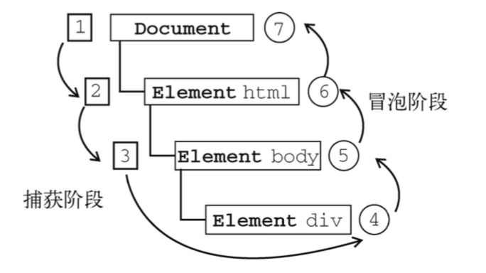

# 浏览器事件模型&请求

## DOM事件

DOM `(Document Object Model ，文档对象模型)`是针对HTML文档和XML文档的⼀个API。DOM描绘了⼀个层次化的节点树，允许开发⼈员添加、移出和修改页面的某⼀部分，DOM 脱胎于Netscape 及微软公司创始的 DHTML（动态HTML）。但现在它已经成为表现和操作页面标记的真正跨平台、语言中立的方式。

`Netscape Navigator 4` 和 IE4 分别发布于 1997 年的 6 ⽉和 10 ⽉发布的 DHTML，由于 IE4 和 Netscape Navigator4 分别支持不同的 DHTML，为了统⼀标准，W3C开始制定 DOM。1998 年10 ⽉ W3C 总结了 IE 和 Navigator4 的规范，制定了 DOMLevel 1即 DOM1，之前 IE 与
Netscape 的规范则被称为 DOMLevel 0 即 DOM0 。

### DOM0级事件

假设页面存在一个btn的按钮，并且给btn添加一个点击事件

```js
btn.onclick = function() {
    console.log('this is a click event')
    console.log(e); // 事件对象
    console.log(window.event); // IE中事件对象 
}
```

事件就是用户或浏览器自身执行的某种操作，如click、load、mouseover等，都是事件的名字，而响应某个事件的函数就被称为事件处理程序。

### DOM1级事件

DOM级别1于1998年10⽉1⽇成为W3C推荐标准。1级DOM标准中并没有定义事件相关的内容，所以没有所谓的1级DOM事件模型。在2级DOM中除了定义了⼀些DOM相关的操作之外还定义了⼀个事件模型 ，这个标准下的事件模型就是我们所说的2级DOM事件模型。

### DOM2级事件

DOM0级 可以认为 onclick 是 btn 的⼀个属性，DOM2级 则将属性升级为队列。
DOM2级 事件定义了两个方法，用于处理指定和删除事件处理程序的操作， addEventListener() 和 removeEventListener() ，所有的 DOM 节点中都包含这两个方法，它们都接收 3 个参数。

1. 要处理的事件名；
2. 作为事件处理程序的函数；
3. 布尔值，true 代表在捕获阶段调用事件处理程序，false 表示在冒泡阶段调用事件处理程序，默认为 false；

```js
btn.addEventListener('click',function(){
 // do something
})
btn.addEventListener('click',function(){
 // do something else
})
```

addEventListener() 将事件加入到监听队列中，当浏览器发现用户点击按钮时，click 队列中依次执行匿名函数1、匿名函数2。

```js
function fn1(){
 // do something
}
function fn1(){
 // do something else
}
btn.addEventListener('click',fn1)
btn.addEventListener('click',fn2)
```

如果这样写，click 队列中依次 fn1.call(btn,event) ， fn2.call(btn,event) 。通过 addEventListener() 添加的事件只能由 removeEventListener() 来移除，并且 removeEventListener() 只能移除具名函数，不能移除匿名函数。

### IE中的DOM2级事件

E8 及之前，实现类似 `addEventListener()` 和 `removeEventListener()` 的两个方法是 `attachEvent()` 和 `detachEvent()` ，这两个方法接受相同的两个参数。

1. 要处理的事件名；
2. 作为事件处理程序的函数；

IE8 之前的只支持事件冒泡，所以通过 `attachEvent()` 添加的事件处理程序只能添加到冒泡阶段

```js
btn.attachEvent('click',fn1)
btn.attachEvent('click',fn2)
```

当用户点击时，click 队列依次 fn1.call(undefined,undefined) ， fn2.call(undefined,undefined) 。类似的 detachEvent() 也只能移除具名函数，不能移除匿名函数。

```js
function eventHandler() {
 console.log('xiaokai');
}
btn.attachEvent('onClick', eventHandler);
btn.detachEvent('onClick', eventHandler);
```

### 兼容处理

```js
if(typeof btn.addEventListener === 'function'){
    btn.addEventListener('click',fn);
}else if(typeof btn.attachEvent === 'function'){
    btn.attachEvent('onclick',fn)
}else{
    btn.onclick=function(){
    // do something
    }
}
```

### 总结

```js
var btn = document.getElementById('btn');
btn.onClick = () => {
    console.log('我是DOM0级事件处理程序');
}
btn.onClick = null;
btn.addEventListener('click', () => {
    console.log('我是DOM2级事件处理程序');
}, false);
btn.removeEventListener('click', handler, false)
btn.attachEvent('onclick', () => {
    console.log('我是IE事件处理程序')
})
btn.detachEvent('onclick', handler);
```

1. DOM2级的好处是可以添加多个事件处理程序；DOM0对每个事件只支持⼀个事件处理程序；
2. 通过DOM2添加的匿名函数⽆法移除，上面写的例子就移除不了， addEventListener 和 removeEventListener 的handler必须同名；
3. 作用域：DOM0的handler会在所属元素的作用域内运行，IE的handler会在全局作用域运行， this === window ；
4. 触发顺序：添加多个事件时，DOM2会按照添加顺序执行，IE会以相反的顺序执行；
5. 跨浏览器的事件处理程序

```js
var EventUtil = {
 // element是当前元素，可以通过getElementById(id)获取
 // type 是事件类型，⼀般是click ,也有可能是⿏标、焦点、滚轮事件等等
 // handle 事件处理函数
 addHandler: (element, type, handler) => {
    // 先检测是否存在DOM2级方法,再检测IE的方法，最后是DOM0级方法（⼀般不会到这）
    if (element.addEventListener) {
    // 第三个参数false表示冒泡阶段
        element.addEventListener(type, handler, false);
    } else if (element.attachEvent) {
        element.attachEvent(`on${type}`, handler)
    } else {
        element[`on${type}`] = handler;
    }
 },
 removeHandler: (element, type, handler) => {
    if (element.removeEventListener) {
        // 第三个参数false表示冒泡阶段
        element.removeEventListener(type, handler, false);
    } else if (element.detachEvent) {
        element.detachEvent(`on${type}`, handler)
    } else {
        element[`on${type}`] = null;
    }
 }
}
// 获取元素
var btn = document.getElementById('btn');
// 定义handler
var handler = function(e) {
 console.log('我被点击了');
}
// 监听事件
EventUtil.addHandler(btn, 'click', handler);
// 移除事件监听
// EventUtil.removeHandler(button1, 'click', clickEvent);
```

## 事件捕获&事件冒泡

事件流描述的是从页面中接收事件的顺序；

IE 的事件流是事件冒泡流而 `Netscape Communicator` 的事件流是事件捕获流

DOM2级事件规定的事件流包括三个阶段：

- 事件捕获阶段；
- 处于⽬标阶段；
- 事件冒泡阶段；

首先发生的是事件捕获，为截获事件提供了机会。
然后是实际的⽬标接收到事件。
最后⼀个阶段是冒泡阶段，可以在这个阶段对事件做出响应



1. 当处于⽬标阶段，没有捕获与冒泡之分，执⾏顺序会按照 `addEventListener` 的添加顺序决定，先添加先执⾏；
2. 使用 `stopPropagation()` 取消事件传播时，事件不会被传播给下⼀个节点，但是，同⼀节点上的其他listener还是会被执⾏；如果想要同⼀层级的listener也不执⾏，可以使用 `stopImmediatePropagation()` ；

```js
// list 的捕获
$list.addEventListener('click', (e) => {
    console.log('list capturing');
    e.stopPropagation();
}, true)

// list 捕获 2
$list.addEventListener('click', (e) => {
    console.log('list capturing2');
}, true)
// list capturing
// list capturing2
```

3. `preventDefault()` 只是阻⽌默认⾏为，跟JS的事件传播⼀点关系都没有；
4. ⼀旦发起了 `preventDefault()` ，在之后传递下去的事件里面也会有效果；

### 测试

举个:chestnut:

```html
<!DOCTYPE html>
<html>
    <head>
        <title>Event Bubbling Example</title>
    </head>
    <body>
        <div id="myDiv">Click Me</div>
    </body>
</html>
```

1. 事件捕获

最不具体的节点最先收到事件，而最具体的节点最后收到事件。事件捕获实际上是为了在事件到达最终目标前拦截事件

如果前面的例子使用事件捕获，则点击\<div\>元素会以下列顺序出发click事件：
- document
- html
- body
- div

2. 事件冒泡

在点击页面中的\<div\>元素后，click事件会如下顺序发生；

- div
- body
- html
- document

\<div\>元素，即被点击的元素，最先触发click事件。然后，click事件沿DOM树一路向上，在经过的每个节点上依次触发，直至到达`document`对象

### 事件对象

DOM0和DOM2的事件处理程序都会自动传入event对象，IE中的event对象取决于指定的事件处理程序的方法。
IE的handler会在全局作用域运行，`this === window`,所以在IE中会有`window.event`,`event`两种情况，只有在事件处理程序期间，event对象才会存在，一旦事件处理程序执行完成，event对象就会被销毁。

event对象里需要关心的两个属性：

1. target: target永远是被添加了事件的那个元素；
2. eventPhase: 调用事件处理程序的阶段，有三个值（1：捕获阶段，2：处于目标，3：冒泡阶段）

**preventDefault与stopPropagation**

preventDefault: 比如链接被点击会导航到其href指定的URL，这个就是默认行为；
stopPropagation: 立即停止事件在DOM层次中的传播，包括捕获和冒泡事件；

IE中的属性：

- srcElement => target
- returnValue => preventDefault()
- cancelBubble => stopPropagation()

IE不支持事件捕获，因而只能取消事件冒泡，但`stopPropagation`可以同时取消事件捕获和冒泡

```js
var EventUtil = {
    // element是当前元素，可以通过getElementById(id)获取
    // type 是事件类型，⼀般是click ,也有可能是⿏标、焦点、滚轮事件等等
    // handle 事件处理函数
    addHandler: (element, type, handler) => {
        // 先检测是否存在DOM2级方法,再检测IE的方法，最后是DOM0级方法（⼀般不会到这）
        if (element.addEventListener) {
            // 第三个参数false表示冒泡阶段
            element.addEventListener(type, handler, false);
        } else if (element.attachEvent) {
            element.attachEvent(`on${type}`, handler)
        } else {
            element[`on${type}`] = handler;
        }
    },
    removeHandler: (element, type, handler) => {
        if (element.removeEventListener) {
            // 第三个参数false表示冒泡阶段
            element.removeEventListener(type, handler, false);
        } else if (element.detachEvent) {
            element.detachEvent(`on${type}`, handler)
        } else {
            element[`on${type}`] = null;
        }
    },
    // 获取event对象
    getEvent: (event) => {
        return event ? event : window.event
    },
    // 获取当前⽬标
    getTarget: (event) => {
        return event.target ? event.target : event.srcElement
    },
    // 阻⽌默认⾏为
    preventDefault: (event) => {
        if (event.preventDefault) {
            event.preventDefault()
        } else {
            event.returnValue = false
        }
    },
    // 停⽌传播事件
    stopPropagation: (event) => {
        if (event,stopPropagation) {
            event.stopPropagation()
        } else {
            event.cancelBubble = true
        }
    }
}
```

### 事件委托

事件委托：用来解决事件处理程序过多的问题

```html
<ul id="myLinks">
    <li id="goSomewhere">Go somewhere</li>
    <li id="doSomething">Do something</li>
    <li id="sayHi">Say hi</li> 
</ul>
```

按照传统的做法，需要像下面这样为它们添加 3 个事 件处理程序。

```js
var item1 = document.getElementById("goSomewhere");
var item2 = document.getElementById("doSomething");
var item3 = document.getElementById("sayHi");
EventUtil.addHandler(item1, "click", function(event){
    location.href = "http://www.baidu.com";
});
EventUtil.addHandler(item2, "click", function(event){
    document.title = "I changed the document's title";
});
EventUtil.addHandler(item3, "click", function(event){
    alert("hi");
});
```

如果在⼀个复杂的 Web 应用程序中，对所有可单击的元素都采用这种方式，那么结果就会有数不 清的代码用于添加事件处理程序。此时，可以利用事件委托技术解决这个问题。使用事件委托，只需在DOM 树中尽量最高的层次上添加⼀个事件处理程序，如下面的例子所示

```js
var list = document.getElementById("myLinks");
EventUtil.addHandler(list, "click", function(event) {
    event = EventUtil.getEvent(event);
    var target = EventUtil.getTarget(event);
    switch(target.id) {
        case "doSomething":
            document.title = "I changed the document's title";
            break;
        case "goSomewhere":
            location.href = "http://www.wrox.com";
            break;
        case "sayHi": 
            alert("hi");
            break;
    }
}
```

子节点的点击事件会冒泡到⽗节点，并被这个注册事件处理
最适合采用事件委托技术的事件包括 `click` 、 `mousedown` 、 `mouseup` 、 `keydown` 、 `keyup`和 `keypress` 。 虽然 `mouseover` 和 `mouseout` 事件也冒泡，但要适当处理它们并不容易，而且经常需要计算元素的位置。可以考虑为 `document` 对象添加⼀个事件处理程序，用以处理页面上发生的某种特定类型的事件，需要跟踪的事件处理程序越少，移除它们就越容易（移除事件处理程序关乎内存和性能）。只要是通过`onload` 事件处理程序添加的东⻄，最后都要通过 `onunload` 事件处理程序将它们移除。

## 浏览器请求

在浏览器端发送网络请求的常见方式：

1. ajax
2. fetch
3. axios

## ajax

:::info ajax
Asynchronous JavaScript And XML，翻译过来就是“异步的 Javascript 和 XML”。
ajax是js异步技术的术语，早起相关的api是XHR。
:::

Ajax 是⼀个技术统称，是⼀个概念模型，它囊括了很多技术，并不特指某⼀技术，它很重要的特性之⼀就是让页面实现局部刷新。

### 手写ajax

利用XMLHttpRequest模块实现Ajax

**创建异步对象**

```js
let xmlHttp;
if (window.XMLHttpRequest) {
    // code for IE7+, Firefox, Chrome, Opera, Safari
    xmlHttp = new XMLHttpRequest();
} else {
    // code for IE6, IE5
    xmlHttp = new ActiveXObject('Microsoft.XMLHTTP');
}
```

通过 XMLHttpRequest 构造函数创建⼀个异步对象 xmlhttp , IE6, IE5 使用ActiveXObject创建，创建的这个异步对象上有很多属性和方法，常用的有：

1. `onreadystatechange`:监听异步对象请求状态码`readyState`的改变，每当`readyState`改变时，就会触发`onreadystatechange`事件
2. `readystate`: 请求状态码
3. `status`: http状态码
4. `responseText`：后台返回的字符串形式的响应数据；
5. `responseXML`：后台返回的XML形式的响应数据； 

`readyState`表示异步对象目前的状态，状态码从0到4：

0: 表示请求未初始化，还没调用`open()`
1: 服务器链接已建立，但是还没有调用`send()`
2: 请求已接收，正在处理中（通常现在可以从响应中获取内容头）
3: 请求处理中，通常响应中已有部分数据可用了，没有全部完成
4: 当 `readyState` 状态码为4时，表示请求已完成；此阶段确认全部数据都已经解析完毕，可以通过异步对象的属性获取对应数据；

**设置请求方式和请求地址**

创建异步对象之后，通过 open() 方法设置ajax请求方式和请求地址 格式：

`xmlHttp.open("GET/POST","ajax-get.txt",true)`

第⼀个参数：请求的类型；GET 还是 POST；
第二个参数：表示请求的文件的地址url；
第三个参数：设置请求方法是不是异步async，true为异步， false为同步。AJAX存在的意义就是发异步请求，所以第三个参数永远传true；

在IE浏览器中，如果通过Ajax发送GET请求，那么IE浏览器认为，同⼀个URL只有⼀个结果，如果地址没有发生变化，它就会把上⼀次返回的结果，直接返回。这样我们不能实时的拿到变化后的数据。如果要想我们拿到实时数据，必须保证每次的URL都是不⼀样的(ie的缓存问题)

```js
xmlHttp.open("GET","ajax-get.txt?t=" + (new Date().getTime()),true);
//或
xmlHttp.open("GET","ajax-get.txt?t=" + Math.random(),true);
```

**发送请求**

直接通过异步对象的send()发送请求

```js
xmlHttp.send();
```

特别注意的是： 如果发送POST请求，使用 setRequestHeader() 来添加 HTTP请求头，并在send()方法中传递要发送的数据：

```js
xmlHttp.open("POST","ajax_test.html",true);
xmlHttp.setRequestHeader("Content-type","application/x-www-form-urlencoded");
xmlHttp.send("fname=Henry&lname=Ford");
```

**通过onreadystatechange监听状态变化**

当异步对象的readyState发生改变，会触发 onreadystatechange 函数，当readyState变成为4时，表示当前状态是请求完毕的状态，同时当http的响应码status为200到300之间（包括200和300）或为304时，表示ajax请求成功;当http状态码不是200到300之间的数也不是304时，表示请求不成功

```js
//4.监听状态变化
xmlHttp.onreadystatechange = () => {
// 判断当前状态改变是请求完毕的状态吗
    if (xmlHttp.readyState === 4) {
        if (xmlHttp.status >= 200 && xmlHttp.status < 300 || xmlHttp.status == 304) {
            console.log("成功的接收到服务器返回的数据");
        }else{
            console.log("不成功！");
        }
    }
}
```

**处理返回的结果**

如果成功，可通过异步对象的 `responseText` 属性来获取服务器返回的字符串

整个ajax代码

```js
const ajax = option => {
    //type url data timeout success error所有参数换成一个对象{}
    
    //0 将对象转成字符串
    const objToString = data => {
        data.t = new Date().getTime();
        let res = [];
        for( let key in data) {
            //需要将key和value转成⾮中文的形式，因为url不能有中文。使用encodeURIComponent();
            res.push(encodeURIComponent(key) + ' = ' + encodeURIComponent(data[key]));
        }
        return res.join('&')
    }

    let str = objToString(option.data || {})

    // 1.创建⼀个异步对象xmlHttp；
    var xmlHttp, timer;
    if (window.XMLHttpRequest) {
        xmlHttp = new XMLHttpRequest();
    } else if (xmlHttp) {
        // code for IE6, IE5
        xmlHttp = new ActiveXObject('Microsoft.xmlHttp');
    }

    // 2.设置请求方式和请求地址；
    // 判断请求的类型是POST还是GET
    if (option.type.toLowerCase() === 'get') {
        xmlHttp.open(option.type, option.url + '?t=' + str, true);
        // 3.发送请求；
        xmlHttp.send();
    } else {
        xmlHttp.open(option.type, option.url, true);
        // 注意：在post请求中，必须在open和send之间添加HTTP请求头：setRequestHeader(header,value);
        xmlHttp.setRequestHeader('Content-type', 'application/x-www-form-urlencoded');
        // 3.发送请求；
        xmlHttp.send(str);
    }
    // 4.监听状态的变化；
    xmlHttp.onreadystatechange = function () {
        clearInterval(timer);
        debugger;
        if (xmlHttp.readyState === 4) {
            if ((xmlHttp.status >= 200 && xmlHttp.status < 300) || xmlHttp.status == 304) {
                // 5.处理返回的结果；
                option.success(xmlHttp.responseText); //成功后回调；
            } else {
                option.error(xmlHttp.responseText); //失败后回调；
            }
        }
    };
    //判断外界是否传⼊了超时时间
    if (option.timeout) {
        timer = setInterval(function () {
            xmlHttp.abort(); //中断请求
            clearInterval(timer);
        }, option.timeout);
    }
}
```

**总结**

我们可以发现，ajax只是⼀种异步请求的方式，并不特指某⼀种具体的实现方式，但随着使用这种方式实现网络请求时内部⼜包含请求的情况，就会出现回调地狱，这也是XHR的诟病之⼀，因此，后来才催生了更加优雅的请求方式。

## fetch

Fetch 是在 ES6 出现的，它使用了 ES6 提出的 Promise 对象。它是 XMLHttpRequest 的替代品。有⼈把它与 Ajax 作⽐较，其实这是不对的，我们通常所说的 Ajax 是指使用 XMLHttpRequest 实现的 Ajax，所以真正应该和 XMLHttpRequest 作⽐较。

### 基本介绍

fetch()的功能与 XMLHttpRequest 基本相同，但有三个差异：

1. fetch使用 Promise，不使用回调函数，因此大大简化了写法，写起来更简洁；
2. fetch采用模块化设计，API 分散在多个对象上（Response 对象、Request 对象、Headers 对象），更合理⼀些；相⽐之下， XMLHttpRequest 的 API 设计并不是很好，输⼊、输出、状态都在同⼀个接⼝管理，容易写出⾮常混乱的代码；
3. fetch通过数据流（Stream 对象）处理数据，可以分块读取，有利于提高网站性能表现，减少内存占用，对于请求大文件或者网速慢的场景相当有用。 XMLHTTPRequest 对象不支持数据流，所有的数据必须放在缓存里，不支持分块读取，必须等待全部拿到后，再⼀次性吐出来；

```js
fetch('https://api.github.com/users/ruanyf')
    .then(response => response.json())
    .then(json => console.log(json))
    .catch(err => console.log('Request Failed', err));
```

fetch()接收到的response是⼀个 [Stream 对象](https://developer.mozilla.org/en-US/docs/Web/API/Streams_API)， response.json() 是⼀个异步操作，取出所有内容，并将其转为 JSON 对象。

Promise 可以使用 await 语法改写，使得语义更清晰。

```js
async function getJSON() {
    let url = 'https://api.github.com/users/ruanyf';
    try {
        let response = await fetch(url);
        return await response.json();
    } catch (error) {
        console.log('Request Failed', error);
    }
}
```

上面示例中，await语句必须放在 try...catch 里面，这样才能捕捉异步操作中可能发生的错误。

### Response

fetch()请求成功以后，得到的是一个[Response对象](https://developer.mozilla.org/en-US/docs/Web/API/Response)。它对应服务器的Http回应。

**标头信息**

即对应HTTP回应的标头信息(Headers)，可以立即读取。

1. `Response.ok`属性返回⼀个布尔值，表示请求是否成功，true对应 HTTP 请求的状态码 200 到299，false对应其他的状态码；
2. `Response.status`属性返回⼀个数字，表示 HTTP 回应的状态码（例如200，表示成功请求）；
3. `Response.statusText`属性返回⼀个字符串，表示 HTTP 回应的状态信息（例如请求成功以后，服务器返回"OK"）；
4. `Response.url`属性返回请求的 URL。如果 URL 存在跳转，该属性返回的是最终 URL；
5. `Response.type` 属性返回请求的类型。可能的值如下：
    - basic：普通请求，即同源请求；
    - cors：跨域请求；
    - error：网络错误，主要用于 Service Worker；
    - opaque：如果fetch()请求的type属性设为no-cors，就会返回这个值。表示发出的是简单的跨域请求，类似\<form\>表单的那种跨域请求；
    - opaqueredirect：如果fetch()请求的redirect属性设为manual，就会返回这个值；
6. `Response.redirected`属性返回⼀个布尔值，表示请求是否发生过跳转。

**判断请求是否成功**

fetch()发出请求以后，有⼀个很重要的注意点：只有网络错误，或者⽆法连接时，fetch()才会报错，其他情况都不会报错，而是认为请求成功。这就是说，即使服务器返回的状态码是 4xx 或 5xx，fetch()也不会报错（即 Promise 不会变为 rejected状态）。

1. Response.status

`Response.status` 属性，得到 HTTP 回应的真实状态码，才能判断请求是否成功。

```js
async function fetchText() {
    let response = await fetch('/readme.txt');
    if (response.status >= 200 && response.status < 300) {
        return await response.text();
    } else {
        throw new Error(response.statusText);
    }
}
```

`response.status` 属性只有等于 2xx （200~299），才能认定请求成功。这里不用考虑网址跳转（状态码为 3xx），因为fetch()会将跳转的状态码自动转为 200。

2. Response.ok是否为true

```js
if (response.ok) {
 // 请求成功
} else {
 // 请求失败
}
```

**Response.headers**

Headers 对象可以使用for...of循环进⾏遍历。

```js
const response = await fetch(url);
for (let [key, value] of response.headers) {
    console.log(`${key} : ${value}`);
}
// 或者
for (let [key, value] of response.headers.entries()) {
    console.log(`${key} : ${value}`);
}
```

Headers 对象提供了以下方法，用来操作标头

```js
Headers.get()：根据指定的键名，返回键值。
Headers.has()： 返回⼀个布尔值，表示是否包含某个标头。
Headers.set()：将指定的键名设置为新的键值，如果该键名不存在则会添加。
Headers.append()：添加标头。
Headers.delete()：删除标头。
Headers.keys()：返回⼀个遍历器，可以依次遍历所有键名。
Headers.values()：返回⼀个遍历器，可以依次遍历所有键值。
Headers.entries()：返回⼀个遍历器，可以依次遍历所有键值对（[key, value]）。
Headers.forEach()：依次遍历标头，每个标头都会执⾏⼀次参数函数。

let response = await fetch(url);
response.headers.get('Content-Type')
// application/json; charset=utf-8

// 键名
for(let key of myHeaders.keys()) {
 console.log(key);
}
// 键值
for(let value of myHeaders.values()) {
 console.log(value);
}
```

**读取内容的方法**

Response对象根据服务器返回的不同类型的数据，提供了不同的读取方法。

- response.text()：得到文本字符串；
- response.json()：得到 JSON 对象；
- response.blob()：得到二进制 Blob 对象；
- response.formData()：得到 FormData 表单对象；
- response.arrayBuffer()：得到二进制 ArrayBuffer 对象；

response.blob() 用于获取二进制文件。

```js
//读取图片文件显示在网页上
const response = await fetch('flower.jpg');
const myBlob = await response.blob();
const objectURL = URL.createObjectURL(myBlob);
const myImage = document.querySelector('img');
myImage.src = objectURL;
```

response.arrayBuffer() 主要用于获取流媒体文件。

```js
//获取音频⽂件song.ogg，然后在线播放的例子。
const audioCtx = new window.AudioContext();
const source = audioCtx.createBufferSource();
const response = await fetch('song.ogg');
const buffer = await response.arrayBuffer();
const decodeData = await audioCtx.decodeAudioData(buffer);
source.buffer = buffer;
source.connect(audioCtx.destination);
source.loop = true;
```

**Response.clone**

Stream 对象只能读取⼀次，读取完就没了。这意味着，前⼀节的五个读取方法，只能使用⼀个，否则会报错。

```js
let text = await response.text();
let json = await response.json(); // 报错
```

上面示例先使用了 response.text() ，就把 Stream 读完了。后面再调用 response.json() ，就没有内容可读了，所以报错。
Response 对象提供 Response.clone() 方法，创建Response对象的副本，实现多次读取

```js
const response1 = await fetch('flowers.jpg');
const response2 = response1.clone();
const myBlob1 = await response1.blob();
const myBlob2 = await response2.blob();
image1.src = URL.createObjectURL(myBlob1);
image2.src = URL.createObjectURL(myBlob2);
```

上面示例中， response.clone() 复制了⼀份 Response 对象，然后将同⼀张图片读取了两次。

**Response.body**

Response.body 属性是 Response 对象暴露出的底层接⼝，返回⼀个 ReadableStream 对象，供用户操作。它可以用来分块读取内容，应用之⼀就是显示下载的进度。

```js
const response = await fetch('flower.jpg');
const reader = response.body.getReader();
while(true) {
    const {done, value} = await reader.read();
    if (done) {
        break;
    }
    console.log(`Received ${value.length} bytes`)
}
```

`response.body.getReader()` 方法返回⼀个遍历器。这个遍历器的read()方法每次返回⼀个对象，表示本次读取的内容块。

这个对象的done属性是⼀个布尔值，用来判断有没有读完；value属性是⼀个 arrayBuffer 数组，表示内容块的内容，而value.length属性是当前块的⼤小。

### 定制http请求

fetch()的第一个参数是URL，还可以接受第二个参数，作为配置对象，定制发出的HTTP请求

```js
fetch(url, optionObj)
```

HTTP请求的方法,标头,数据体都在这个对象里面设置。

**post请求**

```js
const response = await fetch(url, {
    method: 'POST',
    headers: {
        "Content-type": "application/x-www-form-urlencoded; charset=UTF-8",
    },
    body: 'foo=bar&lorem=ipsum',
});
const json = await response.json();

//配置对象用了三个属性
method：HTTP 请求的方法，POST、DELETE、PUT都在这个属性设置。
headers：⼀个对象，用来定制 HTTP 请求的标头。
body：POST 请求的数据体。
```

注意，有些标头不能通过headers属性设置，⽐如 `Content-Length` 、`Cookie`、`Host`等等。它们是由浏览器自动生成，⽆法修改。

**提交 JSON 数据**

```js
const user = { name: 'John', surname: 'Smith' };
const response = await fetch('/article/fetch/post/user', {
    method: 'POST',
    headers: {
        'Content-Type': 'application/json;charset=utf-8'
    },
    body: JSON.stringify(user)
});
```

标头 `Content-Type` 要设成 `application/json;charset=utf-8` 。因为默认发送的是纯⽂本， `Content-Type` 的默认值是 `text/plain;charset=UTF-8` 。

**提交表单**

```js
const form = document.querySelector('form');
const response = await fetch('/users', {
    method: 'POST',
    body: new FormData(form)
})
```

**文件上传**

如果表单里面有⽂件选择器，可以用前⼀个例子的写法，上传的⽂件包含在整个表单里面，⼀起提交。另⼀种方法是用脚本添加⽂件，构造出⼀个表单，进⾏上传，请看下面的例子。

```js
const input = document.querySelector('input[type="file"]');
const data = new FormData();
data.append('file', input.files[0]);
data.append('user', 'foo');
fetch('/avatars', {
    method: 'POST',
    body: data
});
```

**直接上传二进制**

fetch()也可以直接上传⼆进制数据，将 Blob 或 arrayBuffer 数据放在body属性里面。

```js
let blob = await new Promise(resolve =>
    canvasElem.toBlob(resolve, 'image/png')
);
let response = await fetch('/article/fetch/post/image', {
    method: 'POST',
    body: blob
});
```

**option API**

fetch()第二个参数的完整API如下：

```js
const response = fetch(url, {
    method: "GET",
    headers: {
        "Content-Type": "text/plain;charset=UTF-8"
    },
    body: undefined,
    referrer: "about:client",
    referrerPolicy: "no-referrer-when-downgrade",
    mode: "cors",
    credentials: "same-origin",
    cache: "default",
    redirect: "follow",
    integrity: "",
    keepalive: false,
    signal: undefined
});
```

fetch()请求的底层用的是[Request()](https://developer.mozilla.org/en-US/docs/Web/API/Request/Request)对象的接口，参数完全一样，因此上面的API也是Request()的API

**cache**

cache属性指定如何处理缓存。可能的取值如下：
- default：默认值，先在缓存里面寻找匹配的请求；
- no-store：直接请求远程服务器，并且不更新缓存；
- reload：直接请求远程服务器，并且更新缓存；
- no-cache：将服务器资源跟本地缓存进⾏⽐较，有新的版本才使用服务器资源，否则使用缓存；
- force-cache：缓存优先，只有不存在缓存的情况下，才请求远程服务器；
- only-if-cached：只检查缓存，如果缓存里面不存在，将返回504错误；

**mode**

mode属性指定请求的模式。可能的取值如下：

cors：默认值，允许跨域请求；
same-origin：只允许同源请求；
no-cors：请求方法只限于 GET、POST 和 HEAD，并且只能使用有限的⼏个简单标头，不能添加跨域的复杂标头，相当于提交表单所能发出的请求；

**credentials**

credentials属性指定是否发送 Cookie。可能的取值如下：

- same-origin：默认值，同源请求时发送 Cookie，跨域请求时不发送；
- include：不管同源请求，还是跨域请求，⼀律发送 Cookie；
- omit：⼀律不发送；
跨域请求发送 Cookie，需要将credentials属性设为include

```js
fetch('http://another.com', {
    credentials: "include"
});
```

**singal**

signal属性指定⼀个 `AbortSignal` 实例，用于取消fetch()请求。

**keepalive**

keepalive属性用于页面卸载时，告诉浏览器在后台保持连接，继续发送数据。

⼀个典型的场景就是，用户离开网页时，脚本向服务器提交⼀些用户⾏为的统计信息。这时，如果不用keepalive属性，数据可能⽆法发送，因为浏览器已经把页面卸载了。

```js
window.onunload = function() {
    fetch('/analytics', {
        method: 'POST',
        body: "statistics",
        keepalive: true
    });
};
```

**redirect**

redirect属性指定 HTTP 跳转的处理方法。可能的取值如下：

- follow：默认值，fetch()跟随 HTTP 跳转；
- error：如果发生跳转，fetch()就报错；
- manual：fetch()不跟随 HTTP 跳转，但是response.url属性会指向新的 URL，response.redirected属性会变为true，由开发者自己决定后续如何处理跳转；

**integrity**

integrity属性指定⼀个哈希值，用于检查 HTTP 回应传回的数据是否等于这个预先设定的哈希值。⽐如，下载⽂件时，检查⽂件的 SHA-256 哈希值是否相符，确保没有被篡改。

```js
fetch('http://site.com/file', {
    integrity: 'sha256-abcdef'
});
```

### fetch cancel

fetch()请求发送以后，如果中途想要取消，需要使用 AbortController 对象。

```js
let controller = new AbortController();
let signal = controller.signal;
fetch(url, {
    signal: controller.signal
});
signal.addEventListener('abort',
    () => console.log('abort!')
);
controller.abort(); // 取消
console.log(signal.aborted); // true
```

上面示例中，⾸先新建 `AbortController` 实例，然后发送fetch()请求，配置对象的`signal`属性必须指定接收 `AbortController` 实例发送的信号 `controller.signal` 。`controller.abort()` 方法用于发出取消信号。这时会触发abort事件，这个事件可以监听，也可以通过 `controller.signal.aborted` 属性判断取消信号是否已经发出。下面是⼀个1秒后自动取消请求的例子。

```js
let controller = new AbortController();
setTimeout(() => controller.abort(), 1000);
try {
    let response = await fetch('/long-operation', {
        signal: controller.signal
    });
} catch(err) {
    if (err.name == 'AbortError') {
        console.log('Aborted!');
    } else {
        throw err;
    }
}

```

## axios

axios是⼀个用于网络请求的第三方库，是⼀个基于Promise 用于浏览器和 nodejs 的 HTTP 客户端，它本身具有以下特征：

- 从浏览器中创建 XMLHttpRequest ；
- 从 node.js 发出 http 请求；
- 支持 Promise API；
- 拦截请求和响应；
- 转换请求和响应数据；
- 取消请求；
- ⾃动转换JSON数据；
- 客户端支持防⽌CSRF/XSRF；

### 基础使用

Axios 提供了两种不同的形式来发送 HTTP 请求：

**axios(config)方法**

axios(config) 方法接收⼀个对象，这个对象包含了⼀些对请求的配置， axios 会根据这些配置来发送对应的 HTTP 请求

最基本的配置项应该包括：

1. method 请求的方法（可选值： get , post 等）；
2. url 请求的地址 （必须项）；
3. data 请求发送的数据（post等请求需要）；

```js
// 发送 POST 请求
axios({
    method: 'post',
    url: '/user/12345',
    data: {
        firstName: 'Fred',
        lastName: 'Flintstone'
    }
}).then(res => {
    consloe.log(res)
}).catch(err => {
    console.log(err)
})
// 发送 GET 请求（默认的方法）
axios('/user/12345');
```

请求响应的处理在 then 和 catch 回调中，请求正常会进⼊ then ，请求异常则会进 catch

**请求别名**

```js
// 发送GET请求
axios.get('/user?ID=12345').then(function (response) {
    console.log(response);
}).catch(function (error) {
    console.log(error);
});
// 发送POST请求
axios.post('/user', {
    firstName: 'Fred',
    lastName: 'Flintstone'
}).then(function (response) {
    console.log(response);
}).catch(function (error) {
    console.log(error);
});
```

### 响应数据

其中的 data 是后端返回的数据，⼀般只需要关注 response 中的 data 字段就⾏

```js
{
    // `data` 由服务器提供的响应
    data: {},
    // `status` 来⾃服务器响应的 HTTP 状态码
    status: 200,
    // `statusText` 来⾃服务器响应的 HTTP 状态信息
    statusText: 'OK',
    // `headers` 服务器响应的头
    headers: {},
    // `config` 是为请求提供的配置信息
    config: {},
    // 'request'
    // `request` is the request that generated this response
    // It is the last ClientRequest instance in node.js (in redirects)
    // and an XMLHttpRequest instance the browser
    request: {}
}
```

### 创建实例

可以使用⾃定义配置新建⼀个 axios 实例 `axios.create([config])` ：

```js
const instance = axios.create({
    baseURL: 'url',
    timeout: 1000,
    headers: {'X-Custom-Header': 'foobar'}
})
```

以下是实例所拥有的方法

- `request(config)`；
- `get(url[, config])`；
- `delete(url[, config])`；
- `head(url[, config])`；
- `options(url[, config])`
- `post(url[, data[, config]])`；
- `put(url[, data[, config]])`；
- `patch(url[, data[, config]])`；

axios会把这些方法中的config 会和创建实例时指定的 config 合并到⼀起使用

### 拦截器

- `axios.interceptors.request` 请求拦截器
- `axios.interceptors.response` 响应拦截器

```js
// 添加请求拦截器
axios.interceptors.request.use(function (config) {
    // 在发送请求之前做些什么
    config.header["Token"] = "xxxx"
    return config;
}, function (error) {
    // 对请求错误做些什么
    return Promise.reject(error);
});
// 添加响应拦截器
axios.interceptors.response.use(function (response) {
    // 对响应数据做点什么
    if (response.status === 200){
        return response.data
    } else {
        return Promise.reject(new Error('error'))
    }
}, function (error) {
    // 对响应错误做点什么
    return Promise.reject(error);
});
```
如果想要取消拦截器，可以通过使用⼀个变量来接收设置拦截器时返回的实例，然后使用 eject 来取消拦截器

```js
const myInterceptor = axios.interceptors.request.use(function () {/*...*/});
axios.interceptors.request.eject(myInterceptor);
```

### 完整配置

[完整请求配置](https://axios-http.com/)