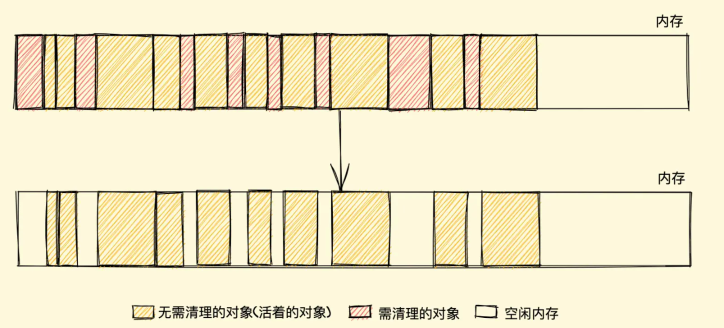
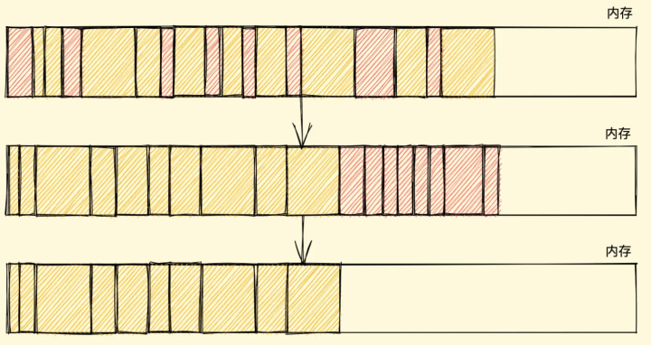
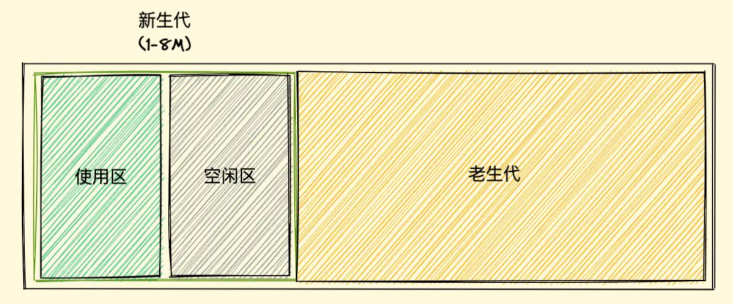
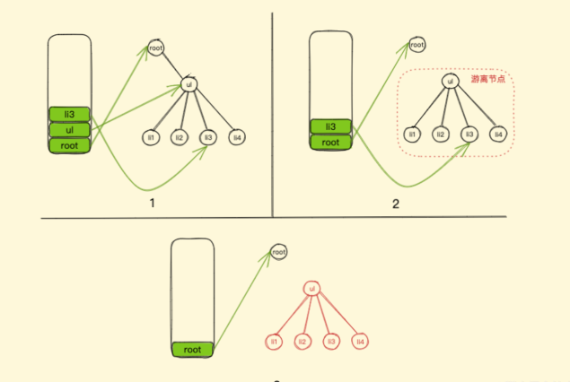

# JavaScript的垃圾回收和内存泄漏

## JavaScript的垃圾回收机制

### 什么是GC

GC 即 `Garbage Collection` ，程序工作过程中会产生很多垃圾，这些垃圾是程序不用的内存或者是之前用过了，以后不会再用的内存空间，而 GC 就是负责回收垃圾的，因为他工作在引擎内部，所以对于我们前端来说，GC 过程是相对比较无感的，这一套引擎执行而对我们又相对无感的操作也就是常说的 `垃圾回收机制` 。
当然也不是所有语言都有 GC，一般的高级语言里面会自带 GC，比如 Java、Python、JavaScript 等，也有无 GC 的语言，比如 C、C++ 等，那这种就需要我们程序员手动管理内存了，相对比较麻烦。

### 垃圾产生&为何回收

我们知道写代码时创建一个基本类型、对象、函数等时都是需要占用内存的，但是我们并不关注这些，因为这是引擎为我们分配的，我们不需要显式手动的去分配内存

```js
let test = {
    name: "xianzao"
};
test = [1,2,3,4,5]
```

假设它是一个完整的程序代码
我们知道 JavaScript 的引用数据类型是保存在堆内存中的，然后在栈内存中保存一个对堆内存中实际对象的引用，所以，JavaScript 中对引用数据类型的操作都是操作对象的引用而不是实际的对象。可以简单理解为，栈内存中保存了一个地址，这个地址和堆内存中的实际值是相关的。

那上面代码首先我们声明了一个变量 test，它引用了对象 {name: 'xiankai'}，接着我们把这个变量重新赋值了一个数组
对象，也就变成了该变量引用了一个数组，那么之前的对象引用关系就没有了，如下图

test -> {name: "xiaokai"}
test -> [1,2,3,4,5]

没有了引用关系后，这部分内存就不会被使用了，一个两个还好，多了的话内存也会受不了，所以就需要被清理（回收）。

:::tip
程序的运行需要内存，只要程序提出要求，操作系统或者运行时就必须提供内存，那么对于持续运行的服务进程，必须
要及时释放内存，否则，内存占用越来越高，轻则影响系统性能，重则就会导致进程崩溃。
:::

### 垃圾回收策略

在 JavaScript 内存管理中有一个概念叫做 可达性 ，就是那些以某种方式可访问或者说可用的值，它们被保证存储在内存中，反之不可访问则需回收。至于如何回收，其实就是怎样发现这些不可达的对象（垃圾）它并给予清理的问题， JavaScript 垃圾回收机制的原理就是定期找出那些不再用到的内存（变量），然后释放其内存。（不是实时的找出无用内存并释放的原因：实时开销太大了）。

**标记清除法**

1. 策略 

标记清除（ Mark-Sweep ），目前在 JavaScript引擎 里这种算法是最常用的，到目前为止的大多数浏览器的JavaScript引擎 都在采用标记清除算法，只是各大浏览器厂商还对此算法进行了优化加工，且不同浏览器的 JavaScript引擎 在运行垃圾回收的频率上有所差异。

此算法分为 `标记` 和 `清除` 两个阶段，标记阶段即为所有活动对象做上标记，清除阶段则把没有标记（也就是非活动对象）销毁。

- 当变量进入执行环境时，反转某一位（通过一个二进制字符来表示标记）；
- 维护进入环境变量和离开环境变量这样两个列表，可以自由的把变量从一个列表转移到另一个列表；

其实，怎样标记对我们来说并不重要，重要的是策略。

引擎在执行 GC（使用标记清除算法）时，需要从出发点去遍历内存中所有的对象去打标记，而这个出发点有很多，我们称之为一组 根 对象，而所谓的根对象，其实在浏览器环境中包括又不止于 全局Window对象、文档DOM树 等。

整个标记清除算法大致过程就像下面这样：

- 垃圾收集器在运行时会给内存中的所有变量都加上一个标记，假设内存中所有对象都是垃圾，全标记为0；
- 然后从各个根对象开始遍历，把不是垃圾的节点改成1；
- 清理所有标记为0的垃圾，销毁并回收它们所占用的内存空间；
- 最后，把所有内存中对象标记修改为0，等待下一轮垃圾回收；

2. 优点

实现比较简单，打标记也无非打与不打两种情况，这使得一位二进制位（0和1）就可以为其标记，非常简单

3. 缺点

在清除之后，剩余的对象内存位置是不变的，也会导致空闲内存空间是不连续的，出现了 内存碎片，并且由于剩余空闲内存不是一整块，它是由不同大小内存组成的内存列表，这就牵扯出了内存分配的问题：



假设我们新建对象分配内存时需要大小为 size，由于空闲内存是间断的、不连续的，则需要对空闲内存列表进行一次单向遍历找出大于等于 size 的块才能为其分配：


常见包括三种分配策略找到合适的块内存：

`First-fit` ，找到大于等于 size 的块立即返回；
`Best-fit` ，遍历整个空闲列表，返回大于等于 size 的最小分块；
`Worst-fit` ，遍历整个空闲列表，找到最大的分块，然后切成两部分，一部分 size 大小，并将该部分返回

这三种策略里面 Worst-fit 的空间利用率看起来是最合理，但实际上切分之后会造成更多的小块，形成内存碎片，所以不推荐使用，对于 First-fit 和 Best-fit 来说，考虑到分配的速度和效率 First-fit 是更为明智的选择

综上所述，标记清除算法或者说策略就有两个很明显的缺点：

- 内存碎片化，空闲内存块是不连续的，容易出现很多空闲内存块，还可能会出现分配所需内存过大的对象时找不到合适的块；
- 分配速度慢，因为即便是使用 First-fit 策略，其操作仍是一个 O(n) 的操作，最坏情况是每次都要遍历到最后，同时因为碎片化，大对象的分配效率会更慢；

归根结底，标记清除算法的缺点在于清除之后剩余的对象位置不变而导致的空闲内存不连续，所以只要解决这一点，两个缺点都可以完美解决了

而 `标记整理（Mark-Compact）`算法 就可以有效地解决，它的标记阶段和标记清除算法没有什么不同，只是标记结束后，标记整理算法会将活着的对象（即不需要清理的对象）向内存的一端移动，最后清理掉边界的内存：



**引用计数算法**

1. 策略

引用计数（ Reference Counting ），这其实是早先的一种垃圾回收算法，它把 对象是否不再需要 简化定义为 对象有没有其他对象引用到它，如果没有引用指向该对象（零引用），对象将被垃圾回收机制回收，但因为它的问题很多，目前很少使用这种算法了。

它的策略是跟踪记录每个变量值被使用的次数

- 当声明了一个变量并且将一个引用类型赋值给该变量的时候这个值的引用次数就为 1；
- 如果同一个值又被赋给另一个变量，那么引用数加 1；
- 如果该变量的值被其他的值覆盖了，则引用次数减 1；
- 当这个值的引用次数变为 0 的时候，说明没有变量在使用，这个值没法被访问了，回收空间，垃圾回收器会在运行的时候清理掉引用次数为 0 的值占用的内存；

```js
let a = new Object() // 1a
let b = a // 2a,b
a = null // 1b
b = null // 0
... // GC
```

虽然这种方式很简单，但是在引用计数这种算法出现没多久，就遇到了一个很严重的问题——循环引用，即对象 A 有一个指针指向对象 B，而对象 B 也引用了对象 A：

```js
function test(){
 let A = new Object()
 let B = new Object()
 A.b = B
 B.a = A
}
```
对象 A 和 B 通过各自的属性相互引用着，按照上文的引用计数策略，它们的引用数量都是 2，但是，在函数 test 执行完成之后，对象 A 和 B 是要被清理的，但使用引用计数则不会被清理，因为它们的引用数量不会变成 0，假如此函数在程序中被多次调用，那么就会造成大量的内存不会被释放。

我们再用标记清除的角度看一下，当函数结束后，两个对象都不在作用域中，A 和 B 都会被当作非活动对象来清除掉，相比之下，引用计数则不会释放，也就会造成大量无用内存占用，这也是后来放弃引用计数，使用标记清除的原因之一。

2. 优点

- 引用计数在引用值为 0 时，也就是在变成垃圾的那一刻就会被回收，所以它可以立即回收垃圾；
- 标记清除算法需要每隔一段时间进行一次，那在应用程序（JS脚本）运行过程中线程就必须要暂停去执行一段时间的 GC，另外，标记清除算法需要遍历堆里的活动以及非活动对象来清除，而引用计数则只需要在引用时计数就可以了；

3. 缺点

- 需要一个计数器，而此计数器需要占很大的位置，因为我们也不知道被引用数量的上限；
- 无法解决循环引用无法回收的问题；

### V8对GC的优化

**分代式垃圾回收**

上文所说的垃圾回收策略在每次垃圾回收时都要检查内存中所有的对象，这样的话对于一些大、老、存活时间长的对象来说，同新、小、存活时间短的对象一个频率的检查很不好，因为前者需要时间长并且不需要频繁进行清理，后者恰好相反，这也是分代式的原则。

1. 新老生代

V8 的垃圾回收策略主要基于分代式垃圾回收机制，V8 中将堆内存分为新生代和老生代两区域，采用不同的垃圾回收器也就是不同的策略管理垃圾回收。

新生代的对象为存活时间较短的对象，简单来说就是新产生的对象，通常只支持 1～8M 的容量，而老生代的对象为存活事件较长或常驻内存的对象，简单来说就是经历过新生代垃圾回收后还存活下来的对象，容量通常比较大

V8 整个堆内存的大小就等于新生代加上老生代的内存：


对于新老两块内存区域的垃圾回收，V8 采用了两个垃圾回收器来管控，我们暂且将管理新生代的垃圾回收器叫做新生代垃圾回收器，同样的，我们称管理老生代的垃圾回收器叫做老生代垃圾回收器。

2. 新生代垃圾回收

新生代对象是通过一个名为 Scavenge 的算法进行垃圾回收，在 Scavenge 算法 的具体实现中，主要采用了一种复制式的方法即 Cheney 算法：
Cheney 算法 中将堆内存一分为二，一个是处于使用状态的空间我们暂且称之为 使用区，一个是处于闲置状态的空间我们称之为 空闲区：



新加入的对象都会存放到使用区，当使用区快被写满时，就需要执行一次垃圾清理操作

当开始进行垃圾回收时，新生代垃圾回收器会对使用区中的活动对象做标记，标记完成之后将使用区的活动对象复制进空闲区并进行排序，随后进入垃圾清理阶段，即将非活动对象占用的空间清理掉。最后进行角色互换，把原来的使用区变成空闲区，把原来的空闲区变成使用区。

当一个对象经过多次复制后依然存活，它将会被认为是生命周期较长的对象，随后会被移动到老生代中，采用老生代的垃圾回收策略进行管理。

另外还有一种情况，如果复制一个对象到空闲区时，空闲区空间占用超过了 25%，那么这个对象会被直接晋升到老生代空间中，设置为 25% 的比例的原因是，当完成 Scavenge 回收后，空闲区将翻转成使用区，继续进行对象内存的分配，若占比过大，将会影响后续内存分配。

3. 老生代垃圾回收

相比于新生代，老生代的垃圾回收就比较容易理解了，上面我们说过，对于大多数占用空间大、存活时间长的对象会被分配到老生代里，因为老生代中的对象通常比较大，如果再如新生代一般分区然后复制来复制去就会非常耗时，从而导致回收执行效率不高，所以老生代垃圾回收器来管理其垃圾回收执行，它的整个流程就采用的就是标记清除了。

首先是标记阶段，从一组根元素开始，递归遍历这组根元素，遍历过程中能到达的元素称为活动对象，没有到达的元素就可以判断为非活动对象。

前面我们也提过，标记清除算法在清除后会产生大量不连续的内存碎片，过多的碎片会导致大对象无法分配到足够的连续内存，而 V8 中就采用了上文中说的标记整理算法来解决这一问题来优化空间。

分代式机制把一些新、小、存活时间短的对象作为新生代，采用一小块内存频率较高的快速清理，而一些大、老、存活时间长的对象作为老生代，使其很少接受检查，新老生代的回收机制及频率是不同的，可以说此机制的出现很大程度提高了垃圾回收机制的效率。

**并行回收**

先了解一个概念：全停顿（ `Stop-The-World` ），我们都知道 JavaScript 是一门单线程的语言，它是运行在主线程上的，那在进行垃圾回收时就会阻塞 JavaScript 脚本的执行，需等待垃圾回收完毕后再恢复脚本执行，我们把这种行为叫做 全停顿。

比如一次 GC 需要 60ms ，那我们的应用逻辑就得暂停 60ms ，假如一次 GC 的时间过长，对用户来说就可能造成页面卡顿等问题。这里，引入多个辅助线程来同时处理，以此加速垃圾回收的执行速度，因此 V8 团队引入了并行回收机制。所谓并行，也就是同时的意思，它指的是垃圾回收器在主线程上执行的过程中，开启多个辅助线程，同时执行同样的回收工作。


简单来说，使用并行回收，假如本来是主线程一个人干活，它一个人需要 3 秒，现在叫上了 2 个辅助线程和主线程一块干活，那三个人一块干一个人干 1 秒就完事了，但是由于多人协同办公，所以需要加上一部分多人协同（同步开销）的时间我们算 0.5 秒好了，也就是说，采用并行策略后，本来要 3 秒的活现在 1.5 秒就可以干完了。

新生代对象空间就采用并行策略，在执行垃圾回收的过程中，会启动了多个线程来负责新生代中的垃圾清理操作，这些线程同时将对象空间中的数据移动到空闲区域，这个过程中由于数据地址会发生改变，所以还需要同步更新引用这些对象的指针，这就是并行回收。

**增量标记与惰性处理**

并行策略虽然可以增加垃圾回收的效率，对于新生代垃圾回收器能够有很好的优化，但是它还是一种全停顿式的垃圾回收方式，对于老生代来说，它的内部存放的都是一些比较大的对象，对于这些大的对象 GC 时哪怕我们使用并行策略依然可能会消耗大量时间。

所以为了减少全停顿的时间，在 2011 年，V8 对老生代的标记进行了优化，从全停顿标记切换到增量标记。

增量就是将一次 GC 标记的过程，分成了很多小步，每执行完一小步就让应用逻辑执行一会儿，这样交替多次后完成一轮 GC 标记：


增量标记其实只是对活动对象和非活动对象进行标记，对于真正的清理释放内存 V8 采用的是惰性清理 Lazy Sweeping

增量标记完成后，惰性清理就开始了。当增量标记完成后，假如当前的可用内存足以让我们快速的执行代码，其实我们是没必要立即清理内存的，可以将清理过程稍微延迟一下，让 JavaScript 脚本代码先执行，也无需一次性清理完所有非活动对象内存，可以按需逐一进行清理直到所有的非活动对象内存都清理完毕，后面再接着执行增量标记。

**总结**

V8 的垃圾回收策略主要基于分代式垃圾回收机制，这我们说过，关于新生代垃圾回收器，我们说使用并行回收可以很好的增加垃圾回收的效率，上述的这三种方式各有优缺点，所以在老生代垃圾回收器中这几种策略都是融合使用的：

- 老生代主要使用并发标记，主线程在开始执行 JavaScript 时，辅助线程也同时执行标记操作（标记操作全都由辅
助线程完成）；
- 标记完成之后，再执行并行清理操作（主线程在执行清理操作时，多个辅助线程也同时执行清理操作）；
清理的任务会采用增量的方式分批在各个 JavaScript 任务之间执行；

## JavaScript的内存泄漏

## 什么是内存泄漏

引擎中有垃圾回收机制，它主要针对一些程序中不再使用的对象，对其清理回收释放掉内存。

那么垃圾回收机制会把不再使用的对象（垃圾）全都回收掉吗？

其实引擎虽然针对垃圾回收做了各种优化从而尽可能的确保垃圾得以回收，但并不是说我们就可以完全不用关心这块了，我们代码中依然要主动避免一些不利于引擎做垃圾回收操作，因为不是所有无用对象内存都可以被回收的，那当不再用到的对象内存，没有及时被回收时，这种场景称之为内存泄漏（ Memory leak ）。

## 常见的内存泄露

### **不正当的闭包**

:::tip
闭包是指有权访问另一个函数作用域中的变量的函数
:::

```js
function fn1(){
    let test = new Array(1000).fill('xianzao')
    return function(){
        console.log('zaoxian')
    }
}
let fn1Child = fn1()
fn1Child()
```

显然它是一个典型闭包，但是它并没有造成内存泄漏，因为返回的函数中并没有对 fn1 函数内部的引用，也就是说，函数 fn1 内部的 test 变量完全是可以被回收的，再来看：

```js
function fn2(){
    let test = new Array(1000).fill('xianzao')
    return function(){
        console.log(test)
        return test
    }
}
let fn2Child = fn2()
fn2Child()
```
显然它也是闭包，并且因为 return 的函数中存在函数 fn2 中的 test 变量引用，所以 test 并不会被回收，也就造成了内存泄漏。
那么怎样解决呢？
其实在函数调用后，把外部的引用关系置空就好了，如下：

```js
function fn2(){
    let test = new Array(1000).fill('xianzao')
    return function(){
        console.log(test)
        return test
    }
}
let fn2Child = fn2()
fn2Child()
fn2Child = null
```

### **隐式全局变量**

JavaScript 的垃圾回收是自动执行的，垃圾回收器每隔一段时间就会找出那些不再使用的数据，并释放其所占用的内存空间。

再来看全局变量和局部变量，函数中的局部变量在函数执行结束后这些变量已经不再被需要，所以垃圾回收器会识别并释放它们。但是对于全局变量，垃圾回收器很难判断这些变量什么时候才不被需要，所以全局变量通常不会被回收，我们使用全局变量是 OK 的，但同时我们要避免一些额外的全局变量产生，如下：

```js
function fn(){
    // test1
    test1 = new Array(1000).fill('xianzao')
    // thiswindowtest2
    this.test2 = new Array(1000).fill('xianzao')
}
fn()
```

调用函数 fn ，因为 没有声明 和 函数中this 的问题造成了两个额外的隐式全局变量，这两个变量不会被回收，这种情况我们要尽可能的避免，在开发中我们可以使用严格模式或者通过 lint 检查来避免这些情况的发生，从而降低内存成本。除此之外，我们在程序中也会不可避免的使用全局变量，这些全局变量除非被取消或者重新分配之外也是无法回收的，这也就需要我们额外的关注，也就是说当我们在使用全局变量存储数据时，要确保使用后将其置空或者重新分配，当然也很简单，在使用完将其置为 null 即可，特别是在使用全局变量做持续存储大量数据的缓存时，我们一定要记得设置存储上限并及时清理，不然的话数据量越来越大，内存压力也会随之增高。

```js
var test = new Array(10000)
// do something
test = null
```

### **游离dom引用**

考虑到性能或代码简洁方面，我们代码中进行 DOM 时会使用变量缓存 DOM 节点的引用，但移除节点的时候，我们应该同步释放缓存的引用，否则游离的子树无法释放

```html
<div id="root">
    <ul id="ul">
        <li></li>
        <li></li>
        <li id="li3"></li>
        <li></li>
    </ul>
</div>
```

```js
let root = document.querySelector('#root')
let ul = document.querySelector('#ul')
let li3 = document.querySelector('#li3')
// ululGC
root.removeChild(ul)
// ulli3ululGC
ul = null
// GC
li3 = null
```

如上所示，当我们使用变量缓存 DOM 节点引用后删除了节点，如果不将缓存引用的变量置空，依然进行不了 GC，也就会出现内存泄漏。

假如我们将父节点置空，但是被删除的父节点其子节点引用也缓存在变量里，那么就会导致整个父 DOM 节点树下整个游离节点树均无法清理，还是会出现内存泄漏，解决办法就是将引用子节点的变量也置空，如下图：



### **定时器**

开发时我们经常会用到计时器，也就是 setTimeout 和 setInterval ，先来看一个例子：

```js
//
let someResource = getData()
setInterval(() => {
    const node = document.getElementById('Node')
    if(node) {
        node.innerHTML = JSON.stringify(someResource)
    }
}, 1000)
```

代码中每隔一秒就将得到的数据放入到 Node 节点中去，但是在 setInterval 没有结束前，回调函数里的变量以及回调函数本身都无法被回收。

什么才叫结束呢？也就是调用了 clearInterval 。如果没有被 clear 掉的话，就会造成内存泄漏。不仅如此，如果回调函数没有被回收，那么回调函数内依赖的变量也没法被回收。所以在上例中， someResource 就没法被回收。同样， setTiemout 也会有同样的问题，所以，当不需要 interval 或者 timeout 时，最好调用 clearInterval 或者clearTimeout 来清除，另外，浏览器中的 requestAnimationFrame 也存在这个问题，我们需要在不需要的时候用cancelAnimationFrame API 来取消使用。

### **事件监听器**

当事件监听器在组件内挂载相关的事件处理函数，而在组件销毁时不主动将其清除时，其中引用的变量或者函数都被认为是需要的而不会进行回收，如果内部引用的变量存储了大量数据，可能会引起页面占用内存过高，这样就造成意外的内存泄漏。

我们就拿 Vue 组件来举例子，React 里也是一样的：

```vue
<template>
    <div></div>
</template>
<script>
export default {
    created() {
        window.addEventListener("resize", this.doSomething)
    },
    beforeDestroy(){
        window.removeEventListener("resize", this.doSomething)
    },
    methods: {
        doSomething() {
        // do something
        }
    }
}
</script>
```

### **Map、Set对象**

当使用 Map 或 Set 存储对象时，同 Object 一致都是强引用，如果不将其主动清除引用，其同样会造成内存不自动进行回收。
如果使用 Map ，对于键为对象的情况，可以采用 WeakMap，WeakMap 对象同样用来保存键值对，对于键是弱引用（注：WeakMap 只对于键是弱引用），且必须为一个对象，而值可以是任意的对象或者原始值，由于是对于对象的弱引用，不会干扰 Js 的垃圾回收。

如果需要使用 Set 引用对象，可以采用 WeakSet，WeakSet 对象允许存储对象弱引用的唯一值，WeakSet 对象中的值同样不会重复，且只能保存对象的弱引用，同样由于是对于对象的弱引用，不会干扰 Js 的垃圾回收。

这里可能需要简单介绍下，谈弱引用，我们先来说强引用，之前我们说 JS 的垃圾回收机制是如果我们持有对一个对象的引用，那么这个对象就不会被垃圾回收，这里的引用，指的就是 强引用 ，而弱引用就是一个对象若只被弱引用所引用，则被认为是不可访问（或弱可访问）的，因此可能在任何时刻被回收。

```js
// obj
let obj = {id: 1}
// obj
obj = null
// {id: 1}
```

这是一个简单的通过重写引用来清除对象引用，使其可回收。
再看下面这个：

```js
let obj = {id: 1}
let user = {info: obj}
let set = new Set([obj])
let map = new Map([[obj, 'xianzao']])
// obj
obj = null
console.log(user.info) // {id: 1}
console.log(set)
console.log(map)
```

这里重写了 obj 以后， `{id: 1}` 依然会存在于内存中，因为 user 对象以及后面的 set/map 都强引用了它，Set/Map、对象、数组对象等都是强引用，所以我们仍然可以获取到 `{id: 1}` ，我们想要清除那就只能重写所有引用将其置空了。

接下来我们看 WeakMap 以及 WeakSet：

```js
let obj = {id: 1}
let weakSet = new WeakSet([obj])
let weakMap = new WeakMap([[obj, 'xianzao']])
// obj
obj = null
// {id: 1} GC 
```

使用了 WeakMap 以及 WeakSet 即为弱引用，将 obj 引用置为 null 后，对象 {id: 1} 将在下一次 GC 中被清理出内存。

### **Console**

在一些小团队中可能项目上线也不清理这些 console，殊不知这些 console 也是隐患，同时也是容易被忽略的，我们之所以在控制台能看到数据输出，是因为浏览器保存了我们输出对象的信息数据引用，也正是因此未清理的 console 如果输出了对象也会造成内存泄漏。所以，开发环境下我们可以使用控制台输出来便于我们调试，但是在生产环境下，一定要及时清理掉输出。

## 常见的前端内存问题

1. 内存泄漏：主要注意上述问题；
2. 内存膨胀：即在短时间内内存占用极速上升到达一个峰值，想要避免需要使用技术手段减少对内存的占用；
3. 频繁 GC：GC 执行的特别频繁，一般出现在频繁使用大的临时变量导致新生代空间被装满的速度极快，而每次新生代装满时就会触发 GC，频繁 GC 同样会导致页面卡顿，想要避免的话就不要搞太多的临时变量，因为临时变量不用了就会被回收


