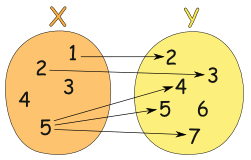

# 函数式编程

- 基础介绍
- 一等公民的函数
- 纯函数的好处
- 柯里化
- 代码组合

## 基础介绍

以下是⼀个海鸥程序，鸟群合并则可以变成了⼀个更⼤的鸟群，繁殖则增加了鸟群的数量，增加的数量就是它们繁殖出来的海鸥的数量。

:::warning
注意这个程序并不是⾯向对象的良好实践，它只是强调当前这种变量赋值⽅式的⼀些弊端。
:::

```js
var Flock = function(n) {
    this.seagulls = n;
}

Flock.prototype.conjoin = function(other) {
    this.seagulls += other.seagulls;
    return this;
}

Flock.prototype.breed = function(other) {
    this.seagulls = this.seagulls * other.seagulls;
    return this;
}

var flock_a = new Flock(4);
var flock_b = new Flock(2);
var flock_c = new Flock(0);

var result = flock_a.conjoin(flock_c).breed(flock_b).conjoin(flock_a.breed(flock_b)).seagulls;
//=> 32
```

按照实现的预期，我们期望答案是16，但是输出的结果却是32，这样的代码形式会使得代码的内部状态变得⾮常难以追踪，错误的原因在于 flock_a 在运算过程中永久地改变了。

再换一种方式：

```js
var conjoin = function(flock_x, flock_y) { return flock_x + flock_y };
var breed = function(flock_x, flock_y) { return flock_x * flock_y };
var flock_a = 4;
var flock_b = 2;
var flock_c = 0;
var result = conjoin(breed(flock_b, conjoin(flock_a, flock_c)), breed(flock_a, flock_b));
```

虽然得到了正确的答案，⽽且少写了很多代码。但函数嵌套有点让⼈费解，不过代码肯定是越直⽩越好，所以如果我们再深⼊挖掘，我们会发现，它不过是在进⾏简单的加（conjoin） 和乘（breed）运算⽽已。

代码中的两个函数除了函数名有些特殊，其他没有任何难以理解的地⽅。我们把它们重命名⼀下，看看它们的真实功能。

```js
var add = function(x, y) { return x + y };
var multiply = function(x, y) { return x * y };
var flock_a = 4;
var flock_b = 2;
var flock_c = 0;
var result = add(multiply(flock_b, add(flock_a, flock_c)), multiply(flock_a, flock_b));
//=>16
```

这样，我们会发现，我们所做的无⾮是简单的加减乘除：

```js
// 结合律（assosiative）
add(add(x, y), z) == add(x, add(y, z));
// 交换律（commutative）
add(x, y) == add(y, x);
// 同⼀律（identity）
add(x, 0) == x;
// 分配律（distributive）
multiply(x, add(y,z)) == add(multiply(x, y), multiply(x, z));
```

基于此，我们可以针对原有代码进⾏处理：

```js
// 原有代码
add(multiply(flock_b, add(flock_a, flock_c)), multiply(flock_a, flock_b));
// 应⽤同⼀律，去掉多余的加法操作（add(flock_a, flock_c) == flock_a）
add(multiply(flock_b, flock_a), multiply(flock_a, flock_b));
// 再应⽤分配律
multiply(flock_b, add(flock_a, flock_a));
```

这样，我们就可以通过简单的函数逻辑调整，优化了绝⼤多数的代码量，只需要定义好 add 和 multiply 即可

## 一等公民的函数

### 概览

函数是“⼀等公⺠”实际上说的是它们和其他对象都⼀样...所以就是普通公⺠（坐经济舱的⼈？）。换句话说，函数没什么特殊的，你可以像对待任何其他数据类型⼀样对待它们——把它们存在数组里，当作参数传递，赋值给变量...等等。

这是 JavaScript 语⾔的基础概念，不过还是值得提⼀提的，⼤多数⼈对这个概念集体无视，或者也可能是无知。我们来看⼀个杜撰的例⼦：

```js
const hi = name => `Hi ${name}`;
const greeting = name => hi(name);
```

这里 greeting 指向的那个把 hi 包了⼀层的包裹函数完全是多余的。为什么？因为 JavaScript的函数是可调⽤的，当 hi 后⾯紧跟 () 的时候就会运⾏并返回⼀个值；如果没有 ()，hi 就简单地返回存到这个变量里的函数。我们来确认⼀下：

```js
hi; // name => `Hi ${name}`
hi("jonas"); // "Hi jonas"
```

greeting 只不过是转了个身然后以相同的参数调⽤了 hi 函数⽽已，因此我们可以这么写：

```js
const greeting = hi;
greeting("times"); // "Hi times"
```

换句话说，hi 已经是个接受⼀个参数的函数了，⽽它仅仅是⽤这个相同的参数调⽤ hi，这样完全多此⼀举。
⽤⼀个函数把另⼀个函数包起来，⽬的仅仅是延迟执⾏，真的是⾮常糟糕的编程习惯。
接下来看⼏个例⼦：

```js
// bad
const getServerStuff = callback => ajaxCall(json => callback(json));
// good
const getServerStuff = ajaxCall;

//等同于

ajaxCall(json => callback(json));
// 等价于
ajaxCall(callback);
// 那么，重构下 getServerStuff
const getServerStuff = callback => ajaxCall(callback);
// ...就等于
const getServerStuff = ajaxCall // <-- 看，没有括号哦
```

所以以上才是写函数的正确⽅式：

```js
const BlogController = {
    index(posts) { return Views.index(posts); },
    show(post) { return Views.show(post); },
    create(attrs) { return Db.create(attrs); },
    update(post, attrs) { return Db.update(post, attrs); },
    destroy(post) { return Db.destroy(post); },
};
```

这个Controller99% 的代码都是垃圾，可以重写为：

```js
const BlogController = {
    index: Views.index,
    show: Views.show,
    create: Db.create,
    update: Db.update,
    destroy: Db.destroy,
};
```

或者直接全部删掉，因为它的作⽤仅仅就是把视图（Views）和数据库（Db）打包在⼀起⽽已。

### 为何函数是一等公民

回顾下前⾯的代码， getServerStuff 和 BlogController ，虽说添加⼀些没有实际⽤处的间接层实现起来很容易，但这样做除了徒增代码量，提⾼维护和检索代码的成本外，没有任何⽤处。另外，如果⼀个函数被不必要地包裹起来了，⽽且发⽣了改动，那么包裹它的那个函数也要做相应的变更。

```js
httpGet('/post/2', json => renderPost(json));
```

如果 httpGet 要改成可以抛出⼀个可能出现的 err 异常，那我们还要回过头去把“胶⽔”函数也改了。

```js
// 把整个应⽤⾥的所有 httpGet 调⽤都改成这样，可以传递 err 参数。
httpGet('/post/2', (json, err) => renderPost(json, err));
```

写成⼀等公⺠函数的形式，要做的改动将会少得多：

```js
httpGet('/post/2', renderPost); // renderPost 将会在 httpGet 中调⽤，想要多少参数都⾏
```

除了删除不必要的函数，正确地为参数命名也必不可少。当然命名不是什么⼤问题，但还是有可能存在⼀些不当的命名，尤其随着代码量的增⻓以及需求的变更，这种可能性也会增加。

项⽬中常⻅的⼀种造成混淆的原因是，针对同⼀个概念使⽤不同的命名。还有通⽤代码的问题。⽐如，下⾯这两个函数做的事情⼀模⼀样，但后⼀个就显得更加通⽤，可重⽤性也更⾼：

```js
// 只针对当前的博客
const validArticles = articles => articles.filter(article => article !== null && article !== undefined),
// 对未来的项⽬更友好
const compact = xs => xs.filter(x => x !== null && x !== undefined);
```

在命名的时候，我们特别容易把⾃⼰限定在特定的数据上（本例中是 articles ）。这种现象很常⻅，也是重复造轮⼦的⼀⼤原因。

有⼀点我必须得指出，你⼀定要⾮常⼩⼼ this 值，这⼀点与⾯向对象代码类似。如果⼀个底层函数使⽤了 this，⽽且是以⼀等公⺠的⽅式被调⽤的，那就很容易掉进this的坑里

```js
var fs = require('fs');
// bad
fs.readFile('freaky_friday.txt', Db.save);
// good a little
fs.readFile('freaky_friday.txt', Db.save.bind(Db));
```

把 Db 绑定（bind）到它⾃⼰身上以后，你就可以随⼼所欲地调⽤它的原型链式了。

:::tip
this 有利有弊，如果不熟悉，尽量避免使⽤它，因为在函数式编程中根本⽤不到它。然⽽，在使⽤其他
的类库时，可能会发现各种各样关于this的使⽤。
:::

## 纯函数的好处

### 什么是纯函数

:::tip
纯函数是这样⼀种函数，即相同的输⼊，永远会得到相同的输出，⽽且没有任何可观察的副作⽤。
:::

⽐如数组的 slice 和 splice ，这两个函数的作⽤并⽆⼆致——但是注意，它们各⾃的⽅式却⼤不同，但不管怎么说作⽤还是⼀样的。

- `slice` 符合纯函数的定义：因为对相同的输⼊它保证能返回相同的输出；
- `splice` 却不同：会产⽣可观察到的副作⽤，即这个数组永久地改变了；

```js
var xs = [1, 2, 3, 4, 5];
// 纯的
xs.slice(0,3);
//=> [1,2,3]
xs.slice(0,3);
//=> [1,2,3]
xs.slice(0,3);
//=> [1,2,3]
// 不纯的
xs.splice(0,3);
//=> [1,2,3]
xs.splice(0,3);
//=> [4,5]
xs.splice(0,3);
//=> []
```

在函数式编程中，我们追求的是那种可靠的，每次都能返回同样结果的函数，⽽不是像 splice 这样每次调⽤后都把数据弄得⼀团糟的函数。

来看看另一个例子

```js
// 不纯的
var minimum = 21;
var checkAge = function(age) {
    return age >= minimum;
};
// 纯的
var checkAge = function(age) {
    var minimum = 21;
    return age >= minimum;
};
```

在不纯的版本中， `checkAge` 的结果将取决于 minimum 这个可变变量的值。换句话说，它取决于系统状态（ system state ）；因为它引⼊了外部的环境，从⽽增加了认知负荷（ cognitive load ）。

这个例⼦可能还不是那么明显，但这种依赖状态是影响系统复杂度的罪魁祸⾸。输⼊值之外的因素能够左右 `checkAge` 的返回值，不仅让它变得不纯，⽽且导致每次我们思考整个软件的时候都痛苦不堪。

另⼀⽅⾯，使⽤纯函数的形式，函数就能做到⾃给⾃⾜。我们也可以让 minimum 成为⼀个不可变（immutable ）对象，这样就能保留纯粹性，因为状态不会有变化。要实现这个效果，必须得创建⼀个对象，然后调⽤ `Object.freeze` ⽅法：

```js
var immutableState = Object.freeze({
    minimum: 21
});
```

### 副作用内容

副作⽤是在计算结果的过程中，系统状态的⼀种变化，或者与外部世界进⾏的可观察的交互。

副作⽤可能包含，但不限于：
1. 更改⽂件系统；
2. 往数据库插⼊记录；
3. 发送⼀个 http 请求；
4. 可变数据；
5. 打印/log；
6. 获取⽤户输⼊；
7. DOM 查询；
8. 访问系统状态...

概括来讲，只要是跟函数外部环境发⽣的交互就都是副作⽤——这⼀点可能会让你怀疑⽆副作⽤编程的可⾏性。函数式编程的哲学就是假定副作⽤是造成不正当⾏为的主要原因。

这并不是说，要禁⽌使⽤⼀切副作⽤，⽽是说，要让它们在可控的范围内发⽣。

副作⽤让⼀个函数变得不纯是有道理的：从定义上来说，纯函数必须要能够根据相同的输⼊返回相同的输出；如果函数需要跟外部事物打交道，那么就⽆法保证这⼀点了。

### demo

函数是两种数值之间的关系：输⼊和输出。尽管每个输⼊都只会有⼀个输出，但不同的输⼊却可以有相同的输出。下图展示了⼀个合法的从 x 到 y 的函数关系；


下⾯这张图表展示的就不是⼀种函数关系，因为输⼊值 5 指向了多个输出：



函数可以描述为⼀个集合，这个集合⾥的内容是 (输⼊, 输出) 对：[(1,2), (3,6), (5,10)]。

或者：

```js
var toLowerCase = {"A":"a", "B": "b", "C": "c", "D": "d", "E": "e", "D":
"d"};
toLowerCase["C"];
//=> "c"
var isPrime = {1:false, 2: true, 3: true, 4: false, 5: true, 6:false};
isPrime[3];
//=> true
```

当然实际情况中，可能需要进⾏⼀些计算⽽不是⼿动指定各项值；不过上例倒是表明了另外⼀种思考函数的⽅式。

从数学的概念上将，纯函数就是数学上的函数，⽽且是函数式编程的全部。使⽤这些纯函数编程能够带来⼤量的好处，让我们来看⼀下为何要不遗余⼒地保留函数的纯粹性的原因。

### 追求纯函数的原因

#### 可缓存性

⾸先，纯函数总能够根据输⼊来做缓存。实现缓存的⼀种典型⽅式是 `memoize` 技术：

```js
var squareNumber = memoize(function(x){ return x*x; });
squareNumber(4);
//=> 16
squareNumber(4); // 从缓存中读取输⼊值为 4 的结果
//=> 16
squareNumber(5);
//=> 25
squareNumber(5); // 从缓存中读取输⼊值为 5 的结果
//=> 25

var memoize = function(f) {
    var cache = {};
    return function() {
        var arg_str = JSON.stringify(arguments);
        cache[arg_str] = cache[arg_str] || f.apply(f, arguments);
        return cache[arg_str];
    };
};
```

值得注意的⼀点是，可以通过延迟执⾏的⽅式把不纯的函数转换为纯函数：

```js
var pureHttpCall = memoize(function(url, params){
    return function() { return $.getJSON(url, params); }
});
```

这⾥有趣的地⽅在于我们并没有真正发送 http 请求——只是返回了⼀个函数，当调⽤它的时候才会发请求。这个函数之所以有资格成为纯函数，是因为它总是会根据相同的输⼊返回相同的输出：给定了 url和 params 之后，它就只会返回同⼀个发送 http 请求的函数。

memoize 函数⼯作起来没有任何问题，虽然它缓存的并不是 http 请求所返回的结果，⽽是⽣成的函数。

#### 可移植性/自文档化

纯函数是完全⾃给⾃⾜的，它需要的所有东⻄都能轻易获得。仔细思考思考这⼀点...这种⾃给⾃⾜的好处是什么呢？⾸先，纯函数的依赖很明确，因此更易于观察和理解。

```js
// 不纯的
var signUp = function(attrs) {
    var user = saveUser(attrs);
    welcomeUser(user);
};
var saveUser = function(attrs) {
    var user = Db.save(attrs);
    ...
};
var welcomeUser = function(user) {
    Email(user, ...);
    ...
};
// 纯的
var signUp = function(Db, Email, attrs) {
    return function() {
        var user = saveUser(Db, attrs);
        welcomeUser(Email, user); 
    };
};
var saveUser = function(Db, attrs) {
    ...
};
var welcomeUser = function(Email, user) {
    ...
};
```

这个例⼦表明，纯函数对于其依赖必须要明确，这样我们就能知道它的⽬的

仅从纯函数版本的 `signUp` 的签名就可以看出，它将要⽤到 `Db` 、 `Email` 和 `attrs` ，这在最⼩程度上给了我们⾜够多的信息。

其次，通过强迫“注⼊”依赖，或者把它们当作参数传递，我们的应⽤也更加灵活；因为数据库或者邮件客户端等等都参数化了。如果要使⽤另⼀个 `Db` ，只需把它传给函数就⾏了。如果想在⼀个新应⽤中使⽤这个可靠的函数，尽管把新的 `Db` 和 `Email` 传递过去就好了，⾮常简单。

命令式编程中“典型”的⽅法和过程都深深地根植于它们所在的环境中，通过状态、依赖和有效作⽤（ `available effects` ）达成；纯函数与此相反，它与环境⽆关，只要我们愿意，可以在任何地⽅运⾏它。

#### 可测试性

纯函数让测试更加容易。我们不需要伪造⼀个“真实的”⽀付⽹关，或者每⼀次测试之前都要配置、之后都要断⾔状态（ assert the stat e）。只需简单地给函数⼀个输⼊，然后断⾔输出就好了。

#### 合理性

很多⼈相信使⽤纯函数最⼤的好处是引⽤透明性（referential transparency）。如果⼀段代码可以替换成它执⾏所得的结果，⽽且是在不改变整个程序⾏为的前提下替换的，那么我们就说这段代码是引⽤透明的。

由于纯函数总是能够根据相同的输⼊返回相同的输出，所以它们就能够保证总是返回同⼀个结果，这也就保证了引⽤透明性。我们来看⼀个例⼦：

```js
var Immutable = require('immutable');
var decrementHP = function(player) {
    return player.set("hp", player.hp-1);
};
var isSameTeam = function(player1, player2) {
    return player1.team === player2.team;
};
var punch = function(player, target) {
 if(isSameTeam(player, target)) {
    return target;
 } else {
    return decrementHP(target);
 }
};
var jobe = Immutable.Map({name:"Jobe", hp:20, team: "red"});
var michael = Immutable.Map({name:"Michael", hp:20, team: "green"});
punch(jobe, michael);
//=> Immutable.Map({name:"Michael", hp:19, team: "green"})
```

decrementHP 、 isSameTeam 和 punch 都是纯函数，所以是引⽤透明的。我们可以使⽤⼀种叫做“等式推导”（ equational reasoning ）的⽅法来分析代码。所谓“等式推导”就是“⼀对⼀”替换，有点像在不考虑程序性执⾏的怪异⾏为（ quirks of programmatic evaluation ）的情况下，⼿动执⾏相关代码。我们借助引⽤透明性来剖析⼀下这段代码。

⾸先内联 isSameTeam 函数：

```js
var punch = function(player, target) {
    if(player.team === target.team) {
        return target;
    } else {
        return decrementHP(target);
    }
};
```

因为是不可变数据，我们可以直接把 team 替换为实际值：

```js
var punch = function(player, target) {
    if("red" === "green") {
        return target;
    } else {
        return decrementHP(target);
    }
};
```

if 语句执⾏结果为 false，所以可以把整个 if 语句都删掉：

```js
var punch = function(player, target) {
    return decrementHP(target);
};
```

如果再内联 decrementHP ，我们会发现这种情况下，punch 变成了⼀个让 hp 的值减 1 的调⽤：

```js
var punch = function(player, target) {
    return target.set("hp", target.hp-1);
};
```

等式推导带来的分析代码的能⼒对重构和理解代码⾮常重要。事实上，我们重构海鸥程序使⽤的正是这项技术：利⽤加和乘的特性。

#### 并行代码

最后⼀点，也是决定性的⼀点：我们可以并⾏运⾏任意纯函数。因为纯函数根本不需要访问共享的内存，⽽且根据其定义，纯函数也不会因副作⽤⽽进⼊竞争态（ race condition ）。

并⾏代码在服务端 js 环境以及使⽤了 web worker 的浏览器那⾥是⾮常容易实现的，因为它们使⽤了线程（thread）。不过出于对⾮纯函数复杂度的考虑，当前主流观点还是避免使⽤这种并⾏。

## 柯里化

### 什么是柯里化

curry 的概念很简单：只传递给函数⼀部分参数来调⽤它，让它返回⼀个函数去处理剩下的参数。

你可以⼀次性地调⽤ curry 函数，也可以每次只传⼀个参数分多次调⽤。

```js
var add = function(x) {
    return function(y) {
        return x + y
    }
}

var increment = add(1);
var addTen = add(10);

increment(2);
//3

addTen(2);
//12
```

这⾥我们定义了⼀个 add 函数，它接受⼀个参数并返回⼀个新的函数。调⽤ add 之后，返回的函数就通过闭包的⽅式记住了 add 的第⼀个参数。⼀次性地调⽤它实在是有点繁琐，好在我们可以使⽤⼀个特殊的 curry 帮助函数（ `helper function` ）使这类函数的定义和调⽤更加容易。

```js
var curry = require('lodash').curry;
var match = curry(function(what, str) {
    return str.match(what);
});
var replace = curry(function(what, replacement, str) {
    return str.replace(what, replacement);
});
var filter = curry(function(f, ary) {
    return ary.filter(f);
});
var map = curry(function(f, ary) {
    return ary.map(f);
});
```

在上⾯的代码中遵循的是⼀种简单，同时也⾮常重要的模式。即策略性地把要操作的数据（ `String` ， `Array` ）放到最后⼀个参数⾥。到使⽤它们的时候你就明⽩这样做的原因是什么了。

```js
match(/\s+/g, "hello world");
// [ ' ' ]
match(/\s+/g)("hello world");
// [ ' ' ]
var hasSpaces = match(/\s+/g);
// function(x) { return x.match(/\s+/g) }
hasSpaces("hello world");
// [ ' ' ]
hasSpaces("spaceless");
// null
filter(hasSpaces, ["tori_spelling", "tori amos"]);
// ["tori amos"]
var findSpaces = filter(hasSpaces);
// function(xs) { return xs.filter(function(x) { return x.match(/\s+/g)}) }
findSpaces(["tori_spelling", "tori amos"]);
// ["tori amos"]
var noVowels = replace(/[aeiou]/ig);
// function(replacement, x) { return x.replace(/[aeiou]/ig, replacement) }
var censored = noVowels("*");
// function(x) { return x.replace(/[aeiou]/ig, "*") }
censored("Chocolate Rain");
```

这⾥表明的是⼀种“预加载”函数的能⼒，通过传递⼀到两个参数调⽤函数，就能得到⼀个记住了这些参数的新函数。

### 使用用途

curry 的⽤处⾮常⼴泛，就像在 hasSpaces 、 findSpaces 和 censored 看到的那样，只需传给函数⼀些参数，就能得到⼀个新函数。

```js
var garChildren = function(x) {
    return x.childNodes;
}

var allTheChildren = map(getChildren);
```

只传给函数⼀部分参数通常也叫做局部调⽤（ partial application ），能够⼤量减少样板⽂件代码（boilerplate code）。考虑上⾯的 allTheChildren 函数，如果⽤ lodash 的普通 map 来写会是什么样的（注意参数的顺序也变了）：

```js
var allTheChildren = function(elements) {
    return _.map(elements, getChildren);
};
```

通常我们不定义直接操作数组的函数，因为只需内联调⽤ map(getChildren) 就能达到⽬的。这⼀点同样适⽤于 sort、filter 以及其他的⾼阶函数（ higher order function ）（⾼阶函数：参数或返回值为函数的函数）。

当我们谈论纯函数的时候，我们说它们接受⼀个输⼊返回⼀个输出。curry 函数所做的正是这样：每传递⼀个参数调⽤函数，就返回⼀个新函数处理剩余的参数。这就是⼀个输⼊对应⼀个输出啊。

哪怕输出是另⼀个函数，它也是纯函数。当然 curry 函数也允许⼀次传递多个参数，但这只是出于减少() 的⽅便。

### 测试

```js
var _ = require('ramda');
// 练习 1
//==============
// 通过局部调⽤（partial apply）移除所有参数
var words = function(str) {
    return split(' ', str);
};
// 练习 1a
//==============
// 使⽤ `map` 创建⼀个新的 `words` 函数，使之能够操作字符串数组
var sentences = undefined;
// 练习 2
//==============
// 通过局部调⽤（partial apply）移除所有参数
var filterQs = function(xs) {
 return filter(function(x){ return match(/q/i, x); }, xs);
};
// 练习 3
//==============
// 使⽤帮助函数 `_keepHighest` 重构 `max` 使之成为 curry 函数
// ⽆须改动:
var _keepHighest = function(x,y){ return x >= y ? x : y; };
// 重构这段代码:
var max = function(xs) {
 return reduce(function(acc, x){
    return _keepHighest(acc, x);
    }, -Infinity, xs); 
};
```

```js
var curry = _.curry;
var match = curry(function(what, str) {
    return str.match(what);
});
var replace = curry(function(what, replacement, str) {
    return str.replace(what, replacement);
});
var filter = curry(function(f, ary) {
    return ary.filter(f);
});
var map = curry(function(f, ary) {
    return ary.map(f);
});
var reduce = curry(function(f,init,arr) {
    return arr.reduce(f, init)
})


var hasSpaces = match(/\s+/g);


var findSpaces = filter(hasSpaces)
console.log(findSpaces(["tori_  spelling", "tori amos"]))


var split = curry(function(what,str) {
    return str.split(what)
})
var word = split('')
console.log(word('7899a'))
var words = map(word)
console.log(words(['2345','abcd','##$']))

var hasQ = match(/q/i);

var findQ = filter(hasQ)

console.log(findQ(['23qwe','908jh','99rtq']))

var _keepHighest = function(x,y){ return x >= y ? x : y; };

var max = function(xs) {
    return reduce(function(acc, x){
        return _keepHighest(acc, x);
        }, -Infinity, xs);
};
max([9,8,7,6,5,4,3])
const findMax = reduce(function(acc,x) {
    return _keepHighest(acc, x)
}, -Infinity)
console.log(findMax([9,8,7,6,5,4,3]))
var slice = curry(function(start,end,arr) {
    return arr.slice(start,end)
})
var take = slice(0)
console.log(take(4,[1,2,3,6,8,0]))
```

## 代码组合

### 什么是代码组合

```js
var compose = function(f, g) {
    return function(x) {
        return f(g(x))
    }
}
```

f 和 g 都是函数，x 是在它们之间通过“管道”传输的值。

组合看起来像是在饲养函数。你就是饲养员，选择两个有特点⼜遭你喜欢的函数，让它们结合，产下⼀个崭新的函数。组合的⽤法如下：

```js
var toUpperCase = function(x) { return x.toUpperCase(); };
var exclaim = function(x) { return x + '!'; };
var shout = compose(exclaim, toUpperCase);
shout("send in the clowns");
//=> "SEND IN THE CLOWNS!"
```

代码组合：两个函数组合之后返回了⼀个新函数，也就是组合某种类型（本例中是函数）的两个元素本就该⽣成⼀个该类型的新元素。

在 compose 的定义中，g 将先于 f 执⾏，因此就创建了⼀个从右到左的数据流。这样做的可读性远远⾼于嵌套⼀⼤堆的函数调⽤，如果不⽤组合，shout 函数将会是这样的：

```js
var shout = function(x){
    return exclaim(toUpperCase(x));
};
```

让代码从右向左运⾏，⽽不是由内⽽外运⾏，我们来看⼀个顺序很重要的例⼦：

```js
var head = function(x) { return x[0]; };
var reverse = reduce(function(acc, x){ return [x].concat(acc); }, []);
var last = compose(head, reverse);
last(['jumpkick', 'roundhouse', 'uppercut']);
//=> 'uppercut'
```

reverse 反转列表， head 取列表中的第⼀个元素；所以结果就是得到了⼀个 last 函数（译者注：即取列表的最后⼀个元素），虽然它性能不⾼。这个组合中函数的执⾏顺序应该是显⽽易⻅的。尽管我们可以定义⼀个从左向右的版本，但是从右向左执⾏更加能够反映数学上的含义。

```js
//结合律（associativity）
var associative = compose(f, compose(g, h)) == compose(compose(f, g), h);
```

意味着不管你是把 g 和 h 分到⼀组，还是把 f 和 g 分到⼀组都不重要。所以，如果我们想把字符串变为⼤写，可以这么写：

```js
compose(toUpperCase, compose(head, reverse));

compose(compose(toUpperCase, head), reverse);
```

因为如何为 compose 的调⽤分组不重要，所以结果都是⼀样的。这也让我们有能⼒写⼀个可变的组合（ variadic compose ），⽤法如下：

```js
// 前⾯的例⼦中我们必须要写两个组合才⾏，但既然组合是符合结合律的，我们就可以只写⼀个，
// ⽽且想传给它多少个函数就传给它多少个，然后让它⾃⼰决定如何分组。
var lastUpper = compose(toUpperCase, head, reverse);
lastUpper(['jumpkick', 'roundhouse', 'uppercut']);
//=> 'UPPERCUT'
var loudLastUpper = compose(exclaim, toUpperCase, head, reverse)
loudLastUpper(['jumpkick', 'roundhouse', 'uppercut']);
//=> 'UPPERCUT!'
```

运⽤结合律能为我们带来强⼤的灵活性，⽽且你也可以在类似 lodash、underscore 以及 ramda 这样的类库中找到它们的常规定义。

结合律的⼀⼤好处是任何⼀个函数分组都可以被拆开来，然后再以它们⾃⼰的组合⽅式打包在⼀起。让我们来重构重构前⾯的例⼦：

```js
var loudLastUpper = compose(exclaim, toUpperCase, head, reverse);
// 或
var last = compose(head, reverse);
var loudLastUpper = compose(exclaim, toUpperCase, last);
// 或
var last = compose(head, reverse);
var angry = compose(exclaim, toUpperCase);
var loudLastUpper = compose(angry, last);
```

### pointfree

pointfree 模式指的是，永远不必说出你的数据。它的意思是说，函数⽆须提及将要操作的数据是什么样的。⼀等公⺠的函数、柯⾥化（curry）以及组合协作起来⾮常有助于实现这种模式。

```js
// ⾮ pointfree，因为提到了数据：word
var snakeCase = function (word) {
 return word.toLowerCase().replace(/\s+/ig, '_');
};
// pointfree
var snakeCase = compose(replace(/\s+/ig, '_'), toLowerCase);
```

这⾥所做的事情就是通过管道把数据在接受单个参数的函数间传递。利⽤ curry，我们能够做到让每个函数都先接收数据，然后操作数据，最后再把数据传递到下⼀个函数那⾥去。另外注意在 pointfree 版本中，不需要 word 参数就能构造函数；⽽在⾮ pointfree 的版本中，必须要有 word 才能进⾏⼀切操作。

再来看⼀个例⼦：

```js
// ⾮ pointfree，因为提到了数据：name
var initials = function (name) {
 return name.split(' ').map(compose(toUpperCase, head)).join('. ');
};
// pointfree
var initials = compose(join('. '), map(compose(toUpperCase, head)), split(
' '));
initials("hunter stockton thompson");
// 'H. S. T'
```

pointfree 模式能够帮助我们减少不必要的命名，让代码保持简洁和通⽤。对函数式代码来说，pointfree 是⾮常好的⽯蕊试验，因为它能告诉我们⼀个函数是否是接受输⼊返回输出的⼩函数。⽐如，while 循环是不能组合的。不过你也要警惕，pointfree 就像是⼀把双刃剑，有时候也能混淆视听。并⾮所有的函数式代码都是 pointfree 的，不过这没关系。可以使⽤它的时候就使⽤，不能使⽤的时候就⽤普通函数。

### debug

组合的⼀个常⻅错误是，在没有局部调⽤之前，就组合类似 map 这样接受两个参数的函数。

```js
// 错误做法：我们传给了 `angry` ⼀个数组，根本不知道最后传给 `map` 的是什么东⻄。
var latin = compose(map, angry, reverse);
latin(["frog", "eyes"]);
// error
// 正确做法：每个函数都接受⼀个实际参数。
var latin = compose(map(angry), reverse);
latin(["frog", "eyes"]);
// ["EYES!", "FROG!"])
```

如果在 debug 组合的时候遇到了困难，那么可以使⽤下⾯这个实⽤的，但是不纯的 trace 函数来追踪代码的执⾏情况。

```js
var trace = curry(function(tag, x){
    console.log(tag, x);
    return x;
});
var dasherize = compose(join('-'), toLower, split(' '), replace(/\s{2,}/ig,
' '));
dasherize('The world is a vampire');
// TypeError: Cannot read property 'apply' of undefined
```

toLower 的参数是⼀个数组，所以需要先⽤ map 调⽤⼀下它。

```js
var dasherize = compose(join('-'), map(toLower), split(' '), replace(/\s{2,}/ig, ' '));
dasherize('The world is a vampire');
// 'the-world-is-a-vampire'
```