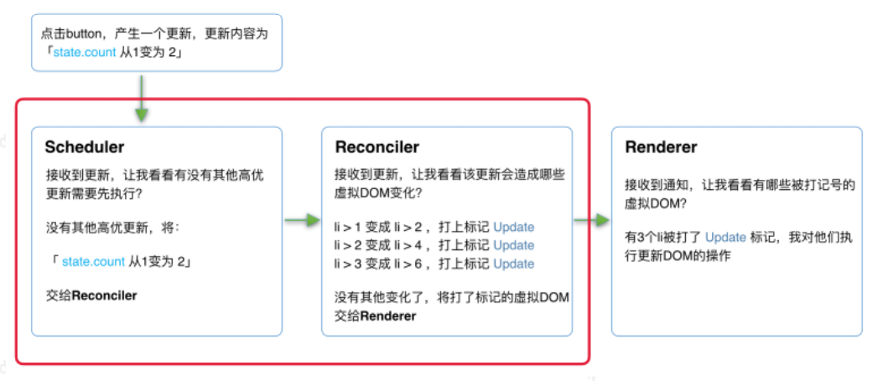
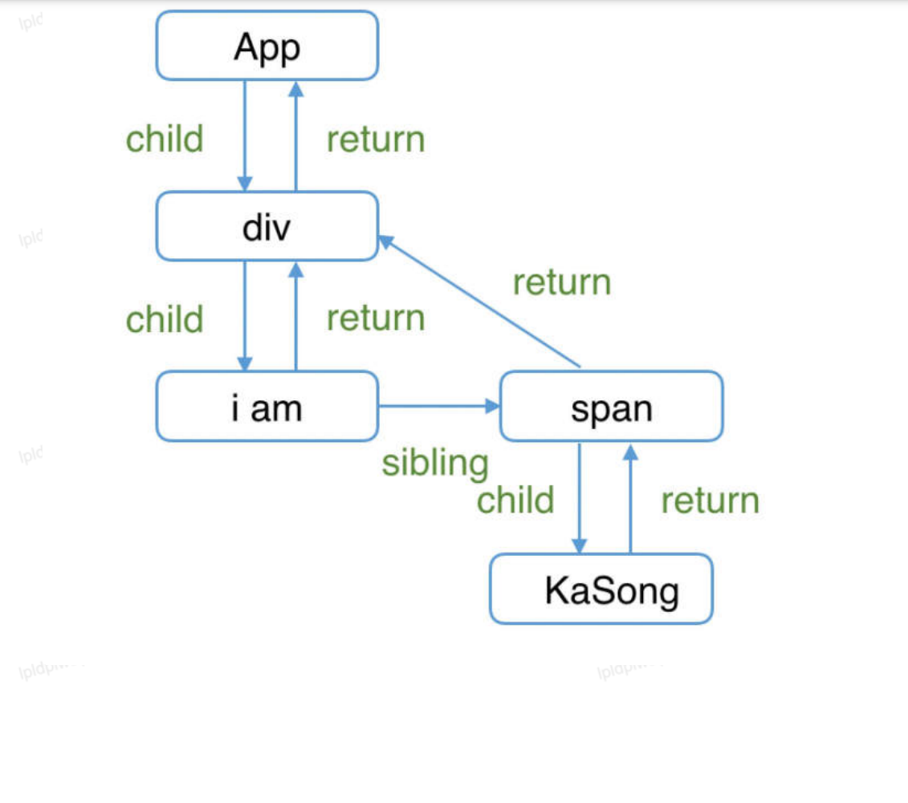

# React核心源码解析

## React理念

:::tip
我们认为，React 是用 JavaScript 构建快速响应的大型 Web 应用程序的首选方式。在 Facebook 和Instagram 上表现优秀。ui = render (data) -> 单向数据流
:::

如何提升页面响应交互？
CPU卡顿：大量计算操作导致的性能问题
IO卡顿：网络请求延时的，无法快速响应

1. CPU卡顿
在浏览器刷新频率为60HZ的情况下（即1000ms / 60HZ = 16.6ms）浏览器刷新一次浏览器里JS线程与GUI线程是互斥的，不可同时执行，所以JS脚本和浏览器的render、painting不能同时执行，所以执行顺序为： JS脚本执行 ->样式布局 ->样式绘制 ，JS执行时间超过16.6ms，
就不会执行render与painting了

```jsx
// index.js
import ReactDOM from "react-dom";
import App from "./App";
const rootElement = document.getElementById("root");
// ReactDOM.render(<App />, rootElement);
ReactDOM.createRoot(rootElement).render(<App />);
// APP.js
import "./styles.css";
export default function App() {
    const len = 3000;
    return (
        <ul>
            {Array(len)
            .fill(0)
            .map((_, i) => (
            <li>{i}</li>
            ))}
        </ul>
    );
}
```

React 是如何解决这个问题的？
在浏览器每一帧的时间中，预留一些时间给JS线程，React利用这部分时间更新组件（预留的初始时间是5ms）。

时间切片：把更新过程碎片化，把一个耗时长的任务分成很多小片。执行非阻塞渲染，基于优先级应用更新以及在后台预渲染内容。

在开启concurrent mode后

```jsx
// 通过使用ReactDOM.unstable_createRoot开启Concurrent Mode
// ReactDOM.render(<App/>, rootEl);
ReactDOM.createRoot(rootEl).render(<App/>);
```

开启时间切片后，React长尾任务会被切到每一帧任务里，执行时间在5ms左右，就可以保障rendering与painting时间了

2. IO卡顿

假设页面加载，是否展示loading
停留时间长：显示loading，加载完成后隐藏
停留时间短：不显示loading，用户无感知，不然loading闪一下

- Suspense：https://17.reactjs.org/docs/concurrent-mode-suspense.html
- useDeferredValue：https://17.reactjs.org/docs/concurrent-modereference.html#usedeferredvalue

总结：快速响应 -> 同步的长尾更新转为可中断的异步更新

### 新老react架构对比

React15：

Reconciler（协调器）—— 负责找出变化的组件
Renderer（渲染器）—— 负责将变化的组件渲染到页面上

- Reconciler：
https://zh-hans.reactjs.org/docs/codebase-overview.html#reconcilers

在React中可以通过this.setState、this.forceUpdate、ReactDOM.render等API触发更新。
每当有更新发生时，Reconciler会做如下工作：
1. 调用函数组件、或class组件的render方法，将返回的JSX转化为虚拟DOM
2. 将虚拟DOM和上次更新时的虚拟DOM对比
3. 通过对比找出本次更新中变化的虚拟DOM
4. 通知Renderer将变化的虚拟DOM渲染到页面上

- Renderer：
https://zh-hans.reactjs.org/docs/codebase-overview.html#renderers

由于React支持跨平台，所以不同平台有不同的Renderer。我们前端最熟悉的是负责在浏览器环境渲染的Renderer —— ReactDOM。
除此之外，还有：
ReactNative：渲染App原生组件
ReactArt：渲染到Canvas, SVG 或 VML (IE8)
在每次更新发生时，Renderer接到Reconciler通知，将变化的组件渲染在当前宿主环境。

React 15架构的缺点
在Reconciler中，mount的组件会调用mountComponent，update的组件会调用updateComponent。这两个方法会递归更新子组件

递归的缺点：

1. 当层级很深时，递归更新时间超过了16ms，用户交互就会卡顿
2. React 15不支持用可中断的异步更新代替同步的更新

demo：
https://codesandbox.io/s/fervent-sutherland-pf7sg?file=/src/App.js

React16：

Scheduler（调度器）—— 调度任务的优先级，高优任务优先进入Reconciler
Reconciler（协调器）—— 负责找出变化的组件
Renderer（渲染器）—— 负责将变化的组件渲染到页面上

Scheduler（调度器）：

需要一种机制，当浏览器有剩余时间时通知我们，从而完成任务调度。
部分浏览器已经实现了这个API，这就是requestIdleCallback。但是由于以下因素，React放弃使用：

浏览器兼容性

- 触发频率不稳定，受很多因素影响。比如当我们的浏览器切换tab后，之前tab注册的
- requestIdleCallback触发的频率会变得很低

基于以上原因，React实现了功能更完备的requestIdleCallbackpolyfill，这就是Scheduler。除了在空闲
时触发回调的功能外，Scheduler还提供了多种调度优先级供任务设置。

Reconciler（协调器）
我们知道，在React15中Reconciler是递归处理虚拟DOM的。让我们看看React16的Reconciler

```jsx
// 更新工作从递归变成了可以中断的循环过程。每次循环都会调用shouldYield判断当前是否有剩余时间。
/** @noinline */
function workLoopConcurrent() {
    // Perform work until Scheduler asks us to yield
    while (workInProgress !== null && !shouldYield()) {
        workInProgress = performUnitOfWork(workInProgress);
    }
}
```

Q：如何处理中断更新时DOM渲染不完全？

在React16中，Reconciler与Renderer不再是交替工作。当Scheduler将任务交给Reconciler后，Reconciler会为变化的虚拟DOM打上代表增/删/更新的标记

整个Scheduler与Reconciler的工作都在内存中进行。只有当所有组件都完成Reconciler的工作，才会统一交给Renderer。

详细官方介绍：
https://github.com/facebook/react/blob/1fb18e22ae66fdb1dc127347e169e73948778e5a/packages/react-reconciler/src/ReactSideEffectTags.js



其中红框中的步骤随时可能由于以下原因被中断：

- 有其他更高优任务需要先更新
- 当前帧没有剩余时间

由于红框中的工作都在内存中进行，不会更新页面上的DOM，所以即使反复中断，用户也不会看见更新不完全的DOM
同时，由于Scheduler和Reconciler都是平台无关的，所以React为他们分别单独发布了一个包

###  Fiber架构详解

fiber的核心思路：在react中遵循代数效应（algebraic effects）

代数效应是函数式编程中的一个概念，用于将副作用从函数调用中分离。

```jsx
function getTotalPicNum(user1, user2) {
    const picNum1 = getPicNum(user1);
    const picNum2 = getPicNum(user2);
    return picNum1 + picNum2;
}
```

假设getPickNum需要异步请求：async await？
破坏了上下文的一致性，需要调用它的函数也时async

假如有一个类似的try...catch语法 ------try...handle、perform、resume

```jsx
function getPicNum(name) {
    const picNum = perform name;
        return picNum;
    }
    try {
        getTotalPicNum('xiaokai', 'houwan');
    } handle (who) {
    switch (who) {
        case 'xiaokai':
        resume with 230;
        case 'houwan':
        resume with 122;
        default:
        resume with 0;
    }
}
```

代数效应：将副作用（例子中为请求图片数量）从函数逻辑中分离，使函数关注点保持纯粹，也就是不用关心是同步还是异步
Example：Hooks，不用关心useState中state是如何保存变化的，我们只需要使用即可

React Fiber

1. 定义：React内部实现的一套状态更新机制。支持任务不同优先级，可中断与恢复，并且恢复后可以复用之前的中间状态。

2. 功能：

a. 作为架构来说，之前React15的Reconciler采用递归的方式执行，数据保存在递归调用栈中，所以被称为stack Reconciler。React16的Reconciler基于Fiber节点实现，被称为FiberReconciler；
b. 作为静态的数据结构来说，每个Fiber节点对应一个React element，保存了该组件的类型（函数组件/类组件/原生组件...）、对应的DOM节点等信息；
c. 作为动态的工作单元来说，每个Fiber节点保存了本次更新中该组件改变的状态、要执行的工作（需要被删除/被插入页面中/被更新...）；

react fiber node定义
地址：
https://github.com/facebook/react/blob/1fb18e22ae66fdb1dc127347e169e73948778e5a/packages/react-reconciler/src/ReactFiber.new.js#L117

```js
function FiberNode(
    tag: WorkTag,
    pendingProps: mixed,
    key: null | string,
    mode: TypeOfMode,
    ) {
    // Instance，静态节点的数据结构属性
    this.tag = tag;
    this.key = key;
    this.elementType = null;
    this.type = null;
    this.stateNode = null;
    // Fiber，用来链接其他fiber节点形成的fiber树
    this.return = null;
    this.child = null;
    this.sibling = null;
    this.index = 0;
    this.ref = null;
    // 作为动态的工作单元的属性
    this.pendingProps = pendingProps;
    this.memoizedProps = null;
    this.updateQueue = null;
    this.memoizedState = null;
    this.dependencies = null;
    this.mode = mode;
    this.effectTag = NoEffect;
    this.subtreeTag = NoSubtreeEffect;
    this.deletions = null;
    this.nextEffect = null;
    this.firstEffect = null;
    this.lastEffect = null;
    // 作为调度优先级的属性
    this.lanes = NoLanes;
    this.childLanes = NoLanes;
    // 指向该fiber在另一次更新时对应的fiber
    this.alternate = null;
    if (enableProfilerTimer) {
        // Note: The following is done to avoid a v8 performance cliff.
        //
        // Initializing the fields below to smis and later updating them with
        // double values will cause Fibers to end up having separate shapes.
        // This behavior/bug has something to do with Object.preventExtension
        ().
        // Fortunately this only impacts DEV builds.
        // Unfortunately it makes React unusably slow for some applications.
        // To work around this, initialize the fields below with doubles.
        //
        // Learn more about this here:
        // https://github.com/facebook/react/issues/14365
        // https://bugs.chromium.org/p/v8/issues/detail?id=8538
        this.actualDuration = Number.NaN;
        this.actualStartTime = Number.NaN;
        this.selfBaseDuration = Number.NaN;
        this.treeBaseDuration = Number.NaN;
        // It's okay to replace the initial doubles with smis after initializa
        tion.
        // This won't trigger the performance cliff mentioned above,
        // and it simplifies other profiler code (including DevTools).
        this.actualDuration = 0;
        this.actualStartTime = -1;
        this.selfBaseDuration = 0;
        this.treeBaseDuration = 0;
    }
    if (__DEV__) {
        // This isn't directly used but is handy for debugging internals:
        this._debugID = debugCounter++;
        this._debugSource = null;
        this._debugOwner = null;
        this._debugNeedsRemount = false;
        this._debugHookTypes = null;
        if (!hasBadMapPolyfill && typeof Object.preventExtensions === 'function') {
            Object.preventExtensions(this);
        }
    }
}
```

- 架构层面

```jsx
// 指向父级Fiber节点
this.return = null;
// 指向子Fiber节点
this.child = null;
// 指向右边第一个兄弟Fiber节点
this.sibling = null;
// 表示的组件结构
function App() {
    return (
        <div>
            i am
            <span>xianzao</span>
        </div>
    )
}
```

Q：为什么指向的父节点是return而不是parent？

因为作为一个工作单元，return指节点执行完completeWork后会返回的下一个节点。子Fiber节点及其兄弟节点完成工作后会返回其父级节点，所以用return指代父级节点

- 作为静态数据结构

```jsx
// Fiber对应组件的类型 Function/Class...
this.tag = tag;
// key属性
this.key = key;
// 大部分情况同type，某些情况不同，比如FunctionComponent使用React.memo包裹
this.elementType = null;
// 对于 FunctionComponent，指函数本身，对于ClassComponent，指class
this.type = null;
// Fiber对应的真实DOM节点
this.stateNode = null;
```

- 作作为动态工作单元

记录更新相关的信息，主要是updateQueue

Q：React Fiber 如何更新DOM？

使用“双缓存”
在内存中绘制当前的fiber dom，绘制完毕后直接替换上一帧的fiber dom，由于省去了两帧替换间的计算时间，不会出现从白屏到出现画面的闪烁情况
在React中最多会同时存在两棵Fiber树。当前屏幕上显示内容对应的Fiber树称为current Fiber，正在内存中构建的Fiber树称为workInProgress Fiber，两者通过alternate连接

```js
currentFiber.alternate === workInProgressFiber;
workInProgressFiber.alternate === currentFiber;
```

React应用的根节点通过current指针指向不同的fiber dom切换，当update时，workInProgressFiberrende完成后会跟currentFiber 替换，下一次更新会将当前currentFiber（上一次的
workInProgressFiber）替换

```jsx
function App() {
    const [num, add] = useState(0);
    return (
        <p onClick={() => add(num + 1)}>{num}</p>
    )
}
ReactDOM.render(<App/>, document.getElementById('root'));
```

- mount

1. 首次执行ReactDOM.render会创建fiberRootNode（源码中叫fiberRoot）和rootFiber。其中fiberRootNode是整个应用的根节点，rootFiber是\<App/\>所在组件树的根节点；

a. 区分fiberRootNode与rootFiber：因为在应用中我们可以多次调用ReactDOM.render渲染不同的组件树，他们会拥有不同的rootFiber。但是整个应用的根节点只有一个，那就是
fiberRootNode；
b. fiberRootNode的current会指向当前页面上已渲染内容对应Fiber树，即current Fiber；
c. 因为是首次渲染，此时页面还没有挂在所有的DOM，所以rootFiber还没有子fiber dom

2. render阶段，根据组件返回的JSX在内存中依次创建Fiber节点并连接在一起构建Fiber树，被称为workInProgress Fiber；

a. 在构建workInProgress Fiber树时会尝试复用current Fiber树中已有的Fiber节点内的属性（后续的diff），在首屏渲染时只有rootFiber存在对应的current fiber（即rootFiber.alternate）

3. alternate阶段：此时workInProgress fiber已经构建完成，fiberRootNode的current指向了workInProgress fiber

- update

1. 假设p元素更新，这会开启一次新的render阶段并构建一棵新的workInProgress Fiber 树，且会尽可能服用显有的current Fiber

2. alternate阶段

workInProgress fiber在更换完后，fiberRootNode的current指针更换

## 前置知识

github地址：https://github.com/facebook/react

### 目录结构

主要内容在packages中
- react：
地址：https://github.com/facebook/react/tree/main/packages/react
内容：全局React API，如React.createElement、React.Component等
- scheduler：
地址：https://github.com/facebook/react/tree/main/packages/scheduler
内容：scheduler实现
- Shared：
地址：https://github.com/facebook/react/tree/main/packages/shared
内容：其他模块中公用的方法和全局变量
- Render相关
```jsx
- react-art
- react-dom # 注意这同时是DOM和SSR（服务端渲染）的入口
- react-native-renderer
- react-noop-renderer # 用于debug fiber（后面会介绍fiber）
- react-test-renderer
```
- 实验性文件
```jsx
- react-server # 创建自定义SSR流
- react-client # 创建自定义的client
- react-fetch # 用于数据请求
- react-interactions # 用于测试交互相关的内部特性，比如React的事件模型
- react-reconciler # Reconciler的实现，你可以用他构建自己的Renderer
```
- 辅助包
```jsx
- react-is # 用于测试组件是否是某类型
- react-client # 创建自定义的流
- react-fetch # 用于数据请求
- react-refresh # “热重载”的React官方实现
```
- react-reconciler（核心关注点）
地址：https://github.com/facebook/react/tree/main/packages/react-reconciler
内容：React16核心更新内容

### 深入理解JSX

JSX和Fiber节点是同一个东西么？
React Component、React Element是同一个东西么，他们和JSX有什么关系？

JSX在编译时会被Babel编译为React.createElement方法，这也是为什么要引入 import React from 'react'; 的原因

地址：
https://github.com/facebook/react/blob/1fb18e22ae66fdb1dc127347e169e73948778e5a/packages/react/src/ReactElement.js#L348

```jsx
export function createElement(type, config, children) {
    let propName;
    const props = {};
    let key = null;
    let ref = null;
    let self = null;
    let source = null;
    if (config != null) {
    // 将 config 处理后赋值给 props
    // ...省略
    }
    const childrenLength = arguments.length - 2;
    // 处理 children，会被赋值给props.children
    // ...省略
    // 处理 defaultProps
    // ...省略
    return ReactElement(
        type,
        key,
        ref,
        self,
        source,
        ReactCurrentOwner.current,
        props,
    );
}
const ReactElement = function(type, key, ref, self, source, owner, props)
{
    const element = {
        // 标记这是个 React Element
        $$typeof: REACT_ELEMENT_TYPE,
        type: type,
        key: key,
        ref: ref,
        props: props,
        _owner: owner,
    };
    return element;
};
```
在全局API isValidElement里，通过$$typeof判断为REACT_ELEMENT_TYPE即为react元素，所以JSX返回的结构也是react element

```jsx
export function isValidElement(object) {
    return (
        typeof object === 'object' &&
        object !== null &&
        object.$$typeof === REACT_ELEMENT_TYPE
    );
}
```

React根据classComponent原型上的isReactComponent判断是否为ClassComponent

```jsx
ClassComponent.prototype.isReactComponent; // {}
FunctionComponent.prototype.isReactComponent; // undefined
```

JSX与Fiber节点的关系
- JSX是一种描述当前组件内容的数据结构，他不包含组件schedule、reconcile、render所需的相关信息
  - 比如如下信息就不包括在JSX中：组件在更新中的优先级、组件的state、组件被打上的用于Renderer的标记
- Fiber更多地是一种更新机制
  - 在组件mount时，Reconciler根据JSX描述的组件内容生成组件对应的Fiber节点
  - 在update时，Reconciler将JSX与Fiber节点保存的数据对比，生成组件对应的Fiber节点，并根据对比结果为Fiber节点打上标记

## 架构篇

## render阶段

内容：Fiber节点是如何被创建并构建成render树的

在render的阶段中，根据是同步还是异步，执行performSyncWorkOnRoot 和performConcurrentWorkOnRoot

```jsx
// performSyncWorkOnRoot会调用该方法
function workLoopSync() {
    while (workInProgress !== null) {
        performUnitOfWork(workInProgress);
    }
}
// performConcurrentWorkOnRoot会调用该方法
function workLoopConcurrent() {
    while (workInProgress !== null && !shouldYield()) {
        performUnitOfWork(workInProgress);
    }
}
```

区别：是否调用shouldYield。如果当前浏览器帧没有剩余时间，shouldYield会中止循环，直到浏览器有空闲时间后再继续遍历

说明：
workInProgress 代表当前已创建的 workInProgress fiber ；
performUnitOfWork 方法会创建下一个Fiber节点并赋值给 workInProgress ，并将 workInProgress 与已创建的Fiber节点连接起来构成Fiber树；

虽然fiber reconciler是从stack reconciler重构而来，但都是通过遍历的方式实现可中断的异步递归

1. 递

首先从 rootFiber 开始向下深度优先遍历。为遍历到的每个Fiber节点调用beginWork（下面详细讲）；
该方法会根据传入的Fiber节点创建子Fiber节点，并将这两个Fiber节点连接起来；
当遍历到叶子节点（即没有子组件的组件）时就会进入“归”阶段；

2. 归

在“归”阶段会调用completeWork（下面详细讲)处理Fiber节点。
当某个Fiber节点执行完completeWork，如果其存在兄弟Fiber节点（即fiber.sibling !== null），会进入其兄弟Fiber的“递”阶段；
如果不存在兄弟Fiber，会进入父级Fiber的“归”阶段；“递”和“归”阶段会交错执行直到“归”到rootFiber

```jsx
function App() {
    return (
        <div>
            i am
            <span>text</span>
        </div>
    )
}
ReactDOM.render(<App />, document.getElementById("root"));
```



```jsx
1. rootFiber beginWork
2. App Fiber beginWork
3. div Fiber beginWork
4. "i am" Fiber beginWork
5. "i am" Fiber completeWork
6. span Fiber beginWork
7. span Fiber completeWork
8. div Fiber completeWork
9. App Fiber completeWork
10. rootFiber completeWork
// 没有叶子节点是因为React针对只有单一文本子节点的Fiber节点做了性能优化
// 递归的格式
function performUnitOfWork(fiber) {
    // 执行beginWork
    if (fiber.child) {
        performUnitOfWork(fiber.child);
    }
    // 执行completeWork
    if (fiber.sibling) {
        performUnitOfWork(fiber.sibling);
    }
}
```

### beginWork

地址：
https://github.com/facebook/react/blob/1fb18e22ae66fdb1dc127347e169e73948778e5a/packages/react-reconciler/src/ReactFiberBeginWork.new.js#L3075

beginWork的工作是传入当前Fiber节点，创建子Fiber节点

```jsx
function beginWork(
    current: Fiber | null,
    workInProgress: Fiber,
    renderLanes: Lanes,
): Fiber | null {
    // ...省略函数体
}
```

- current：当前组件对应的Fiber节点在上一次更新时的Fiber节点，即workInProgress.alternate
- workInProgress：当前组件对应的Fiber节点
- renderLanes：优先级相关，后面讲

可以根据current!==null，判断组件时mount还是update

- mount：首次渲染，当前组件的fiber节点为null；
- update：之前已经mount，fiber节点不为null；

基于此原因，beginWork的工作可以分为两部分：

update时：如果current存在，在满一定条件时可以复用current节点，（diff）这样就能克隆current.child作为workInProgress.child，而不需要新建workInProgress.child；
mount时：除fiberRootNode以外，current === null。会根据fiber.tag不同，创建不同类型的子Fiber节点；

```js
function beginWork(
    current: Fiber | null,
    workInProgress: Fiber,
    renderLanes: Lanes
): Fiber | null {
    // update时：如果current存在可能存在优化路径，可以复用current（即上一次更新的Fiber节点）
    if (current !== null) {
        // ...省略
        // 复用current
        return bailoutOnAlreadyFinishedWork(
            current,
            workInProgress,
            renderLanes,
        );
    } else {
        didReceiveUpdate = false;
    }
    // mount时：根据tag不同，创建不同的子Fiber节点
    switch (workInProgress.tag) {
        case IndeterminateComponent:
        // ...省略
        case LazyComponent:
        // ...省略
        case FunctionComponent:
        // ...省略
        case ClassComponent:
        // ...省略
        case HostRoot:
        // ...省略
        case HostComponent:
        // ...省略
        case HostText:
        // ...省略
        // ...省略其他类型
    }
}
```

- update时

didReceiveUpdate = false：不需要新建fiber，可以直接复用
!includesSomeLane(renderLanes, updateLanes)，即当前Fiber节点优先级不够（后面讲）

```js
if (current !== null) {
    const oldProps = current.memoizedProps;
    const newProps = workInProgress.pendingProps;
    if (
        oldProps !== newProps ||
        hasLegacyContextChanged() ||
        (__DEV__ ? workInProgress.type !== current.type : false)
    ) {
        didReceiveUpdate = true;
    } else if (!includesSomeLane(renderLanes, updateLanes)) {
        didReceiveUpdate = false;
        switch (workInProgress.tag) {
        // 省略处理
        }
    return bailoutOnAlreadyFinishedWork(
        current,
        workInProgress,
        renderLanes,
    );
    } else {
        didReceiveUpdate = false;
    }
} else {
    didReceiveUpdate = false;
}
```

- mount时

    - 根据fiber.tag不同，进入不同逻辑的fiber创建

    - 官网地址：
    https://github.com/facebook/react/blob/1fb18e22ae66fdb1dc127347e169e73948778e5a/packages/react-reconciler/src/ReactWorkTags.js

    - 对于常见的组件（FunctionComponent、ClassComponent），会执行reconcileChildren

```jsx
// mount时：根据tag不同，创建不同的Fiber节点
switch (workInProgress.tag) {
    case IndeterminateComponent:
    // ...省略
    case LazyComponent:
    // ...省略
    case FunctionComponent:
    // ...省略
    case ClassComponent:
    // ...省略
    case HostRoot:
    // ...省略
    case HostComponent:
    // ...省略
    case HostText:
    // ...省略
    // ...省略其他类型
}
```

- reconcileChildren
    - mount组件：创建新的子Fiber节点；
    - update组件：将当前组件与该组件在上次更新时对应的Fiber节点比较（Diff），将比较的结果生成新Fiber节点；

```jsx
export function reconcileChildren(
    current: Fiber | null,
    workInProgress: Fiber,
    nextChildren: any,
    renderLanes: Lanes
) {
    if (current === null) {
        // 对于mount的组件
        workInProgress.child = mountChildFibers(
            workInProgress,
            null,
            nextChildren,
            renderLanes,
        );
    } else {
        // 对于update的组件
        workInProgress.child = reconcileChildFibers(
            workInProgress,
            current.child,
            nextChildren,
            renderLanes,
        );
    }
}
```

- mountChildFibers & reconcileChildFibers
    - 都会生成新的fiber节点返回给workInProgress.child，作为本次beginWork的返回值，在下次performUnitOfWork执行时workInProgress的入参

- effectTag
    - render阶段的工作是在内存中进行，当工作结束后会通知Renderer需要执行的DOM操作。要执行DOM操作的具体类型就保存在fiber.effectTag中


### completeWork

- 作用：针对不同的fiber.tag调用不同的处理逻辑
- 地址：
https://github.com/facebook/react/blob/1fb18e22ae66fdb1dc127347e169e73948778e5a/packages/react-reconciler/src/ReactFiberCompleteWork.new.js#L673

```js
function completeWork(
    current: Fiber | null,
    workInProgress: Fiber,
    renderLanes: Lanes,
): Fiber | null {
    const newProps = workInProgress.pendingProps;
    switch (workInProgress.tag) {
        case IndeterminateComponent:
        case LazyComponent:
        case SimpleMemoComponent:
        case FunctionComponent:
        case ForwardRef:
        case Fragment:
        case Mode:
        case Profiler:
        case ContextConsumer:
        case MemoComponent:
        return null;
        case ClassComponent: {
            // ...省略
            return null;
        }
        case HostRoot: {
            // ...省略
            updateHostContainer(workInProgress);
            return null;
        }
        case HostComponent: {
        // ...省略
        return null;
    }
 // ...省略
```

- 判断update时我们还需要考虑workInProgress.stateNode != null ?（即该Fiber节点是否存在对应的DOM节点）

```jsx
case HostComponent: {
    popHostContext(workInProgress);
    const rootContainerInstance = getRootHostContainer();
    const type = workInProgress.type;
    if (current !== null && workInProgress.stateNode != null) {
    // update的情况
    // ...省略
    } else {
    // mount的情况
    // ...省略
    }
    return null;
}
```

- 当update时，Fiber节点已经存在对应DOM节点，所以不需要生成DOM节点。需要做的主要是处理props，比如：

    - onClick、onChange等回调函数的注册
    - 处理style prop
    - 处理DANGEROUSLY_SET_INNER_HTML prop
    - 处理children prop

```jsx
if (current !== null && workInProgress.stateNode != null) {
    // update的情况
    updateHostComponent(
        current,
        workInProgress,
        type,
        newProps,
        rootContainerInstance,
    );
}
```
- updateHostComponent git地址：
https://github.com/facebook/react/blob/1fb18e22ae66fdb1dc127347e169e73948778e5a/packages/react-reconciler/src/ReactFiberCompleteWork.new.js#L225

- 在updateHostComponent内部，被处理完的props会被赋值给workInProgress.updateQueue，并最终会在commit阶段被渲染在页面上，其中updatePayload为数组形式，他的偶数索引的值
为变化的prop key，奇数索引的值为变化的prop value

```js
workInProgress.updateQueue = (updatePayload: any);
```

- mount时
    - 为Fiber节点生成对应的DOM节点
    - 将子孙DOM节点插入刚生成的DOM节点中
    - 与update逻辑中的updateHostComponent类似的处理props的过程

```jsx
// mount的情况
// ...省略服务端渲染相关逻辑
const currentHostContext = getHostContext();
// 为fiber创建对应DOM节点
const instance = createInstance(
    type,
    newProps,
    rootContainerInstance,
    currentHostContext,
    workInProgress,
);
// 将子孙DOM节点插入刚生成的DOM节点中
appendAllChildren(instance, workInProgress, false, false);
// DOM节点赋值给fiber.stateNode
workInProgress.stateNode = instance;
// 与update逻辑中的updateHostComponent类似的处理props的过程
if (
    finalizeInitialChildren(
        instance,
        type,
        newProps,
        rootContainerInstance,
        currentHostContext,
    )
) {
    markUpdate(workInProgress);
}
```

- effectList

Q：作为DOM操作的依据，commit阶段需要找到所有有effectTag的Fiber节点并依次执行effectTag对应操作。难道需要在commit阶段再遍历一次Fiber树寻找effectTag !== null的Fiber节点么？

completeWork在上层函数completeUnitOfWork上维护了一个单向链表
effectList中第一个Fiber节点保存在fiber.firstEffect，最后一个元素保存在fiber.lastEffect。

类似appendAllChildren，在“归”阶段，所有有effectTag的Fiber节点都会被追加在effectList中，最终形成一条以rootFiber.firstEffect为起点的单向链表。

地址：
https://github.com/facebook/react/blob/1fb18e22ae66fdb1dc127347e169e73948778e5a/packages/react-reconciler/src/ReactFiberWorkLoop.new.js#L1744

```js
                       nextEffect          nextEffect
rootFiber.firstEffect -----------> fiber -----------> fiber
```

在performSyncWorkOnRoot函数中fiberRootNode被传递给commitRoot方法，开启commit阶段工作流程
```js
commitRoot(root);
```

## commit阶段

```js
commitRoot(root);
```

在rootFiber.firstEffect上保存了一条需要执行副作用的Fiber节点的单向链表effectList，这些Fiber节点的updateQueue中保存了变化的props
这些副作用对应的DOM操作在commit阶段执行。

源码地址：
https://github.com/facebook/react/blob/1fb18e22ae66fdb1dc127347e169e73948778e5a/packages/react-reconciler/src/ReactFiberWorkLoop.new.js#L2001

除此之外，一些生命周期钩子（比如componentDidXXX）、hook（比如useEffect）需要在commit阶段执行。

commit阶段的主要工作（即Renderer的工作流程）分为三部分：

1. before mutation阶段（执行DOM操作前）
2. mutation阶段（执行DOM操作）
3. layout阶段（执行DOM操作后）

- before mutation

```js
do {
    // 触发useEffect回调与其他同步任务。由于这些任务可能触发新的渲染，所以这里要一直遍历执行直到没有任务
    flushPassiveEffects();
} while (rootWithPendingPassiveEffects !== null);
 // root指 fiberRootNode
 // root.finishedWork指当前应用的rootFiber
 const finishedWork = root.finishedWork;
 // 凡是变量名带lane的都是优先级相关
 const lanes = root.finishedLanes;
 if (finishedWork === null) {
    return null;
 }
 root.finishedWork = null;
 root.finishedLanes = NoLanes;
 // 重置Scheduler绑定的回调函数
 root.callbackNode = null;
 root.callbackId = NoLanes;
 let remainingLanes = mergeLanes(finishedWork.lanes, finishedWork.childLanes);
 // 重置优先级相关变量
 markRootFinished(root, remainingLanes);
 // 清除已完成的discrete updates，例如：用户⿏标点击触发的更新。
 if (rootsWithPendingDiscreteUpdates !== null) {
    if (
        !hasDiscreteLanes(remainingLanes) &&
        rootsWithPendingDiscreteUpdates.has(root)
    ) {
        rootsWithPendingDiscreteUpdates.delete(root);
    }
 }
 // 重置全局变量
 if (root === workInProgressRoot) {
    workInProgressRoot = null;
    workInProgress = null;
    workInProgressRootRenderLanes = NoLanes;
 } else {

 }
// 将effectList赋值给firstEffect
 // 由于每个fiber的effectList只包含他的子孙节点
 // 所以根节点如果有effectTag则不会被包含进来
 // 所以这里将有effectTag的根节点插入到effectList尾部
 // 这样才能保证有effect的fiber都在effectList中
 let firstEffect;
 if (finishedWork.effectTag > PerformedWork) {
 if (finishedWork.lastEffect !== null) {
    finishedWork.lastEffect.nextEffect = finishedWork;
    firstEffect = finishedWork.firstEffect;
 } else {
    firstEffect = finishedWork;
 }
 } else {
    // 根节点没有effectTag
    firstEffect = finishedWork.firstEffect;
 }

```
before mutation之前主要做一些变量赋值，状态重置的工作。

- layout

主要包括三点内容：
1. useEffect相关的处理：后面详细讲
2. 性能追踪相关：代码里有很多和interaction相关的变量。他们都和追踪React渲染时间、性能相关，在Profiler API和DevTool中使用，你可以在这里看到interaction的定义
3. 在commit阶段会触发一些生命周期钩子（如 componentDidXXX）和hook（如useLayoutEffect、useEffect）。在这些回调方法中可能触发新的更新，新的更新会开启新的render-commit流程。

### before mutation（执行DOM前）

遍历effectList并调用commitBeforeMutationEffects函数处理。

地址：
https://github.com/facebook/react/blob/1fb18e22ae66fdb1dc127347e169e73948778e5a/packages/react-reconciler/src/ReactFiberWorkLoop.new.js#L2104-L2127

```jsx
// 保存之前的优先级，以同步优先级执行，执行完毕后恢复之前优先级
const previousLanePriority = getCurrentUpdateLanePriority();
setCurrentUpdateLanePriority(SyncLanePriority);
// 将当前上下文标记为CommitContext，作为commit阶段的标志
const prevExecutionContext = executionContext;
executionContext |= CommitContext;
// 处理focus状态
focusedInstanceHandle = prepareForCommit(root.containerInfo);
shouldFireAfterActiveInstanceBlur = false;
// beforeMutation阶段的主函数
commitBeforeMutationEffects(finishedWork);
focusedInstanceHandle = null;
```

主要讲下 commitBeforeMutationEffects

```js
function commitBeforeMutationEffects() {
    while (nextEffect !== null) {
        const current = nextEffect.alternate;
        if (!shouldFireAfterActiveInstanceBlur && focusedInstanceHandle !== null) {
        // ...focus blur相关
        }
        const effectTag = nextEffect.effectTag;
        // 调用getSnapshotBeforeUpdate
        if ((effectTag & Snapshot) !== NoEffect) {
            commitBeforeMutationEffectOnFiber(current, nextEffect);
        }
        // 调度useEffect
        if ((effectTag & Passive) !== NoEffect) {
            if (!rootDoesHavePassiveEffects) {
                rootDoesHavePassiveEffects = true;
                scheduleCallback(NormalSchedulerPriority, () => {
                    flushPassiveEffects();
                    return null;
                });
            }
        }
        nextEffect = nextEffect.nextEffect;
    }
}
```

1. 处理DOM节点渲染、删除后的autoFocus、blur等操作；
2. 调用getSnapshotBeforeUpdate
3. 调度 useEffect

调用getSnapshotBeforeUpdate

commitBeforeMutationEffectOnFiber是commitBeforeMutationLifeCycles的别名，在该方法内会调用getSnapshotBeforeUpdate。
地址：
https://github.com/facebook/react/blob/1fb18e22ae66fdb1dc127347e169e73948778e5a/packages/react-reconciler/src/ReactFiberCommitWork.old.js#L222

因为在V16版本后，componentWillXXX钩子为UNSAFE_，所以，React提供了替代的生命周期钩子getSnapshotBeforeUpdate，getSnapshotBeforeUpdate是在commit阶段内的before mutation阶段调用的，由于commit阶段是同步的，所以不会遇到多次调用的问题

为什么从Reactv16开始，componentWillXXX钩子前增加了UNSAFE_前缀？

从React15升级为React16后，源码改动如此之大，说React被重构可能更贴切些。正是由于变动如此之大，使得一些特性在新旧版本React中表现不一致

在Stack Reconciler重构为Fiber Reconciler后，render阶段的任务可能中断/重新开始，对应的组件在render阶段的生命周期钩子（即componentWillXXX）可能触发多次。
这种行为和Reactv15不一致，所以标记为UNSAFE_。
- componentWillMount -- componentDidMount
- componentWillRecieveProps -- getDerivedStateFromProps
- componentWillUpdate -- getDerivedStateFromProps

在React更新里，每次发起更新都会创建一个Update对象，同一组件的多个Update，会以链表的形式保存在updateQueue中。

- update

```js
const update: Update<*> = {
    // ...省略当前不需要关注的字段
    lane, // 表示调度优先级
    payload: null, // 更新挂载的数据，对于this.setState创建的更新，payload为this.setState的传参
    next: null // 与其他update形成链表
};
```
- updateQueue

```js
const queue: UpdateQueue<State> = {
    baseState: fiber.memoizedState, // 更新基于哪个state开始
    firstBaseUpdate: null, // 更新开始和结束的update
    lastBaseUpdate: null,
    shared: {
        pending: null, // 更新的单个或多个update形成的链表
    },
    // 其他参数省略...
};
// baseUpdate + shared.pending会作为本次更新需要执行的Update
```

假设，某个组件updateQueue 存在4个update，数字代表优先级

```js
baseState = '';
A1 - B2 - C1 - D2
// 为了保证更新的连贯性，第一个被跳过的update（B）和后面的update会作为第二次渲染的baseUpdate
// 为BCD
// 首次渲染后
baseState: ''
Updates: [A1, C1]
Result state: 'AC'
// 第二次渲染，B在第一次渲染时被跳过，所以在他之后的C造成的渲染结果不会体现在第二次渲染的baseState中。所以baseState为A而不是上次渲染的Result state AC
// 。这也是为了保证更新的连贯性
baseState: 'A' // 为了保证一致性，C不在
Updates: [B2, C1, D2]
Result state: 'ABCD'
// Updates里出现了两次C
```

- 调度useEffect

```js
// 调度useEffect
if ((effectTag & Passive) !== NoEffect) {
    if (!rootDoesHavePassiveEffects) {
        rootDoesHavePassiveEffects = true;
        scheduleCallback(NormalSchedulerPriority, () => { // scheduler提供，调度优先级的回调
            // 触发useEffect
            flushPassiveEffects(); // 具体见后文hooks
            return null;
        });
    }
}
```

在flushPassiveEffects方法内部会从全局变量rootWithPendingPassiveEffects获取effectList，就是会遍历rootWithPendingPassiveEffects（即effectList）执行effect回调函数。

Q：为什么要异步调度：
https://zh-hans.reactjs.org/docs/hooks-reference.html#timing-of-effects

:::tip
与 componentDidMount、componentDidUpdate 不同的是，在浏览器完成布局与绘制之后，传给useEffect 的函数会延迟调用。这使得它适用于许多常见的副作用场景，比如设置订阅和事件处理等情况，因此不应在函数中执行阻塞浏览器更新屏幕的操作。
:::

防止同步执行时阻塞浏览器渲染


### mutation（执行DOM中）

类似 before mutation，mutation遍历effectList执行函数。这里执行的是commitMutationEffects。

地址：
https://github.com/facebook/react/blob/1fb18e22ae66fdb1dc127347e169e73948778e5a/packages/react-reconciler/src/ReactFiberWorkLoop.old.js#L2091

```js
nextEffect = firstEffect;
do {
 try {
    commitMutationEffects(root, renderPriorityLevel);
 } catch (error) {
    invariant(nextEffect !== null, 'Should be working on an effect.');
    captureCommitPhaseError(nextEffect, error);
    nextEffect = nextEffect.nextEffect;
 }
} while (nextEffect !== null);
```

```js
function commitMutationEffects(root: FiberRoot, renderPriorityLevel) {
    // 遍历effectList
    while (nextEffect !== null) {
        const effectTag = nextEffect.effectTag;
        // 根据 ContentReset effectTag重置文字节点
        if (effectTag & ContentReset) {
            commitResetTextContent(nextEffect);
        }
        // 更新ref
        if (effectTag & Ref) {
            const current = nextEffect.alternate;
            if (current !== null) {
                commitDetachRef(current);
            }
        }
        // 根据 effectTag 分别处理
        const primaryEffectTag =
        effectTag & (Placement | Update | Deletion | Hydrating);
        switch (primaryEffectTag) {
            // 插入DOM
            case Placement: {
                commitPlacement(nextEffect);
                nextEffect.effectTag &= ~Placement;
                break;
            }
            // 插入DOM 并 更新DOM
            case PlacementAndUpdate: {
                // 插入
                commitPlacement(nextEffect);
                nextEffect.effectTag &= ~Placement;
                // 更新
                const current = nextEffect.alternate;
                commitWork(current, nextEffect);
                break;
            }
            // SSR
            case Hydrating: {
                nextEffect.effectTag &= ~Hydrating;
                break;
            }
            // SSR
            case HydratingAndUpdate: {
                nextEffect.effectTag &= ~Hydrating;
                const current = nextEffect.alternate;
                commitWork(current, nextEffect);
                break;
            }
            // 更新DOM
            case Update: {
                const current = nextEffect.alternate;
                commitWork(current, nextEffect);
                break;
            }
            // 删除DOM
            case Deletion: {
                commitDeletion(root, nextEffect, renderPriorityLevel);
                break;
            }
        }
        nextEffect = nextEffect.nextEffect;
    }
}
```

执行内容：

1. 根据ContentReset effectTag重置文字节点
2. 更新ref
3. 根据effectTag分别处理，其中effectTag包括(Placement | Update | Deletion | Hydrating)，hydrate是SSR，不考虑

- placement effect：插入DOM

调用：commitPlacement

地址：
https://github.com/facebook/react/blob/970fa122d8188bafa600e9b5214833487fbf1092/packages/react-reconciler/src/ReactFiberCommitWork.new.js#L1156

实现内容：

1. 获取父DOM节点，其中finishedWork为传入的Fiber节点。
```js
const parentFiber = getHostParentFiber(finishedWork);
// 父级DOM节点
const parentStateNode = parentFiber.stateNode;
```

2. 获取fiber节点的DOM兄弟节点
```js
const before = getHostSibling(finishedWork);
```

3. 根据DOM的兄弟节点是否存在调用parentNode.insertBefore 或者 parentNode.appendChild，插入DOM

```js
// parentStateNode是否是rootFiber
if (isContainer) {
 insertOrAppendPlacementNodeIntoContainer(finishedWork, before, parent);
} else {
 insertOrAppendPlacementNode(finishedWork, before, parent);
}
```

Q：渲染DOM中时间复杂度最高的操作是？
getHostSibling（获取兄弟DOM节点）
当在同一个父Fiber节点下依次执行多个插入操作，getHostSibling算法的复杂度为指数级。
这是由于Fiber节点不只包括HostComponent，所以Fiber树和渲染的DOM树节点并不是一一对应的。要从Fiber节点找到DOM节点很可能跨层级遍历

```jsx
function Item() {
 return <li><li>;
}
function App() {
 return (
 <div>
 <Item/>
 </div>
 )
}
ReactDOM.render(<App/>, document.getElementById('root'));
// Fiber树
 child child child child
rootFiber -----> App -----> div -----> Item -----> li
// DOM树
#root ---> div ---> li
// 在div的子节点Item前加一个p
function App() {
 return (
 <div>
 <p></p>
 <Item/>
 </div>
 )
}
// Fiber树
 child child child
rootFiber -----> App -----> div -----> p
 | sibling child
| -------> Item -----> li
// DOM树
#root ---> div ---> p
 |
 ---> li
// 此时dom中p的兄弟节点是li
// fiber中fiberP的兄弟节点是fiberItem，fiberItem的子节点才是li
```

- update effect

调用的方法为commitWork，他会根据Fiber.tag分别处理。
地址：
https://github.com/facebook/react/blob/970fa122d8188bafa600e9b5214833487fbf1092/packages/react-reconciler/src/ReactFiberCommitWork.new.js#L1441

主要关注：FunctionComponent和HostComponent

1. FunctionComponent mutation

当fiber.tag为FunctionComponent，会调用commitHookEffectListUnmount。该方法会遍历
effectList，执行所有useLayoutEffect hook的销毁函数
地址：
https://github.com/facebook/react/blob/970fa122d8188bafa600e9b5214833487fbf1092/packages/react-reconciler/src/ReactFiberCommitWork.new.js#L314

2. HostComponent mutation

当fiber.tag为HostComponent，会调用commitUpdate。
地址：
https://github.com/facebook/react/blob/970fa122d8188bafa600e9b5214833487fbf1092/packages/react-dom/src/client/ReactDOMHostConfig.js#L423
最终会在updateDOMProperties中将render阶段 completeWork中为Fiber节点赋值的updateQueue对应的内容渲染在页面上。

```js
for (let i = 0; i < updatePayload.length; i += 2) {
    const propKey = updatePayload[i];
    const propValue = updatePayload[i + 1];
    // 处理 style
    if (propKey === STYLE) {
        setValueForStyles(domElement, propValue);
        // 处理 DANGEROUSLY_SET_INNER_HTML
    } else if (propKey === DANGEROUSLY_SET_INNER_HTML) {
        setInnerHTML(domElement, propValue);
        // 处理 children
    } else if (propKey === CHILDREN) {
        setTextContent(domElement, propValue);
    } else {
        // 处理剩余 props
        setValueForProperty(domElement, propKey, propValue, isCustomComponentTag);
    }
}
```

- deletion effect

当Fiber节点含有Deletion effectTag，意味着该Fiber节点对应的DOM节点需要从页面中删除。调用的方法为commitDeletion。

地址：
https://github.com/facebook/react/blob/970fa122d8188bafa600e9b5214833487fbf1092/packages/react-reconciler/src/ReactFiberCommitWork.new.js#L1421

1. 递归调用Fiber节点及其子孙Fiber节点中fiber.tag为ClassComponent的componentWillUnmount生命周期钩子，从页面移除Fiber节点对应DOM节点
2. 解绑ref
3. 调度useEffect的销毁函数

###  layout（执行DOM后）

之所以称为layout，因为该阶段的代码都是在DOM渲染完成（mutation阶段完成）后执行的。该阶段触发的生命周期钩子和hook可以直接访问到已经改变后的DOM，即该阶段是可以参与DOM layout的阶段

- layout阶段也是遍历effectList

```js
root.current = finishedWork;
nextEffect = firstEffect;
do {
    try {
        commitLayoutEffects(root, lanes);
    } catch (error) {
        invariant(nextEffect !== null, "Should be working on an effect.");
        captureCommitPhaseError(nextEffect, error);
        nextEffect = nextEffect.nextEffect;
    }
} while (nextEffect !== null);
nextEffect = null;
```

- commitLayoutEffects

地址：
https://github.com/facebook/react/blob/970fa122d8188bafa600e9b5214833487fbf1092/packages/react-reconciler/src/ReactFiberWorkLoop.new.js#L2302

```js
function commitLayoutEffects(root: FiberRoot, committedLanes: Lanes) {
    while (nextEffect !== null) {
        const effectTag = nextEffect.effectTag;
        // 调用生命周期钩子和hook
        if (effectTag & (Update | Callback)) {
            const current = nextEffect.alternate;
            commitLayoutEffectOnFiber(root, current, nextEffect, committedLanes);
        }
        // 赋值ref
        if (effectTag & Ref) {
            commitAttachRef(nextEffect);
        }
        nextEffect = nextEffect.nextEffect;
    }
}
```

1. commitLayoutEffectOnFiber（调用生命周期钩子和hook相关操作）
2. commitAttachRef（赋值 ref）

- commitLayoutEffectOnFiber

地址：
https://github.com/facebook/react/blob/970fa122d8188bafa600e9b5214833487fbf1092/packages/react-reconciler/src/ReactFiberCommitWork.new.js#L459

1. 对于ClassComponent

a. 通过current === null?区分是mount还是update，调用componentDidMount 或者componentDidUpdate
b. 触发状态更新的this.setState如果赋值了第二个参数回调函数，也会在此时调用

```js
this.setState({ xxx: 1 }, () => { console.log("i am update~"); });
```

2. 对于FunctionComponent及相关类型（如ForwardRef、React.memo或者HOC），他会调用useLayoutEffect hook的回调函数，调度useEffect的销毁与回调函数

```js
switch (finishedWork.tag) {
    // 以下都是FunctionComponent及相关类型
    case FunctionComponent:
    case ForwardRef:
    case SimpleMemoComponent:
    case Block: {
    // 执行useLayoutEffect的回调函数
    commitHookEffectListMount(HookLayout | HookHasEffect, finishedWork);
    // 调度useEffect的销毁函数与回调函数
    schedulePassiveEffects(finishedWork);
    return;
}
```

- commitAttachRef

获取DOM实例，更新Ref

```js
function commitAttachRef(finishedWork: Fiber) {
    const ref = finishedWork.ref;
    if (ref !== null) {
        const instance = finishedWork.stateNode;
        // 获取DOM实例
        let instanceToUse;
        switch (finishedWork.tag) {
            case HostComponent:
            instanceToUse = getPublicInstance(instance);
            break;
            default:
            instanceToUse = instance;
        }
        if (typeof ref === "function") {
            // 如果ref是函数形式，调用回调函数
            ref(instanceToUse);
        } else {
            // 如果ref是ref实例形式，赋值ref.current
            ref.current = instanceToUse;
        }
    }
}
```

- current fiber切换

```js
root.current = finishedWork;
```

因为双缓存策略，workInProgress Fiber树在commit阶段完成渲染后会变为current Fiber树。这行代码的作用就是切换fiberRootNode指向的current Fiber树。

Q：双缓存切换执行时间
mutation阶段结束后，layout阶段开始前

所以
1. componentWillUnmount在mutation阶段执行。此时current Fiber树还指向前一次更新的Fiber树，在生命周期钩子内获取的DOM还是更新前的；
2. componentDidMount和componentDidUpdate会在layout阶段执行。此时current Fiber树已经指向更新后的Fiber树，在生命周期钩子内获取的DOM就是更新后的；


 


