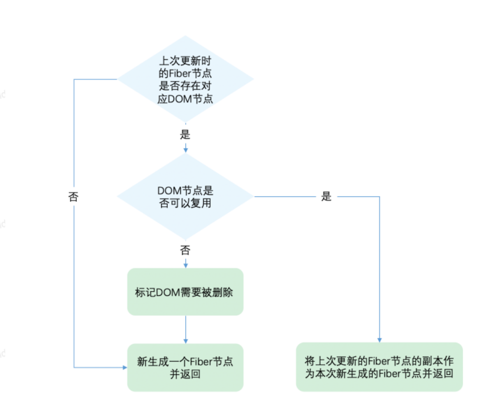
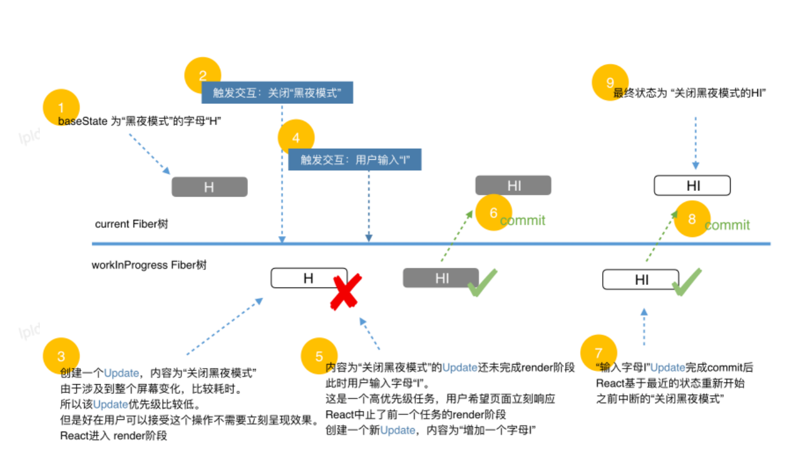

# React核心源码解析2

## diff算法

在render阶段，对于update的组件，他会将当前组件与该组件在上次更新时对应的Fiber节点⽐较（也就是俗称的Diff算法），将⽐较的结果⽣成新Fiber节点。

官⽹对diff算法的介绍：https://zh-hans.reactjs.org/docs/reconciliation.html#the-diffing-algorithm

1. 不同类型的元素：React拆卸原有的树，⽣成新的树

```jsx
<div>
 <Counter />
</div>
<span>
 <Counter />
</span>
```

a. 卸载时：
ⅰ. DOM节点销毁；
ⅱ. 执⾏componentWilUnmount()；
b. 新建时：
ⅰ. 执⾏UNSAFE_componentWillMount()，然后执⾏componentDidMount()；

2. 同一类型的元素

```html
<div className="before" title="stuff" />
<div className="after" title="stuff" />

<div style={{color: 'red', fontWeight: 'bold'}} />
<div style={{color: 'green', fontWeight: 'bold'}}></>
```

a. 保留DOM节点，仅对⽐更新有改变的属性

3. 对⽐同类型的组件元素：

a. 组件更新时，组件实例保持不变，保证state不变，更新组件的props以保证与新的元素⼀致，调⽤UNSAFE_componentWillReceiveProps()、UNSAFE_componentWillUpdate() 以及componentDidUpdate() ⽅法；

b. 调⽤render，执⾏diff
ⅰ. React 同时遍历两个⼦元素的列表；当产⽣差异时，⽣成⼀个 mutation

1. 在⼦元素列表结尾新增
2. 在⼦元素列表头部新增

```jsx
<ul>
 <li>first</li>
 <li>second</li>
</ul>
<ul>
 <li>first</li>
 <li>second</li>
 <li>third</li> // 只需要新增元素即可
</ul>
```

```jsx
<ul>
 <li>Duke</li>
 <li>Villanova</li>
</ul>
// 销毁⼦元素列表，新建新的⼦元素列表，有性能问题
<ul>
 <li>Connecticut</li>
 <li>Duke</li>
 <li>Villanova</li>
</ul>
```

c. 使⽤keys：直接⽐较key值定位，所以key传index也会有性能问题

```jsx
<ul>
 <li key="2015">Duke</li>
 <li key="2016">Villanova</li>
</ul>
<ul>
 <li key="2014">Connecticut</li>
 <li key="2015">Duke</li>
 <li key="2016">Villanova</li>
</ul>
```

d. 官⽹总结：

:::tip
1. 该算法不会尝试匹配不同组件类型的⼦树。如果你发现你在两种不同类型的组件中切换，但输出⾮常相似的内容，建议把它们改成同⼀类型。在实践中，我们没有遇到这类问题；
2. Key 应该具有稳定，可预测，以及列表内唯⼀的特质。不稳定的 key（⽐如通过 Math.random() ⽣成的）会导致许多组件实例和 DOM 节点被不必要地重新创建，这可能导致性能下降和⼦组件中的状态丢失；
:::

结合render和commit阶段，⼀个DOM节点最多有4个节点与之相关：

1. current Fiber。如果该DOM节点已在⻚⾯中，current Fiber代表该DOM节点对应的Fiber节点；
2. workInProgress Fiber。如果该DOM节点将在本次更新中渲染到⻚⾯中，workInProgress Fiber代表该DOM节点对应的Fiber节点；
3. DOM节点本身；
4. JSX对象。即ClassComponent的render⽅法的返回结果，或FunctionComponent的调⽤结果。JSX对象中包含描述DOM节点的信息；

diff算法：对⽐1 4 ⽣成2

### Diff的瓶颈及处理⽅法

diff操作本身也会带来性能损耗，React⽂档中提到，即使在最前沿的算法中，将前后两棵树完全⽐对的算法的复杂程度为 O(n^3)，其中n是树中元素的数量；如果在React中使⽤了该算法，那么展示1000个元素所需要执⾏的计算量将在⼗亿的量级范围。这个开销实在是太过⾼昂；

为了降低算法复杂度，React的diff会预设三个限制：

1. 只对同级元素进⾏diff。如果⼀个DOM节点在前后两次更新中跨越了层级，那么React会忽略；
2. 两个不同类型的元素会产⽣出不同的树。如果元素由div变为p，React会销毁div及其⼦孙节点，并新建p及其⼦孙节点；
3. 开发者可以通过 key prop来暗示哪些⼦元素在不同的渲染下能保持稳定；

### Diff是如何实现的

Diff的⼊⼝函数是reconcileChildFibers：会根据newChild（即JSX对象）类型调⽤不同的处理函数

地址：
https://github.com/facebook/react/blob/1fb18e22ae66fdb1dc127347e169e73948778e5a/packages/react-reconciler/src/ReactChildFiber.new.js#L1280

```js
// 根据newChild类型选择不同diff函数处理
function reconcileChildFibers(
    returnFiber: Fiber,
    currentFirstChild: Fiber | null,
    newChild: any,
): Fiber | null {
    const isObject = typeof newChild === 'object' && newChild !== null;
    if (isObject) {
        // object类型，可能是 REACT_ELEMENT_TYPE 或 REACT_PORTAL_TYPE
        switch (newChild.$$typeof) {
            case REACT_ELEMENT_TYPE:
            // 调⽤ reconcileSingleElement 处理
            // // ...省略其他case
        }
    }
    if (typeof newChild === 'string' || typeof newChild === 'number') {
    // 调⽤ reconcileSingleTextNode 处理
    // ...省略
    }
    if (isArray(newChild)) {
    // 调⽤ reconcileChildrenArray 处理
    // ...省略
    }
    // ⼀些其他情况调⽤处理函数
    // ...省略
    // 以上都没有命中，删除节点
    return deleteRemainingChildren(returnFiber, currentFirstChild);
}
```

根据同级的节点数量将Diff分为两类：

1. 当newChild类型为object、number、string，代表同级只有⼀个节点
2. 当newChild类型为Array，同级有多个节点

### 单节点diff

以类型为object为例，执⾏reconcileSingleElement

```js
const isObject = typeof newChild === 'object' && newChild !== null;
 if (isObject) {
    // 对象类型，可能是 REACT_ELEMENT_TYPE 或 REACT_PORTAL_TYPE
    switch (newChild.$$typeof) {
        case REACT_ELEMENT_TYPE:
        // 调⽤ reconcileSingleElement 处理
        // ...其他case
    }
 }
```

地址：
https://github.com/facebook/react/blob/1fb18e22ae66fdb1dc127347e169e73948778e5a/packages/react-reconciler/src/ReactChildFiber.new.js#L1141

执⾏流程：



```js
function reconcileSingleElement(
    returnFiber: Fiber,
    currentFirstChild: Fiber | null,
    element: ReactElement
): Fiber {
    const key = element.key;
    let child = currentFirstChild;

    // ⾸先判断是否存在对应DOM节点
    while (child !== null) {
        // 上⼀次更新存在DOM节点，接下来判断是否可复⽤
        // ⾸先⽐较key是否相同
        if (child.key === key) {
            // key相同，接下来⽐较type是否相同
            switch (child.tag) {
                // ...省略case

                default: {
                    if (child.elementType === element.type) {
                        // type相同则表示可以复⽤
                        // 返回复⽤的fiber
                        return existing;
                    }

                    // type不同则跳出switch
                    break;
                }
            }
            // 代码执⾏到这⾥代表：key相同但是type不同
            // 将该fiber及其兄弟fiber标记为删除
            deleteRemainingChildren(returnFiber, child);
            break;
        } else {
        // key不同，将该fiber标记为删除
        deleteChild(returnFiber, child);
        }
        child = child.sibling;
    }
    // 创建新Fiber，并返回 ...省略
}
```

1. 先判断key是否相同，如果key相同则判断type是否相同，只有都相同时⼀个DOM节点才能复⽤；
2. 删除逻辑：
a. 当child !== null且key相同且type不同时执⾏deleteRemainingChildren将child及其兄弟fiber都标记删除；
b. 当child !== null且key不同时仅将child标记删除；

```js
// current fiber
ul > li li li
// JSX
ul > p
```

需要根据第⼀个li与p是否相同判断
1. key相同type不同，当前fiber和后续sibling fiber删除；
2. key不同，type也不同，删除当前fiber，前往下⼀个sibling fiber；

```jsx
// 更新前
<div>a</div>
// 更新后
<p>a</p>
// key为null，⼀致，但type不同，不能复⽤
// 更新前
<div key="xxx">a</div>
// 更新后
<div key="ooo">a</div>
// key不同，不需要看type，不能复⽤
// 更新前
<div key="xxx">a</div>
// 更新后
<p key="ooo"a</p>
// key不同，不需要看type，不能复⽤
// 更新前
<div key="xxx">a</div>
// 更新后
<div key="xxx">b</div>
// key type都相同，props中children不同，更新⼦元素
```

### 多节点diff

对于多节点的functionComponent，reconcileChildFibers的newChild参数类型为Array，执⾏reconcileChildrenArray

```js
if (isArray(newChild)) {
 // 调⽤ reconcileChildrenArray 处理
 // ...省略
}
```

同级多个节点的diff，归纳为：
1. 节点更新
2. 节点新增或减少
3. 节点位置变化

```js
// 更新前
<ul>
 <li key="0" className="before">0<li>
 <li key="1">1<li>
</ul>
// 更新后 情况1 —— 节点属性变化
<ul>
 <li key="0" className="after">0<li>
 <li key="1">1<li>
</ul>
// 更新后 情况2 —— 节点类型更新
<ul>
 <div key="0">0</div>
 <li key="1">1<li>
</ul>
```

```js
// 更新前
<ul>
 <li key="0">0<li>
 <li key="1">1<li>
</ul>
// 更新后 情况1 —— 新增节点
<ul>
 <li key="0">0<li>
 <li key="1">1<li>
 <li key="2">2<li>
</ul>
// 更新后 情况2 —— 删除节点
<ul>
 <li key="1">1<li>
</ul>
```

```js
// 更新前
<ul>
 <li key="0">0<li>
 <li key="1">1<li>
</ul>
// 更新后
<ul>
 <li key="1">1<li>
 <li key="0">0<li>
</ul>
```

#### diff思路

1. 针对节点更新

a. 新增：执⾏新增逻辑
b. 删除：执⾏删除逻辑
c. 更新：执⾏更新逻辑

前提：操作优先级⼀样，但实际开发中，React团队发现，相较于新增和删除，更新组件发⽣的频率更⾼。所以Diff会优先判断当前节点是否属于更新

Q：同级⽐较能否使⽤双指针算法提⾼遍历速度？

不可以
待更新对象为JSX，其中newChildren为数组格式，但current fiber 是链表格式，同级的fiber节点是由sibling指针形成的单链表，不⽀持双指针遍历；

:::tip
newChildren[0]与fiber⽐较，newChildren[1]与fiber.sibling⽐较,⽆法针对数组和链表进⾏⽐较，所以不可⾏
:::

react团队提供的思路：2轮遍历

1. 处理 更新 的节点；
2. 处理⾮ 更新 的节点；

#### 第⼀轮遍历

地址：
https://github.com/facebook/react/blob/1fb18e22ae66fdb1dc127347e169e73948778e5a/packages/react-reconciler/src/ReactChildFiber.new.js#L818

1. let i = 0，遍历newChildren，将newChildren[i]与oldFiber⽐较，判断DOM节点是否可复⽤；
2. 如果可复⽤，i++，继续⽐较newChildren[i]与oldFiber.sibling，可以复⽤则继续遍历；
3. 如果不可复⽤，分两种情况：
a. key不同导致不可复⽤，⽴即跳出整个遍历，第⼀轮遍历结束；
b. key相同type不同导致不可复⽤，会将oldFiber标记为DELETION，并继续遍历；
4. 如果newChildren遍历完（即 i === newChildren.length - 1 ）或者oldFiber遍历完（即oldFiber.sibling === null），跳出遍历，第⼀轮遍历结束；

其中，3 4可以完成当前遍历

3：此时newChildren没有遍历完，oldFiber也没有遍历完

```js
// 更新前
<li key="0">0</li>
<li key="1">1</li>
<li key="2">2</li>

// 更新后
<li key="0">0</li>
<li key="2">1</li>
<li key="1">2</li>
// 第⼀个节点可复⽤，遍历到key === 2的节点发现key改变，不可复⽤
// 跳出遍历，等待第⼆轮遍历处理
// oldFiber: key === 1、key === 2未遍历
// newChildren剩下key === 2、key === 1未遍历
```

4：可能newChildren遍历完，或oldFiber遍历完，或他们同时遍历完

```js
// 更新前
<li key="0" className="a">0</li>
<li key="1" className="b">1</li>

// 更新后 情况1 —— newChildren与oldFiber都遍历完
<li key="0" className="aa">0</li>
<li key="1" className="bb">1</li>

// 更新后 情况2 —— newChildren没遍历完，oldFiber遍历完
// newChildren剩下 key==="2" 未遍历
<li key="0" className="aa">0</li>
<li key="1" className="bb">1</li>
<li key="2" className="cc">2</li>

// 更新后 情况3 —— newChildren遍历完，oldFiber没遍历完
// oldFiber剩下 key==="1" 未遍历
<li key="0" className="aa">0</li>
```

#### 第⼆轮遍历

1. newChildren 和 oldFiber 同时遍历完

不需要第⼆轮的遍历，直接进⾏ update，diff结束；

2. newChildren没遍历完，oldFiber遍历完

已有的DOM节点都对⽐结束，这时还有新加⼊的节点，意味着本次更新有新节点插⼊，我们只需要遍历剩下的newChildren为⽣成的workInProgress fiber依次标记Placement；

地址：
https://github.com/facebook/react/blob/1fb18e22ae66fdb1dc127347e169e73948778e5a/packages/react-reconciler/src/ReactChildFiber.new.js#L869

3. newChildren遍历完，oldFiber没遍历完

本次更新⽐之前的节点数量少，有节点被删除了。所以需要遍历剩下的oldFiber，依次标记Deletion；

4. newChildren与oldFiber都没遍历完

意味着有节点更新了位置

#### 如何处理更新后的节点

由于有节点改变了位置，所以不能再⽤位置索引i对⽐前后的节点，那么如何才能将同⼀个节点在两次更新中对应上呢--key

为了快速的找到key对应的oldFiber，我们将所有还未处理的oldFiber存⼊以key为key，oldFiber为value的Map中

```js
const existingChildren = mapRemainingChildren(returnFiber, oldFiber);
```

接下来遍历剩余的newChildren，通过newChildren[i].key就能在existingChildren中找到key相同的oldFiber

#### 标记节点是否移动

如何判断节点是否移动？参照物是什么？

我们的参照物是：最后⼀个可复⽤的节点在oldFiber中的位置索引（⽤变量lastPlacedIndex表示）。

本次更新中节点是按newChildren的顺序排列。在遍历newChildren过程中，每个遍历到的可复⽤节点⼀定是当前遍历到的所有可复⽤节点中最靠右的那个，即⼀定在lastPlacedIndex对应的可复⽤的节点在本次更新中位置的后⾯；

所以只需要⽐较遍历到的可复⽤节点在上次更新时是否也在lastPlacedIndex对应的oldFiber后⾯，就能知道两次更新中这两个节点的相对位置改变没有；

我们⽤变量oldIndex表示遍历到的可复⽤节点在oldFiber中的位置索引。如果oldIndex < lastPlacedIndex，代表本次更新该节点需要向右移动；

lastPlacedIndex初始为0，每遍历⼀个可复⽤的节点，如果oldIndex >= lastPlacedIndex，则lastPlacedIndex = oldIndex；

#### demo

每个字⺟代表⼀个节点，字⺟的值代表节点的key

demo 1

```text
// 之前
abcd
// 之后
acdb
===第⼀轮遍历开始===
a（之后）vs a（之前）
key不变，可复⽤
此时 a 对应的oldFiber（之前的a）在之前的数组（abcd）中索引为0
所以 lastPlacedIndex = 0;
继续第⼀轮遍历...
c（之后）vs b（之前）
key改变，不能复⽤，跳出第⼀轮遍历
此时 lastPlacedIndex === 0;
===第⼀轮遍历结束===
===第⼆轮遍历开始===
newChildren === cdb，没⽤完，不需要执⾏删除旧节点
oldFiber === bcd，没⽤完，不需要执⾏插⼊新节点
将剩余oldFiber（bcd）保存为map
// 当前oldFiber：bcd
// 当前newChildren：cdb
继续遍历剩余newChildren
key === c 在 oldFiber中存在
const oldIndex = c（之前）.index;
此时 oldIndex === 2; // 之前节点为 abcd，所以c.index === 2
⽐较 oldIndex 与 lastPlacedIndex;
如果 oldIndex >= lastPlacedIndex 代表该可复⽤节点不需要移动
并将 lastPlacedIndex = oldIndex;
如果 oldIndex < lastplacedIndex 该可复⽤节点之前插⼊的位置索引⼩于这次更新需要插⼊
的位置索引，代表该节点需要向右移动
在例⼦中，oldIndex 2 > lastPlacedIndex 0，
则 lastPlacedIndex = 2;
c节点位置不变
继续遍历剩余newChildren

// 当前oldFiber：bd
// 当前newChildren：db
key === d 在 oldFiber中存在
const oldIndex = d（之前）.index;
oldIndex 3 > lastPlacedIndex 2 // 之前节点为 abcd，所以d.index === 3
则 lastPlacedIndex = 3;
d节点位置不变
继续遍历剩余newChildren
// 当前oldFiber：b
// 当前newChildren：b
key === b 在 oldFiber中存在
const oldIndex = b（之前）.index;
oldIndex 1 < lastPlacedIndex 3 // 之前节点为 abcd，所以b.index === 1
则 b节点需要向右移动
===第⼆轮遍历结束===
最终acd 3个节点都没有移动，b节点被标记为移动
```

demo 2

```text
// 之前
abcd
// 之后
dabc
===第⼀轮遍历开始===
d（之后）vs a（之前）
key改变，不能复⽤，跳出遍历
===第⼀轮遍历结束===
===第⼆轮遍历开始===
newChildren === dabc，没⽤完，不需要执⾏删除旧节点
oldFiber === abcd，没⽤完，不需要执⾏插⼊新节点
将剩余oldFiber（abcd）保存为map
继续遍历剩余newChildren
// 当前oldFiber：abcd
// 当前newChildren dabc
key === d 在 oldFiber中存在
const oldIndex = d（之前）.index;
此时 oldIndex === 3; // 之前节点为 abcd，所以d.index === 3
⽐较 oldIndex 与 lastPlacedIndex;
oldIndex 3 > lastPlacedIndex 0
则 lastPlacedIndex = 3;
d节点位置不变
继续遍历剩余newChildren
// 当前oldFiber：abc
// 当前newChildren abc
key === a 在 oldFiber中存在
const oldIndex = a（之前）.index; // 之前节点为 abcd，所以a.index === 0
此时 oldIndex === 0;
⽐较 oldIndex 与 lastPlacedIndex;
oldIndex 0 < lastPlacedIndex 3
则 a节点需要向右移动
继续遍历剩余newChildren
// 当前oldFiber：bc
// 当前newChildren bc
key === b 在 oldFiber中存在
const oldIndex = b（之前）.index; // 之前节点为 abcd，所以b.index === 1
此时 oldIndex === 1;
⽐较 oldIndex 与 lastPlacedIndex;
oldIndex 1 < lastPlacedIndex 3
则 b节点需要向右移动
继续遍历剩余newChildren
// 当前oldFiber：c
// 当前newChildren c
key === c 在 oldFiber中存在
const oldIndex = c（之前）.index; // 之前节点为 abcd，所以c.index === 2
此时 oldIndex === 2;
⽐较 oldIndex 与 lastPlacedIndex;
oldIndex 2 < lastPlacedIndex 3
则 c节点需要向右移动
===第⼆轮遍历结束===
```

所以，尽量减少节点从后⾯移动到前⾯的操作
1. abcd -> acdb：b移动到最右边
2. abcd -> dabc：abc移动到最右边

## 状态更新

### 概览

梳理下⼏个关键的节点：
1. render阶段的开始
开始于 performSyncWorkOnRoot 或 performConcurrentWorkOnRoot ⽅法的调⽤。这取决于本次更新是同步更新还是异步更新，render结束完后会进⼊commit
2. commit阶段的开始
开始于 commitRoot ⽅法的调⽤。其中rootFiber会作为传参
此时，状态为

```text
触发状态更新（根据场景调⽤不同⽅法）
 |
 |
 v
 ？
 |
 |
 v
render阶段（`performSyncWorkOnRoot` 或 `performConcurrentWorkOnRoot`）
 |
 |
 v
commit阶段（`commitRoot`）
```

### 创建update对象

在react⾥，触发状态更新的操作包括：
- ReactDOM.render
- this.setState
- this.forceUpdate
- useState
- useReducer

Q：如何在调⽤场景不同的情况下，接⼊同⼀套状态管理机制？
在每次状态更新，都会创建保存⼀个更新状态相关的对象，称为Update，在render的beginwork中会根据Update得到新的state

### 从fiber到root

render阶段是从rootFiber开始向下遍历。那么如何从触发状态更新的fiber得到rootFiber呢？

调⽤markUpdateLaneFromFiberToRoot⽅法。

地址：
https://github.com/facebook/react/blob/1fb18e22ae66fdb1dc127347e169e73948778e5a/packages/react-reconciler/src/ReactFiberWorkLoop.new.js#L636

该⽅法做的⼯作可以概括为：从触发状态更新的fiber⼀直向上遍历到rootFiber，并返回rootFiber。

### 调度更新

现在有⼀个rootFiber，该rootFiber对应的Fiber树中某个Fiber节点包含⼀个Update。
接下来通知Scheduler根据更新的优先级，决定以同步还是异步的⽅式调度本次更新。
这⾥调⽤的⽅法是ensureRootIsScheduled

地址：
https://github.com/facebook/react/blob/b6df4417c79c11cfb44f965fab55b573882b1d54/packages/react-reconciler/src/ReactFiberWorkLoop.new.js#L602

ensureRootIsScheduled核⼼代码：

```js
if (newCallbackPriority === SyncLanePriority) {
    // 任务已经过期，需要同步执⾏render阶段
    newCallbackNode = scheduleSyncCallback(
        performSyncWorkOnRoot.bind(null, root)
    );
    } else {
    // 根据任务优先级异步执⾏render阶段
    var schedulerPriorityLevel = lanePriorityToSchedulerPriority(
        newCallbackPriority
    );
    newCallbackNode = scheduleCallback(
        schedulerPriorityLevel,
        performConcurrentWorkOnRoot.bind(null, root)
    );
}
```

⾄此，状态更新的流程已经通了

```text
触发状态更新（根据场景调⽤不同⽅法）
 |
 |
 v
创建Update对象（后⾯详解）
 |
 |
 v
从fiber到root（`markUpdateLaneFromFiberToRoot`）
 |
 |
 v
调度更新（`ensureRootIsScheduled`）
 |
 |
 v
render阶段（`performSyncWorkOnRoot` 或 `performConcurrentWorkOnRoot`）
 |
 |
 v
commit阶段（`commitRoot`）
```

### Update

通过代码版本控制类⽐

1. 同步更新

在没有代码版本控制前，我们在代码中逐步叠加功能。⼀切看起来井然有序，直到我们遇到了⼀个紧急线上bug（红⾊节点）

如果要修改，需要先将之前的代码提交；
所有通过ReactDOM.render创建的应⽤都是通过类似的⽅式更新状态，没有优先级，⾼优先级需要排在其他更新的后⾯

2. 并发更新

如果有了代码版本控制，需要发布urgent变更，暂存当前已有的修改，在master上直接修复

修复后使⽤ git rebase 和分⽀连接，当前开发的分⽀是基于修复bug的最新的master分⽀

在React中，通过ReactDOM.createBlockingRoot和ReactDOM.createRoot创建的应⽤会采⽤并发的⽅式更新状态；
⾼优更新（红⾊节点）中断正在进⾏中的低优更新（蓝⾊节点），先完成render - commit流程；
待⾼优更新完成后，低优更新基于⾼优更新的结果重新更新；

#### update的分类

触发⽅法 组件
ReactDOM.render HostRoot
this.setState ClassComponent
this.forceUpdate ClassComponent
useState FunctionComponent
useReducer FunctionComponent

|  触发方法    | 组件 | 
| ---- | ---- | 
| ReactDOM.render | HostRoot |
| this.setState | ClassComponent | 
| this.forceUpdate | ClassComponent | 
| useState | FunctionComponent | 
| useReducer | FunctionComponent | 

共有三种组件⽀持Update：HostRoot 、ClassComponent、FunctionComponent，其中，ClassComponent与HostRoot共⽤⼀套Update结构，FunctionComponent单独使⽤⼀种Update结构

虽然他们的结构不同，但是⼯作机制与⼯作流程⼤体相同。在本节我们介绍前⼀种Update，FunctionComponent对应的Update在后⾯讲解

#### Update结构

ClassComponent与HostRoot（即rootFiber.tag对应类型）共⽤同⼀种Update结构

```js
const update: Update<*> = {
    eventTime,
    lane,
    suspenseConfig,
    tag: UpdateState,
    payload: null,
    callback: null,
    next: null,
};
```
- eventTime：任务时间，通过performance.now()获取的毫秒数；
- lane：优先级相关字段；
- suspenseConfig：Suspense相关；
- tag：更新的类型，包括UpdateState | ReplaceState | ForceUpdate | CaptureUpdate；
- payload：更新挂载的数据，不同类型组件挂载的数据不同。对于ClassComponent，payload为
- this.setState的第⼀个传参。对于HostRoot，payload为ReactDOM.render的第⼀个传参；
- callback：commit layout中⽀持的回调函数。
- next：与其他Update连接形成链表。

#### Update与Fiber联系

Fiber节点组成Fiber树，⻚⾯中最多同时存在两棵Fiber树：
- 代表当前⻚⾯状态的current Fiber树
- 代表正在render阶段的workInProgress Fiber树
类似Fiber节点组成Fiber树，Fiber节点上的多个Update会组成链表并被包含在fiber.updateQueue中。

Q：什么情况下，⼀个Fiber节点会有多个Update

```js
onClick() {
    this.setState({
        a: 1
    })
    this.setState({
        b: 2
    })
}
```

Fiber节点最多同时存在两个updateQueue：
current fiber保存的updateQueue即current updateQueue
workInProgress fiber保存的updateQueue即workInProgress updateQueue

在commit阶段完成⻚⾯渲染后，workInProgress Fiber树变为current Fiber树，workInProgress Fiber树内Fiber节点的updateQueue就变成current updateQueue

#### updateQueue

updateQueue有三种类型，其中针对HostComponent的类型在completeWork⾥讲过。
剩下两种类型和Update的两种类型对应
ClassComponent与HostRoot使⽤的UpdateQueue结构如下：

```js
const queue: UpdateQueue<State> = {
    baseState: fiber.memoizedState,
    firstBaseUpdate: null,
    lastBaseUpdate: null,
    shared: {
        pending: null,
    },
    effects: null,
};
```

- baseState：本次更新前该Fiber节点的state，Update基于该state计算更新后的state，可以将baseState类⽐⼼智模型中的master分⽀；
- firstBaseUpdate与lastBaseUpdate：本次更新前该Fiber节点已保存的Update。以链表形式存在，链表头为firstBaseUpdate，链表尾为lastBaseUpdate。之所以在更新产⽣前该Fiber节点内就存在Update，是由于某些Update优先级较低所以在上次render阶段由Update计算state时被跳过，可以将baseUpdate类⽐⼼智模型中执⾏git rebase基于的commit（节点D）；
- shared.pending：触发更新时，产⽣的Update会保存在shared.pending中形成单向环状链表。当由Update计算state时这个环会被剪开并连接在lastBaseUpdate后⾯，可以将shared.pending类⽐⼼智模型中本次需要提交的commit（节点ABC）。
- effects：数组。保存update.callback !== null的Update；

#### demo

假设有⼀个fiber刚经历commit阶段完成渲染。
该fiber上有两个由于优先级过低所以在上次的render阶段并没有处理的Update。他们会成为下次更新的baseUpdate。

我们称其为u1和u2，其中u1.next === u2。
```js
fiber.updateQueue.firstBaseUpdate === u1;
fiber.updateQueue.lastBaseUpdate === u2;
u1.next === u2;
```

我们⽤-->表示链表的指向：

```js
fiber.updateQueue.baseUpdate: u1 --> u2
```

现在我们在fiber上触发两次状态更新，这会先后产⽣两个新的Update，我们称为u3和u4。每个 update 都会插⼊到 updateQueue 队列上
当插⼊u3后：

```js
fiber.updateQueue.shared.pending === u3;
u3.next === u3;
```

shared.pending的环状链表，⽤图表示为：

```js
fiber.updateQueue.shared.pending: u3 ─────┐
                                    ^     |

                                    └──────┘
```

接着插⼊u4之后：

```js
fiber.updateQueue.shared.pending = u4;
u4.next === u3;
u3.next === u4;
```

shared.pending是环状链表，⽤图表示为：

```js
fiber.updateQueue.shared.pending: u4 ──> u3
                                    ^      |

                                    └──────┘
```

shared.pending 会保证始终指向最后⼀个插⼊的update
更新调度完成后进⼊render阶段
此时shared.pending的环被剪开并连接在updateQueue.lastBaseUpdate后⾯：

```js
fiber.updateQueue.baseUpdate: u1 --> u2 --> u3 --> u4
```

接下来遍历updateQueue.baseUpdate链表，以fiber.updateQueue.baseState为初始state，依次与遍历到的每个Update计算并产⽣新的state；

在遍历时如果有优先级低的Update会被跳过；
当遍历完成后获得的state，就是该Fiber节点在本次更新的state

state的变化在render阶段产⽣与上次更新不同的JSX对象，通过Diff算法产⽣effectTag，在commit阶段渲染在⻚⾯上，同时，渲染完成后workInProgress Fiber树变为current Fiber树，整个更新流程结束。

## 深入理解优先级

### 什么是优先级

状态更新由⽤户交互产⽣，⽤户⼼⾥对交互执⾏顺序有个预期。React根据⼈机交互研究的结果中⽤户对交互的预期顺序为交互产⽣的状态更新赋予不同优先级

- ⽣命周期⽅法：同步执⾏；
- 受控的⽤户输⼊：⽐如输⼊框内输⼊⽂字，同步执⾏；
- 交互事件：⽐如动画，⾼优先级执⾏；
- 其他：⽐如数据请求，低优先级执⾏；

### 如何调度优先级

React会调⽤Scheduler提供的⽅法runWithPriority，该⽅法接收⼀个优先级常量与⼀个回调函数作为参数。回调函数会以优先级⾼低为顺序排列在⼀个定时器中并在合适的时间触发。

unstable_runWithPriority地址：
https://github.com/facebook/react/blob/970fa122d8188bafa600e9b5214833487fbf1092/packages/scheduler/src/Scheduler.js#L217

scheduler优先级常量定义地址：
https://github.com/facebook/react/blob/970fa122d8188bafa600e9b5214833487fbf1092/packages/scheduler/src/SchedulerPriorities.js

### demo



以上有两个Update。我们将“关闭⿊夜模式”产⽣的Update称为u1，输⼊字⺟“I”产⽣的Update称为u2其中u1先触发并进⼊render阶段。其优先级较低，执⾏时间较⻓。此时：

```js
fiber.updateQueue = {
    baseState: {
        blackTheme: true,
        text: 'H'
    },
    firstBaseUpdate: null,
    lastBaseUpdate: null
    shared: {
        pending: u1
    },
    effects: null
};
```

在u1完成render阶段前⽤户通过键盘输⼊字⺟“I”，产⽣了u2。u2属于受控的⽤户输⼊，优先级⾼于u1，于是中断u1产⽣的render阶段。

```js
fiber.updateQueue.shared.pending === u2 ----> u1
                                    ^        |
                                    |________|
// 即
u2.next === u1;
u1.next === u2;
```

其中u2优先级⾼于u1。
接下来进⼊u2产⽣的render阶段。
在 processUpdateQueue ⽅法中，shared.pending环状链表会被剪开并拼接在baseUpdate后⾯。需要明确⼀点，shared.pending指向最后⼀个pending的update，所以实际执⾏时update的顺序为：
u1 -- u2

接下来遍历baseUpdate，处理优先级合适的Update（这⼀次处理的是更⾼优的u2）；
由于u2不是baseUpdate中的第⼀个update，在其之前的u1由于优先级不够被跳过；
update之间可能有依赖关系，所以被跳过的update及其后⾯所有update会成为下次更新的baseUpdate。（即u1 -- u2）;
最终u2完成render - commit阶段；

```js
fiber.updateQueue = {
    baseState: {
    blackTheme: true,
        text: 'HI'
    },
    firstBaseUpdate: u1,
    lastBaseUpdate: u2
    shared: {
        pending: null
    },
    effects: null
};
```

在commit阶段结尾会再调度⼀次更新。在该次更新中会基于baseState中firstBaseUpdate保存的u1，开启⼀次新的render阶段。

```js
fiber.updateQueue = {
    baseState: {
        blackTheme: false,
        text: 'HI'
    },
    firstBaseUpdate: null,
    lastBaseUpdate: null
    shared: {
        pending: null
    },
    effects: null
};
```

可以看到，u2执⾏了2次，相对应的render阶段的⽣命周期 componentWillXXX也会执⾏2次，这就是为什么这些⽣命周期会被标记为unsafe_；

Q：render阶段可能会被中断，如何保证 updateQueue 中的Update不会丢失？

在render阶段，shared.pending的环被剪开并连接在updateQueue.lastBaseUpdate后⾯。实际上shared.pending会被同时连接在workInProgress updateQueue.lastBaseUpdate与currentupdateQueue.lastBaseUpdate后⾯。
当render阶段被中断后重新开始时，会基于current updateQueue克隆出workInProgressupdateQueue。由于current updateQueue.lastBaseUpdate已经保存了上⼀次的Update，所以不会丢失
当commit阶段完成渲染，由于workInProgress updateQueue.lastBaseUpdate中保存了上⼀次的Update，所以 workInProgress Fiber树变成current Fiber树后也不会造成Update丢失

Q：如何保证状态依赖的连续性？

当某个Update由于优先级低⽽被跳过时，保存在baseUpdate中的不仅是该Update，还包括链表中该Update之后的所有Update。

考虑如下例⼦：

```js
baseState: ''
shared.pending: A1 --> B2 --> C1 --> D2
```

其中字⺟代表该Update要在⻚⾯插⼊的字⺟，数字代表优先级，值越低优先级越⾼。
第⼀次render，优先级为1。

```js
baseState: ''
baseUpdate: null
render阶段使⽤的Update: [A1, C1]
memoizedState: 'AC'
```

其中B2由于优先级为2，低于当前优先级，所以他及其后⾯的所有Update会被保存在baseUpdate中作为下次更新的Update（即B2 C1 D2）。

这么做是为了保持状态的前后依赖顺序。
第⼆次render，优先级为2。

```js
baseState: 'A'
baseUpdate: B2 --> C1 --> D2
render阶段使⽤的Update: [B2, C1, D2]
memoizedState: 'ABCD'
```

此时，React能保证最终的状态⼀定和⽤户触发的交互⼀致，但是中间过程状态⽆法保证

###  ReactDOM.render执行流程

⾸次执⾏ReactDOM.render会创建fiberRootNode和rootFiber。其中fiberRootNode是整个应⽤的根节点，rootFiber是要渲染组件所在组件树的根节点

```js
// container指ReactDOM.render的第⼆个参数（即应⽤挂载的DOM节点）
root = container._reactRootContainer = legacyCreateRootFromDOMContainer(
    container,
    forceHydrate,
);
fiberRoot = root._internalRoot;
```

地址：
https://github.com/facebook/react/blob/1fb18e22ae66fdb1dc127347e169e73948778e5a/packages/react-dom/src/client/ReactDOMLegacy.js#L193

legacyCreateRootFromDOMContainer⽅法内部会调⽤createFiberRoot⽅法完成fiberRootNode和rootFiber的创建以及关联。并初始化updateQueue

```js
export function createFiberRoot(
    containerInfo: any,
    tag: RootTag,
    hydrate: boolean,
    hydrationCallbacks: null | SuspenseHydrationCallbacks,
): FiberRoot {
    // 创建fiberRootNode
    const root: FiberRoot = (new FiberRootNode(containerInfo, tag, hydrate):
    any);

    // 创建rootFiber
    const uninitializedFiber = createHostRootFiber(tag);
    // 连接rootFiber与fiberRootNode
    root.current = uninitializedFiber;
    uninitializedFiber.stateNode = root;
    // 初始化updateQueue
    initializeUpdateQueue(uninitializedFiber);
    return root;
}
```

### 创建Update

地址：
https://github.com/facebook/react/blob/1fb18e22ae66fdb1dc127347e169e73948778e5a/packages/react-reconciler/src/ReactFiberReconciler.new.js#L255

```js
export function updateContainer(
    element: ReactNodeList,
    container: OpaqueRoot,
    parentComponent: ?React$Component<any, any>,
    callback: ?Function,
): Lane {
    // ...省略与逻辑不相关代码
    // 创建update
    const update = createUpdate(eventTime, lane, suspenseConfig);

    // update.payload为需要挂载在根节点的组件
    update.payload = {element};
    // callback为ReactDOM.render的第三个参数 —— 回调函数
    callback = callback === undefined ? null : callback;
    if (callback !== null) {
        update.callback = callback;
    }
    // 将⽣成的update加⼊updateQueue
    enqueueUpdate(current, update);
    // 调度更新
    scheduleUpdateOnFiber(current, lane, eventTime);
    // ...省略与逻辑不相关代码
}
```

所以完整流程为：

```text
创建fiberRootNode、rootFiber、updateQueue（`legacyCreateRootFromDOMContainer
`）
 |
 |
 v
创建Update对象（`updateContainer`）
 |
 |
 v
从fiber到root（`markUpdateLaneFromFiberToRoot`）
 |
 |
 v
调度更新（`ensureRootIsScheduled`）
 |
 |
 v
render阶段（`performSyncWorkOnRoot` 或 `performConcurrentWorkOnRoot`）
 |
 |
 v
commit阶段（`commitRoot`）
```

### React其他⼊⼝函数

当前React共有三种模式：
- legacy，这是当前React使⽤的⽅式。当前没有计划删除本模式，但是这个模式可能不⽀持⼀些新功能；
- blocking，开启部分concurrent模式特性的中间模式。⽬前正在实验中。作为迁移到concurrent模式的第⼀个步骤；
- concurrent，⾯向未来的开发模式。我们之前讲的任务中断/任务优先级都是针对concurrent模式；

基于此原因，可以通过不同的⼊⼝函数开启不同模式：
- legacy -- ReactDOM.render(/<App //>, rootNode)
- blocking -- ReactDOM.createBlockingRoot(rootNode).render(/<App //>)
- concurrent -- ReactDOM.createRoot(rootNode).render(/<App //>)

### this.setState

this.setState 会调⽤this.updater.enqueueSetState

地址：
https://github.com/facebook/react/blob/1fb18e22ae66fdb1dc127347e169e73948778e5a/packages/react/src/ReactBaseClasses.js#L57

```js
Component.prototype.setState = function (partialState, callback) {
    if (!(typeof partialState === 'object' || typeof partialState === 'function' || partialState == null)) {
        {
            throw Error( "setState(...): takes an object of state variables to update or a function which returns an object of state variables." );
        }
    }
    this.updater.enqueueSetState(this, partialState, callback, 'setState');
};
```

enqueueSetState就是我们从创建update到调度update

```js
enqueueSetState(inst, payload, callback) {
    // 通过组件实例获取对应fiber
    const fiber = getInstance(inst);
    const eventTime = requestEventTime();
    const suspenseConfig = requestCurrentSuspenseConfig();
    // 获取优先级
    const lane = requestUpdateLane(fiber, suspenseConfig);
    // 创建update
    const update = createUpdate(eventTime, lane, suspenseConfig);
    update.payload = payload;
    // 赋值回调函数
    if (callback !== undefined && callback !== null) {
        update.callback = callback;
    }
    // 将update插⼊updateQueue
    enqueueUpdate(fiber, update);
    // 调度update
    scheduleUpdateOnFiber(fiber, lane, eventTime);
}
```

#### this.forceUpdate

在this.updater上，除了enqueueSetState外，还存在enqueueForceUpdate，在this.forceUpdate时调⽤；

```js
enqueueForceUpdate(inst, callback) {
    const fiber = getInstance(inst);
    const eventTime = requestEventTime();
    const suspenseConfig = requestCurrentSuspenseConfig();
    const lane = requestUpdateLane(fiber, suspenseConfig);
    const update = createUpdate(eventTime, lane, suspenseConfig);
    // 赋值tag为ForceUpdate
    update.tag = ForceUpdate;
    if (callback !== undefined && callback !== null) {
        update.callback = callback;
    }
    enqueueUpdate(fiber, update);
    scheduleUpdateOnFiber(fiber, lane, eventTime);
};
```

此时，当某次更新含有tag为ForceUpdate的Update，那么当前ClassComponent不会受其他性能优化⼿段（shouldComponentUpdate|PureComponent）影响，⼀定会更新。

## 极简hook实现

```js
function App() {
    const [num, updateNum] = useState(0);
    return <p onClick={() => updateNum(num => num + 1)}>{num}</p>;
}
```

1. 通过⼀些途径产⽣更新，更新会造成组件render--updateNum；
2. 组件render时useState返回的num为更新后的结果；


其中步骤1的更新可以分为mount和update：

1. 调⽤ReactDOM.render会产⽣mount的更新，更新内容为useState的initialValue（即0）。
2. 点击p标签触发updateNum会产⽣⼀次update的更新，更新内容为num => num + 1。

### 更新是什么

通过⼀些途径产⽣更新，更新会造成组件render

```js
const update = {
    // 更新执⾏的函数
    action,
    // 与同⼀个Hook的其他更新形成链表
    next: null
}
```

### update的数据结构

加⼊有多个update，如何组合起来

```jsx
// 之前
return <p onClick={() => updateNum(num => num + 1)}>{num}</p>;
// 之后
return <p onClick={() => {
 updateNum(num => num + 1);
 updateNum(num => num + 1);
 updateNum(num => num + 1);
}}>{num}</p>;
```

通过环形单向链表
调⽤updateNum实际上是dispatchAction.bind(null, hook.queue)

```js
function dispatchAction(queue, action) {
    // 创建update
    const update = {
    action,
        next: null
    }
    // 环状单向链表操作
    if (queue.pending === null) {
        update.next = update;
    } else {
        update.next = queue.pending.next;
        queue.pending.next = update;
    }
    queue.pending = update;
    // 模拟React开始调度更新
    schedule();
}
```

当产⽣第⼀个update（我们叫他u0），此时queue.pending === null。
update.next = update;即u0.next = u0，他会和⾃⼰⾸尾相连形成单向环状链表。
然后queue.pending = update;即queue.pending = u0

```jsx
queue.pending = u0 ----->
                ^       |
                |       |
                ---------

```

当产⽣第⼆个update（我们叫他u1），update.next = queue.pending.next;，此时queue.pending.next === u0， 即u1.next = u0。
queue.pending.next = update;，即u0.next = u1。然后queue.pending = update;即queue.pending = u1

```jsx
queue.pending = u1 ---> u0
                ^       |
                |       |
                ---------
```

queue.pending始终指向最后⼀个插⼊的update

### 状态如何保存

更新产⽣的update对象会保存在queue中。
不同于ClassComponent的实例可以存储数据
对于FunctionComponent，queue存储对应的fiber中

```jsx
// App组件对应的fiber对象
const fiber = {
    // 保存该FunctionComponent对应的Hooks链表
    memoizedState: null,
    // 指向App函数
    stateNode: App
};
```

### Hooks数据结构

```js
hook = {
    // 保存update的queue，即上⽂介绍的queue
    queue: {
        pending: null
    },
    // 保存hook对应的state
    memoizedState: initialState,
    // 与下⼀个Hook连接形成单向⽆环链表
    next: null
}
```

Q：update与hook的关系
每个useState对应⼀个hook对象。

调⽤const [num, updateNum] = useState(0);时updateNum（即上⽂介绍的dispatchAction）产⽣的update保存在useState对应的hook.queue中

### 模拟react调度更新流程

实现通过操作产⽣更新，更新造成组件render

```jsx
function dispatchAction(queue, action) {
    // ...创建update

    // ...环状单向链表操作
    // 模拟React开始调度更新
    schedule();
}
// 模拟调度
// ⾸次render时是mount
isMount = true;
function schedule() { 
    // 更新前将workInProgressHook重置为fiber保存的第⼀个Hook
    workInProgressHook = fiber.memoizedState;
    // 触发组件render
    fiber.stateNode();
    // 组件⾸次render为mount，以后再触发的更新为update
    isMount = false;
}
// 每当遇到下⼀个useState，我们移动workInProgressHook的指针
workInProgressHook = workInProgressHook.next;
// 保证了每次组件render时useState的调⽤顺序及数量保持⼀致
// 可以通过workInProgressHook找到当前useState对应的hook对象。
```

### 计算state

组件render时，useState返回的值为更新后的结果，即⼀个完整的useState

```js
function useState(initialState) {
    // 当前useState使⽤的hook会被赋值该该变量
    let hook;
    if (isMount) {
        hook = {
            queue: {
                pending: null
            },
            memoizedState: initialState,
            next: null
        }
        // 将hook插⼊fiber.memoizedState链表末尾
        if (!fiber.memoizedState) {
            fiber.memoizedState = hook;
        } else {
            workInProgressHook.next = hook;
        }
        // 移动workInProgressHook指针
        workInProgressHook = hook;
    } else {
        // update时找到对应hook
        hook = workInProgressHook;
        // 移动workInProgressHook指针
        workInProgressHook = workInProgressHook.next;
    }
    let baseState = hook.memoizedState;
    if (hook.queue.pending) {
    // 获取update环状单向链表中第⼀个update
    let firstUpdate = hook.queue.pending.next;

    do {
        // 执⾏update action
        const action = firstUpdate.action;
        baseState = action(baseState);
        firstUpdate = firstUpdate.next;

    // 最后⼀个update执⾏完后跳出循环
    } while (firstUpdate !== hook.queue.pending.next)

        // 清空queue.pending
        hook.queue.pending = null;
    }
    hook.memoizedState = baseState;
    return [baseState, dispatchAction.bind(null, hook.queue)];
}
```

## Hooks数据结构

### dispatcher

上⽂中，useState使⽤isMount区分mount和update
在真实的Hooks中，组件mount时的hook与update时的hook来源于不同的对象，这类对象在源码中被称为dispatcher

```jsx
// mount时的Dispatcher
const HooksDispatcherOnMount: Dispatcher = {
    useCallback: mountCallback,
    useContext: readContext,
    useEffect: mountEffect,
    useImperativeHandle: mountImperativeHandle,
    useLayoutEffect: mountLayoutEffect,
    useMemo: mountMemo,
    useReducer: mountReducer,
    useRef: mountRef,
    useState: mountState,
    // ...省略
};
// update时的Dispatcher
const HooksDispatcherOnUpdate: Dispatcher = {
    useCallback: updateCallback,
    useContext: readContext,
    useEffect: updateEffect,
    useImperativeHandle: updateImperativeHandle,
    useLayoutEffect: updateLayoutEffect,
    useMemo: updateMemo,
    useReducer: updateReducer,
    useRef: updateRef,
    useState: updateState,
    // ...省略
};
```

mount时调⽤的hook和update时调⽤的hook其实是两个不同的函数。

在FunctionComponent render前，会根据FunctionComponent对应fiber的以下条件区分mount与update

```js
current === null || current.memoizedState === null
```

并将不同情况对应的dispatcher赋值给全局变量ReactCurrentDispatcher的current属性

```js
ReactCurrentDispatcher.current =
 current === null || current.memoizedState === null
 ? HooksDispatcherOnMount
 : HooksDispatcherOnUpdate; 
```

地址：
https://github.com/acdlite/react/blob/1fb18e22ae66fdb1dc127347e169e73948778e5a/packages/react-reconciler/src/ReactFiberHooks.new.js#L409

### dispatch异常场景

```js
useEffect(() => {
 useState(0);
})
```

实际上，ReactCurrentDispatcher.current已经指向ContextOnlyDispatcher，所以调⽤useState实际会调⽤throwInvalidHookError，直接抛出异常

```js
export const ContextOnlyDispatcher: Dispatcher = {
    useCallback: throwInvalidHookError,
    useContext: throwInvalidHookError,
    useEffect: throwInvalidHookError,
    useImperativeHandle: throwInvalidHookError,
    useLayoutEffect: throwInvalidHookError,
 // ...省略
}
```

地址：
https://github.com/acdlite/react/blob/1fb18e22ae66fdb1dc127347e169e73948778e5a/packages/react-reconciler/src/ReactFiberHooks.new.js#L458

### Hook数据结构

```jsx
const hook: Hook = {
    memoizedState: null,
    baseState: null,
    baseQueue: null,
    queue: null,
    next: null,
};
```

除了memoizedState，其余与updateQueue⼀致
useState：对于const [state, updateState] = useState(initialState)，memoizedState保存state的值
useReducer：对于const [state, dispatch] = useReducer(reducer, {});，memoizedState保存state的值
useEffect：memoizedState保存包含useEffect回调函数、依赖项等的链表数据结构effect。effect
链表同时会保存在fiber.updateQueue中
useRef：对于useRef(1)，memoizedState保存{current: 1}
useMemo：对于useMemo(callback, [depA])，memoizedState保存[callback(), depA]
useCallback：对于useCallback(callback, [depA])，memoizedState保存[callback, depA]。与useMemo的区别是，useCallback保存的是callback函数本身，⽽useMemo保存的是callback函数的执⾏结果
有些hook是没有memoizedState的，⽐如：
useContext

### useState与useReducer

useState和useReducer是Redux作者加⼊React后的⼀个核⼼贡献：将Redux的思想带⼊到React⾥本质来说，useState只是预置了reducer的useReducer

#### 概览

```jsx
function App() {
    const [state, dispatch] = useReducer(reducer, {a: 1});
    const [num, updateNum] = useState(0);

    return (
        <div>
        <button onClick={() => dispatch({type: 'a'})}>{state.a}</button>
        <button onClick={() => updateNum(num => num + 1)}>{num}</button>
        </div>
    )
}
```

- 声明阶段即App调⽤时，会依次执⾏useReducer与useState⽅法
- 调⽤阶段即点击按钮后，dispatch或updateNum被调⽤时

#### 声明阶段

当FunctionComponent进⼊render阶段的beginWork时，会调⽤renderWithHooks⽅法该⽅法内部会执⾏FunctionComponent对应函数（即fiber.type）

```js
function useState(initialState) {
    var dispatcher = resolveDispatcher();
    return dispatcher.useState(initialState);
}
function useReducer(reducer, initialArg, init) {
    var dispatcher = resolveDispatcher();
    return dispatcher.useReducer(reducer, initialArg, init);
}
```

mount时

mount时，useReducer会调⽤mountReducer，useState会调⽤mountState

```jsx
function mountState<S>(
    initialState: (() => S) | S,
): [S, Dispatch<BasicStateAction<S>>] {
    // 创建并返回当前的hook
    const hook = mountWorkInProgressHook();
    // ...赋值初始state
    // 创建queue
    const queue = (hook.queue = {
        pending: null,
        dispatch: null,
        lastRenderedReducer: basicStateReducer,
        lastRenderedState: (initialState: any),
    });
    // ...创建dispatch
    return [hook.memoizedState, dispatch];
}
function mountReducer<S, I, A>(
    reducer: (S, A) => S,
    initialArg: I,
    init?: I => S,
): [S, Dispatch<A>] {
    // 创建并返回当前的hook
    const hook = mountWorkInProgressHook();
    // ...赋值初始state
    // 创建queue
    const queue = (hook.queue = {
        pending: null,
        dispatch: null,
        lastRenderedReducer: reducer,
        lastRenderedState: (initialState: any),
    });
    // ...创建dispatch
    return [hook.memoizedState, dispatch];
}
```
其中，mountWorkInProgressHook对应创建并返回对应的Hook，以上两个hooks的区别：queue参数的lastRenderedReducer字段

```js
const queue = (hook.queue = {
    pending: null,
    // 保存dispatchAction.bind()的值
    dispatch: null,
    // 上⼀次render时使⽤的reducer
    lastRenderedReducer: reducer,
    // 上⼀次render时的state
    lastRenderedState: (initialState: any),
});
```

useReducer的lastRenderedReducer为传⼊的reducer参数。useState的lastRenderedReducer为basicStateReducer，basicStateReducer如下：

```jsx
function basicStateReducer<S>(state: S, action: BasicStateAction<S>): S {
    return typeof action === 'function' ? action(state) : action;
}
```

update时

在update时，useReducer和useState调⽤的是同⼀个函数 updateReducer

地址：
https://github.com/acdlite/react/blob/1fb18e22ae66fdb1dc127347e169e73948778e5a/packages/react-reconciler/src/ReactFiberHooks.new.js#L665

```jsx
// 找到对应的hook，根据update计算该hook的新state并返回
function updateReducer<S, I, A>(
    reducer: (S, A) => S,
    initialArg: I,
    init?: I => S,
): [S, Dispatch<A>] {
    // 获取当前hook
    const hook = updateWorkInProgressHook();
    const queue = hook.queue;

    queue.lastRenderedReducer = reducer;
    // ...同update与updateQueue类似的更新逻辑
    const dispatch: Dispatch<A> = (queue.dispatch: any);
    return [hook.memoizedState, dispatch];
}
```

#### 调⽤阶段

调⽤阶段会执⾏dispatchAction，此时该FunctionComponent对应的fiber以及hook.queue已经通过调⽤bind⽅法预先作为参数传⼊

```jsx
// 创建update，将update加⼊queue.pending中，并开启调度。
function dispatchAction(fiber, queue, action) {
    // ...创建update
    var update = {
        eventTime: eventTime,
        lane: lane,
        suspenseConfig: suspenseConfig,
        action: action,
        eagerReducer: null,
        eagerState: null,
        next: null
    };
    // ...将update加⼊queue.pending

    var alternate = fiber.alternate;
    if (fiber === currentlyRenderingFiber$1 || alternate !== null && alternate === currentlyRenderingFiber$1) {
        // render阶段触发的更新
        didScheduleRenderPhaseUpdateDuringThisPass = didScheduleRenderPhaseUpd
        ate = true;
    } else {
        if (fiber.lanes === NoLanes && (alternate === null || alternate.lanes === NoLanes)) {
        // ...fiber的updateQueue为空，优化路径
        }
        scheduleUpdateOnFiber(fiber, lane, eventTime);
    }
}
```

### useEffect

参考commit阶段时useEffect⼯作流
:::tip
在flushPassiveEffects⽅法内部会从全局变量rootWithPendingPassiveEffects获取effectList。
:::

#### flushPassiveEffectsImpl

flushPassiveEffects内部会设置优先级，并执⾏flushPassiveEffectsImpl

地址：
https://github.com/facebook/react/blob/1fb18e22ae66fdb1dc127347e169e73948778e5a/packages/react-reconciler/src/ReactFiberWorkLoop.old.js#L2458

flushPassiveEffectsImpl主要做三件事：
- 调⽤该useEffect在上⼀次render时的销毁函数；
- 调⽤该useEffect在本次render时的回调函数；
- 如果存在同步任务，不需要等待下次事件循环的宏任务，提前执⾏；

这⾥主要关注前两件事：

- 销毁函数的执⾏

useEffect的执⾏需要保证所有组件useEffect的销毁函数必须都执⾏完后才能执⾏任意⼀个组件的useEffect的回调函数。

这是因为多个组件间可能共⽤同⼀个ref。
如果不是按照“全部销毁”再“全部执⾏”的顺序，那么在某个组件useEffect的销毁函数中修改的ref.current可能影响另⼀个组件useEffect的回调函数中的同⼀个ref的current属性。

在useLayoutEffect中也有同样的问题，所以他们都遵循“全部销毁”再“全部执⾏”的顺序。

所以，会遍历并执⾏所有useEffect的销毁函数

```js
// pendingPassiveHookEffectsUnmount中保存了所有需要执⾏销毁的useEffect
const unmountEffects = pendingPassiveHookEffectsUnmount;
pendingPassiveHookEffectsUnmount = [];
for (let i = 0; i < unmountEffects.length; i += 2) {
    const effect = ((unmountEffects[i]: any): HookEffect);
    const fiber = ((unmountEffects[i + 1]: any): Fiber);
    const destroy = effect.destroy;
    effect.destroy = undefined;
    if (typeof destroy === 'function') {
        // 销毁函数存在则执⾏
        try {
            destroy();
        } catch (error) {
            captureCommitPhaseError(fiber, error);
        }
    }
}
```

其中pendingPassiveHookEffectsUnmount数组的索引i保存需要销毁的effect，i+1保存该effect对应的fiber

- 回调函数的执⾏

遍历数组，执⾏对应effect的回调函数。

```js
// pendingPassiveHookEffectsMount中保存了所有需要执⾏回调的useEffect
const mountEffects = pendingPassiveHookEffectsMount;
pendingPassiveHookEffectsMount = [];
for (let i = 0; i < mountEffects.length; i += 2) {
    const effect = ((mountEffects[i]: any): HookEffect);
    const fiber = ((mountEffects[i + 1]: any): Fiber);

    try {
        const create = effect.create;
        effect.destroy = create();
    } catch (error) {
        captureCommitPhaseError(fiber, error);
    }
}
```

### useRef

ref是reference（引⽤）的缩写。在React中，我们习惯⽤ref保存DOM。
对于`useRef(1)`，memoizedState保存`{current: 1}`

#### useRef的两个状态

在mount和update时对应了两个dispatcher

地址：
https://github.com/facebook/react/blob/1fb18e22ae66fdb1dc127347e169e73948778e5a/packages/react-reconciler/src/ReactFiberHooks.old.js#L1208-L1221

```jsx
function mountRef<T>(initialValue: T): {|current: T|} {
    // 获取当前useRef hook
    const hook = mountWorkInProgressHook();
    // 创建ref
    const ref = {current: initialValue};
    hook.memoizedState = ref;
    return ref;
}
function updateRef<T>(initialValue: T): {|current: T|} {
    // 获取当前useRef hook
    const hook = updateWorkInProgressHook();
    // 返回保存的数据
    return hook.memoizedState;
}
```

useRef仅仅是返回⼀个包含current属性的对象，可以看React.createRef，证明了ref在mount时只有current属性

```js
export function createRef(): RefObject {
    const refObject = {
        current: null,
    };
    return refObject;
}
```

#### Ref⼯作流程

在React中，HostComponent、ClassComponent、ForwardRef可以赋值ref属性。

```jsx
// HostComponent
<div ref={domRef}></div>
// ClassComponent / ForwardRef
<App ref={cpnRef} />
```

其中，ForwardRef只是将ref作为第⼆个参数传递下去，不会进⼊ref的⼯作流程。

因为HostComponent在commit阶段的mutation阶段执⾏DOM操作。

所以，对应ref的更新也是发⽣在mutation阶段。
同时，mutation阶段执⾏DOM操作的依据为effectTag。
所以，对于HostComponent、ClassComponent如果包含ref操作，那么也会赋值相应的effectTag。

```jsx
// ...
export const Placement = /* */ 0b0000000000000010;
export const Update = /* */ 0b0000000000000100;
export const Deletion = /* */ 0b0000000000001000;
export const Ref = /* */ 0b0000000010000000;
// ...
```

所以，ref的⼯作流程可以分为两部分：
1. render阶段为含有ref属性的fiber添加Ref effectTag
2. commit阶段为包含Ref effectTag的fiber执⾏对应操作

#### render阶段

在render阶段的beginWork与completeWork中有个同名⽅法markRef⽤于为含有ref属性的fiber增加Ref effectTag

```jsx
// beginWork的markRef
function markRef(current: Fiber | null, workInProgress: Fiber) {
    const ref = workInProgress.ref;
    if (
        (current === null && ref !== null) ||
        (current !== null && current.ref !== ref)
    ) {
        // Schedule a Ref effect
        workInProgress.effectTag |= Ref;
    }
}
// completeWork的markRef
function markRef(workInProgress: Fiber) {
    workInProgress.effectTag |= Ref;
}
```
markRef在beginWork地址：
https://github.com/facebook/react/blob/1fb18e22ae66fdb1dc127347e169e73948778e5a/packages/react-reconciler/src/ReactFiberBeginWork.old.js#L693

在completeWork地址：
https://github.com/facebook/react/blob/1fb18e22ae66fdb1dc127347e169e73948778e5a/packages/react-reconciler/src/ReactFiberCompleteWork.old.js#L153

在beginWork中，如下两处调⽤了markRef：
- updateClassComponent内的finishClassComponent，对应ClassComponent；注意 ClassComponent 即使 shouldComponentUpdate 为false该组件也会调⽤markRef
- updateHostComponent，对应HostComponent；
在completeWork中，如下两处调⽤了markRef：
- completeWork中的HostComponent类型
- completeWork中的ScopeComponent类型

总结下组件对应fiber被赋值Ref effectTag需要满⾜的条件：
- fiber类型为HostComponent、ClassComponent
- 对于mount，workInProgress.ref !== null，即存在ref属性
- 对于update，current.ref !== workInProgress.ref，即ref属性改变

#### commit阶段

在commit阶段的mutation阶段中，对于ref属性改变的情况，需要先移除之前的ref。

地址：
https://github.com/facebook/react/blob/1fb18e22ae66fdb1dc127347e169e73948778e5a/packages/react-reconciler/src/ReactFiberWorkLoop.old.js#L2342

```jsx
function commitMutationEffects(root: FiberRoot, renderPriorityLevel) {
    while (nextEffect !== null) {
        const effectTag = nextEffect.effectTag;
        // ...
        if (effectTag & Ref) {
            const current = nextEffect.alternate;
            if (current !== null) {
                // 移除之前的ref
                commitDetachRef(current);
            }
        }
    // ...
    }
    // ...

    function commitDetachRef(current: Fiber) {
        const currentRef = current.ref;
        if (currentRef !== null) {
            if (typeof currentRef === 'function') {
                // function类型ref，调⽤他，传参为null
                currentRef(null);
            } else {
            // 对象类型ref，current赋值为null
            currentRef.current = null;
            }
        }
    }
}
```

接下来进⼊ref的赋值阶段，commitLayoutEffect会执⾏commitAttachRef（赋值ref）

```jsx
function commitAttachRef(finishedWork: Fiber) {
    const ref = finishedWork.ref;
    if (ref !== null) {
        // 获取ref属性对应的Component实例
        const instance = finishedWork.stateNode;
        let instanceToUse;
        switch (finishedWork.tag) {
            case HostComponent:
            instanceToUse = getPublicInstance(instance);
            break;
            default:
            instanceToUse = instance;
        }
        // 赋值ref
        if (typeof ref === 'function') {
            ref(instanceToUse);
        } else {
            ref.current = instanceToUse;
        }
    }
}
```

### useMemo与useCallback

#### mount

```js
function mountMemo<T>(
    nextCreate: () => T,
    deps: Array<mixed> | void | null,
): T {
    // 创建并返回当前hook
    const hook = mountWorkInProgressHook();
    const nextDeps = deps === undefined ? null : deps;
    // 计算value
    const nextValue = nextCreate();
    // 将value与deps保存在hook.memoizedState
    hook.memoizedState = [nextValue, nextDeps];
    return nextValue;
}
function mountCallback<T>(callback: T, deps: Array<mixed> | void | null):
T {
    // 创建并返回当前hook
    const hook = mountWorkInProgressHook();
    const nextDeps = deps === undefined ? null : deps;
    // 将value与deps保存在hook.memoizedState
    hook.memoizedState = [callback, nextDeps];
    return callback;
}
```

- mountMemo会将回调函数(nextCreate)的执⾏结果作为value保存
- mountCallback会将回调函数作为value保存

#### update

```js
function updateMemo<T>(
    nextCreate: () => T,
    deps: Array<mixed> | void | null,
): T {
    // 返回当前hook
    const hook = updateWorkInProgressHook();
    const nextDeps = deps === undefined ? null : deps;
    const prevState = hook.memoizedState;
    if (prevState !== null) {
        if (nextDeps !== null) {
            const prevDeps: Array<mixed> | null = prevState[1];
            // 判断update前后value是否变化
            if (areHookInputsEqual(nextDeps, prevDeps)) {
                // 未变化
                return prevState[0];
            }
        }
    }
    // 变化，重新计算value
    const nextValue = nextCreate();
    hook.memoizedState = [nextValue, nextDeps];
    return nextValue;
}
function updateCallback<T>(callback: T, deps: Array<mixed> | void | null):
T {
    // 返回当前hook
    const hook = updateWorkInProgressHook();
    const nextDeps = deps === undefined ? null : deps;
    const prevState = hook.memoizedState;
    if (prevState !== null) {
        if (nextDeps !== null) {
            const prevDeps: Array<mixed> | null = prevState[1];
            // 判断update前后value是否变化
            if (areHookInputsEqual(nextDeps, prevDeps)) {
                // 未变化
                return prevState[0];
            }
        }
    }
    // 变化，将新的callback作为value
    hook.memoizedState = [callback, nextDeps];
    return callback;
}
```

对于update，这两个hook的唯⼀区别也是是回调函数本身还是回调函数的执⾏结果作为value。

## Concurrent Mode

### 概览

:::tip
Concurrent 模式是⼀组 React 的新功能，可帮助应⽤保持响应，并根据⽤户的设备性能和⽹速进⾏适当的调整。
:::

Concurrent Mode是React16年重构 Fiber架构 的源动⼒，也是React未来的发展⽅向。

#### 底层架构--fiber架构

oncurrent Mode最关键的⼀点是：实现异步可中断的更新。
Fiber架构的意义在于，他将单个组件作为⼯作单元，使以组件为粒度的“异步可中断的更新”成为可能。

#### 架构的驱动⼒--Scheduler

当同步运⾏Fiber架构（通过ReactDOM.render），则Fiber架构与V15并⽆区别。
但是当我们配合时间切⽚，就能根据宿主环境性能，为每个⼯作单元分配⼀个可运⾏时间，实现“异步可中断的更新”

#### 架构运⾏策略--lane

基于当前的架构，当⼀次更新在运⾏过程中被中断，过段时间再继续运⾏，这就是“异步可中断的更新”；

当⼀次更新在运⾏过程中被中断，转⽽重新开始⼀次新的更新，我们可以说：后⼀次更新打断了前⼀次更新；
这就是优先级的概念：后⼀次更新的优先级更⾼，就会打断正在进⾏的前⼀次更新。
多个优先级之间如何互相打断？优先级能否升降？本次更新应该赋予什么优先级？
这就需要⼀个模型控制不同优先级之间的关系与⾏为，也就是lane

#### 上层实现

从源码层⾯讲，Concurrent Mode是⼀套可控的“多优先级更新架构”，落地的上层实现包括：

1. batchUpdates
2. Suspense
3. useDeferredValue


### scheduler原理及实现

scheduler实现功能：

1. 时间切⽚
2. 优先级调度

#### 时间切⽚原理

时间切⽚的本质是模拟实现requestIdleCallback

requestIdleCallback是在“浏览器重排/重绘”后如果当前帧还有空余时间时被调⽤的。

```text
⼀个task(宏任务) --
队列中全部job(微任务) --
requestAnimationFrame --
浏览器重排/重绘 --
requestIdleCallback
```

除去“浏览器重排/重绘”，下图是浏览器⼀帧中可以⽤于执⾏JS的时机。
⼀个task(宏任务) -- 队列中全部job(微任务) -- requestAnimationFrame -- 浏览器重排/重绘 --requestIdleCallback
requestIdleCallback是在“浏览器重排/重绘”后如果当前帧还有空余时间时被调⽤的。

浏览器并没有提供其他API能够在同样的时机（浏览器重排/重绘后）调⽤以模拟其实现。唯⼀能精准控制调⽤时机的API是requestAnimationFrame，他能让我们在“浏览器重排/重绘”之前执⾏JS。
这也是为什么我们通常⽤这个API实现JS动画 —— 这是浏览器渲染前的最后时机，所以动画能快速被渲染。

所以，Scheduler的时间切⽚功能是通过task（宏任务）实现的。
setTimeout：最常⻅
MessageChannel：执⾏时机⽐setTimeout更早

所以Scheduler将需要被执⾏的回调函数作为MessageChannel的回调执⾏。如果当前宿主环境不⽀持MessageChannel，则使⽤setTimeout

setTimeout：
https://github.com/facebook/react/blob/1fb18e22ae66fdb1dc127347e169e73948778e5a/packages/scheduler/src/forks/SchedulerHostConfig.default.js#L47-L55
MessageChannel：
https://github.com/facebook/react/blob/1fb18e22ae66fdb1dc127347e169e73948778e5a/packages/scheduler/src/forks/SchedulerHostConfig.default.js#L228-L234

在React的render阶段，开启Concurrent Mode时，每次遍历前，都会通过Scheduler提供的shouldYield⽅法判断是否需要中断遍历，使浏览器有时间渲染：

```js
function workLoopConcurrent() {
    // Perform work until Scheduler asks us to yield
    while (workInProgress !== null && !shouldYield()) {
        performUnitOfWork(workInProgress);
    }
}
```

在Schdeduler中，为任务分配的初始剩余时间为5ms，但随着应⽤运⾏，会通过fps动态调整分配给任务的可执⾏时间。

```js
forceFrameRate = function(fps) {
    if (fps < 0 || fps > 125) {
        // Using console['error'] to evade Babel and ESLint
        console['error'](
        'forceFrameRate takes a positive int between 0 and 125, ' +
        'forcing frame rates higher than 125 fps is not unsupported',
        );
        return;
    }
    if (fps > 0) {
        yieldInterval = Math.floor(1000 / fps);
    } else {
        // reset the framerate
        yieldInterval = 5;
    }
};
```

####  优先级调度

Scheduler是独⽴于React的包，对外暴露了⼀个⽅法unstable_runWithPriority。
这个⽅法接受⼀个优先级与⼀个回调函数，在回调函数内部调⽤获取优先级的⽅法都会取得第⼀个参数对应的优先级：

```js
function unstable_runWithPriority(priorityLevel, eventHandler) {
    switch (priorityLevel) {
        case ImmediatePriority:
        case UserBlockingPriority:
        case NormalPriority:
        case LowPriority:
        case IdlePriority:
        break;
        default:
        priorityLevel = NormalPriority;
    }
    var previousPriorityLevel = currentPriorityLevel;
    currentPriorityLevel = priorityLevel;
    try {
        return eventHandler();
    } finally {
        currentPriorityLevel = previousPriorityLevel;
    }
}
```

⼀共有5种优先级

```jsx
// Times out immediately
var IMMEDIATE_PRIORITY_TIMEOUT = -1;
// Eventually times out
var USER_BLOCKING_PRIORITY_TIMEOUT = 250;
var NORMAL_PRIORITY_TIMEOUT = 5000;
var LOW_PRIORITY_TIMEOUT = 10000;
// Never times out
var IDLE_PRIORITY_TIMEOUT = maxSigned31BitInt;
```

### lane模型

lane模型就是react优先级的机制，可以⽤来

- 可以表示优先级的不同
- 可能同时存在⼏个同优先级的更新，所以还得能表示批的概念
- ⽅便进⾏优先级相关计算

#### 表示优先级不同

lane模型使⽤31位的⼆进制表示31条赛道，位数越⼩的优先级越⾼，某些相邻的位拥有相同优先级。

#### 表示“批”的概念

```js
const InputDiscreteLanes: Lanes = /* */ 0b0000000000000000000000000011000;
export const DefaultLanes: Lanes = /* */ 0b0000000000000000000111000000000;
const TransitionLanes: Lanes = /* */ 0b0000000001111111110000000000000;
```

其中的某些变量占了多个位，这就是批
其中InputDiscreteLanes是“⽤户交互”触发更新会拥有的优先级范围。
DefaultLanes是“请求数据返回后触发更新”拥有的优先级范围。
TransitionLanes是Suspense、useTransition、useDeferredValue拥有的优先级范围。
这其中有个细节，越低优先级的lanes占⽤的位越多。⽐如InputDiscreteLanes占了2个位，TransitionLanes占了9个位。
原因在于：越低优先级的更新越容易被打断，导致积压下来，所以需要更多的位。相反，最⾼优的同步更新的SyncLane不需要多余的lanes

#### ⽅便进⾏优先级相关计算

使⽤位运算符

```js
// 判断a b是否有交集
export function includesSomeLane(a: Lanes | Lane, b: Lanes | Lane) {
 return (a & b) !== NoLanes;
}
// 计算b这个lanes是否是a对应的lanes的⼦集，只需要判断a与b按位与的结果是否为b：
export function isSubsetOfLanes(set: Lanes, subset: Lanes | Lane) {
 return (set & subset) === subset;
}
// 将两个lane或lanes的位合并只需要执⾏按位或操作：
export function mergeLanes(a: Lanes | Lane, b: Lanes | Lane): Lanes {
 return a | b;
}
```


