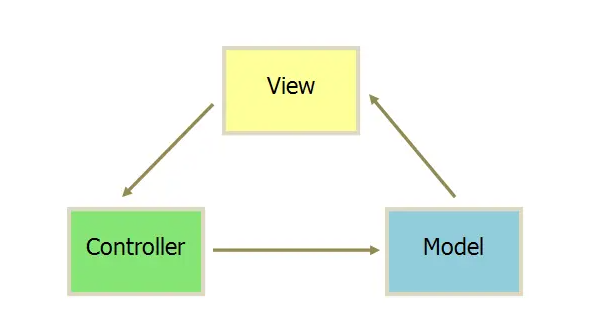
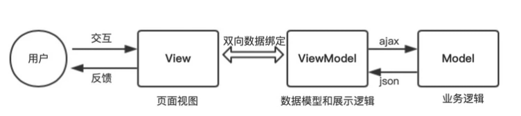

# vue基础用法

官方地址:[https://v2.cn.vuejs.org/](https://v2.cn.vuejs.org/)

## vue.js简介

:::tip
Vue (读⾳ /vjuː/，类似于 view) 是⼀套用于构建用户界面的渐进式框架。与其它大型框架不同的是，Vue 被设计为可以自底向上逐层应用。Vue 的核心库只关注视图层，不仅易于上手，还便于与第三方库或既有项⽬整合。另⼀方面，当与现代化的⼯具链以及各种⽀持类库结合使用时，Vue 也完全能够为复杂的单⻚应用提供驱动。
:::

### 先谈谈设计模式mvc



```js
//model
var myapp = {};//创建这个应用对象

myapp.Model = function() {
    var val = 0;

    this.add = function(v) {
        if(val < 100) val += v;
    }

    this.sub = function(v) {
        if(val > 0) val -= v;
    }

    this.getVal = function() {
        return val;
    }

    // 观察者模式
    var self = this,views = [];

    this.register = function(view) {
        views.push(view)
    }

    this.notify = function() {
        for(var i = 0; i < views.length; i++) {
            views[i].render(self);
        }
    }
}

//view
myapp.View = function(controller) {
    var $num = $('#num'),
        $incBtn = $('#increace')
        $devBtn = $('#decrease')

    this.render = fumction(model) {
        $num.text(model.getVal() + 'rmb')
    }

    //绑定事件
    $incBtn.click(controller.increase);
    $decBtn.click(controller.decrease);
}

//controller
myapp.Controller = function() {
    var model = null,
        view = null;
    this.init = function() {
        /*初始化model和view*/
        model = new myapp.Model();
        view = new myapp.View(this);
        /* View向Model注册，当Model更新就会去通知View啦 */
        model.register(view);
        model.notify();
    }
    /* 让Model更新数值并通知View更新视图 */
    this.increase = function() {
        model.add(1);
        model.notify();
    };
    this.decrease = function() {
        model.sub(1);
        model.notify();
    };
}
// init
(function() {
 var controller = new myapp.Controller();
 controller.init();
})();
```

### MVVM模式



```js
// model
var data = {
    val: 0
};
// view
<div id="myapp">
    <div>
        <span>{{ val }}rmb</span>
    </div>
    <div>
        <button v-on:click="sub(1)">-</button>
        <button v-on:click="add(1)">+</button>
    </div>
</div>
// controller
new Vue({
    el: '#myapp',
    data: data,
    methods: {
        add(v) {
            if(this.val < 100) {
                this.val += v;
            }
        },
        sub(v) {
            if(this.val > 0) {
                this.val -= v;
            }
        }
    }
});
// MVVM
// 1. 数据会绑定在viewModel层并自动将数据渲染到⻚面中
// 2. 视图变化时，会通知viewModel层更新数据
// Vue是不是MVVM？React呢？
// 严格来讲都不是
// React：ui = render (data) 单向数据流
// Vue: ref 直接操作DOM，跳过了ViewModel
```

## vue.js模板及指令

###  vue.js实例

每个vue应用都是通过用vue函数创建一个新的vue实例开始的：

```js
var vm = new Vue({
 // 选项
})
```

在Vue2⾥，虽然没有完全遵循 MVVM，但是 Vue 的设计也受到了它的启发。因此在⽂档中经常会使用vm (ViewModel 的缩写) 这个变量名表示 Vue 实例。

当⼀个 Vue 实例被创建时，它将 data 对象中的所有的 property 加入到 Vue 的响应式系统中。当这些property 的值发生改变时，视图将会产生“响应”，即匹配更新为新的值。

```js
// 我们的数据对象
var data = { a: 1 }
// 该对象被加入到⼀个 Vue 实例中
var vm = new Vue({
    data: data
})
// 获得这个实例上的 property
// 返回源数据中对应的字段
vm.a == data.a // => true
// 设置 property 也会影响到原始数据
vm.a = 2
data.a // => 2
// ……反之亦然
data.a = 3
vm.a // => 3
```

当这些数据改变时，视图会进行重渲染。值得注意的是只有当实例被创建时就已经存在于 data 中的property 才是响应式的。也就是说如果你添加⼀个新的 property，比如：

```js
vm.b = 'hi'
```

那么对 b 的改动将不会触发任何视图的更新。如果你知道你会在晚些时候需要⼀个 property，但是⼀开始它为空或不存在，那么你仅需要设置⼀些初始值。比如：

```js
data: {
    newTodoText: '',
    visitCount: 0,
    hideCompletedTodos: false,
    todos: [],
    error: null
}
```

这⾥唯⼀的例外是使用 Object.freeze()，这会阻止修改现有的 property，也意味着响应系统无法再追踪变化。

```js
var obj = {
    foo: 'bar'
}
Object.freeze(obj)
new Vue({
    el: '#app',
    data: obj
})
```
```html
<div id="app">
 <p>{{ foo }}</p>
 <!-- 这⾥的 `foo` 不会更新！ -->
 <button v-on:click="foo = 'baz'">Change it</button>
</div>
```

除了数据 property，Vue 实例还暴露了⼀些有用的实例 property 与方法。它们都有前缀 $，以便与用户定义的 property 区分开来。例如：

```js
var data = { a: 1 }
var vm = new Vue({
    el: '#example',
    data: data
})
vm.$data === data // => true
vm.$el === document.getElementById('example') // => true
// $watch 是⼀个实例方法
vm.$watch('a', function (newValue, oldValue) {
 // 这个回调将在 `vm.a` 改变后调用
})
```

### vue.js模板

Vue.js 使用了基于 HTML 的模板语法，允许开发者声明式地将 DOM 绑定至底层 Vue 实例的数据。所有Vue.js 的模板都是合法的 HTML，所以能被遵循规范的浏览器和 HTML 解析器解析。

在底层的实现上，Vue 将模板编译成虚拟 DOM 渲染函数。结合响应系统，Vue 能够智能地计算出最少需要重新渲染多少组件，并把 DOM 操作次数减到最少。

#### 文本

数据绑定最常⻅的形式就是使用“Mustache”语法 (双大括号) 的⽂本插值：

```js
<span>Message: {{ msg }}</span>
```

Mustache 标签将会被替代为对应数据对象上 msg property 的值。无论何时，绑定的数据对象上 msg property 发生了改变，插值处的内容都会更新。

通过使用 v-once 指令，你也能执行⼀次性地插值，当数据改变时，插值处的内容不会更新。但请留心这会影响到该节点上的其它数据绑定：

```html
<span v-once>这个将不会改变: {{ msg }}</span>
```

#### 原始HTML

双大括号会将数据解释为普通⽂本，而非 HTML 代码。为了输出真正的 HTML，你需要使用 v-html指令：

```html
<p>Using mustaches: {{ rawHtml }}</p>
<p>Using v-html directive: <span v-html="rawHtml"></span></p>
```

这个 span 的内容将会被替换成为 property 值 rawHtml，直接作为 HTML——会忽略解析 property 值中的数据绑定

#### 属性

Mustache 语法不能作用在 HTML attribute 上，遇到这种情况应该使用 v-bind指令：

```html
<div v-bind:id="dynamicId"></div>
```

#### 使用javascript表达式

迄今为止，在我们的模板中，我们⼀直都只绑定简单的 property 键值。但实际上，对于所有的数据绑定，Vue.js 都提供了完全的 JavaScript 表达式⽀持。

```html
{{ number + 1 }}
{{ ok ? 'YES' : 'NO' }}
{{ message.split('').reverse().join('') }}
<div v-bind:id="'list-' + id"></div>
```

这些表达式会在所属 Vue 实例的数据作用域下作为 JavaScript 被解析。有个限制就是，每个绑定都只能包含单个表达式，所以下面的例⼦都不会生效。

```html
<!-- 这是语句，不是表达式 -->
{{ var a = 1 }}
<!-- 流控制也不会生效，请使用三元表达式 -->
{{ if (ok) { return message } }}
```

### 指令

指令 (Directives) 是带有 v- 前缀的特殊 attribute。指令的职责是，当表达式的值改变时，将其产生的连带影响，响应式地作用于 DOM。

```html
<p v-if="seen">现在你看到我了</p>
```

这⾥，v-if 指令将根据表达式 seen 的值的真假来插入/移除 \<p\> 元素。

#### 参数

⼀些指令能够接收⼀个“参数”，在指令名称之后以冒号表示。例如，v-bind 指令可以用于响应式地更新HTML attribute：

```html
<a v-bind:href="url">...</a>
```

在这⾥ href 是参数，告知 v-bind 指令将该元素的 href attribute 与表达式 url 的值绑定。另⼀个例⼦是 v-on 指令，它用于监听 DOM 事件：

```js
<a v-on:click="doSomething">...</a>
```

#### 动态参数

从 2.6.0 开始，可以用方括号括起来的 JavaScript 表达式作为⼀个指令的参数：

```html
<!--
注意，参数表达式的写法存在⼀些约束，如之后的“对动态参数表达式的约束”章节所述。
-->
<a v-bind:[attributeName]="url"> ... </a>
```

这⾥的 attributeName 会被作为⼀个 JavaScript 表达式进行动态求值，求得的值将会作为最终的参数来使用。例如，如果你的 Vue 实例有⼀个 data property attributeName，其值为 "href"，那么这个绑定将等价于 v-bind:href。

同样地，你可以使用动态参数为⼀个动态的事件名绑定处理函数：

```html
<a v-on:[eventName]="doSomething"> ... </a>
```
在这个示例中，当 eventName 的值为 "focus" 时，v-on:[eventName] 将等价于 v-on:focus。

- 对动态参数的值的约束

动态参数预期会求出⼀个字符串，异常情况下值为 null。这个特殊的 null 值可以被显性地用于移除绑定。任何其它非字符串类型的值都将会触发⼀个警告。

- 对动态参数表达式的约束

动态参数表达式有⼀些语法约束，因为某些字符，如空格和引号，放在 HTML attribute 名⾥是无效的。例如：

```html
<!-- 这会触发⼀个编译警告 -->
<a v-bind:['foo' + bar]="value"> ... </a>
```

#### 修饰符

修饰符 (modifier) 是以半⻆句号 . 指明的特殊后缀，用于指出⼀个指令应该以特殊方式绑定。例如，.prevent 修饰符告诉 v-on 指令对于触发的事件调用 event.preventDefault()：

```html
<form v-on:submit.prevent="onSubmit">...</form>
```

#### 缩写

v- 前缀作为⼀种视觉提示，用来识别模板中 Vue 特定的 attribute。

- v-bind缩写

```html
<!-- 完整语法 -->
<a v-bind:href="url">...</a>
<!-- 缩写 -->
<a :href="url">...</a>
<!-- 动态参数的缩写 (2.6.0+) -->
<a :[key]="url"> ... </a>
```

- v-on缩写

```html
<!-- 完整语法 -->
<a v-on:click="doSomething">...</a>
<!-- 缩写 -->
<a @click="doSomething">...</a>
<!-- 动态参数的缩写 (2.6.0+) -->
<a @[event]="doSomething"> ... </a>
```

#### 自定义指令

除了核心功能默认内置的指令 ( v-model 和 v-show )，Vue 也允许注册自定义指令。在 Vue2.0 中，代码复用和抽象的主要形式是组件。然而，有的情况下，你仍然需要对普通 DOM 元素进行底层操作，这时候就会用到自定义指令。

Vue 自定义指令有全局注册和局部注册两种方式。全局注册指令的方式，通过 Vue.directive( id, [definition] ) 方式注册全局指令。如果想注册局部指令，组件中也接受⼀个directives的选项。

```js
// 注册⼀个全局自定义指令 `v-focus`
Vue.directive('focus', {
    // 当被绑定的元素插入到 DOM 中时……
    inserted: function (el) {
        // 聚焦元素
        el.focus()
    }
})
// 注册⼀个局部自定义指令 `v-focus`
directives: {
    focus: {
        // 指令的定义
        inserted: function (el) {
            el.focus()
        }
    }
}
```

然后我们可以在模板中任何元素上使用 v-focus property，如下：

```js
<input v-focus>
```

当我们需要批量注册自定义指令时，写很多个`Vue.directive( id, [definition] ) 会导致代码冗余，所以我们可以利用Vue.use()` 的特性，完成批量注册。批量注册指令，新建 directives/directive.js ⽂件

```js
// 导入指令定义⽂件
import debounce from './debounce'
import throttle from './throttle'
// 集成⼀起
const directives = {
    debounce,
    throttle,
}
//批量注册
export default {
    install(Vue) {
        Object.keys(directives).forEach((key) => {
            Vue.directive(key, directives[key])
        })
    },
}
```

在 main.js 引入，并Vue.use() 调用完成批量注册

```js
import Vue from 'vue'
import Directives from './directives/directive.js'
Vue.use(Directives)
```

⼀个指令定义对象可以提供如下几个钩⼦函数 (均为可选)：

- bind: 只调用⼀次，指令第⼀次绑定到元素时调用，可以定义⼀个在绑定时执行⼀次的初始化动作，此时获取父节点为null。
- inserted: 被绑定元素插入父节点时调用（仅保证父节点存在，但不⼀定已被插入⽂档中），此时可以获取到父节点。
- update: 所在组件的 VNode 更新时调用，但是可能发生在其⼦ VNode 更新之前。指令的值可能发生了改变，也可能没有。但是你可以通过比较更新前后的值来忽略不必要的模板更新
- componentUpdated: 指令所在组件的 VNode 及其⼦ VNode 全部更新后调用。
- unbind: 只调用⼀次， 指令与元素解绑时调用。

接下来我们来看⼀下钩⼦函数的参数 (即 el、binding、vnode 和 oldVnode)。
指令钩⼦函数会被传入以下参数：

- el：指令所绑定的元素，可以用来直接操作 DOM。
- binding：⼀个对象，包含以下 property：
    - name：指令名，不包括 v- 前缀。
    - value：指令的绑定值，例如：v-my-directive="1 + 1" 中，绑定值为 2。
    - oldValue：指令绑定的前⼀个值，仅在 update 和 componentUpdated 钩⼦中可用。无论值是
    否改变都可用。
    - expression：字符串形式的指令表达式。例如 v-my-directive="1 + 1" 中，表达式为 "1 + 1"。
    - arg：传给指令的参数，可选。例如 v-my-directive:foo 中，参数为 "foo"。
    - modifiers：⼀个包含修饰符的对象。例如：v-my-directive.foo.bar 中，修饰符对象为 { foo:
    true, bar: true }。
- vnode：Vue 编译生成的虚拟节点。
- oldVnode：上⼀个虚拟节点，仅在 update 和 componentUpdated 钩⼦中可用

#### v-longpress

```js
//directive
const longpress = {
    bind: function(el, {value: {fn, time}}) {
        //没绑定函数直接返回
        if(typeof fn!== 'function') return
        //定义定时器变量
        el._timer = null
        //创建计时器（n秒后执行函数）
        el._start = (e) => {
            //e.type表示触发的事件类型如mousedown,touchstart等
            //pc端: e.button表示是哪个键按下0为⿏标左键，1为中键，2为右键
            //移动端: e.touches表示同时按下的键为个数
            if ( (e.type === 'mousedown' && e.button && e.button !== 0) ||
                 (e.type === 'touchstart' && e.touches && e.touches.length > 1)
            ) return;
            //定时⻓按n秒后执行事件
            if (el._timer === null) {
                el._timer = setTimeout(() => {
                    fn()
                }, time)
                //取消浏览器默认事件，如右键弹窗
                el.addEventListener('contextmenu', function(e) {
                    e.preventDefault();
                })
            }
        }
        // 如果两秒内松⼿，则取消计时器
        el._cancel = (e) => {
            if (el._timer !== null) {
                clearTimeout(el._timer)
                el._timer = null
            }
        }
        // 添加计时监听
        el.addEventListener('mousedown', el._start)
        el.addEventListener('touchstart', el._start)
        // 添加取消监听
        el.addEventListener('click', el._cancel)
        el.addEventListener('mouseout', el._cancel)
        el.addEventListener('touchend', el._cancel)
        el.addEventListener('touchcancel', el._cancel)
    },
    //指令与元素解绑时，移除事件绑定
    unbind(el) {
        // 添加计时监听
        el.addEventListener('mousedown', el._start)
        el.addEventListener('touchstart', el._start)
        // 添加取消监听
        el.addEventListener('click', el._cancel)
        el.addEventListener('mouseout', el._cancel)
        el.addEventListener('touchend', el._cancel)
        el.addEventListener('touchcancel', el._cancel)
    }
}

export default longpress

// 引用
<template>
 <button v-longpress="{fn: longpress,time:2000}">⻓按</button>
</template>
<script>
export default {
    methods: {
        longpress () {
            console.log('⻓按指令生效')
        }
    }
}
</script>
```

#### v-debounce

```js
const debounce = {
    inserted: function (el, {value:{fn, event, time}}) {
        //没绑定函数直接返回
        if (typeof fn !== 'function') return
        el._timer = null
        //监听点击事件，限定事件内如果再次点击则清空定时器并重新定时
        el.addEventListener(event, () => {
            if (el._timer !== null) {
                clearTimeout(el._timer)
                el._timer = null
            }
            el._timer = setTimeout(() => {
                fn()
            }, time)
        })
    },
}
export default debounce

// 引用
<template>
    <input v-debounce="{fn: debounce, event: 'input', time: 5000}" />
</template>
<script>
export default {
    methods: {
        debounce(){
            console.log('debounce 防抖')
        },
    }
}
</script>
```

#### v-throttle

```js
const throttle = {
    bind: function(el, {value: {fn, time}}) {
        if(typeof fn !== 'function') return
        el._flag = true;//开关默认为开
        el._timer = null
        el.handler = function() {
            if(!el._flag) return;
            //执行之后开关关闭
            el._flag && fn()
            el._flag = false
            if(el._timer !== null) {
                clearTimeout(el._timer)
                el._timer = null
            }
            el_timer = setTimeout(() => {
                el._flag = true;//三秒后开关开启
            }, time);
        }
        el.addEventListener('click', el.handler)
    },
    unbind: function(el, binding) {
        el.removeEventListener('click', el.handler)
    }
}

export default throttle

// 引用
<template>
    <button v-throttle="{fn: throttle,time:3000}">throttle节流</button>
</template>
<script>
export default {
    methods: {
        throttle () {
            console.log('throttle 节流 只触发⼀次')
        }
    }
}
</script>
```

## vue.js生命周期

### 生命周期内容

|   生命周期   | 描述 |
| ---- | ---- |
| beforeCreate | 组件实例被创建之初 |
| created | 组件实例已经完全创建|
| beforeMount |组件挂载之前|
| mounted | 组件挂载到实例上去之后|
| beforeUpdate |组件数据发生变化，更新之前|
| updated | 组件数据更新之后 |
| beforeDestroy | 组件实例销毁之前 |
| destroyed | 组件实例销毁之后 |
| activated | keep-alive 缓存的组件激活时 |
| deactivated | keep-alive | 缓存的组件停用时调用 |
| errorCaptured | 捕获⼀个来自⼦孙组件的错误时被调用 |

### 生命周期功能 

1.  `beforeCreate -> created`
    - 初始化vue实例，进行数据观测

2. `created`
    - 完成数据观测，属性与方法的运算，watch、event事件回调的配置
    - 可调用methods中的方法，访问和修改data数据触发响应式渲染dom，可通过computed和
    watch完成数据计算
    - 此时vm.$el 并没有被创建

3. `created -> beforeMount`
    - 判断是否存在el选项，若不存在则停止编译，直到调用vm.$mount(el)才会继续编译
    - vm.el获取到的是挂载DOM的

4. `beforeMount`
    - 在此阶段可获取到vm.el
    - 此阶段vm.el虽已完成DOM初始化，但并未挂载在el选项上

5. `beforeMount -> mounted`
    - 此阶段vm.el完成挂载，vm.$el生成的DOM替换了el选项所对应的DOM

6. `mounted`
    - vm.el已完成DOM的挂载与渲染，此刻打印vm.$el，发现之前的挂载点及内容已被替换成新的DOM

7. `beforeUpdate`
    - 更新的数据必须是被渲染在模板上的（el、template、render之⼀）
    - 此时view层还未更新
    - 若在beforeUpdate中再次修改数据，不会再次触发更新方法

8. `updated`
    - 完成view层的更新
    - 若在updated中再次修改数据，会再次触发更新方法（beforeUpdate、updated）

9. `beforeDestroy`

    - 实例被销毁前调用，此时实例属性与方法仍可访问

10. `destroyed`

    - 完全销毁⼀个实例。可清理它与其它实例的连接，解绑它的全部指令及事件监听器
    - 并不能清除DOM，仅仅销毁实例


使用场景分析：

|   生命周期   | 描述 |
| ---- | ---- |
| beforeCreate | 执行时组件实例还未创建，通常用于插件开发中执行⼀些初始化任务 |
| created | 组件初始化完毕，各种数据可以使用，常用于异步数据获取 |
| beforeMount | 未执行渲染、更新，dom未创建 |
| mounted | 初始化结束，dom已创建，可用于获取访问数据和dom元素 |
| beforeUpdate | 更新前，可用于获取更新前各种状态 |
| updated | 更新后，所有状态已是最新 |
| beforeDestroy | 销毁前，可用于⼀些定时器或订阅的取消 |
| destroyed | 组件已销毁，作用同上 |

## computed和watch

### computed

```html
<div id="example">
 {{ message.split('').reverse().join('') }}
</div>
```

在这个地方，模板不再是简单的声明式逻辑。你必须看⼀段时间才能意识到，这⾥是想要显示变量message 的翻转字符串。当你想要在模板中的多处包含此翻转字符串时，就会更加难以处理。所以，对于任何复杂逻辑，你都应当使用计算属性。

```html
<div id="example">
    <p>Original message: "{{ message }}"</p>
    <p>Computed reversed message: "{{ reversedMessage }}"</p>
</div>
```
```js
var vm = new Vue({
    el: '#example',
    data: {
        message: 'Hello'
    },
    computed: {
        // 计算属性的 getter
        reversedMessage: function () {
            // `this` 指向 vm 实例
            return this.message.split('').reverse().join('')
        }
    }
})
```

### computed和method

你可能已经注意到我们可以通过在表达式中调用方法来达到同样的效果：

```vue
<p>Reversed message: "{{ reversedMessage() }}"</p>

<script>
export default {
     // 在组件中
    methods: {
        reversedMessage: function () {
            return this.message.split('').reverse().join('')
        }
    }
}
</script>
```

我们可以将同⼀函数定义为⼀个方法而不是⼀个计算属性。两种方式的最终结果确实是完全相同的。不同的是计算属性是基于它们的响应式依赖进行缓存的。只在相关响应式依赖发生改变时它们才会重新求值。这就意味着只要 message 还没有发生改变，多次访问 reversedMessage 计算属性会⽴即返回之前的计算结果，而不必再次执行函数。这也同样意味着下面的计算属性将不再更新，因为 Date.now() 不是响应式依赖：

```js
computed: {
    now: function () {
        return Date.now()
    }
}
```

相比之下，每当触发重新渲染时，调用方法将总会再次执行函数。

我们为什么需要缓存？假设我们有⼀个性能开销比较大的计算属性 A，它需要遍历⼀个巨大的数组并做大量的计算。然后我们可能有其他的计算属性依赖于 A。如果没有缓存，我们将不可避免的多次执行 A的 getter！如果你不希望有缓存，请用方法来替代。

### computed和watch

Vue 提供了⼀种更通用的方式来观察和响应 Vue 实例上的数据变动：侦听属性。当你有⼀些数据需要随着其它数据变动而变动时，你很容易滥用 watch。然而，通常更好的做法是使用计算属性而不是命令式的 watch 回调。细想⼀下这个例⼦：

```html
<div id="demo">{{ fullName }}</div>
```
```js
var vm = new Vue({
    el: '#demo',
    data: {
        firstName: 'Foo',
        lastName: 'Bar',
        fullName: 'Foo Bar'
    },
    watch: {
        firstName: function (val) {
            this.fullName = val + ' ' + this.lastName
        },
        lastName: function (val) {
            this.fullName = this.firstName + ' ' + val
        }
    }
})
```

上面代码是命令式且重复的。将它与计算属性的版本进行比较：

```js
var vm = new Vue({
    el: '#demo',
    data: {
        firstName: 'Foo',
        lastName: 'Bar'
    },
    computed: {
        fullName: function () {
            return this.firstName + ' ' + this.lastName
        }
    }
})
```

### computed和setter

计算属性默认只有 getter，不过在需要时你也可以提供⼀个 setter：

```js
// ...
computed: {
    fullName: {
        // getter
        get: function () {
            return this.firstName + ' ' + this.lastName
        },
        // setter
        set: function (newValue) {
            var names = newValue.split(' ')
            this.firstName = names[0]
            this.lastName = names[names.length - 1]
        }
    }
}
// ...
```

现在再运行 vm.fullName = 'John Doe' 时，setter 会被调用，vm.firstName 和 vm.lastName 也会相应地被更新。

## watch

虽然计算属性在大多数情况下更合适，但有时也需要⼀个自定义的侦听器。

```html
<div id="watch-example">
 <p>
    Ask a yes/no question:
    <input v-model="question">
 </p>
 <p>{{ answer }}</p>
</div>
```
```js
var watchExampleVM = new Vue({
    el: '#watch-example',
    data: {
        question: '',
        answer: 'I cannot give you an answer until you ask a question!'
    },
    watch: {
        // 如果 `question` 发生改变，这个函数就会运行
        question: function (newQuestion, oldQuestion) {
            this.answer = 'Waiting for you to stop typing...'
            this.debouncedGetAnswer()
        }
    },
    created: function () {
    // `_.debounce` 是⼀个通过 Lodash 限制操作频率的函数。
    // 在这个例⼦中，我们希望限制访问 yesno.wtf/api 的频率
    // AJAX 请求直到用户输入完毕才会发出。想要了解更多关于
    // `_.debounce` 函数 (及其近亲 `_.throttle`) 的知识，
    // 请参考：https://lodash.com/docs#debounce
        this.debouncedGetAnswer = _.debounce(this.getAnswer, 500)
    },
    methods: {
        getAnswer: function () {
            if (this.question.indexOf('?') === -1) {
                this.answer = 'Questions usually contain a question mark. ;-)'
                return
            }
            this.answer = 'Thinking...'
            var vm = this
            axios.get('https://yesno.wtf/api')
            .then(function (response) {
                vm.answer = _.capitalize(response.data.answer)
            })
            .catch(function (error) {
                vm.answer = 'Error! Could not reach the API. ' + error
            })
        }
    }
})
```

在这个示例中，使用 watch 选项允许我们执行异步操作 (访问⼀个 API)，限制我们执行该操作的频率，并在我们得到最终结果前，设置中间状态。这些都是计算属性无法做到的。

## 异同点

### 相同点

1. 基于vue的依赖收集机制；
2. 都是被依赖的变化触发，进行改变进而进行处理计算；

### 不同点

1. 入和出
computed：多入单出 —— 多个值变化，组成⼀个值的变化；
watch：单入多出 —— 单个值的变化，进而影响⼀系列的状态变更；

2. 性能
computed：会自动diff依赖，若依赖没有变化，会改从缓存中读取当前计算值；
watch：无论监听值变化与否，都会执行回调；

3. 写法上
computed: 必须有return返回值；
watch: 不⼀定；

4. 时机上
computed：从首次生成赋值，就开始计算运行了；
watch: 首次不会运行，除非——immediate：true


