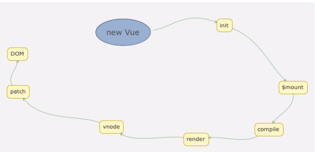

# vue2源码解析上

## vue目录结构设计

```js
src
 -complier    # 编译相关
 -core        # 核心代码
 -platforms   # 不同平台的支持
 -server      # 服务端渲染
 -sfc         # .vue文件解析
 -shared      # 共享代码
```

### complier

包含vue.js所有编译相关的代码。它包括把模板解析成ast语法树,ast语法树优化，代码生成功能。

编译的工作可以在构建时做（借助webpack，vue-loader等辅助插件）；也可以在运行时做，使用包含构建功能的vue.js显然，编译是一项耗性能的工作，所以更推荐前者--离线编译

### core

包含了vue.js的核心代码，包括内置组件，全局api封装，vue实例化，观察者，虚拟dom，工具函数等等。这里的代码可谓是vue.js的灵魂，也是我们之后需要重点分析的地方。

### platform

vue.js的是一个跨平台的类mvvm框架，它可以跑在web上，也可以配合weex跑在native客户端上。platform是vue.js的入口，2个目录代表2个主要入口，分别打包成运行在web上和weex上的vue.js

### server

vue.js支持了服务端渲染，所有服务端渲染相关的逻辑都在这个目录下

:::tip
这部分代码是在服务端的node.js,不要和跑在浏览器端的vue.js混为一谈
:::

服务端渲染主要的工作是把组件渲染为服务器端的html字符串，将它们直接发送到浏览器，最后将静态标记混合为客户端上完全交互的应用程序

### sfc

通常我们开发vue.js都会借助webpack构建，然后通过.vue单文件来编写组件。
这个目录下的代码逻辑会把.vue文件内容解析成一个javascript的对象

### shared

vue.js会定义一些工具方法，这里定义的工具方法都是会被浏览器端的vue.js和服务器端的vue.js所共享

## vue源码构建

vue.js源码是基于rollup构建的，它的构建相关配置都在scripts目录下

### 构建过程

在scripts/build.js中

```js
let builds = require('./config').getAllBuilds()
// filter builds via command line arg
if (process.argv[2]) {
  const filters = process.argv[2].split(',')
  builds = builds.filter(b => {
    return filters.some(f => b.output.file.indexOf(f) > -1 || b._name.indexOf(f) > -1)
  })
} else {
  // filter out weex builds by default
  builds = builds.filter(b => {
    return b.output.file.indexOf('weex') === -1
  })
}
build(builds)
```
这段代码逻辑非常简单，先从配置文件读取配置，再通过命令行参数对构建配置做过滤，这样就可以构建出不同用途的Vue.js 了。以 `web-runtime-cjs-dev` 配置为例它经过 Rollup 的构建打包后，最终会在 dist 目录下生成 dist/vue.runtime.common.dev.js 。

### Runtime Only VS Runtime + Compiler

通常我们利用 vue-cli 去初始化我们的 Vue.js 项目的时候会询问我们用 Runtime Only 版本的还是 Runtime +Compiler 版本。下面我们来对比这两个版本。

- Runtime Only

我们在使用 Runtime Only 版本的 Vue.js 的时候，通常需要借助如 webpack 的 vue-loader 工具把 .vue 文件编译成JavaScript，因为是在编译阶段做的，所以它只包含运行时的 Vue.js 代码，因此代码体积也会更轻量；

- Runtime + Compiler

我们如果没有对代码做预编译，但又使用了 Vue 的 template 属性并传入一个字符串，则需要在客户端编译模板，如下所示：

```js
// 需要编译器的版本
new Vue({
  template: '<div>{{ hi }}</div>'
})
// 这种情况不需要
new Vue({
  render (h) {
    return h('div', this.hi)
  }
})
```
在 Vue.js 2.0 中，最终渲染都是通过 render 函数，如果写 template 属性，则需要编译成 render 函数，那么这个编译过程会发生运行时，所以需要带有编译器的版本。
很显然，这个编译过程对性能会有一定损耗，所以通常我们更推荐使用 Runtime-Only 的 Vue.js。

## vue入口

在 web场景下，我们来分析 Runtime + Compiler 构建出来的 Vue.js，它的入口是 `src/platforms/web/entry-runtimewith-compiler.js`

### vue定义

```js
import { initMixin } from './init'
import { stateMixin } from './state'
import { renderMixin } from './render'
import { eventsMixin } from './events'
import { lifecycleMixin } from './lifecycle'
import { warn } from '../util/index'
function Vue (options) {
 if (process.env.NODE_ENV !== 'production' &&
 !(this instanceof Vue)
 ) {
 warn('Vue is a constructor and should be called with the `new` keyword')
 }
 this._init(options)
}
initMixin(Vue)
stateMixin(Vue)
eventsMixin(Vue)
lifecycleMixin(Vue)
renderMixin(Vue)
export default Vue
```

在这里，我们会发现，Vue实际上就是一个用 Function 实现的类，这也是为什么我们只能通过 new Vue 去实例化它的原因。

### initGlobalAPI

Vue.js 在整个初始化过程中，除了给它的原型 prototype 上扩展方法，还会给 Vue 这个对象本身扩展全局的静态方法，它的定义在 `src/core/global-api/index.js` 中：

```js
export function initGlobalAPI (Vue: GlobalAPI) {
 // config
 const configDef = {}
 configDef.get = () => config
 if (process.env.NODE_ENV !== 'production') {
 configDef.set = () => {
 warn(
 'Do not replace the Vue.config object, set individual fields instead.'
 )
 }
 }
 Object.defineProperty(Vue, 'config', configDef)
 // exposed util methods.
 // NOTE: these are not considered part of the public API - avoid relying on
 // them unless you are aware of the risk.
 Vue.util = {
 warn,
 extend,
 mergeOptions,
 defineReactive
 }
 Vue.set = set
 Vue.delete = del
 Vue.nextTick = nextTick
 Vue.options = Object.create(null)
 ASSET_TYPES.forEach(type => {
 Vue.options[type + 's'] = Object.create(null)
 })
 // this is used to identify the "base" constructor to extend all plain-object
 // components with in Weex's multi-instance scenarios.
 Vue.options._base = Vue
 extend(Vue.options.components, builtInComponents)
 initUse(Vue)
 initMixin(Vue)
 initExtend(Vue)
 initAssetRegisters(Vue)
}
```

这里就是在 Vue 上扩展的一些全局方法的定义，Vue 官网中关于全局 API 都可以在这里找到，有一点要注意的是，Vue.util 暴露的方法最好不要依赖，因为它可能经常会发生变化，是不稳定的。具体的全局API后面详细讲解；

## 数据驱动

Vue.js 一个核心思想是数据驱动。所谓数据驱动，是指视图是由数据驱动生成的，我们对视图的修改，不会直接操作DOM，而是通过修改数据。它相比我们传统的前端开发，如使用 jQuery 等前端库直接修改 DOM，大大简化了代码量。特别是当交互复杂的时候，只关心数据的修改会让代码的逻辑变的非常清晰，因为 DOM 变成了数据的映射，我们所有的逻辑都是对数据的修改，而不用碰触 DOM，这样的代码非常利于维护。

在 Vue.js 中我们可以采用简洁的模板语法来声明式的将数据渲染为 DOM：

```js
<div id="app">
  {{ message }}
</div>
var app = new Vue({
  el: '#app',
  data: {
    message: 'Hello Vue!'
  }
})
```
最终它会在页面上渲染出 Hello Vue 。接下来，我们会从源码角度来分析 Vue 是如何实现的。在这里，先弄清楚模板和数据如何渲染成最终的 DOM。

### new Vue 时发生了什么

从入口代码开始分析，我们先来分析 new Vue 背后发生了哪些事情。我们都知道，new 关键字在 Javascript 语言中代表实例化是一个对象，而 Vue 实际上是一个类，类在 Javascript 中是用 Function 来实现的，来看一下源码，在 src/core/instance/index.js 中。
```js
function Vue (options) {
 if (process.env.NODE_ENV !== 'production' &&
 !(this instanceof Vue)
 ) {
 warn('Vue is a constructor and should be called with the `new` keyword')
 }
 this._init(options)
}
```
可以看到 Vue 只能通过 new 关键字初始化，然后会调用 this._init 方法， 该方法在 initMixin(Vue) 时注入到prototype上，在 src/core/instance/init.js 中定义。

```js
Vue.prototype._init = function (options?: Object) {
 const vm: Component = this
 // a uid
 vm._uid = uid++
 let startTag, endTag
 /* istanbul ignore if */
 if (process.env.NODE_ENV !== 'production' && config.performance && mark) {
  startTag = `vue-perf-start:${vm._uid}`
  endTag = `vue-perf-end:${vm._uid}`
  mark(startTag)
 }
 // a flag to avoid this being observed
 vm._isVue = true
 // merge options
 if (options && options._isComponent) {
 // optimize internal component instantiation
 // since dynamic options merging is pretty slow, and none of the
 // internal component options needs special treatment.
 initInternalComponent(vm, options)
 } else {
  vm.$options = mergeOptions(
    resolveConstructorOptions(vm.constructor),
  options || {},
  vm
  )
 }
 /* istanbul ignore else */
 if (process.env.NODE_ENV !== 'production') {
  initProxy(vm)
 } else {
  vm._renderProxy = vm
 }
 // expose real self
 vm._self = vm
 initLifecycle(vm)
 initEvents(vm)
 initRender(vm)
 callHook(vm, 'beforeCreate')
 initInjections(vm) // resolve injections before data/props
 initState(vm)
 initProvide(vm) // resolve provide after data/props
 callHook(vm, 'created')
 /* istanbul ignore if */
 if (process.env.NODE_ENV !== 'production' && config.performance && mark) {
  vm._name = formatComponentName(vm, false)
  mark(endTag)
  measure(`vue ${vm._name} init`, startTag, endTag)
 }
 if (vm.$options.el) {
  vm.$mount(vm.$options.el)
 }
}
```
Vue 初始化主要就干了几件事情，合并配置，初始化生命周期，初始化事件中心，初始化渲染，初始化 data、props、computed、watcher 等等。
Vue 的初始化逻辑写的非常清楚，把不同的功能逻辑拆成一些单独的函数执行，让主线逻辑一目了然，由于我们这一章的目标是弄清楚模板和数据如何渲染成最终的 DOM，所以各种初始化逻辑我们先不看。在初始化的最后，检测到如果有 el属性，则调用 vm.$mount 方法挂载 vm，挂载的目标就是把模板渲染成最终的 DOM，那么接下来我们来分析 Vue 的挂载过程。

### vue实例挂载的实现

Vue 中我们是通过 `$mount` 实例方法去挂载 vm 的，`$mount` 方法在多个文件中都有定义，如 `src/platform/web/entry-runtime-with-compiler.js` 、 `src/platform/web/runtime/index.js` 、 `src/platform/weex/runtime/index.js` 。因为`$mount` 这个方法的实现是和平台、构建方式都相关的。接下来我们重点分析带 compiler 版本的 $mount 实现，因为抛开 webpack 的 vue-loader，我们在纯前端浏览器环境分析 Vue 的工作原理，有助于我们对原理理解的深入。

先来看一下 src/platform/web/entry-runtime-with-compiler.js 文件中定义：

```js
const mount = Vue.prototype.$mount
Vue.prototype.$mount = function (
  el?: string | Element,
  hydrating?: boolean
): Component {
  el = el && query(el)
  /* istanbul ignore if */
  if (el === document.body || el === document.documentElement) {
    process.env.NODE_ENV !== 'production' && warn(
      `Do not mount Vue to <html> or <body> - mount to normal elements instead.`
    )
    return this
  }
  const options = this.$options
  // resolve template/el and convert to render function
  if (!options.render) {
    let template = options.template
    if (template) {
      if (typeof template === 'string') {
        if (template.charAt(0) === '#') {
          template = idToTemplate(template)
          /* istanbul ignore if */
          if (process.env.NODE_ENV !== 'production' && !template) {
            warn(
            `Template element not found or is empty: ${options.template}`,
            this
            )
          }
        }
      } else if (template.nodeType) {
        template = template.innerHTML
      } else {
        if (process.env.NODE_ENV !== 'production') {
          warn('invalid template option:' + template, this)
        }
        return this
      }
    } else if (el) {
      template = getOuterHTML(el)
    }
    if (template) {
      /* istanbul ignore if */
      if (process.env.NODE_ENV !== 'production' && config.performance && mark) {
        mark('compile')
      }
      const { render, staticRenderFns } = compileToFunctions(template, {
        outputSourceRange: process.env.NODE_ENV !== 'production',
        shouldDecodeNewlines,
        shouldDecodeNewlinesForHref,
        delimiters: options.delimiters,
        comments: options.comments
      }, this)
      options.render = render
      options.staticRenderFns = staticRenderFns
      /* istanbul ignore if */
      if (process.env.NODE_ENV !== 'production' && config.performance && mark) {
        mark('compile end')
        measure(`vue ${this._name} compile`, 'compile', 'compile end')
      }
    }
  }
  return mount.call(this, el, hydrating)
}

```
这段代码首先缓存了原型上的 $mount 方法，再重新定义该方法

1. 它对 el 做了限制，Vue 不能挂载在 body、html 这样的根节点上；
2. 如果没有定义 render 方法，则会把 el 或者 template 字符串转换成 render 方法。在 Vue 2.0 版本中，所有 Vue 的组件的渲染最终都需要 render 方法，无论我们是用单文件 .vue 方式开发组件，还是写了 el 或者 template 属性，最终都会转换成 render 方法；
3. 根据生成的template函数，会执行在线编译的过程，是调用 compileToFunctions 方法实现的，在后续的编译过程中讲解。最后，调用原先原型上的 $mount 方法挂载；

原先原型上的 $mount 方法在 src/platform/web/runtime/index.js 中定义，之所以这么设计完全是为了复用，因为它是可以被 runtime only 版本的 Vue 直接使用的。

```js
// public mount method
Vue.prototype.$mount = function (
 el?: string | Element,
 hydrating?: boolean
): Component {
 el = el && inBrowser ? query(el) : undefined
 return mountComponent(this, el, hydrating)
}
```
$mount 方法支持传入 2 个参数，第一个是 el，它表示挂载的元素，可以是字符串，也可以是 DOM 对象，如果是字符串在浏览器环境下会调用 query 方法转换成 DOM 对象的。第二个参数是和服务端渲染相关，在浏览器环境下我们不需要传第二个参数。

$mount 方法实际上会去调用 mountComponent 方法，这个方法定义在 src/core/instance/lifecycle.js 文件中：

```js
export function mountComponent (
  vm: Component,
  el: ?Element,
  hydrating?: boolean
): Component {
  vm.$el = el
  if (!vm.$options.render) {
    vm.$options.render = createEmptyVNode
    if (process.env.NODE_ENV !== 'production') {
      /* istanbul ignore if */
      if ((vm.$options.template && vm.$options.template.charAt(0) !== '#') ||
      vm.$options.el || el) {
        warn(
          'You are using the runtime-only build of Vue where the template ' +
          'compiler is not available. Either pre-compile the templates into ' +
          'render functions, or use the compiler-included build.',
          vm
        )
      } else {
        warn(
          'Failed to mount component: template or render function not defined.',
          vm
        )
      }
    }
  }
  callHook(vm, 'beforeMount')
  let updateComponent
  /* istanbul ignore if */
  if (process.env.NODE_ENV !== 'production' && config.performance && mark) {
    updateComponent = () => {
      const name = vm._name
      const id = vm._uid
      const startTag = `vue-perf-start:${id}`
      const endTag = `vue-perf-end:${id}`
      mark(startTag)
      const vnode = vm._render()
      mark(endTag)
      measure(`vue ${name} render`, startTag, endTag)
      mark(startTag)
      vm._update(vnode, hydrating)
      mark(endTag)
      measure(`vue ${name} patch`, startTag, endTag)
    }
  } else {
    updateComponent = () => {
      vm._update(vm._render(), hydrating)
    }
  }
  // we set this to vm._watcher inside the watcher's constructor
  // since the watcher's initial patch may call $forceUpdate (e.g. inside child
  // component's mounted hook), which relies on vm._watcher being already defined
  new Watcher(vm, updateComponent, noop, {
    before () {
      if (vm._isMounted) {
        callHook(vm, 'beforeUpdate')
      }
    }
  }, true /* isRenderWatcher */)
  hydrating = false
  // manually mounted instance, call mounted on self
  // mounted is called for render-created child components in its inserted hook
  if (vm.$vnode == null) {
    vm._isMounted = true
    callHook(vm, 'mounted')
  }
  return vm
}
```

这里面核心就是先实例化一个渲染Watcher，在它的回调函数中会调用 updateComponent 方法，在此方法中调用 vm._render 方法先生成虚拟 Node，最终调用 vm._update 更新 DOM。Watcher 在这里起到两个作用：（后面会详细讲解）

1. 初始化的时候会执行回调函数；
2. 当 vm 实例中的监测的数据发生变化的时候执行回调函数；
函数最后判断当根节点vm.$vnode为null时，执行mount初始化；接下来详细讲_render（生成VNode）和_update（更新DOM）

### render

Vue 的 `_render` 方法是实例的一个私有方法，它用来把实例渲染成一个虚拟 Node。它的定义在 `src/core/instance/render.js` 文件中：
在 `src/core/instance/init.js` 中，执行 `renderMixin` ，注入到到Vue.prototype上：

```js
Vue.prototype._render = function (): VNode {
  const vm: Component = this
  const { render, _parentVnode } = vm.$options
  // reset _rendered flag on slots for duplicate slot check
  if (process.env.NODE_ENV !== 'production') {
    for (const key in vm.$slots) {
      // $flow-disable-line
      vm.$slots[key]._rendered = false
    }
  }
  if (_parentVnode) {
    vm.$scopedSlots = _parentVnode.data.scopedSlots || emptyObject
  }
  // set parent vnode. this allows render functions to have access
  // to the data on the placeholder node.
  vm.$vnode = _parentVnode
  // render self
  let vnode
  try {
    vnode = render.call(vm._renderProxy, vm.$createElement)
  } catch (e) {
    handleError(e, vm, `render`)
    // return error render result,
    // or previous vnode to prevent render error causing blank component
    /* istanbul ignore else */
    if (process.env.NODE_ENV !== 'production') {
      if (vm.$options.renderError) {
        try {
          vnode = vm.$options.renderError.call(vm._renderProxy, vm.$createElement, e)
        } catch (e) {
          handleError(e, vm, `renderError`)
          vnode = vm._vnode
        }
      } else {
        vnode = vm._vnode
      }
    } else {
      vnode = vm._vnode
    }
  }
  // return empty vnode in case the render function errored out
  if (!(vnode instanceof VNode)) {
    if (process.env.NODE_ENV !== 'production' && Array.isArray(vnode)) {
      warn(
        'Multiple root nodes returned from render function. Render function ' +
        'should return a single root node.',
        vm
      )
    }
    vnode = createEmptyVNode()
  }
  // set parent
  vnode.parent = _parentVnode
  return vnode
}
```
最关键的是 render 方法的调用，在之前的 mounted 方法的实现中，会把 template 编译成 render 方法，具体的编译方法在后面讲

在_render 函数中的 render 方法的调用中：
```js
vnode = render.call(vm._renderProxy, vm.$createElement)
```
`render` 函数中的 `createElement` 方法就是 `vm.$createElement` 方法，其中`vm.$createElement`的方法是在`initRender`中定义的，其中`vm.$createElement`调用了`createElement`，另一个方法也调用了，这个方法是被模板编译成的 `render` 函数使用，而 `vm.$createElement` 是用户手写 `render` 方法使用的， 这俩个方法支持的参数相同，并且内部都调用了`createElement` 方法
```js
vm._c = (a, b, c, d) => createElement(vm, a, b, c, d, false)
vm.$createElement = (a, b, c, d) => createElement(vm, a, b, c, d, true)
```
此方法，也是Vue中提到的render的第一个参数 `createElement`
```js
render: function (createElement) {
  return createElement('div', {
    attrs: {
      id: 'app'
    },
  }, this.message)
}
```

## VDOM

在了解createElement原理之前，先了解下Virtual DOM是什么。

在浏览器中，一个最简单的div所包含的元素也是很多的，因为浏览器的标准就把 DOM 设计的非常复杂。当我们频繁的去做 DOM 更新，会产生一定的性能问题。

```js
const div = document.createElement('div')
let str = '';
for (const key in div) str += key + ' '
```
而 Virtual DOM 就是用一个原生的 JS 对象去描述一个 DOM 节点，所以它比创建一个 DOM 的代价要小很多。在 Vue.js 中，Virtual DOM 是用 VNode 这么一个 Class 去描述，它是定义在 src/core/vdom/vnode.js 中的。

```js
export default class VNode {
  tag: string | void;
  data: VNodeData | void;
  children: ?Array<VNode>;
  text: string | void;
  elm: Node | void;
  ns: string | void;
  context: Component | void; // rendered in this component's scope
  key: string | number | void;
  componentOptions: VNodeComponentOptions | void;
  componentInstance: Component | void; // component instance
  parent: VNode | void; // component placeholder node
  // strictly internal
  raw: boolean; // contains raw HTML? (server only)
  isStatic: boolean; // hoisted static node
  isRootInsert: boolean; // necessary for enter transition check
  isComment: boolean; // empty comment placeholder?
  isCloned: boolean; // is a cloned node?
  isOnce: boolean; // is a v-once node?
  asyncFactory: Function | void; // async component factory function
  asyncMeta: Object | void;
  isAsyncPlaceholder: boolean;
  ssrContext: Object | void;
  fnContext: Component | void; // real context vm for functional nodes
  fnOptions: ?ComponentOptions; // for SSR caching
  fnScopeId: ?string; // functional scope id support
  constructor (
    tag?: string,
    data?: VNodeData,
    children?: ?Array<VNode>,
    text?: string,
    elm?: Node,
    context?: Component,
    componentOptions?: VNodeComponentOptions,
    asyncFactory?: Function
  ) {
    this.tag = tag
    this.data = data
    this.children = children
    this.text = text
    this.elm = elm
    this.ns = undefined
    this.context = context
    this.fnContext = undefined
    this.fnOptions = undefined
    this.fnScopeId = undefined
    this.key = data && data.key
    this.componentOptions = componentOptions
    this.componentInstance = undefined
    this.parent = undefined
    this.raw = false
    this.isStatic = false
    this.isRootInsert = true
    this.isComment = false
    this.isCloned = false
    this.isOnce = false
    this.asyncFactory = asyncFactory
    this.asyncMeta = undefined
    this.isAsyncPlaceholder = false
    }
    // DEPRECATED: alias for componentInstance for backwards compat.
    /* istanbul ignore next */
    get child (): Component | void {
      return this.componentInstance
    }
}
```
实际上 Vue.js 中 Virtual DOM 是借鉴了一个开源库 snabbdom 的实现，然后加入了一些 Vue.js本身的东西，在后面的内容里，会在VNode的create、diff、patch等阶段讲解VNode的操作；

## createElement

Vue.js 利用 createElement 方法创建 VNode，它定义在 src/core/vdom/create-element.js 中：

```js
// wrapper function for providing a more flexible interface
// without getting yelled at by flow
export function createElement (
  context: Component,
  tag: any,
  data: any,
  children: any,
  normalizationType: any,
  alwaysNormalize: boolean
  ): VNode | Array<VNode> {
    if (Array.isArray(data) || isPrimitive(data)) {
      normalizationType = children
      children = data
      data = undefined
    }
    if (isTrue(alwaysNormalize)) {
      normalizationType = ALWAYS_NORMALIZE
    }
    return _createElement(context, tag, data, children, normalizationType)
  }
  export function _createElement (
    context: Component,
    tag?: string | Class<Component> | Function | Object,
    data?: VNodeData,
    children?: any,
    normalizationType?: number
  ): VNode | Array<VNode> {
  if (isDef(data) && isDef((data: any).__ob__)) {
    process.env.NODE_ENV !== 'production' && warn(
      `Avoid using observed data object as vnode data: ${JSON.stringify(data)}\n` +
      'Always create fresh vnode data objects in each render!',
      context
    )
    return createEmptyVNode()
  }
  // object syntax in v-bind
  if (isDef(data) && isDef(data.is)) {
    tag = data.is
  }
  if (!tag) {
    // in case of component :is set to falsy value
    return createEmptyVNode()
  }
  // warn against non-primitive key
  if (process.env.NODE_ENV !== 'production' &&
    isDef(data) && isDef(data.key) && !isPrimitive(data.key)
  ) {
    if (!__WEEX__ || !('@binding' in data.key)) {
      warn(
      'Avoid using non-primitive value as key, ' +
      'use string/number value instead.',
      context
      )
    }
  }
  // support single function children as default scoped slot
  if (Array.isArray(children) &&
    typeof children[0] === 'function'
  ) {
    data = data || {}
    data.scopedSlots = { default: children[0] }
    children.length = 0
  }
  if (normalizationType === ALWAYS_NORMALIZE) {
    children = normalizeChildren(children)
  } else if (normalizationType === SIMPLE_NORMALIZE) {
    children = simpleNormalizeChildren(children)
  }
  let vnode, ns
  if (typeof tag === 'string') {
    let Ctor
    ns = (context.$vnode && context.$vnode.ns) || config.getTagNamespace(tag)
    if (config.isReservedTag(tag)) {
      // platform built-in elements
      if (process.env.NODE_ENV !== 'production' && isDef(data) && isDef(data.nativeOn) && data.tag !== 'component') {
        warn(
        `The .native modifier for v-on is only valid on components but it was used on <${tag}>.`,
        context
        )
      }
      vnode = new VNode(
        config.parsePlatformTagName(tag), data, children,
        undefined, undefined, context
      )
    } else if ((!data || !data.pre) && isDef(Ctor = resolveAsset(context.$options, 'components', tag))) {
      // component
      vnode = createComponent(Ctor, data, context, children, tag)
    } else {
      // unknown or unlisted namespaced elements
      // check at runtime because it may get assigned a namespace when its
      // parent normalizes children
      vnode = new VNode(
        tag, data, children,
        undefined, undefined, context
      )
    }
  } else {
    // direct component options / constructor
    vnode = createComponent(tag, data, context, children)
  }
  if (Array.isArray(vnode)) {
    return vnode
  } else if (isDef(vnode)) {
    if (isDef(ns)) applyNS(vnode, ns)
    if (isDef(data)) registerDeepBindings(data)
    return vnode
  } else {
    return createEmptyVNode()
  }
}
```
_createElement 方法有 5 个参数：

- context 表示 VNode 的上下文环境，它是 Component 类型；
- tag 表示标签，它可以是一个字符串，也可以是一个 Component；
- data 表示 VNode 的数据，它是一个 VNodeData 类型，可以在 flow/vnode.js 中找到它的定义，这里先不展开说；
- children 表示当前 VNode 的子节点，它是任意类型的，它接下来需要被规范为标准的 VNode 数组；
- normalizationType 表示子节点规范的类型，类型不同规范的方法也就不一样，它主要是参考 render 函数是编译生
成的还是用户手写的。

createElement里核心的流程包括两个：

### children的规范化

由于 Virtual DOM 实际上是一个树状结构，每一个 VNode 可能会有若干个子节点，这些子节点应该也是 VNode 的类型。_createElement 接收的第 4 个参数 children 是任意类型的，因此我们需要把它们规范成 VNode 类型。

这里根据 `normalizationType` 的不同，调用了 `normalizeChildren(children)` 和 `simpleNormalizeChildren(children)` 方法，它们的定义都在 `src/core/vdom/helpers/normalzie-children.js` 中：

```js
export function simpleNormalizeChildren (children: any) {
 for (let i = 0; i < children.length; i++) {
  if (Array.isArray(children[i])) {
    return Array.prototype.concat.apply([], children)
  }
 }
 return children
}
export function normalizeChildren (children: any): ?Array<VNode> {
 return isPrimitive(children)
 ? [createTextVNode(children)]
 : Array.isArray(children)
 ? normalizeArrayChildren(children)
 : undefined
}
```
- simpleNormalizeChildren：
  - 调用场景是 render 函数是编译生成的。
  - 理论上编译生成的 children 都已经是 VNode 类型的，但这里有一个例外，就是 functional component 函数式组件返回的是一个数组而不是一个根节点，所以会通过 Array.prototype.concat 方法把整个 children 数组打平，让它的深度只有一层。
- normalizeChildren 方法的调用场景有 2 种：
  - 一个场景是 render 函数是用户手写的，当 children 只有一个节点的时候，Vue.js 从接口层面允许用户把 children写成基础类型用来创建单个简单的文本节点，这种情况会调用 createTextVNode 创建一个文本节点的 VNode；
  - 另一个场景是当编译 slot、v-for 的时候会产生嵌套数组的情况，会调用 normalizeArrayChildren 方法；
```js
function normalizeArrayChildren (children: any, nestedIndex?: string): Array<VNode> {
 const res = []
 let i, c, lastIndex, last
 for (i = 0; i < children.length; i++) {
 c = children[i]
 if (isUndef(c) || typeof c === 'boolean') continue
 lastIndex = res.length - 1
 last = res[lastIndex]
 // nested
 if (Array.isArray(c)) {
 if (c.length > 0) {
 c = normalizeArrayChildren(c, `${nestedIndex || ''}_${i}`)
 // merge adjacent text nodes
 if (isTextNode(c[0]) && isTextNode(last)) {
 res[lastIndex] = createTextVNode(last.text + (c[0]: any).text)
 c.shift()
 }
 res.push.apply(res, c)
 }
 } else if (isPrimitive(c)) {
 if (isTextNode(last)) {
 // merge adjacent text nodes
 // this is necessary for SSR hydration because text nodes are
 // essentially merged when rendered to HTML strings
 res[lastIndex] = createTextVNode(last.text + c)
 } else if (c !== '') {
 // convert primitive to vnode
 res.push(createTextVNode(c))
 }
 } else {
 if (isTextNode(c) && isTextNode(last)) {
 // merge adjacent text nodes
 res[lastIndex] = createTextVNode(last.text + c.text)
 } else {
 // default key for nested array children (likely generated by v-for)
 if (isTrue(children._isVList) &&
 isDef(c.tag) &&
 isUndef(c.key) &&
 isDef(nestedIndex)) {
 c.key = `__vlist${nestedIndex}_${i}__`
 }
 res.push(c)
 }
 }
 }
 return res
}
```

normalizeArrayChildren 接收 2 个参数：

1. children：表示要规范的子节点；
2. nestedIndex：表示嵌套的索引；

因为单个 child 可能是一个数组类型。 normalizeArrayChildren 主要的逻辑就是遍历 children，获得单个节点 c，然后对 c 的类型判断

1. 如果是一个数组类型，则递归调用 normalizeArrayChildren ;
2. 如果是基础类型，则通过 createTextVNode 方法转换成 VNode 类型；否则就已经是 VNode 类型了，如果children 是一个列表并且列表还存在嵌套的情况，则根据 nestedIndex 去更新它的 key；

:::warning
注意：在遍历的过程中，如果存在两个连续的 text 节点，会把它们合并成一个 text 节点
:::

然后，children就变为了VNode的单节点或者数组了

### VNode的构建

规范完children后，需要创建一个VNode实例：

```js
let vnode, ns
if (typeof tag === 'string') {
  let Ctor
  ns = (context.$vnode && context.$vnode.ns) || config.getTagNamespace(tag)
  if (config.isReservedTag(tag)) {
    // platform built-in elements
    if (process.env.NODE_ENV !== 'production' && isDef(data) && isDef(data.nativeOn) && data.tag !== 'component') {
      warn(
      `The .native modifier for v-on is only valid on components but it was used on <${tag}>.`,
      context
      )
    }
    vnode = new VNode(
      config.parsePlatformTagName(tag), data, children,
      undefined, undefined, context
    )
  } else if ((!data || !data.pre) && isDef(Ctor = resolveAsset(context.$options, 'components', tag))) {
    // component
    vnode = createComponent(Ctor, data, context, children, tag)
  } else {
    // unknown or unlisted namespaced elements
    // check at runtime because it may get assigned a namespace when its
    // parent normalizes children
    vnode = new VNode(
      tag, data, children,
      undefined, undefined, context
    )
  }
} else {
  // direct component options / constructor
  vnode = createComponent(tag, data, context, children)
}
```
这里先对 tag 做判断：

1. 如果是 string 类型，则接着判断如果是内置的一些节点，则直接创建一个普通 VNode；
2. 如果是为已注册的组件名，则通过 createComponent 创建一个组件类型的 VNode，否则创建一个未知的标签的VNode；
3. 如果是 tag 一个 Component 类型，则直接调用 createComponent 创建一个组件类型的 VNode 节点。对于createComponent 创建组件类型的 VNode 的过程，本质上它还是返回了一个 VNode，后面讲解。

因此，createElement 创建 VNode 的过程，每个 VNode 有 children，children 每个元素也是一个 VNode，这样就形成了一个 VNode Tree，它很好的描述了我们的 DOM Tree

## update

Vue 的 _update 是实例的一个私有方法，它被调用的时机有 2 个，一个是首次渲染，一个是数据更新的时候；（涉及到数据更新的代码会在后面讲到），_update 方法的作用是把 VNode 渲染成真实的 DOM，它的定义在 src/core/instance/lifecycle.js 中：

```js
Vue.prototype._update = function (vnode: VNode, hydrating?: boolean) {
  const vm: Component = this
  const prevEl = vm.$el
  const prevVnode = vm._vnode
  const prevActiveInstance = activeInstance
  activeInstance = vm
  vm._vnode = vnode
  // Vue.prototype.__patch__ is injected in entry points
  // based on the rendering backend used.
  if (!prevVnode) {
    // initial render
    vm.$el = vm.__patch__(vm.$el, vnode, hydrating, false /* removeOnly */)
  } else {
    // updates
    vm.$el = vm.__patch__(prevVnode, vnode)
  }
  activeInstance = prevActiveInstance
  // update __vue__ reference
  if (prevEl) {
    prevEl.__vue__ = null
  }
  if (vm.$el) {
    vm.$el.__vue__ = vm
  }
  // if parent is an HOC, update its $el as well
  if (vm.$vnode && vm.$parent && vm.$vnode === vm.$parent._vnode) {
    vm.$parent.$el = vm.$el
  }
  // updated hook is called by the scheduler to ensure that children are
  // updated in a parent's updated hook.
}
```
_update 的核心就是调用 vm.__patch__ 方法，这个方法实际上在不同的平台，比如 web 和 weex 上的定义是不一样的，因此在 web 平台中它的定义在 src/platforms/web/runtime/index.js 中：

```js
Vue.prototype.__patch__ = inBrowser ? patch : noop
```

在 web 平台上，是否是服务端渲染也会对这个方法产生影响。因为在服务端渲染中，没有真实的浏览器 DOM 环境，所以不需要把 VNode 最终转换成 DOM，因此是一个空函数，而在浏览器端渲染中，它指向了 patch 方法，它的定义在src/platforms/web/runtime/patch.js 中：

```js
mport * as nodeOps from 'web/runtime/node-ops'
import { createPatchFunction } from 'core/vdom/patch'
import baseModules from 'core/vdom/modules/index'
import platformModules from 'web/runtime/modules/index'
// the directive module should be applied last, after all
// built-in modules have been applied.
const modules = platformModules.concat(baseModules)
export const patch: Function = createPatchFunction({ nodeOps, modules })
```

该方法的定义是调用 createPatchFunction 方法的返回值，这里传入了一个对象，包含 nodeOps 参数和 modules 参数。其中，nodeOps 封装了一系列 DOM 操作的方法，modules 定义了一些模块的钩子函数的实现，我们这里先不详细介绍，来看一下 createPatchFunction 的实现，它定义在 src/core/vdom/patch.js 中：

```js
const hooks = ['create', 'activate', 'update', 'remove', 'destroy']
export function createPatchFunction (backend) {
  let i, j
  const cbs = {}
  const { modules, nodeOps } = backend
  for (i = 0; i < hooks.length; ++i) {
    cbs[hooks[i]] = []
    for (j = 0; j < modules.length; ++j) {
      if (isDef(modules[j][hooks[i]])) {
      cbs[hooks[i]].push(modules[j][hooks[i]])
      }
    }
  }
  // ...
  return function patch (oldVnode, vnode, hydrating, removeOnly) {
    if (isUndef(vnode)) {
      if (isDef(oldVnode)) invokeDestroyHook(oldVnode)
      return
    }
    let isInitialPatch = false
    const insertedVnodeQueue = []
    if (isUndef(oldVnode)) {
      // empty mount (likely as component), create new root element
      isInitialPatch = true
      createElm(vnode, insertedVnodeQueue)
    } else {
        const isRealElement = isDef(oldVnode.nodeType)
        if (!isRealElement && sameVnode(oldVnode, vnode)) {
        // patch existing root node
        patchVnode(oldVnode, vnode, insertedVnodeQueue, removeOnly)
      } else {
        if (isRealElement) {
          // mounting to a real element
          // check if this is server-rendered content and if we can perform
          // a successful hydration.
          if (oldVnode.nodeType === 1 && oldVnode.hasAttribute(SSR_ATTR)) {
            oldVnode.removeAttribute(SSR_ATTR)
            hydrating = true
          }
          if (isTrue(hydrating)) {
            if (hydrate(oldVnode, vnode, insertedVnodeQueue)) {
              invokeInsertHook(vnode, insertedVnodeQueue, true)
              return oldVnode
            } else if (process.env.NODE_ENV !== 'production') {
              warn(
              'The client-side rendered virtual DOM tree is not matching ' +
              'server-rendered content. This is likely caused by incorrect ' +
              'HTML markup, for example nesting block-level elements inside ' +
              '<p>, or missing <tbody>. Bailing hydration and performing ' +
              'full client-side render.'
              )
            }
          }
          // either not server-rendered, or hydration failed.
          // create an empty node and replace it
          oldVnode = emptyNodeAt(oldVnode)
        }
        // replacing existing element
        const oldElm = oldVnode.elm
        const parentElm = nodeOps.parentNode(oldElm)
        // create new node
        createElm(
          vnode,
          insertedVnodeQueue,
          // extremely rare edge case: do not insert if old element is in a
          // leaving transition. Only happens when combining transition +
          // keep-alive + HOCs. (#4590)
          oldElm._leaveCb ? null : parentElm,
          nodeOps.nextSibling(oldElm)
        )
        // update parent placeholder node element, recursively
        if (isDef(vnode.parent)) {
          let ancestor = vnode.parent
          const patchable = isPatchable(vnode)
          while (ancestor) {
            for (let i = 0; i < cbs.destroy.length; ++i) {
              cbs.destroy[i](ancestor)
            }
            ancestor.elm = vnode.elm
            if (patchable) {
              for (let i = 0; i < cbs.create.length; ++i) {
                cbs.create[i](emptyNode, ancestor)
              }
              // #6513
              // invoke insert hooks that may have been merged by create hooks.
              // e.g. for directives that uses the "inserted" hook
              const insert = ancestor.data.hook.insert
              if (insert.merged) {
                // start at index 1 to avoid re-invoking component mounted hook
                for (let i = 1; i < insert.fns.length; i++) {
                  insert.fns[i]()
                }
              }
            } else {
              registerRef(ancestor)
            }
            ancestor = ancestor.parent
          }
        }
        // destroy old node
        if (isDef(parentElm)) {
          removeVnodes(parentElm, [oldVnode], 0, 0)
        } else if (isDef(oldVnode.tag)) {
          invokeDestroyHook(oldVnode)
        }
      }
    }
    invokeInsertHook(vnode, insertedVnodeQueue, isInitialPatch)
    return vnode.elm
  }
}
```
createPatchFunction 内部定义了一系列的辅助方法，最终返回了一个 patch 方法，这个方法就赋值给了 vm._update函数里调用的 vm.__patch__ 。

Q：为何 Vue.js 源码绕了这么一大圈，把相关代码分散到各个目录？
A：
1. 因为patch 是平台相关的，在 Web 和 Weex 环境，它们把虚拟 DOM 映射到 “平台 DOM” 的方法是不同的，并且对 “DOM” 包括的属性模块创建和更新也不尽相同。因此每个平台都有各自的 nodeOps 和 modules ，它们的代码需要托管在 src/platforms 这个大目录下；
2. 不同平台的 patch 的主要逻辑部分是相同的，所以这部分公共的部分托管在 core 这个大目录下。差异化部分只需要通过参数 nodeOps 和 modules 来区分：
  - nodeOps 表示对 “平台 DOM” 的一些操作方法；
  - modules 表示平台的一些模块，它们会在整个 patch 过程的不同阶段执行相应的钩子函数；

回到 patch 方法本身，它接收 4个参数：

- oldVnode 表示旧的 VNode 节点，它也可以不存在或者是一个 DOM 对象；
- vnode 表示执行 _render 后返回的 VNode 的节点；
- hydrating 表示是否是服务端渲染；
- removeOnly 是给 transition-group 用的；

先来回顾我们的例子：

```js
var app = new Vue({
  el: '#app',
  render: function (createElement) {
    return createElement('div', {
      attrs: {
        id: 'app'
      },
    }, this.message)
  },
  data: {
    message: 'Hello Vue!'
  }
})
```

在 vm._update 的方法里是这么调用 patch 方法的：

```js
// initial render
vm.$el = vm.__patch__(vm.$el, vnode, hydrating, false /* removeOnly */)
```
结合我们的例子：
1. 我们的场景是首次渲染，所以在执行 `patch` 函数的时候，传入的 `vm.$el` 对应的是例子中 id 为 app 的 DOM 对象，
这个也就是我们在 `index.html` 模板中写的 \<div id="app"\> ，`vm.$el` 的赋值是在之前 `mountComponent` 函数做
的；
2. vnode 对应的是调用 render 函数的返回值；
3. hydrating 在非服务端渲染情况下为 false；
4. removeOnly 为 false；

这时候回顾patch的执行过程上

```js
const isRealElement = isDef(oldVnode.nodeType)
if (!isRealElement && sameVnode(oldVnode, vnode)) {
 // patch existing root node
 patchVnode(oldVnode, vnode, insertedVnodeQueue, removeOnly)
} else {
 if (isRealElement) {
 // mounting to a real element
 // check if this is server-rendered content and if we can perform
 // a successful hydration.
 if (oldVnode.nodeType === 1 && oldVnode.hasAttribute(SSR_ATTR)) {
 oldVnode.removeAttribute(SSR_ATTR)
 hydrating = true
 }
 if (isTrue(hydrating)) {
 if (hydrate(oldVnode, vnode, insertedVnodeQueue)) {
 invokeInsertHook(vnode, insertedVnodeQueue, true)
 return oldVnode
 } else if (process.env.NODE_ENV !== 'production') {
 warn(
 'The client-side rendered virtual DOM tree is not matching ' +
 'server-rendered content. This is likely caused by incorrect ' +
 'HTML markup, for example nesting block-level elements inside ' +
 '<p>, or missing <tbody>. Bailing hydration and performing ' +
 'full client-side render.
 )
 }
 }
 // either not server-rendered, or hydration failed.
 // create an empty node and replace it
 oldVnode = emptyNodeAt(oldVnode)
 }
 // replacing existing element
 const oldElm = oldVnode.elm
 const parentElm = nodeOps.parentNode(oldElm)
 // create new node
 createElm(
 vnode,
 insertedVnodeQueue,
 // extremely rare edge case: do not insert if old element is in a
 // leaving transition. Only happens when combining transition +
 // keep-alive + HOCs. (#4590)
 oldElm._leaveCb ? null : parentElm,
 nodeOps.nextSibling(oldElm)
 )
}
```
由于我们传入的 oldVnode 实际上是一个 DOM，所以 isRealElement 为 true，接下来又通过 emptyNodeAt 方法把oldVnode 转换成 VNode 对象，然后再调用 createElm 方法，来看一下它的实现：

```js
function createElm (
 vnode,
 insertedVnodeQueue,
 parentElm,
 refElm,
 nested,
 ownerArray,
 index
) {
 if (isDef(vnode.elm) && isDef(ownerArray)) {
 // This vnode was used in a previous render!
 // now it's used as a new node, overwriting its elm would cause
 // potential patch errors down the road when it's used as an insertion
 // reference node. Instead, we clone the node on-demand before creating
 // associated DOM element for it.
 vnode = ownerArray[index] = cloneVNode(vnode)
 }
 vnode.isRootInsert = !nested // for transition enter check
 if (createComponent(vnode, insertedVnodeQueue, parentElm, refElm)) {
 return
 }
 const data = vnode.data
 const children = vnode.children
 const tag = vnode.tag
 if (isDef(tag)) {
 if (process.env.NODE_ENV !== 'production') {
 if (data && data.pre) {
 creatingElmInVPre++
 }
 if (isUnknownElement(vnode, creatingElmInVPre)) {
 warn(
 'Unknown custom element: <' + tag + '> - did you ' +
 'register the component correctly? For recursive components, ' +
 'make sure to provide the "name" option.',
 vnode.context
 )
 }
 }
 vnode.elm = vnode.ns
 ? nodeOps.createElementNS(vnode.ns, tag)
 : nodeOps.createElement(tag, vnode)
 setScope(vnode)
 /* istanbul ignore if */
 if (__WEEX__) {
 // ...
 } else {
 createChildren(vnode, children, insertedVnodeQueue)
 if (isDef(data)) {
 invokeCreateHooks(vnode, insertedVnodeQueue)
 }
 insert(parentElm, vnode.elm, refElm)
 }
 if (process.env.NODE_ENV !== 'production' && data && data.pre) {
 creatingElmInVPre--
 }
 } else if (isTrue(vnode.isComment)) {
 vnode.elm = nodeOps.createComment(vnode.text)
 insert(parentElm, vnode.elm, refElm)
 } else {
 vnode.elm = nodeOps.createTextNode(vnode.text)
 insert(parentElm, vnode.elm, refElm)
 }
}
```
createElm 的作用是通过虚拟节点创建真实的 DOM 并插入到它的父节点中。

1. createComponent 方法目的是尝试创建子组件，后面详细解释，在当前这个 case 下它的返回值为 false；
2. 接下来判断 vnode 是否包含 tag，如果包含，先简单对 tag 的合法性在非生产环境下做校验，看是否是一个合法标签；然后再去调用平台 DOM 的操作去创建一个占位符元素；（ns：nameSpace）

```js
vnode.elm = vnode.ns
 ? nodeOps.createElementNS(vnode.ns, tag)
 : nodeOps.createElement(tag, vnode)
```

接下来调用 createChildren 方法去创建子元素，也就是去遍历 createElm 的：

```js
createChildren(vnode, children, insertedVnodeQueue)
function createChildren (vnode, children, insertedVnodeQueue) {
  if (Array.isArray(children)) {
  if (process.env.NODE_ENV !== 'production') {
    checkDuplicateKeys(children)
  }
  for (let i = 0; i < children.length; ++i) {
    createElm(children[i], insertedVnodeQueue, vnode.elm, null, true, children, i)
  }
  } else if (isPrimitive(vnode.text)) {
    nodeOps.appendChild(vnode.elm, nodeOps.createTextNode(String(vnode.text)))
  }
}
```
接着再调用 invokeCreateHooks 方法执行所有的 create 的钩子并把 vnode push 到 insertedVnodeQueue 中。
```js
if (isDef(data)) {
  invokeCreateHooks(vnode, insertedVnodeQueue)
}
function invokeCreateHooks (vnode, insertedVnodeQueue) {
  for (let i = 0; i < cbs.create.length; ++i) {
    cbs.create[i](emptyNode, vnode)
  }
  i = vnode.data.hook // Reuse variable
  if (isDef(i)) {
    if (isDef(i.create)) i.create(emptyNode, vnode)
    if (isDef(i.insert)) insertedVnodeQueue.push(vnode)
  }
}
```
最后调用 insert 方法把 DOM 插入到父节点中，因为是递归调用，子元素会优先调用 insert，所以整个 vnode 树节点的插入顺序是先子后父。来看一下 insert 方法，它的定义在 src/core/vdom/patch.js 上。
```js
insert(parentElm, vnode.elm, refElm)
function insert (parent, elm, ref) {
  if (isDef(parent)) {
    if (isDef(ref)) {
      if (ref.parentNode === parent) {
        nodeOps.insertBefore(parent, elm, ref)
      }
    } else {
      nodeOps.appendChild(parent, elm)
    }
  }
}
```
insert 调用一些 nodeOps 把子节点插入到父节点中，这些辅助方法定义在 src/platforms/web/runtime/node-ops.js中：

```js
export function insertBefore (parentNode: Node, newNode: Node, referenceNode: Node) {
  parentNode.insertBefore(newNode, referenceNode)
}
export function appendChild (node: Node, child: Node) {
  node.appendChild(child)
}
```
其实在web中，就是调用原生 DOM 的 API 进行 DOM 操作；

在 createElm 过程中，如果 vnode 节点不包含 tag，则它有可能是一个注释或者纯文本节点，可以直接插入到父元素中。在我们这个例子中，最内层就是一个文本 vnode，它的 text 值取的就是之前的 this.message 的值 Hello Vue!。

再回到 patch 方法，首次渲染我们调用了 createElm 方法，这里传入的 parentElm 是 oldVnode.elm 的父元素，在我们的例子是 id 为 #app div 的父元素，也就是 Body；实际上整个过程就是递归创建了一个完整的 DOM 树并插入到Body 上；

最后，我们根据之前递归 createElm 生成的 vnode 插入顺序队列，执行相关的 insert 钩子函数；

以上就是数据在Vue2中如何渲染成DOM的过程



