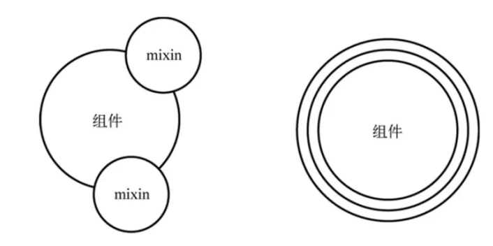

# vue3新特性

## 响应式原理

`Object.defineProperty VS Proxy`

我们知道，Vue2的响应式原理是基于Object.defineProperty的⽅法重新定义对象的getter和setter，⽽Vue3是基于Proxy代理对象，拦截对象属性的访问与赋值过程。差异在于，前者并不能对诸如数组⻓度变化、增删元素操作已经对对象新增属性进⾏感知，⽽在Vue层⾯也不得不重新⼀些数组⽅法（push、pop、unshift、shift等），动态的添加响应式属性，也要使⽤`$set`⽅法。⽽Proxy则完美的解决了这些问题，不过对于不⽀持Proxy对象的浏览器（诸如IE，虽然已经退出历史舞台，但⽬前占⽐还是很⼤），如果要使⽤Vue3，还需要降级兼容。

- 通过Object.defineProperty中的get与set属性实现响应式

```js
// 假设我们在data函数中返回的数据为initData
const initData = { value: 1 };
// 基于initData创建响应式的代理对象data
const data = {};
Object.keys(initData).forEach(key => {
  Object.defineProperty(data, key, {
    get() {
      // 此处依赖收集
      console.log('访问了', key);
      return initData[key];
   },
    set(v) {
      // 此处进⾏了回调更新
      console.log('修改了', key);
      initData[key] = v;
   }
 });
});
// data.value
// 访问了value
// 1
// data.value = 2
// 修改了value
// 2
// data
// {} 因为只是代理，不会对data进⾏设置
// initData.value2 = 2
// 2
// data.value2
// undefined 未在初始时设置，⽆法进⾏依赖收集
```
从上述代码可以看出，initData动态添加的属性，并不能被观测到，这也是Vue.set存在的原因；
Q：Vue.set是如何实现的
A：
set ⽅法主要作⽤是向响应式对象中添加⼀个属性，并确保这个新属性同样是响应式的，且触发视图更新。它必须⽤于向响应式对象上添加新属性，对象不能是 Vue 实例，或者 Vue 实例的根数据对象

Vue.set( target, key, value ) / this.$set( target, key, value )
- target：要更改的数据源(可以是对象或者数组)
- key：要更改的具体数据，或者新增的属性名
- value ：重新赋的值

set ⽅法会对参数中的 target 进⾏类型判断

1. 如果是 undefined 、null 、基本数据类型，直接报错；
2. 如果为数组，取当前数组⻓度与 key 这两者的最⼤值作为数组的新⻓度，然后使⽤数组的 splice ⽅法将传⼊的索引 key 对应的 val 值添加进数组。target 在 observe 的时候，原型链被修改了，splice ⽅法也已经被重写了，触发之后会再次遍历数组，进⾏数据劫持，也就是说当使⽤ splice ⽅法向数组内添加元素时，该元素会⾃动被变成响应式的；
3. 如果为对象，会先判断 key 值是否存在于对象中，如果在，则直接替换 value。如果不在，就判断target 是不是响应式对象（其实就是判断它是否有 __ob__ 属性），接着判断如果它是不是 Vue 实例，或者是 Vue 实例的根数据对象，如果是则抛出警告并退出程序。如果 target 不是响应式对象，就直接给 target 的 key 赋值，如果 target 是响应式对象，就调⽤ defineReactive 将新属性的值添加到 target 上，并进⾏依赖收集，更新视图更新；

```js
// example:
this.$set(data, a, 1);
// 源码
function set(target: Array<any> | Object, key: any, val: any): any {
  // isUndef 是判断 target 是不是等于 undefined 或者 null 。
  // isPrimitive 是判断 target 的数据类型是不是 string、number、symbol、boolean 中的⼀种
  if (process.env.NODE_ENV !== 'production' &&(isUndef(target) || isPrimitive(target))) {
    warn(`Cannot set reactive property on undefined, null, or primitivevalue: ${(target)}`)
  }
  // 数组的处理
  if (Array.isArray(target) && isValidArrayIndex(key)) {
        target.length = Math.max(target.length, key)
        target.splice(key, 1, val)
        return val
  }
  // 对象，并且该属性原来已存在于对象中，则直接更新
  if (key in target && !(key in Object.prototype)) {
    target[key] = val
    return val
 }
  // vue给响应式对象(⽐如 data ⾥定义的对象)都加了⼀个 __ob__ 属性，
  // 如果⼀个对象有这个 __ob__ 属性，那么就说明这个对象是响应式对象，修改对象已有属性的时候就会触发⻚⾯渲染
  // ⾮ data ⾥定义的就不是响应式对象。
  const ob = (target).__ob__
  if (target._isVue || (ob && ob.vmCount)) {
    process.env.NODE_ENV !== 'production' && warn(
      'Avoid adding reactive properties to a Vue instance or its root$data ' +
      'at runtime - declare it upfront in the data option.'
   )
    return val
  }
  // 不是响应式对象
  if (!ob) {
    target[key] = val
    return val
  }
  // 是响应式对象，进⾏依赖收集
  defineReactive(ob.value, key, val)
  // 触发更新视图
  ob.dep.notify()
  return val
}
```
主要根据ob.dep.notify()，这个⾥⾯放着订阅者模式⾥⾯的订阅者，通过notify来通知订阅者做处理

- Proxy可以观测到动态添加的属性的变化，以此实现响应式；

Proxy ⽤于修改某些操作的默认⾏为，等同于在语⾔层⾯做出修改，所以属于⼀种“元编程”（metaprogramming），即对编程语⾔进⾏编程；

Proxy 可以理解成，在⽬标对象之前架设⼀层“拦截”，外界对该对象的访问，都必须先通过这层拦截，因此提供了⼀种机制，可以对外界的访问进⾏过滤和改写。Proxy 这个词的原意是代理，⽤在这⾥表示由它来“代理”某些操作，可以译为“代理器”；

ES6 原⽣提供 Proxy 构造函数，⽤来⽣成 Proxy 实例。

```js
var proxy = new Proxy(target, handler);
```

Proxy 对象的所有⽤法，都是上⾯这种形式，不同的只是handler参数的写法。其中，new Proxy()表示⽣成⼀个Proxy实例，target参数表示所要拦截的⽬标对象，handler参数也是⼀个对象，⽤来定制拦截⾏为。

1. get：⽤来初始化对象或获取值时，设置⾃定义前置检测

```js
var proxy = new Proxy({}, {
  get: function(target, propKey) {
    return 35;
 }
});
let obj = Object.create(proxy);
obj.time // 35
var person = {
  name: "张三"
};
var proxy = new Proxy(person, {
  get: function(target, propKey) {
    if (propKey in target) {
      return target[propKey];
   } else {
      throw new ReferenceError("Prop name \"" + propKey + "\" does notexist.");
   }
 }
});
proxy.name // "张三"
proxy.age // Uncaught ReferenceError: Prop name "age" does not exist.
```

2. set：设置值时逻辑校验

```js
let validator = {
  set: function(obj, prop, value) {
    if (prop === 'age') {
      if (!Number.isInteger(value)) {
        throw new TypeError('The age is not an integer');
     }
      if (value > 200) {
        throw new RangeError('The age seems invalid');
     }
   }
    // 对于满⾜条件的 age 属性以及其他属性，直接保存
    obj[prop] = value;
    return true;
 }
};
let person = new Proxy({}, validator);
person.age = 100;
person.age // 100
person.age = 'young' // 报错
person.age = 300 // 报错
const initData = { value: 1 };
const proxy = new Proxy(initData, {
  get: function (target, key, receiver) {
    // 此处进⾏依赖收集
    console.log('访问了', key);
    return Reflect.get(target, key, receiver);
 },
  set: function (target, key, value, receiver) {
    // 此处执⾏回调更新
    console.log('修改了', key);
    return Reflect.set(target, key, value, receiver);
 }
});
// proxy.value
// 访问了value
// 1
// proxy.value = 2
// 修改了value
// 2
// proxy.value2 = 2
// 修改了value2
// 2
// initData.value3 = 3
// proxy.value3
// 访问了value3
// 3
```

## Vue3新特性

- 可以声明在⼊⼝⽂件内声明多个实例，实例间错误隔离，若没有阻断性错误，不会影响其他实例；
- 更好的⽀持单测；
- ⽀持不同⼈员并⾏开发；

```js
// Vue2
// 所有数据定义在data中，⽅法定义在methods中的，并且使⽤this来调⽤对应的数据和⽅法
new Vue({
});
// Vue3
createApp(App).mount('#app);
createApp(MyApp).mount('#app);
```

### Composition API

```vue
<template>
  <div class="homePage">
    <p>count: {{ count }}</p>   
    <p>倍数： {{ multiple }}</p>       
    <div>
      <button style="margin-right: 10px" @click="increase">加1</button>
      <button @click="decrease">减⼀</button>    
    </div>     
  </div>
</template>
<script>
export default {
  data() {
    return { count: 0 };
 },
  computed: {
    multiple() {
      return 2 * this.count;
   },
 },
  methods: {
    increase() {
      this.count++;
   },
    decrease() {
      this.count--;
   },
 },
};
</script>
```

针对count的加减以及显示倍数， 就需要分别在 data、methods、computed 中进⾏操作，⼀个⼩的需求经常会导致在data、methods、computed中进⾏操作，随着业务复杂程度提升，其中内容会随之增加；

在vue2.x 版本给出的解决⽅案就是 Mixin, 但是使⽤ Mixin 也会遇到让⼈苦恼的问题：
1. 命名冲突问题；
2. 不清楚暴露出来的变量的作⽤；
3. 逻辑重⽤到其他 component 经常遇到问题；

在Vue3.x 就推出了Composition API主要就是为了解决上⾯的问题，将零散分布的逻辑组合在⼀起来维护，并且还可以将单独的功能逻辑拆分成单独的⽂件。

### setup

setup() 函数是 vue3 中，专⻔为组件提供的新属性。它为我们使⽤ vue3 的 Composition API 新特性提供了统⼀的⼊⼝, setup 函数会在 beforeCreate 、created 之前执⾏, vue3也是取消了这两个钩⼦，统⼀⽤setup代替, 该函数相当于⼀个⽣命周期函数，vue中过去的data，methods，watch等全部都⽤对应的
新增api写在setup()函数中

```vue
setup(props, context) {
  // Attribute (⾮响应式对象，等同于 $attrs)
  context.attrs
  // 插槽 (⾮响应式对象，等同于 $slots)
  context.slots
  // 触发事件 (⽅法，等同于 $emit)
  context.emit
  // 暴露公共 property (函数)
  context.expose
    
  return {}
}
// example
<!-- MyBook.vue -->
<template>
  <div>{{ collectionName }}: {{ readersNumber }} {{ book.title }}</div>
</template>
<script>
  import { ref, reactive } from 'vue'
  export default {
    props: {
      collectionName: String
   },
    setup(props) {
      const readersNumber = ref(0)
      const book = reactive({ title: 'Vue 3 Guide' })
      // 暴露给 template
      return {
        readersNumber,
        book
     }
   }
 }
</script>
```
- props: ⽤来接收 props 数据, props 是响应式的，当传⼊新的 props 时，它将被更新；
- context ⽤来定义上下⽂, 上下⽂对象中包含了⼀些有⽤的属性，这些属性在 vue 2.x 中需要通过
- this 才能访问到, 在 setup() 函数中⽆法访问到 this，是个 undefined；
- context 是⼀个普通的 JavaScript 对象，也就是说，它不是响应式的，这意味着你可以安全地对
  context 使⽤ ES6 解构；
- 返回值: return {}, 返回响应式数据, 模版中需要使⽤的函数；

:::warning
注意： 因为 props 是响应式的， 你不能使⽤ ES6 解构，它会消除 prop 的响应性
:::

```vue
<script>
import { defineComponent, reactive, ref, toRefs } from 'vue';
export default defineComponent({
  setup(props, context) {
  
    const { title } = toRefs(props)
    
    console.log(title.value)
    
    return {}
 }
});
</script>
```
如果 title 是可选的 prop，则传⼊的 props 中可能没有 title 。在这种情况下，toRefs 将不会为 title 创建⼀个 ref 。你需要使⽤ toRef 替代它：

```vue
<script lang="ts">
import { defineComponent, reactive, toRef, toRefs } from 'vue';
export default defineComponent({
  setup(props, context) {
  
    const { title } = toRef(props, 'title')
    
    console.log(title.value)
    
    return {}
 }
});
</script>
```

### reactive()，shallowReactive()

- reactive()

函数接收⼀个普通对象，返回⼀个响应式的数据对象, 相当于 Vue 2.x 中的 Vue.observable() API，响应式转换是“深层”的——它影响所有嵌套属性。基于proxy来实现，想要使⽤创建的响应式数据也很简单，创建出来之后，在setup中return出去，直接在template中调⽤即可；

```js
setup() {
  const person = {
    name: 'xianzao',
    age: 1,
    contacts: {
      phone: 123456789,
   },
 };
  const personReactive = reactive(person);
  // 查看 reactive 实例结构
  console.log('reactive', personReactive);
  // 获取嵌套对象属性
  const contacts = personReactive.contacts;
  // 因为深层响应，所以依然有响应性
  console.log('contacts属性：', contacts);
  // 获取简单类型的属性
  let name = toRef(personReactive.name);
  // name属性是简单类型的，所以失去响应性，如果需要响应式，需要使⽤toRef(name)
  console.log('name属性：', name);
},
```

- shallowReactive()：创建⼀个响应式代理，它跟踪其⾃身属性的响应性shallowReactive⽣成⾮递归
  响应数据，只监听第⼀层数据的变化，但不执⾏嵌套对象的深层响应式转换 (暴露原始值)；

```js
const personShallowReactive = shallowReactive(person);
// 查看 reactive 实例结构
console.log('shallow reactive', personShallowReactive);
// 获取嵌套对象属性
const shallowContacts = personShallowReactive.contacts;
// 因为深层响应，所以依然有响应性
console.log('shallow contacts属性：', shallowContacts);
// 获取简单类型的属性
let shallowName = personShallowReactive.name;
// name属性是简单类型的，所以失去响应性，如果需要响应式，需要使⽤toRef(name)
console.log('shallow name属性：', shallowName);
```

### ref()，isRef()，toRefs()

- ref() 函数⽤来根据给定的值创建⼀个响应式的数据对象，ref() 函数调⽤的返回值是⼀个对象，这个对象上只包含⼀个 value 属性, 只在setup函数内部访问ref函数需要加.value，其⽤途创建独⽴的原始值；

```vue
<template>
    <div class="mine">
       {{count}} // 10
    </div>
</template>
<script>
import { defineComponent, ref } from 'vue';
export default defineComponent({
  setup() {
    const count = ref<number>(10)
    // 在js 中获取ref 中定义的值, 需要通过value属性
    console.log(count.value);
    return {
       count
   }
   }
});
</script>
```
在reactive对象中访问ref创建的响应式数据

```vue
<template>
    <div class="mine">
       {{count}} -{{t}} // 10 -100
    </div>
</template>
<script>
import { defineComponent, reactive, ref, toRefs } from 'vue';
export default defineComponent({
  setup() {
    const count = ref<number>(10)
    const obj = reactive({
      t: 100,
      count
   })
  
    // 通过reactive 来获取ref 的值时,不需要使⽤.value属性， ref 将被⾃动解包
    console.log(obj.count); // 10
    console.log(obj.count === count.value); // true
    
    // count 改变时，更新 `obj.count
    count.value = 12
    console.log(count.value) // 12
    console.log(obj.count) // 12
    
    // 反之，修改obj 的count 值 ，ref 也会更新
   obj.count = 20
   console.log(obj.count) // 20
   console.log(count.value) // 20
    
    return {
       ...toRefs(obj)
   }
   }
});
</script>
```
reactive 将解包所有深层的 refs，同时维持 ref 的响应性。当将 ref分配给 reactive property 时，ref 将被⾃动解包

- isRef()

⽤来判断某个值是否为 ref() 创建出来的对象

```js
const count = ref(10);
const user = 'xianzao';
// 判断是否为ref创建出来的
console.log('user is ref? ', isRef(user));
console.log('count is ref? ', isRef(count));
```

- toRefs()

将 reactive() 创建出来的响应式对象，转换为普通的对象，只不过，这个对象上的每个属性节点，都是ref() 类型的响应式数据

### readonly()、isReadonly()、shallowReadonly()

- readonly: 传⼊ref或 reactive对象,并返回⼀个原始对象的只读代理,对象内部任何嵌套的属性也都是
  只读的、 并且是递归只读；

- isReadonly: 检查对象是否是由 readonly 创建的只读对象；

```js
const obj = reactive({
  t: 100,
  count,
});
// 设置obj为readonly
const objOnly = readonly(obj);
console.log('read only obj is: ', objOnly);
// obj.t = 200;
objOnly.t = 200;
console.log('changed obj is: ', obj);
console.log('changed read only obj is: ', objOnly);
console.log('changed obj is read only?: ', isReadonly(obj));
console.log('changed read only obj is read only?: ', isReadonly(objOnly),objOnly.t);
```
Q：如果设置obj.t = 200，那objonly.t是多少？
A：也是200，因为修改的⾮readonly，设置完readonly后的元素还是reactive的；

- shallowReadonly 作⽤只处理对象最外层属性的响应式（浅响应式）的只读，但不执⾏嵌套对象的深度只读转换 (暴露原始值)

```js
// 设置obj为shallowReadOnly
const objShallowOnly = shallowReadonly(obj);
console.log('shallow read only obj is: ', objShallowOnly);
objShallowOnly.t = 200;
objShallowOnly.userInfo.age = 777;
console.log('changed shallow read only obj is:', objShallowOnly);
```

### computed()，watch()，data

- computed()

该函数⽤来创造计算属性，它返回的值是⼀个ref对象。 ⾥⾯可以传⽅法，或者⼀个对象，对象中包含set()、get()⽅法；

```js
// 创建只读的计算属性
import { computed, defineComponent, ref } from 'vue';
export default defineComponent({
  setup(props, context) {
    const age = ref(18)
    // 根据 age 的值，创建⼀个响应式的计算属性 readOnlyAge,它会根据依赖的 ref ⾃动计算并返回⼀个新的 ref
    const readOnlyAge = computed(() => age.value++) // 19
    return {
      age,
      readOnlyAge
   }
 }
});
```
```vue
// 通过set()、get()⽅法创建⼀个可读可写的计算属性
<script>
import { computed, defineComponent, ref } from 'vue';
export default defineComponent({
  setup(props, context) {
    const age = ref<number>(18)
    const computedAge = computed({
      get: () => age.value + 1,
      set: value => age.value + value
   })
    // 为计算属性赋值的操作，会触发 set 函数, 触发 set 函数后，age 的值会被更新
    age.value = 100
    return {
      age,
      computedAge
   }
 }
});
</script>
```

- watch()

watch 函数⽤来侦听特定的数据源，并在回调函数中执⾏副作⽤。默认情况是懒执⾏的，也就是说仅在侦听的源数据变更时才执⾏回调；

```vue
// 1. 监听reactive声明的数据源
<script>
import { computed, defineComponent, reactive, toRefs, watch } from 'vue';
export default defineComponent({
  setup(props, context) {
    const state = reactive({ name: 'vue', age: 10 })
    watch(
     () => state.age,
     (age, preAge) => {
        console.log(age); // 100
        console.log(preAge); // 10
     }
   )
    // 修改age 时会触发watch 的回调, 打印变更前后的值
    state.age = 100
    return {
      ...toRefs(state)
   }
 }
});
</script>
```

```vue
// 2. 监听⽤ref声明的数据源
<script>
import { defineComponent, ref, watch } from 'vue';
export default defineComponent({
  setup(props, context) {
    const age = ref(10);
    watch(age, () => console.log(age.value)); // 100
    
    // 修改age 时会触发watch 的回调, 打印变更后的值
    age.value = 100
    return {
      age
   }
 }
});
</script>
```
```vue
// 3. 同时监听多个值
<script>
import { computed, defineComponent, reactive, toRefs, watch } from 'vue';
export default defineComponent({
  setup(props, context) {
    const state = reactive({ name: 'vue', age: 10 })
    watch(
     [() => state.name, () => state.age],
     ([newName, newAge], [oldName, oldAge]) => {
        console.log(newName);
        console.log(newAge);
        console.log(oldName);
        console.log(oldAge);
     }
   )
    // 修改age 时会触发watch 的回调, 打印变更前后的值, 此时需要注意, 更改其中⼀个值, 都会执⾏watch的回调
    state.age = 100
    state.name = 'vue3'
    return {
      ...toRefs(state)
   }
 }
});
</script>
```
```vue
// 4. stop停⽌监听
// 在 setup() 函数内创建的 watch 监视，会在当前组件被销毁的时候⾃动停⽌。
// 如果想要明确地停⽌某个监视，可以调⽤ watch() 函数的返回值即可，语法如下：
<script>
import { set } from 'lodash';
import { computed, defineComponent, reactive, toRefs, watch } from 'vue';
export default defineComponent({
  setup(props, context) {
    const state = reactive({ name: 'vue', age: 10 })
    const stop =  watch(
     [() => state.age, () => state.name],
     ([newName, newAge], [oldName, oldAge]) => {
        console.log(newName);
        console.log(newAge);
        console.log(oldName);
        console.log(oldAge);
     }
   )
    // 修改age 时会触发watch 的回调, 打印变更前后的值, 此时需要注意, 更改其中⼀个值, 都会执⾏watch的回调
    state.age = 100
    state.name = 'vue3'
    setTimeout(()=> {
      stop()
      // 此时修改时, 不会触发watch 回调
      state.age = 1000
      state.name = 'vue3-'
   }, 1000) // 1秒之后讲取消watch的监听
    
    return {
      ...toRefs(state)
   }
 }
});
</script>
```

- data

```js
// Vue3中唯⼀⽤法
data: {
  return {
    flag: true
 }
}
// Vue2中不推荐使⽤，但不会报错，但在Vue3中会报错
data: {
  flag: true
}
```
Q：为什么data不能使⽤⼀个对象，⽽是每次都返回⼀个函数？
A：如果是以对象中的数据返回的话，组件之中会共⽤同⼀块内存，在⼀个组件中修改数据，另⼀个组件也会受到影响；⽤函数 return 出去的形式，每次 return 都会alloc新的内存，各个组件中得 data 也就没有任何关系

### 多根节点组件

多根节点允许template标签内直接出现多个⼦集的标签
类似React包含的\<Fragment\>，实际不会产⽣新的标签

```vue
<template>
 <h1>My app!</h1>
 <async-comp />
</template>
```

### 生命周期


新版的⽣命周期函数，可以按需导⼊到组件中，且只能在 setup() 函数中使⽤, 但是也可以在setup 外定义, 在 setup 中使⽤；

setup 是围绕 beforeCreate 和 created ⽣命周期钩⼦运⾏的，所以不需要显式地定义它们。换句话说，在这些钩⼦中编写的任何代码都应该直接在 setup 函数中编写。

|   选项式API   | Hook inside setup |
| ---- | ---- |
|beforeCreate| Not needed*|
|created |Not needed*|
|beforeMount| onBeforeMount|
|mounted |onMounted|
|beforeUpdate| onBeforeUpdate|
|updated |onUpdated|
|beforeUnmount| onBeforeUnmount|
|unmounted |onUnmounted|
|errorCaptured| onErrorCaptured|
|renderTracked |onRenderTracked|
|renderTriggered| onRenderTriggered|
|activated |onActivated|
|deactivated| onDeactivated|

注意，若要在setup中引⼊，需要在vue中引⼊对应hook

```js
import { defineComponent, onBeforeMount, onBeforeUnmount, onBeforeUpdate,onErrorCaptured, onMounted, onUnmounted, onUpdated } from 'vue';
```

下⾯按照⻚⾯的⽣命周期进⾏说明：

### ⻚⾯初始化

涉及钩⼦： beforeCreate 、 created 、 beforeMount 、 renderTracked 、 mounted ；

```js
// 此时data还不可⽤
beforeCreate() {
  console.log('beforeCreate');
},
// data可⽤，DOM不可⽤
created() {
  console.log('created');
},
  
// 在这个钩⼦后，mounted⽣命周期钩⼦之前，render函数（渲染⻚⾯函数）⾸次被调⽤
beforeMount() {
  console.log('beforeMount');
},
// ⻚⾯有取值操作时（如：绑定数据，e.g. 插值语法{{ count }}）触发
renderTracked({ type, key, target, effect }) {
  console.log('renderTracked ----', { type, key, target, effect });
},
// ⻚⾯挂载完毕后触发
mounted() {
  console.log('mounted');
},
  
// 输出
beforeCreate
created
beforeMount
renderTracked ---- {type: "get", key: "count", target: {...}, effect: f}
mounted
```
Vue3.x新增⽣命周期renderTracked说明
官⽅解释：跟踪虚拟DOM重新渲染时调⽤（初始化渲染时也会调⽤）。钩⼦接收 debugger event 作为参数。此事件告诉你哪个操作跟踪了组件以及该操作的⽬标对象和键。
简单理解来说就是：⻚⾯上绑定了响应式数据（取值），就会触发该操作。

### 数据发⽣变化后触发

涉及钩⼦： `renderTriggered` 、 `beforeUpdate` 、 `renderTracked` 、 `updated`

```js
// 2. 数据发⽣改变后触发
 renderTriggered(e) {
 console.log('renderTriggered ----', e);
 },
 /*---------
 在数据发⽣改变后，DOM被更新之前调⽤。
 ----------*/
 beforeUpdate() {
 console.log('beforeUpdate');
 },
 /*---------
 DOM更新完毕之后调⽤。
 注意事项：updated不会保证所有⼦组件也都被重新渲染完毕
 ---------*/
 updated() {
 console.log('updated');
 },
    
// 输出
renderTriggered ---- {target: {...}, key: "count", type: "set", newValue:2, effect: f, oldTarget: undefined, oldValue: 1}
beforeUpdate
update
```

Vue3.x新增⽣命周期renderTriggered说明
官⽅解释：当虚拟DOM重新渲染被触发时调⽤。接收debugger event作为参数。此事件告诉你是什么操作触发了重新渲染，以及该操作的⽬标对象和键。
简单理解：做了某件事，从⽽引发了⻚⾯的重新渲染。

debugger event 说明
- type：操作类型，有set、add、clear、delete，也就是修改操作；
- key：键，简单理解就是操作数据的key。e.g.上⽂使⽤的count；
- target：响应式对象，如：data、ref、computed；
- effect：数据类型为Function。英⽂单词意思为唤起、执⾏的意思。effect⽅法的作⽤是重新render视图；
- newValue：新值；
- oldValue：旧值；
- oldTarget：旧的响应式对象；

### 组件被卸载时触发

涉及钩⼦： `beforeUnmount` 、 `unmounted`

```js
beforeUnmount() {
  console.log("beforeUnmount");
},
// 卸载组件实例后调⽤。
unmounted() {
  console.log("unmounted");
}
```

### 捕获错误时触发

涉及钩⼦： errorCaptured
错误传播规则
- 默认情况下，如果全局的 config.errorHandler 被定义，所有的错误仍会发送它，因此这些错误仍然会向单⼀的分析服务的地⽅进⾏汇报；
- 如果⼀个组件的继承链或⽗级链中存在多个 errorCaptured 钩⼦，则它们将会被相同的错误逐个唤起；
- 如果此 errorCaptured 钩⼦⾃身抛出了⼀个错误，则这个新错误和原本被捕获的错误都会发送给全局的 config.errorHandler；
- ⼀个 errorCaptured 钩⼦能够返回 false 以阻⽌错误继续向上传播。本质上是说“这个错误已经被搞定了且应该被忽略”。它会阻⽌其它任何会被这个错误唤起的 errorCaptured 钩⼦和全局的config.errorHandler；

### 全局配置

在Vue2中，我们要在全局封装通⽤的⽅法，会在⼊⼝⽂件中统⼀声明：

```js
Vue.prototype.$api = api;
Vue.prototype.$http = http;
```

可以通过在原型上定义它们使其在每个 Vue 的实例中可⽤，从⽽达到在Vue实例⾥使⽤`this.$XXX`访问对应⽅法；但是有的时候它会让其他开发者感到混乱。例如他们可能看到了 `this.$http` ，会觉得没有⻅过此功能，或者你打算去搜索如何使⽤它，但是搜不到结果，因为他们并没有发现这是⼀个 axios 的别名；

从技术上讲，Vue 2 没有“app”的概念，我们定义的应⽤只是通过 new Vue() 创建的根 Vue 实例。从同⼀个 Vue 构造函数创建的每个根实例共享相同的全局配置，因此：

1. 在测试期间，全局配置很容易意外地污染其他测试⽤例。⽤户需要仔细地存储原始全局配置；
2. 全局配置使得在同⼀⻚⾯上的多个“应⽤”在全局配置不同时共享同⼀个 Vue 副本⾮常困难；

```js
// 这会影响到所有根实例
Vue.mixin({
  /* ... */
})
const app1 = new Vue({ el: '#app-1' })
const app2 = new Vue({ el: '#app-2' })
```

在Vue3⾥，通过vue 实例上config来配置,包含Vue应⽤程序全局配置的对象。您可以在挂载应⽤程序之前修改下⾯列出的属性；

```js
const app = Vue.createApp({})
app.config = {...}
```

为组件渲染功能和观察程序期间的未捕获错误分配处理程序。错误和应⽤程序实例将调⽤处理程序

```js
app.config.errorHandler = (err, vm, info) => {}
```

可以在应⽤程序内的任何组件实例中访问的全局属性，组件的属性将具有优先权。同时，可以在组件⽤通过 getCurrentInstance() 来获取全局globalProperties 中配置的信息,getCurrentInstance ⽅法获取当前组件的实例，然后通过 ctx 属性获得当前上下⽂，这样我们就能在setup中使⽤router和vuex, 通过这个属性我们就可以操作变量、全局属性、组件属性等等；

```js
const app = Vue.createApp({})
app.config.globalProperties.$http = 'xxxxxxxxs'
setup( ) {
  const { ctx } = getCurrentInstance();
  ctx.$http  
}
```

### 异步组件

Vue3中，异步组件需要使⽤ defineAsyncComponent 创建

全局注册

```js
// 可以利⽤返回值的实例去⾃定义注册异步组件，在哪个应⽤⾥⽣效，在哪个应⽤⾥注册
const AsyncComp = defineAsyncComponent(() => import('./components/AsyncComp.vue'));
app.component('async-comp', AsyncComp);
```

局部注册

```js
// main.js
const AsyncComp = defineAsyncComponent(() =>
import('./components/AsyncComp.vue'));
// app.vue
import AsyncComp from './components/AsyncComp.vue';
{
  components: {'async-comp': AsyncComp}
}
```

异步组件作⽤：

1. 打包后不会集成在index.js中，会单独进⾏打包，⽅便后续操作，可以进⾏缓存，如多个⻚⾯都使⽤⼀个相同的组件，可以将打包⽂件缓存下来；
2. 如果组件包过⼤，可以使⽤loading代替显示；

Vue3也⽀持了Suspense组件

在React V16.6.0中，官⽅提出了lazy和suspense组件

```js
import React, { Suspense } from 'react';
const myComponent = React.lazy(() => import('./Component'));
function MyComponent() {
  return (
    <div>
      <Suspense fallback={<div>Loading...</div>}>
        <myComponent />
      </Suspense>
    </div>
 );
}
```

在Vue3中，也实现了类似功能的Suspense：

1. \<suspense\> 组件有两个插槽。它们都只接收⼀个直接⼦节点。default 插槽⾥的节点会尽可能展示出来。如果不能，则展示 fallback 插槽⾥的节点；
2. 异步组件不需要作为 \<suspense\> 的直接⼦节点。它可以出现在组件树任意深度的位置，且不需要出现在和 \<suspense\> ⾃身相同的模板中。只有所有的后代组件都准备就绪，该内容才会被认为解析完毕；

```js
<template>
  <Suspense>
    <template #default>
      <my-component />
    </template>
    <template #fallback>
      Loading ...
    </template>
  </Suspense>
</template>
<script lang='ts'>
import { defineComponent, defineAsyncComponent } from "vue";
const MyComponent = defineAsyncComponent(() => import('./Component'));
export default defineComponent({
   components: {
     MyComponent
   },
   setup() {
     return {}
   }
})
</script>
```

3. 还有⼀种触发 fallback 的⽅式是让后代组件从 setup 函数中返回⼀个 Promise。通常这是通过async 实现的，⽽不是显式地返回⼀个 Promise：

```js
export default {
  async setup() {
    // 在 `setup` 内部使⽤ `await` 需要⾮常⼩⼼
    const data = await loadData()
    // 它隐性地包裹在⼀个 Promise 内
    // 因为函数是 `async` 的
    return {
      // ...
   }
 }
}
```

4. 如何通过⼦组件触发更新&事件更新
如果根结点发⽣了变化，它会触发 pending 事件。然⽽，默认情况下，它不会更新 DOM 以展示fallback 内容。取⽽代之的是，它会继续展示旧的 DOM，直到新组件准备就绪。这个⾏为可以通过timeout prop 进⾏控制。这个值是⼀个毫秒数，告诉 \<suspense\> 组件多久之后展示 fallback。如果这个值是 0 则表示它\<suspense\>进⼊等待状态时会⽴即显示。除了 pending 事件以外，\<suspense\>组件还拥有 resolve 和 fallback 事件。resolve 事件会在 default 插槽完成新内容的解析之后被触发。fallback 事件会在 fallback 插槽的内容展示的时候被触发；

### 自定义指令

在Vue2⾥，我们通过以下⽅式执⾏：

```js
Vue.directive('focus', {
  bind() {},
  inserted(el) {
    el.focus()
  },
  update() {},
  componentUpdated() {},
  unbind() {}
})
```

在Vue3中有所不同，需要在 Vue.createApp({}) 中使⽤

- 参数：
  - {string} name
  - {Function | Object} [definition]
- 返回值：
  - 如果传⼊ definition 参数，则返回应⽤实例。
  - 如果不传⼊ definition 参数，则返回指令定义。

- ⽤法：注册或检索全局指令。

#### 指令支持形式

- 全局指令

```js
const app = Vue.createApp({})
// 注册⼀个全局⾃定义指令 `v-focus`
app.directive('focus', {
  // 当被绑定的元素挂载到 DOM 中时……
  mounted(el) {
    // 聚焦元素
    el.focus()
 }
})
```

- 局部指令

```js
directives: {
  focus: {
    // 指令的定义
    mounted(el) {
      el.focus()
   }
 }
}
<input v-focus />
```

指令定义对象可以提供如下⼏个钩⼦函数 (均为可选)：
- created：在绑定元素的 attribute 或事件监听器被应⽤之前调⽤。在指令需要附加在普通的 v-on 事
- 件监听器调⽤前的事件监听器中时，这很有⽤；
- beforeMount：当指令第⼀次绑定到元素并且在挂载⽗组件之前调⽤；
- mounted：在绑定元素的⽗组件被挂载后调⽤；
- beforeUpdate：在更新包含组件的 VNode 之前调⽤；
- updated：在包含组件的 VNode 及其⼦组件的 VNode 更新后调⽤；
- beforeUnmount：在卸载绑定元素的⽗组件之前调⽤；
- unmounted：当指令与元素解除绑定且⽗组件已卸载时，只调⽤⼀次；

#### Vue3与Vue2指令变化

|   vue3   | vue2 |
| ---- | ---- |
|created||
|beforeMount| bind|
|mounted| inserted|
|beforeUpdate |update|
|updated| componentUpdated|
|beforeUnmount||
|unmounted| unbind|

#### 动态指令参数

```js
// 固定到距离顶部200px位置
<div id="dynamic-arguments-example" class="demo">
  <p>Scroll down the page</p>
  <p v-pin="200">Stick me 200px from the top of the page</p>
</div>

const app = Vue.createApp({})
app.directive('pin', {
  mounted(el, binding) {
    el.style.position = 'fixed'
    // binding.value 是我们传递给指令的值——在这⾥是 200
    el.style.top = binding.value + 'px'
 }
})
app.mount('#dynamic-arguments-example')

// 固定在指定⽅向上指定位置
<div id="dynamicexample">
  <h3>Scroll down inside this section ↓</h3>
  <p v-pin:[direction]="200">I am pinned onto the page at 200px to the left.</p>
</div>
const app = Vue.createApp({
  data() {
    return {
      direction: 'right'
   }
 }
})
app.directive('pin', {
  mounted(el, binding) {
    el.style.position = 'fixed'
    // binding.arg 是我们传递给指令的参数
    const s = binding.arg || 'top'
    el.style[s] = binding.value + 'px'
 }
})
app.mount('#dynamic-arguments-example')
```

#### 栗子

```js
// main.js
app.directive('copy', {
  beforeMount(el, binding) {
    const success = binding.arg;
    el.targetContent = binding.value;
    el.addEventListener('click', () => {
      if (!el.targetContent) return console.warn('没有需要复制的⽬标内容');
      // 创建textarea标签
      const textarea = document.createElement('textarea');
      // 设置相关属性
      textarea.readOnly = 'readonly';
      textarea.style.position = 'fixed';
      textarea.style.top = '-99999px';
      // 把⽬标内容赋值给它的value属性
      textarea.value = el.targetContent;
      // 插⼊到⻚⾯
      document.body.appendChild(textarea);
      // 调⽤onselect()⽅法
      textarea.select();
      // 把⽬标内容复制进剪贴板, 该API会返回⼀个Boolean
      const res = document.execCommand('Copy');
      res && success && console.log('复制成功，剪贴板内容：' +el.targetContent);
      // 移除textarea标签
      document.body.removeChild(textarea);
    });
  },
  updated(el, binding) {
    // 实时更新最新的⽬标内容
    el.targetContent = binding.value;
  },
  unmounted(el) {
    el.removeEventListener('click', () => {});
  },
});
// App.vue
<button v-copy:[success]="msg">点击复制</button>
```

### teleport

teleport是⼀种将⼦节点渲染到存在于⽗组件以外的 DOM 节点的⽅案

当处理某些类型的组件（如模式，通知或提示）时，模板HTML的逻辑可能位于与我们希望渲染元素的位置不同的⽂件中。

很多时候，与我们的Vue应⽤程序的DOM完全分开处理时，这些元素的管理要容易得多。 所有这些都是因为处理嵌套组件的位置，z-index和样式可能由于处理其所有⽗对象的范围⽽变得棘⼿。

这种情况就是 Teleport 派上⽤场的地⽅。 我们可以在逻辑所在的组件中编写模板代码，这意味着我们可以使⽤组件的数据或 props。 但是，然后完全将其渲染到我们Vue应⽤程序的范围之外。

```vue
// Dialog.vue
<template>
 <div class="portals">
 <button @click="showNotification">Trigger Notification!</button>
 <teleport to="#portal">
 <div v-if="isOpen" class="notification">
 This is rendering outside of this child component!
 </div>
 </teleport>
 </div>
</template>
<script>
import { ref } from 'vue';
export default {
  setup() {
    const isOpen = ref(false);
    var closePopup;
    const showNotification = () => {
      isOpen.value = true;
      clearTimeout(closePopup);
      closePopup = setTimeout(() => {
        isOpen.value = false;
      }, 2000);
    };
    return {
      isOpen,
      showNotification,
    };
  },
};
</script>
<style scoped>
  .notification {
    font-family: myriad-pro, sans-serif;
    position: fixed;
    bottom: 20px;
    left: 20px;
    width: 300px;
    padding: 30px;
    background-color: #fff;
  }
</style>
// index.html
<div id="portal"></div>
```

Teleport具有⼀个必填属性- to
to 需要 prop，必须是有效的查询选择器或 HTMLElement (如果在浏览器环境中使⽤)。指定将在其中移动 \<teleport\> 内容的⽬标元素

与React16提出的Portals功能⼗分类似，都是在指定的DOM节点下添加元素，可以参考各种组件库，基本上dialog等组件在Vue3中的实现都有使⽤到teleport，在React组件中都有⽤到Portals；

### 自定义hooks

Vue3的hooks其实可以参考React的⾃定义hooks的定义， 在 React 中，在函数组件中保留 state 数据的同时，融⼊⽣命周期函数，将组件整体作为⼀个钩⼦函数。

当组件复杂时，多个组件中⼀些重复的逻辑可以被抽象出来。在 Hook 诞⽣之前，React 和 Vue 都拥有⾼阶组件的设计模式，在 React 使⽤到 HOC，在 Vue 2 中使⽤到 mixin。为什么要舍弃它们⽽使⽤Hook，使⽤⾃定义 Hook ⼜有哪些优点，我们先简单了解⼀下 HOC 和 mixin ，对⽐后便知。



HOC 的原理是把组件作为参数传⼊⼀个函数，加⼊复⽤部分后将新的组件作为返回值，使⽤了装饰器模式。mixin 像是把复⽤的部分拆解成⼀个个⼩零件，某个组件需要时就拼接进去。

在实践中，mixin 有如下缺点：
1. 引⼊了隐式依赖关系。
2. 不同 mixins 之间可能会有先后顺序甚⾄代码冲突覆盖的问题
3. mixin 代码会导致滚雪球式的复杂性
4. 多个 mixin 导致合并项不明来源

为了避开这些问题，React 采⽤ HOC，但它依然存在缺陷：
1. ⼀个组件的state影响许多组件的props
2. 造成地狱嵌套

不过使⽤全新的 Hook 组件结构，可以实现平铺式调⽤组件的复⽤部分，解决了 mixin 的来源不明和HOC 的地狱嵌套问题。

#### 栗子

在点击⻚⾯时，记录⿏标的位置

```js
// src/hooks/useMousePosition.ts
import { ref, onMounted, onUnmounted, Ref } from 'vue'
function useMousePosition() {
  const x = ref(0)
  const y = ref(0)
  const updateMouse = (e) => {
    x.value = e.pageX
    y.value = e.pageY
  }
  onMounted(() => {
    document.addEventListener('click', updateMouse)
  })
  onUnmounted(() => {
    document.removeEventListener('click', updateMouse)
  })
  return { x, y }
}
export default useMousePosition
```

```vue
<template>
  <div>
    <p>X: {{ x }}</p>
    <p>Y: {{ y }}</p>
  </div>
</template>
<script lang="ts">
import { defineComponent} from 'vue'
// 引⼊hooks
import useMousePosition from '../../hooks/useMousePosition'
export default defineComponent({
  setup () {
    // 使⽤hooks功能
    const { x, y } = useMousePosition()
    return {
      x,
      y
   }
 }
})
</script>
```

### Provide/Inject

当我们需要从⽗组件向⼦组件传递数据时，可以使⽤ props。想象⼀下这样的结构：但对于⼀些深度嵌套的组件，如果仍然将 prop 沿着组件链逐级传递下去，会很麻烦。对于这种情况，我们可以使⽤⼀对provide 和 inject 。⽆论组件层次结构有多深，⽗组件都可以作为其所有⼦组件的依赖提供者。这个特性有两个部分：⽗组件有⼀个 provide 选项来提供数据，⼦组件有⼀个inject 选项来开始使⽤这些数据。

#### 基础使用

```vue
<script>
import { defineComponent } from 'vue';
export default defineComponent({
  provide: {
    provideData: { name: "xiaokai" },
  }
});
</script>
// ⼦组件
<template>
  <div class="hello">
    <h1>{{ msg }}</h1>
    {{ provideData }}
  </div>
</template>
<script>
export default defineComponent({
  name: "HelloWorld",
  props: {
    msg: String,
 },
  inject: ["provideData"],
});
</script>
```

#### setup()中使用

在 setup() 中使⽤, 则需要从 vue 显式导⼊provide、inject⽅法。导⼊以后，我们就可以调⽤它来定义暴露给我们的组件⽅式。

provide 函数允许你通过两个参数定义属性：
- name：参数名称
- value：属性的值

```vue
// ⽗组件
<script>
import { provide } from "vue";
import HelloWorldVue from "./components/HelloWorld.vue";
export default defineComponent({
  name: "App",
  components: {
    HelloWorld: HelloWorldVue,
 },
  setup() {
    provide("provideData", {
      name: "先早",
   });
 },
});
</script>
// ⼦组件
<script>
import { provide, inject } from "vue";
export default defineComponent({
  name: "HelloWorld",
  props: {
    msg: String,
 },
  setup() {
    const provideData = inject("provideData");
    console.log(provideData); // { name: "先早" }
    return {
      provideData,
   };
 },
});
</script>
```

#### 传递响应式数据

在 provide 值时使⽤ ref 或 reactive

```vue
<script>
import { provide, reactive, ref } from "vue";
import HelloWorldVue from "./components/HelloWorld.vue";
export default defineComponent({
  name: "App",
  components: {
    HelloWorld: HelloWorldVue,
  },
  setup() {
    const age = ref(18);
    provide("provideData", {
      age,
      data: reactive({ name: "先早" }),
    });
  },
});
</script>
<script lang="ts">
import { inject } from "vue";
export default defineComponent({
  name: "HelloWorld",
  props: {
    msg: String,
 },
  setup() {
    const provideData = inject("provideData");
    console.log(provideData);
    return {
      provideData,
   };
 },
});
</script>
```

## ⼀个完整的Vue3组件模板

```vue
<template>
  <div class="mine" ref="elmRefs">
    <span>{{name}}</span>
    <br>
    <span>{{count}}</span>
    <div>
      <button @click="handleClick">测试按钮</button>
    </div>
    <ul>
      <li v-for="item in list" :key="item.id">{{item.name}}</li>
    </ul>
  </div>
</template>
<script lang="ts">
import { computed, defineComponent, getCurrentInstance, onMounted,PropType, reactive, ref, toRefs } from 'vue';
interface IState {
  count: number
  name: string
  list: Array<object>
}
export default defineComponent({
  name: 'demo',
  // ⽗组件传⼦组件参数
  props: {
    name: {
      type: String as PropType<null | ''>,
      default: 'vue3.x'
    },
    list: {
      type: Array as PropType<object[]>,
      default: () => []
    }
  },
  components: {
    /// TODO 组件注册
  },
  emits: ["emits-name"], // 为了提示作⽤
  setup (props, context) {
      console.log(props.name)
      console.log(props.list)
     const state = reactive<IState>({
      name: 'vue 3.0 组件',
      count: 0,
      list: [
       {
          name: 'vue',
          id: 1
       },
       {
          name: 'vuex',
          id: 2
       }
     ]
    })
    const a = computed(() => state.name)
    onMounted(() => {
    })
    function handleClick () {
      state.count ++
      // 调⽤⽗组件的⽅法
      context.emit('emits-name', state.count)
    }
  
    return {
      ...toRefs(state),
      handleClick
    }
  }
});
</script>
```