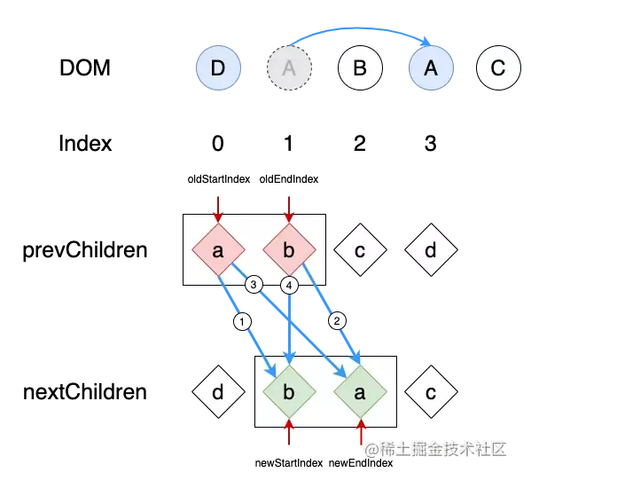
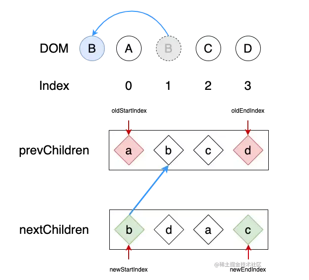

# vue3源码解析下

## Diff算法

diff算法的⽬的是为了找到哪些节点发⽣了变化，哪些节点没有发⽣变化可以复⽤。如果⽤最传统的diff算法，如下图所示，每个节点都要遍历另⼀棵树上的所有节点做⽐较，这就是o(n^2)的复杂度，加上更新节点时的o(n)复杂度，那就总共达到了o(n^3)的复杂度，这对于⼀个结构复杂节点数众多的⻚⾯，成本是⾮常⼤的。


实际上vue和react都对虚拟dom的diff算法做了⼀定的优化，将复杂度降低到了o(n)级别，具体的策略是：同层的节点才相互⽐较；

1. 节点⽐较时，如果类型不同，则对该节点及其所有⼦节点直接销毁新建；
2. 类型相同的⼦节点，使⽤key帮助查找，并且使⽤算法优化查找效率。其中react和vue2以及vue3的diff算法都不尽相同；


主要对⽐Vue2和Vue3，掌握为什么要从Vue2升级到Vue3，并代⼊后续代码，掌握Vue实现diff的流程；

前提：

- mount(vnode, parent, [refNode]) : 通过 vnode ⽣成真实的DOM节点。parent为其⽗级的真实DOM节点， refNode 为真实的DOM节点，其⽗级节点为parent。如果refNode不为空，vnode⽣成的DOM节点就会插⼊到refNode之前；如果refNode为空，那么vnode⽣成的DOM节点就作为最后⼀个⼦节点插⼊到parent中

- patch(prevNode, nextNode, parent) : 可以简单的理解为给当前DOM节点进⾏更新，并且调⽤diff算法对⽐⾃身的⼦节点;

## vue2 diff———双端比较

双端⽐较就是新列表和旧列表两个列表的头与尾互相对⽐，，在对⽐的过程中指针会逐渐向内靠拢，直到某⼀个列表的节点全部遍历过，对⽐停⽌；

### patch

先判断是否是⾸次渲染，如果是⾸次渲染那么我们就直接createElm即可；如果不是就去判断新⽼两个节点的元素类型否⼀样；如果两个节点都是⼀样的，那么就深⼊检查他们的⼦节点。如果两个节点不⼀样那就说明Vnode完全被改变了，就可以直接替换oldVnode；

```js
function patch(oldVnode, vnode, hydrating, removeOnly) {
    // 判断新的vnode是否为空
    if (isUndef(vnode)) {
        // 如果⽼的vnode不为空 卸载所有的⽼vnode
        if (isDef(oldVnode)) invokeDestroyHook(oldVnode)
        return
    }
    let isInitialPatch = false
    // ⽤来存储 insert钩⼦函数，在插⼊节点之前调⽤
    const insertedVnodeQueue = []
    // 如果⽼节点不存在，直接创建新节点
    if (isUndef(oldVnode)) {
        isInitialPatch = true
        createElm(vnode, insertedVnodeQueue)
    } else {
        // 是不是元素节点
        const isRealElement = isDef(oldVnode.nodeType)
        // 当⽼节点不是真实的DOM节点，并且新⽼节点的type和key相同，进⾏patchVnode更新⼯作
        if (!isRealElement && sameVnode(oldVnode, vnode)) {
            patchVnode(oldVnode, vnode, insertedVnodeQueue, null, null,removeOnly)
        } else {
            // 如果不是同⼀元素节点的话
            // 当⽼节点是真实DOM节点的时候
            if (isRealElement) {
                // 如果是元素节点 并且在SSR环境的时候 修改SSR_ATTR属性
                if (oldVnode.nodeType === 1 && oldVnode.hasAttribute(SSR_ATTR)) {
                    // 就是服务端渲染的，删掉这个属性
                    oldVnode.removeAttribute(SSR_ATTR)
                    hydrating = true
                }
                // 这个判断⾥是服务端渲染的处理逻辑
                if (isTrue(hydrating)) {
                    if (hydrate(oldVnode, vnode, insertedVnodeQueue)) {
                        invokeInsertHook(vnode, insertedVnodeQueue, true)
                        return oldVnode
                    }
                }
                // 如果不是服务端渲染的，或者混合失败，就创建⼀个空的注释节点替换oldVnode
                oldVnode = emptyNodeAt(oldVnode)
            }
            // 拿到 oldVnode 的⽗节点
            const oldElm = oldVnode.elm
            const parentElm = nodeOps.parentNode(oldElm)
            // 根据新的 vnode 创建⼀个 DOM 节点，挂载到⽗节点上
            createElm(
                vnode,
                insertedVnodeQueue,
                oldElm._leaveCb ? null : parentElm,
                nodeOps.nextSibling(oldElm)
            )
            // 如果新的 vnode 的根节点存在，就是说根节点被修改了，就需要遍历更新⽗节点
            // 递归 更新⽗占位符元素
            // 就是执⾏⼀遍 ⽗节点的 destory 和 create 、insert 的 钩⼦函数
            if (isDef(vnode.parent)) {
                let ancestor = vnode.parent
                const patchable = isPatchable(vnode)
                // 更新⽗组件的占位元素
                while (ancestor) {
                    // 卸载⽼根节点下的全部组件
                    for (let i = 0; i < cbs.destroy.length; ++i) {
                        cbs.destroy[i](ancestor)
                    }
                    // 替换现有元素
                    ancestor.elm = vnode.elm
                    if (patchable) {
                        for (let i = 0; i < cbs.create.length; ++i) {
                            cbs.create[i](emptyNode, ancestor)
                        }
                        // #6513
                        // invoke insert hooks that may have been merged by createhooks.
                        // e.g. for directives that uses the "inserted" hook.
                        const insert = ancestor.data.hook.insert
                        if (insert.merged) {
                            // start at index 1 to avoid re-invoking componentmounted hook
                            for (let i = 1; i < insert.fns.length; i++) {
                                insert.fns[i]()
                            }
                        }
                    } else {
                        registerRef(ancestor)
                    }
                    // 更新⽗节点
                    ancestor = ancestor.parent
                }
            }
            // 如果旧节点还存在，就删掉旧节点
            if (isDef(parentElm)) {
                removeVnodes([oldVnode], 0, 0)
            } else if (isDef(oldVnode.tag)) {
                // 否则直接卸载 oldVnode
                invokeDestroyHook(oldVnode)
            }
        }
    }
    // 执⾏ 虚拟 dom 的 insert 钩⼦函数
    invokeInsertHook(vnode, insertedVnodeQueue, isInitialPatch)
    // 返回最新 vnode 的 elm ，也就是真实的 dom节点
    return vnode.elm
}
```

### patchVnode

- 如果 Vnode 和 oldVnode 指向同⼀个对象，则直接return即可；
- 将旧节点的真实 DOM 赋值到新节点（真实 dom 连线到新⼦节点）称为elm，然后遍历调⽤ update更新 oldVnode 上的所有属性，⽐如 class,style,attrs,domProps,events...；
- 如果新⽼节点都有⽂本节点，并且⽂本不相同，那么就⽤ vnode .text更新⽂本内容。
- 如果oldVnode有⼦节点⽽ Vnode 没有，则直接删除⽼节点即可；
- 如果oldVnode没有⼦节点⽽ Vnode 有，则将Vnode的⼦节点真实化之后添加到DOM中即可。
- 如果两者都有⼦节点，则执⾏ updateChildren 函数⽐较⼦节点。

```js
function patchVnode(
    oldVnode, // ⽼的虚拟 DOM 节点
    vnode, // 新节点
    insertedVnodeQueue, // 插⼊节点队列
    ownerArray, // 节点数组
    index, // 当前节点的下标
    removeOnly
){
    // 新⽼节点对⽐地址⼀样，直接跳过
    if (oldVnode === vnode) {
        return
    }
    if (isDef(vnode.elm) && isDef(ownerArray)) {
        // clone reused vnode
        vnode = ownerArray[index] = cloneVNode(vnode)
    }
    const elm = vnode.elm = oldVnode.elm
    // 如果当前节点是注释或 v-if 的，或者是异步函数，就跳过检查异步组件
    if (isTrue(oldVnode.isAsyncPlaceholder)) {
        if (isDef(vnode.asyncFactory.resolved)) {
            hydrate(oldVnode.elm, vnode, insertedVnodeQueue)
        } else {
            vnode.isAsyncPlaceholder = true
        }
        return
    }
    // 当前节点是静态节点的时候，key 也⼀样，或者有 v-once 的时候，就直接赋值返回
    if (isTrue(vnode.isStatic) &&
        isTrue(oldVnode.isStatic) &&
        vnode.key === oldVnode.key &&
        (isTrue(vnode.isCloned) || isTrue(vnode.isOnce))
    ) {
        vnode.componentInstance = oldVnode.componentInstance
        return
    }
    let i
    const data = vnode.data
    if (isDef(data) && isDef(i = data.hook) && isDef(i = i.prepatch)) {
        i(oldVnode, vnode)
    }
    const oldCh = oldVnode.children
    const ch = vnode.children
    if (isDef(data) && isPatchable(vnode)) {
    // 遍历调⽤ update 更新 oldVnode 所有属性，⽐如class,style,attrs,domProps,events...
    // 这⾥的 update 钩⼦函数是 vnode 本身的钩⼦函数
        for (i = 0; i < cbs.update.length; ++i) cbs.update[i](oldVnode,vnode)
        // 这⾥的 update 钩⼦函数是我们传过来的函数
        if (isDef(i = data.hook) && isDef(i = i.update)) i(oldVnode, vnode)
    }
    // 如果新节点不是⽂本节点，也就是说有⼦节点
    if (isUndef(vnode.text)) {
        // 如果新⽼节点都有⼦节点
        if (isDef(oldCh) && isDef(ch)) {
            // 如果新⽼节点的⼦节点不⼀样，就执⾏ updateChildren 函数，对⽐⼦节点
            if (oldCh !== ch) updateChildren(elm, oldCh, ch,insertedVnodeQueue, removeOnly)
        } else if (isDef(ch)) {
            // 如果新节点有⼦节点的话，就是说⽼节点没有⼦节点
            // 如果⽼节点是⽂本节点，就是说没有⼦节点，就清空
            if (isDef(oldVnode.text)) nodeOps.setTextContent(elm, '')
            // 添加新节点
            addVnodes(elm, null, ch, 0, ch.length - 1, insertedVnodeQueue)
        } else if (isDef(oldCh)) {
            // 如果新节点没有⼦节点，⽼节点有⼦节点，就删除
            removeVnodes(oldCh, 0, oldCh.length - 1)
        } else if (isDef(oldVnode.text)) {
            // 如果⽼节点是⽂本节点，就清空
            nodeOps.setTextContent(elm, '')
        }
    } else if (oldVnode.text !== vnode.text) {
        // 如果⽼节点的⽂本和新节点的⽂本不同，就更新⽂本
        nodeOps.setTextContent(elm, vnode.text)
    }
    if (isDef(data)) {
        if (isDef(i = data.hook) && isDef(i = i.postpatch)) i(oldVnode,vnode)
    }
}
```

### updateChildren

为了⽅便理解，这⾥⼿动实现Vue2中的updateChildren

#### 实现思路

我们先⽤四个指针指向两个列表的头尾

```js
function vue2Diff(prevChildren, nextChildren, parent) {
    let oldStartIndex = 0,
        oldEndIndex = prevChildren.length - 1
        newStartIndex = 0,
        newEndIndex = nextChildren.length - 1;
    let oldStartNode = prevChildren[oldStartIndex],
        oldEndNode = prevChildren[oldEndIndex],
        newStartNode = nextChildren[nextStartIndex],
        newEndNode = nextChildren[nextEndIndex];
}
```

根据四个指针找到四个节点，然后进⾏对⽐，那么如何对⽐呢？我们按照以下四个步骤进⾏对⽐

1. 使⽤旧列表的头⼀个节点 oldStartNode 与新列表的头⼀个节点 newStartNode 对⽐；
2. 使⽤旧列表的最后⼀个节点 oldEndNode 与新列表的最后⼀个节点 newEndNode 对⽐；
3. 使⽤旧列表的头⼀个节点 oldStartNode 与新列表的最后⼀个节点 newEndNode 对⽐；
4. 使⽤旧列表的最后⼀个节点 oldEndNode 与新列表的头⼀个节点 newStartNode 对⽐；

使⽤以上四步进⾏对⽐，去寻找key相同的可复⽤的节点，当在某⼀步中找到了则停⽌后⾯的寻找。具体对⽐顺序如下图：


对⽐顺序代码结构如下:

```js
function vue2Diff(prevChildren, nextChildren, parent) {
    let oldStartIndex = 0,
        oldEndIndex = prevChildren.length - 1
        newStartIndex = 0,
        newEndIndex = nextChildren.length - 1;
    let oldStartNode = prevChildren[oldStartIndex],
        oldEndNode = prevChildren[oldEndIndex],
        newStartNode = nextChildren[newStartIndex],
        newEndNode = nextChildren[newEndIndex];
    
    if (oldStartNode.key === newStartNode.key) {
    } else if (oldEndNode.key === newEndNode.key) {
    } else if (oldStartNode.key === newEndNode.key) {
    } else if (oldEndNode.key === newStartNode.key) {
    }
}
```
当对⽐时找到了可复⽤的节点，我们还是先 patch 给元素打补丁，然后将指针进⾏前/后移⼀位指针。根据对⽐节点的不同，我们移动的指针和⽅向也不同，具体规则如下：

1. 当旧列表的头⼀个节点 oldStartNode 与新列表的头⼀个节点 newStartNode 对⽐时key相同。那么旧列表的头指针 oldStartIndex 与新列表的头指针 newStartIndex 同时向后移动⼀位；
2. 当旧列表的最后⼀个节点 oldEndNode 与新列表的最后⼀个节点 newEndNode 对⽐时key相同。那么旧列表的尾指针oldEndIndex与新列表的尾指针 newEndIndex 同时向前移动⼀位；
3. 当旧列表的头⼀个节点 oldStartNode 与新列表的最后⼀个节点 newEndNode 对⽐时key相同。那么旧列表的头指针 oldStartIndex 向后移动⼀位；新列表的尾指针 newEndIndex 向前移动⼀位；
4. 当旧列表的最后⼀个节点 oldEndNode 与新列表的头⼀个节点 newStartNode 对⽐时key相同。那么旧列表的尾指针 oldEndIndex 向前移动⼀位；新列表的头指针 newStartIndex 向后移动⼀位；

```js
function vue2Diff(prevChildren, nextChildren, parent) {
    let oldStartIndex = 0,
        oldEndIndex = prevChildren.length - 1,
        newStartIndex = 0,
        newEndIndex = nextChildren.length - 1;
    let oldStartNode = prevChildren[oldStartIndex],
        oldEndNode = prevChildren[oldEndIndex],
        newStartNode = nextChildren[newStartIndex],
        newEndNode = nextChildren[newEndIndex];
    if (oldStartNode.key === newStartNode.key) {
        patch(oldvStartNode, newStartNode, parent)
        oldStartIndex++
        newStartIndex++
        oldStartNode = prevChildren[oldStartIndex]
        newStartNode = nextChildren[newStartIndex]
    } else if (oldEndNode.key === newEndNode.key) {
        patch(oldEndNode, newEndNode, parent)
        oldEndIndex--
        newEndIndex--
        oldEndNode = prevChildren[oldEndIndex]
        newEndNode = nextChildren[newEndIndex]
    } else if (oldStartNode.key === newEndNode.key) {
        patch(oldStartNode, newEndNode, parent)
        oldStartIndex++
        newEndIndex--
        oldStartNode = prevChildren[oldStartIndex]
        newEndNode = nextChildren[newEndIndex]
    } else if (oldEndNode.key === newStartNode.key) {
        patch(oldEndNode, newStartNode, parent)
        oldEndIndex--
        nextStartIndex++
        oldEndNode = prevChildren[oldEndIndex]
        newStartNode = nextChildren[newStartIndex]
    }
}
```
上⾯提到，要让指针向内靠拢，所以我们需要循环。循环停⽌的条件是当其中⼀个列表的节点全部遍历完成，代码如下：

```js
function vue2Diff(prevChildren, nextChildren, parent) {
    let oldStartIndex = 0,
        oldEndIndex = prevChildren.length - 1,
        newStartIndex = 0,
        newEndIndex = nextChildren.length - 1;
    let oldStartNode = prevChildren[oldStartIndex],
        oldEndNode = prevChildren[oldEndIndex],
        newStartNode = nextChildren[newStartIndex],
        newEndNode = nextChildren[newEndIndex];
    while (oldStartIndex <= oldEndIndex && newStartIndex <= newEndIndex) {
        if (oldStartNode.key === newStartNode.key) {
            patch(oldStartNode, newStartNode, parent)
            oldStartIndex++
            newStartIndex++
            oldStartNode = prevChildren[oldStartIndex]
            newStartNode = nextChildren[newStartIndex]
        } else if (oldEndNode.key === newEndNode.key) {
            patch(oldEndNode, newEndNode, parent)
            oldEndIndex--
            newndIndex--
            oldEndNode = prevChildren[oldEndIndex]
            newEndNode = nextChildren[newEndIndex]
        } else if (oldStartNode.key === newEndNode.key) {
            patch(oldvStartNode, newEndNode, parent)
            oldStartIndex++
            newEndIndex--
            oldStartNode = prevChildren[oldStartIndex]
            newEndNode = nextChildren[newEndIndex]
        } else if (oldEndNode.key === newStartNode.key) {
            patch(oldEndNode, newStartNode, parent)
            oldEndIndex--
            newStartIndex++
            oldEndNode = prevChildren[oldEndIndex]
            newStartNode = nextChildren[newStartIndex]
        }
    }
}
```
⾄此整体的循环我们就全部完成了，下⾯我们需要考虑这样两个问题：

- 什么情况下DOM节点需要移动；
- DOM节点如何移动；

我们来解决第⼀个问题：什么情况下需要移动，我们还是以上图为例：


当我们在第⼀个循环时，在第四步发现旧列表的尾节点 oldEndNode 与新列表的头节点 newStartNode 的key相同，是可复⽤的DOM节点。通过观察我们可以发现，原本在旧列表末尾的节点，却是新列表中的开头节点，没有⼈⽐他更靠前，因为他是第⼀个，所以我们只需要把当前的节点移动到原本旧列表中的第⼀个节点之前，让它成为第⼀个节点即可。

```js
function vue2Diff(prevChildren, nextChildren, parent) {
// ...
    while (oldStartIndex <= oldEndIndex && newStartIndex <= newEndIndex) {
        if (oldStartNode.key === newStartNode.key) {
            // ...
        } else if (oldEndNode.key === newEndNode.key) {
            // ...
        } else if (oldStartNode.key === newEndNode.key) {
            // ...
        } else if (oldEndNode.key === newStartNode.key) {
            patch(oldEndNode, newStartNode, parent)
            // 移动到旧列表头节点之前
            parent.insertBefore(oldEndNode.el, oldStartNode.el)
            
            oldEndIndex--
            newStartIndex++
            oldEndNode = prevChildren[oldEndIndex]
            newStartNode = nextChildren[newStartIndex]
        }
    }
}
```


进⼊第⼆次循环，我们在第⼆步发现，旧列表的尾节点 oldEndNode 和新列表的尾节点 newEndNode 为复⽤节点。原本在旧列表中就是尾节点，在新列表中也是尾节点，说明该节点不需要移动，所以我们什么都不需要做。同理，如果是旧列表的头节点 oldStartNode 和新列表的头节点 newStartNode 为复⽤节点，我们也什么都不需要做



进⼊第三次循环，我们在第三部发现，旧列表的头节点 oldStartNode 和新列表的尾节点 newEndNode 为复⽤节点。，我们只要将DOM-A移动到DOM-B后⾯就可以了。依照惯例我们还是解释⼀下，原本旧列表中是头节点，然后在新列表中是尾节点。那么只要在旧列表中把当前的节点移动到原本尾节点的后⾯，就可以了。

```js
function vue2Diff(prevChildren, nextChildren, parent) {
    // ...
    while (oldStartIndex <= oldEndIndex && newStartIndex <= newEndIndex) {
        if (oldStartNode.key === newStartNode.key) {
            // ...
        } else if (oldEndNode.key === newEndNode.key) {
            // ...
        } else if (oldStartNode.key === newEndNode.key) {
            patch(oldStartNode, newEndNode, parent)
            parent.insertBefore(oldStartNode.el, oldEndNode.el.nextSibling)
            oldStartIndex++
            newEndIndex--
            oldStartNode = prevChildren[oldStartIndex]
            newEndNode = nextChildren[newEndIndex]
        } else if (oldEndNode.key === newStartNode.key) {
            //...
        }
    }
}
```


进⼊最后⼀个循环。在第⼀步旧列表头节点 oldStartNode 与新列表头节点 newStartNode 位置相同，所以啥也不⽤做。然后结束循环。

#### ⾮理想情况

上⽂中有⼀个特殊情况，当四次对⽐都没找到复⽤节点时，我们只能拿新列表的第⼀个节点去旧列表中找与其key相同的节点。


```js
function vue2Diff(prevChildren, nextChildren, parent) {
    //...
    while (oldStartIndex <= oldEndIndex && newStartIndex <= newEndIndex) {
        if (oldStartNode.key === newStartNode.key) {
            //...
        } else if (oldEndNode.key === newEndNode.key) {
            //...
        } else if (oldStartNode.key === newEndNode.key) {
            //...
        } else if (oldEndNode.key === newStartNode.key) {
            //...
        } else {
            // 在旧列表中找到 和新列表头节点key 相同的节点
            let newKey = newStartNode.key,
                oldIndex = prevChildren.findIndex(child => child.key === newKey);
            
        }
    }
}
```
找节点的时候其实会有两种情况：⼀种在旧列表中找到了，另⼀种情况是没找到。



当我们在旧列表中找到对应的VNode，我们只需要将找到的节点的DOM元素，移动到开头就可以了。这⾥的逻辑其实和第四步的逻辑是⼀样的，只不过第四步是移动的尾节点，这⾥是移动找到的节点。DOM移动后，由我们将旧列表中的节点改为undefined，这是⾄关重要的⼀步，因为我们已经做了节点的移动了所以我们不需要进⾏再次的对⽐了。最后我们将头指针newStartIndex向后移⼀位

```js
function vue2Diff(prevChildren, nextChildren, parent) {
    //...
    while (oldStartIndex <= oldEndIndex && newStartIndex <= newEndIndex) {
        if (oldStartNode.key === newStartNode.key) {
            //...
        } else if (oldEndNode.key === newEndNode.key) {
            //...
        } else if (oldStartNode.key === newEndNode.key) {
            //...
        } else if (oldEndNode.key === newStartNode.key) {
            //...
        } else {
            // 在旧列表中找到 和新列表头节点key 相同的节点
            let newtKey = newStartNode.key,
                oldIndex = prevChildren.findIndex(child => child.key === newKey);
            
            if (oldIndex > -1) {
                let oldNode = prevChildren[oldIndex];
                patch(oldNode, newStartNode, parent)
                parent.insertBefore(oldNode.el, oldStartNode.el)
                prevChildren[oldIndex] = undefined
            }
            newStartNode = nextChildren[++newStartIndex]
        }
    }
}
```

如果在旧列表中没有找到复⽤节点，就直接创建⼀个新的节点放到最前⾯就可以了，然后后移头指针 newStartIndex 。


```js
function vue2Diff(prevChildren, nextChildren, parent) {
    //...
    while (oldStartIndex <= oldEndIndex && newStartIndex <= newEndIndex) {
        if (oldStartNode.key === newStartNode.key) {
            //...
        } else if (oldEndNode.key === newEndNode.key) {
            //...
        } else if (oldStartNode.key === newEndNode.key) {
            //...
        } else if (oldEndNode.key === newStartNode.key) {
            //...
        } else {
            // 在旧列表中找到 和新列表头节点key 相同的节点
            let newtKey = newStartNode.key,
                oldIndex = prevChildren.findIndex(child => child.key === newKey);
            
            if (oldIndex > -1) {
                let oldNode = prevChildren[oldIndex];
                patch(oldNode, newStartNode, parent)
                parent.insertBefore(oldNode.el, oldStartNode.el)
                prevChildren[oldIndex] = undefined
            } else {
            mount(newStartNode, parent, oldStartNode.el)
            }
            newStartNode = nextChildren[++newStartIndex]
        }
    }
}
```

最后当旧列表遍历到undefind时就跳过当前节点。

```js
function vue2Diff(prevChildren, nextChildren, parent) {
    //...
    while (oldStartIndex <= oldEndIndex && newStartIndex <= newEndIndex) {
        if (oldStartNode === undefind) {
            oldStartNode = prevChildren[++oldStartIndex]
        } else if (oldEndNode === undefind) {
            oldEndNode = prevChildren[--oldEndIndex]
        } else if (oldStartNode.key === newStartNode.key) {
            //...
        } else if (oldEndNode.key === newEndNode.key) {
            //...
        } else if (oldStartNode.key === newEndNode.key) {
            //...
        } else if (oldEndNode.key === newStartNode.key) {
            //...
        } else {
            // ...
        }
    }
}
```

#### 添加节点


针对上述例⼦，⼏次循环都是尾节点相同，尾指针⼀直向前移动，直到循环结束；


此时 oldEndIndex 以及⼩于了 oldStartIndex ，但是新列表中还有剩余的节点，我们只需要将剩余的节点依次插⼊到 oldStartNode 的DOM之前就可以了。为什么是插⼊ oldStartNode 之前呢？原因是剩余的节点在新列表的位置是位于 oldStartNode 之前的，如果剩余节点是在 oldStartNode 之后， oldStartNode 就会先⾏对⽐

```js
function vue2Diff(prevChildren, nextChildren, parent) {
    //...
    while (oldStartIndex <= oldEndIndex && newStartIndex <= newEndIndex) {
    // ...
    }
    if (oldEndIndex < oldStartIndex) {
        for (let i = newStartIndex; i <= newEndIndex; i++) {
        mount(nextChildren[i], parent, prevStartNode.el)
    }
    }
}
```

#### 移除节点

当新列表的 newEndIndex ⼩于 newStartIndex 时，我们将旧列表剩余的节点删除即可。这⾥我们需要注意，旧列表的undefind。在第⼆⼩节中我们提到过，当头尾节点都不相同时，我们会去旧列表中找新列表的第⼀个节点，移动完DOM节点后，将旧列表的那个节点改为undefind。所以我们在最后的删除时，需要注意这些undefind，遇到的话跳过当前循环即可。

```js
function vue2Diff(prevChildren, nextChildren, parent) {
    //...
    while (oldStartIndex <= oldEndIndex && newStartIndex <= newEndIndex) {
    // ...
    }
    if (oldEndIndex < oldStartIndex) {
        for (let i = newStartIndex; i <= newEndIndex; i++) {
        mount(nextChildren[i], parent, prevStartNode.el)
    }
    } else if (newEndIndex < newStartIndex) {
        for (let i = oldStartIndex; i <= oldEndIndex; i++) {
            if (prevChildren[i]) {
                partent.removeChild(prevChildren[i].el)
            }
        }
    }
}
```

#### 总结

```js
function vue2diff(prevChildren, nextChildren, parent) {
    let oldStartIndex = 0,
        newStartIndex = 0,
        oldStartIndex = prevChildren.length - 1,
        newStartIndex = nextChildren.length - 1,
        oldStartNode = prevChildren[oldStartIndex],
        oldEndNode = prevChildren[oldStartIndex],
        newStartNode = nextChildren[newStartIndex],
        newEndNode = nextChildren[newStartIndex];
    while (oldStartIndex <= oldStartIndex && newStartIndex <= newStartIndex) {
        if (oldStartNode === undefined) {
            oldStartNode = prevChildren[++oldStartIndex]
        } else if (oldEndNode === undefined) {
            oldEndNode = prevChildren[--oldStartIndex]
        } else if (oldStartNode.key === newStartNode.key) {
            patch(oldStartNode, newStartNode, parent)
            oldStartIndex++
            newStartIndex++
            oldStartNode = prevChildren[oldStartIndex]
            newStartNode = nextChildren[newStartIndex]
        } else if (oldEndNode.key === newEndNode.key) {
            patch(oldEndNode, newEndNode, parent)
            oldStartIndex--
            newStartIndex--
            oldEndNode = prevChildren[oldStartIndex]
            newEndNode = nextChildren[newStartIndex]
        } else if (oldStartNode.key === newEndNode.key) {
            patch(oldStartNode, newEndNode, parent)
            parent.insertBefore(oldStartNode.el, oldEndNode.el.nextSibling)
            oldStartIndex++
            newStartIndex--
            oldStartNode = prevChildren[oldStartIndex]
            newEndNode = nextChildren[newStartIndex]
        } else if (oldEndNode.key === newStartNode.key) {
            patch(oldEndNode, newStartNode, parent)
            parent.insertBefore(oldEndNode.el, oldStartNode.el)
            oldStartIndex--
            newStartIndex++
            oldEndNode = prevChildren[oldStartIndex]
            newStartNode = nextChildren[newStartIndex]
        } else {
            let newKey = newStartNode.key,
                oldIndex = prevChildren.findIndex(child => child && (child.key === newKey));
            if (oldIndex === -1) {
                mount(newStartNode, parent, oldStartNode.el)
            } else {
                let prevNode = prevChildren[oldIndex]
                patch(prevNode, newStartNode, parent)
                parent.insertBefore(prevNode.el, oldStartNode.el)
                prevChildren[oldIndex] = undefined
            }
            newStartIndex++
            newStartNode = nextChildren[newStartIndex]
        }
    }
    if (newStartIndex > newStartIndex) {
        while (oldStartIndex <= oldStartIndex) {
            if (!prevChildren[oldStartIndex]) {
                oldStartIndex++
                continue
            }
            parent.removeChild(prevChildren[oldStartIndex++].el)
        }
    } else if (oldStartIndex > oldStartIndex) {
        while (newStartIndex <= newStartIndex) {
            mount(nextChildren[newStartIndex++], parent, oldStartNode.el)
        }
    }
}
```

### 缺点

Vue2 是全量 Diff（当数据发⽣变化，它就会新⽣成⼀个DOM树，并和之前的DOM树进⾏⽐较，找到不同的节点然后更新），如果层级很深，很消耗内存；

## Vue3 diff——最⻓递增⼦序列

### Vue3 diff 优化点

1. 静态标记 + ⾮全量 Diff：（Vue 3在创建虚拟DOM树的时候，会根据DOM中的内容会不会发⽣变化，添加⼀个静态标记。之后在与上次虚拟节点进⾏对⽐的时候，就只会对⽐这些带有静态标记的节点。）；

2. 使⽤最⻓递增⼦序列优化对⽐流程，可以最⼤程度的减少 DOM 的移动，达到最少的 DOM 操作；

### 实现思路

vue3的diff算法其中有两个理念。第⼀个是相同的前置与后置元素的预处理；第⼆个则是最⻓递增⼦序列

#### 前置与后置的预处理

我们看这两段⽂字

```js
hello xianzao
hey xianzao
```

我们会发现，这两段⽂字是有⼀部分是相同的，这些⽂字是不需要修改也不需要移动的，真正需要进⾏修改中间的⼏个字⺟，所以diff就变成以下部分

```js
text1: llo
text2: y
```

接下来换成 vnode ：


图中的被绿⾊框起来的节点，他们是不需要移动的，只需要进⾏打补丁 patch 就可以了。我们把该逻辑写成代码。

```js
function vue3Diff(prevChildren, nextChildren, parent) {
    let j = 0,
        prevEnd = prevChildren.length - 1,
        nextEnd = nextChildren.length - 1,
        prevNode = prevChildren[j],
        nextNode = nextChildren[j];
    while (prevNode.key === nextNode.key) {
        patch(prevNode, nextNode, parent)
        j++
        prevNode = prevChildren[j]
        nextNode = nextChildren[j]
    }
    
    prevNode = prevChildren[prevEnd]
    nextNode = prevChildren[nextEnd]
    
    while (prevNode.key === nextNode.key) {
        patch(prevNode, nextNode, parent)
        prevEnd--
        nextEnd--
        prevNode = prevChildren[prevEnd]
        nextNode = prevChildren[nextEnd]
    }
}
```
这时候，我们需要考虑边界情况，⼀种是j > prevEnd；另⼀种是j > nextEnd。


在上图中，此时j > prevEnd且j <= nextEnd，只需要把新列表中 j 到nextEnd之间剩下的节点插⼊进去就可以了。相反， 如果j > nextEnd时，把旧列表中 j 到prevEnd之间的节点删除就可以了。

```js
function vue3Diff(prevChildren, nextChildren, parent) {
    // ...
    if (j > prevEnd && j <= nextEnd) {
        let nextpos = nextEnd + 1,
        refNode = nextpos >= nextChildren.length
                    ? null
                : nextChildren[nextpos].el;
        while(j <= nextEnd) mount(nextChildren[j++], parent, refNode)
        
    } else if (j > nextEnd && j <= prevEnd) {
        while(j <= prevEnd) parent.removeChild(prevChildren[j++].el)
    }
}
```

在while循环时，指针是从两端向内逐渐靠拢的，所以我们应该在循环中就应该去判断边界情况，我们使⽤label语法，当我们触发边界情况时，退出全部的循环，直接进⼊判断

```js
function vue3Diff(prevChildren, nextChildren, parent) {
    let j = 0,
        prevEnd = prevChildren.length - 1,
        nextEnd = nextChildren.length - 1,
        prevNode = prevChildren[j],
        nextNode = nextChildren[j];
    // label语法
    outer: {
        while (prevNode.key === nextNode.key) {
            patch(prevNode, nextNode, parent)
            j++
            // 循环中如果触发边界情况，直接break，执⾏outer之后的判断
            if (j > prevEnd || j > nextEnd) break outer
            prevNode = prevChildren[j]
            nextNode = nextChildren[j]
        }
            prevNode = prevChildren[prevEnd]
            nextNode = prevChildren[nextEnd]
        while (prevNode.key === nextNode.key) {
            patch(prevNode, nextNode, parent)
            prevEnd--
            nextEnd--
            // 循环中如果触发边界情况，直接break，执⾏outer之后的判断
            if (j > prevEnd || j > nextEnd) break outer
            prevNode = prevChildren[prevEnd]
            nextNode = prevChildren[nextEnd]
        }
    }
    
    // 边界情况的判断
    if (j > prevEnd && j <= nextEnd) {
        let nextpos = nextEnd + 1,
        refNode = nextpos >= nextChildren.length
                    ? null
                : nextChildren[nextpos].el;
        while(j <= nextEnd) mount(nextChildren[j++], parent, refNode)
        
    } else if (j > nextEnd && j <= prevEnd) {
        while(j <= prevEnd) parent.removeChild(prevChildren[j++].el)
    }
}
```

#### 判断是否需要移动

接下来，就是找到移动的节点，然后给他移动到正确的位置当前/后置的预处理结束后，我们进⼊真正的diff环节。⾸先，我们先根据新列表剩余的节点数量，创建
⼀个source数组，并将数组填满-1。


```js
function vue3Diff(prevChildren, nextChildren, parent) {
    //...
    outer: {
    // ...
    }
    
    // 边界情况的判断
    if (j > prevEnd && j <= nextEnd) {
        // ...
    } else if (j > nextEnd && j <= prevEnd) {
        // ...
    } else {
        let prevStart = j,
        nextStart = j,
        nextLeft = nextEnd - nextStart + 1,     // 新列表中剩余的节点⻓度
        source = new Array(nextLeft).fill(-1);  // 创建数组，填满-1
    }
}
```

source是⽤来做新旧节点的对应关系的，我们将新节点在旧列表的位置存储在该数组中，我们在根据source计算出它的最⻓递增⼦序列⽤于移动DOM节点。为此，先建⽴⼀个对象存储当前新列表中的节点与index的关系，再去旧列表中去找位置。

:::info
注意：如果旧节点在新列表中没有的话，直接删除就好。除此之外，我们还需要⼀个数量表示记录我们
已经patch过的节点，如果数量已经与新列表剩余的节点数量⼀样，那么剩下的旧节点我们就直接删除
了就可以了
:::

```js
function vue3Diff(prevChildren, nextChildren, parent) {
    //...
    outer: {
    // ...
    }
    
    // 边界情况的判断
    if (j > prevEnd && j <= nextEnd) {
        // ...
    } else if (j > nextEnd && j <= prevEnd) {
        // ...
    } else {
        let prevStart = j,
        nextStart = j,
        nextLeft = nextEnd - nextStart + 1,     // 新列表中剩余的节点⻓度
        source = new Array(nextLeft).fill(-1),  // 创建数组，填满-1
        nextIndexMap = {},                      // 新列表节点与index的映射
        patched = 0;                            // 已更新过的节点的数量
            
        // 保存映射关系  
        for (let i = nextStart; i <= nextEnd; i++) {
            let key = nextChildren[i].key
            nextIndexMap[key] = i
        }
            
            // 去旧列表找位置
        for (let i = prevStart; i <= prevEnd; i++) {
            let prevNode = prevChildren[i],
            prevKey = prevNode.key,
                nextIndex = nextIndexMap[prevKey];
            // 新列表中没有该节点 或者 已经更新了全部的新节点，直接删除旧节点
            if (nextIndex === undefind || patched >= nextLeft) {
                parent.removeChild(prevNode.el)
                continue
            }
            // 找到对应的节点
            let nextNode = nextChildren[nextIndex];
            patch(prevNode, nextNode, parent);
            // 给source赋值
            source[nextIndex - nextStart] = i
            patched++
        }
    }
}
```


找到位置后，我们观察这个重新赋值后的source，我们可以看出，如果是全新的节点的话，其在source数组中对应的值就是初始的-1，通过这⼀步我们可以区分出来哪个为全新的节点，哪个是可复⽤的。其次，我们要判断是否需要移动，如果我们找到的index是⼀直递增的，说明不需要移动任何节点。我们通过设置⼀个变量来保存是否需要移动的状态。

```js
function vue3Diff(prevChildren, nextChildren, parent) {
    //...
    outer: {
    // ...
    }
    
    // 边界情况的判断
    if (j > prevEnd && j <= nextEnd) {
        // ...
    } else if (j > nextEnd && j <= prevEnd) {
        // ...
    } else {

        let prevStart = j,
        nextStart = j,
        nextLeft = nextEnd - nextStart + 1,     // 新列表中剩余的节点⻓度
        source = new Array(nextLeft).fill(-1),  // 创建数组，填满-1
        nextIndexMap = {},                      // 新列表节点与index的映射
        patched = 0,
        move = false,                           // 是否移动
        lastIndex = 0;                          // 记录上⼀次的位置
        
        // 保存映射关系  
        for (let i = nextStart; i <= nextEnd; i++) {
            let key = nextChildren[i].key
            nextIndexMap[key] = i
        }
            
            // 去旧列表找位置
        for (let i = prevStart; i <= prevEnd; i++) {
            let prevNode = prevChildren[i],
            prevKey = prevNode.key,
                nextIndex = nextIndexMap[prevKey];
            // 新列表中没有该节点 或者 已经更新了全部的新节点，直接删除旧节点
            if (nextIndex === undefind || patched >= nextLeft) {
                parent.removeChild(prevNode.el)
                continue
            }
            // 找到对应的节点
            let nextNode = nextChildren[nextIndex];
            patch(prevNode, nextNode, parent);
            // 给source赋值
            source[nextIndex - nextStart] = i
            patched++
            
            // 递增⽅法，判断是否需要移动
            if (nextIndex < lastIndex) {
                move = false
            } else {
                lastIndex = nextIndex
            }
        }
            
        if (move) {
            
            // 需要移动
        } else {

            //不需要移动
        }
    }
}
```

#### DOM如何移动

判断完是否需要移动后，我们就需要考虑如何移动了。⼀旦需要进⾏DOM移动，我们⾸先要做的就是找到source的最⻓递增⼦序列。

```js
function vue3Diff(prevChildren, nextChildren, parent) {
    //...
    if (move) {
        const seq = lis(source); // [0, 1]
    // 需要移动
    } else {
    //不需要移动
    }
}
```

:::info
最⻓递增⼦序列：给定⼀个数值序列，找到它的⼀个⼦序列，并且⼦序列中的值是递增的，⼦序列中的
元素在原序列中不⼀定连续。
例如给定数值序列为：[ 0, 8, 4, 12 ]。
那么它的最⻓递增⼦序列就是：[0, 8, 12]。
当然答案可能有多种情况，例如：[0, 4, 12] 也是可以的。
:::

上⾯的代码中，我们调⽤lis 函数求出数组source的最⻓递增⼦序列为[ 0, 1 ]。我们知道 source 数组的值为 [2, 3, 1, -1]，很显然最⻓递增⼦序列应该是[ 2, 3 ]，计算出的结果是[ 0, 1 ]代表的是最⻓递增⼦序列中的各个元素在source数组中的位置索引，如下图所示：


我们根据source，对新列表进⾏重新编号，并找出了最⻓递增⼦序列。
我们从后向前进⾏遍历source每⼀项。此时会出现三种情况：
1. 当前的值为-1，这说明该节点是全新的节点，⼜由于我们是从后向前遍历，我们直接创建好DOM节点插⼊到队尾就可以了；
2. 当前的索引为最⻓递增⼦序列中的值，也就是i === seq[j]，这说说明该节点不需要移动；
3. 当前的索引不是最⻓递增⼦序列中的值，那么说明该DOM节点需要移动，这⾥也很好理解，我们也是直接将DOM节点插⼊到队尾就可以了，因为队尾是排好序的；


```js
function vue3Diff(prevChildren, nextChildren, parent) {
    //...
    if (move) {
    // 需要移动
        const seq = lis(source); // [0, 1]
            let j = seq.length - 1;  // 最⻓⼦序列的指针
            // 从后向前遍历
        for (let i = nextLeft - 1； i >= 0; i--) {
            let pos = nextStart + i, // 对应新列表的index
                nextNode = nextChildren[pos], // 找到vnode
                nextPos = pos + 1，    // 下⼀个节点的位置，⽤于移动DOM
                refNode = nextPos >= nextChildren.length ? null :
                                    nextChildren[nextPos].el, //DOM节点
                cur = source[i];  // 当前source的值，⽤来判断节点是否需要移动
            
            if (cur === -1) {
                // 情况1，该节点是全新节点
            mount(nextNode, parent, refNode)
            } else if (cur === seq[j]) {
                // 情况2，是递增⼦序列，该节点不需要移动
                // 让j指向下⼀个
                j--
            } else {
                // 情况3，不是递增⼦序列，该节点需要移动
                parent.insetBefore(nextNode.el, refNode)
            }
        }
    } else {
    //不需要移动
    
    }
}
```

说完了需要移动的情况，再说说不需要移动的情况。如果不需要移动的话，我们只需要判断是否有全新的节点给他添加进去就可以了。具体代码如下：

```js
function vue3Diff(prevChildren, nextChildren, parent) {
    //...
    if (move) {
        const seq = lis(source); // [0, 1]
            let j = seq.length - 1;  // 最⻓⼦序列的指针
            // 从后向前遍历
        for (let i = nextLeft - 1； i >= 0; i--) {
            let pos = nextStart + i, // 对应新列表的index
                nextNode = nextChildren[pos], // 找到vnode
            nextPos = pos + 1，    // 下⼀个节点的位置，⽤于移动DOM
                refNode = nextPos >= nextChildren.length ? null :
                                    nextChildren[nextPos].el, //DOM节点
                cur = source[i];  // 当前source的值，⽤来判断节点是否需要移动
            
            if (cur === -1) {
                // 情况1，该节点是全新节点
                mount(nextNode, parent, refNode)
            } else if (cur === seq[j]) {
                // 情况2，是递增⼦序列，该节点不需要移动
                // 让j指向下⼀个
                j--
            } else {
                // 情况3，不是递增⼦序列，该节点需要移动
                parent.insetBefore(nextNode.el, refNode)
            }
        }
    } else {
        //不需要移动
        for (let i = nextLeft - 1； i >= 0; i--) {
            let cur = source[i];  // 当前source的值，⽤来判断节点是否需要移动
            
            if (cur === -1) {
            let pos = nextStart + i, // 对应新列表的index
                nextNode = nextChildren[pos], // 找到vnode
                nextPos = pos + 1，    // 下⼀个节点的位置，⽤于移动DOM
                refNode = nextPos >= nextChildren.length ? null : nextChildren[nextPos].el, //DOM节点
                mount(nextNode, parent, refNode)
            }
        }
    }
}
```

### 最⻓递增⼦序列

:::info
强烈建议看leetcode原题解法：https://leetcode.cn/problems/longest-increasing-subsequence/
:::

我们以该数组为例

```js
[10,9,2,5,3,8,7,13]
```

我们可以使⽤动态规划的思想考虑这个问题。动态规划的思想是将⼀个⼤的问题分解成多个⼩的⼦问题，并尝试得到这些⼦问题的最优解，⼦问题的最优解有可能会在更⼤的问题中被利⽤，这样通过⼩问题的最优解最终求得⼤问题的最优解。

我们先假设只有⼀个值的数组[13]，那么该数组的最⻓递增⼦序列就是[13]⾃⼰本身，其⻓度为1。那么我们认为每⼀项的递增序列的⻓度值均为1

那么我们这次给数组增加⼀个值[7, 13], 由于7 < 13，所以该数组的最⻓递增⼦序列是[7, 13]，那么该⻓度为2。那么我们是否可以认为，当[7]⼩于[13]时，以[7]为头的递增序列的⻓度是，[7]的⻓度和[13]的⻓度的和，即1 + 1 = 2。

ok，我们基于这种思想来给计算⼀下该数组。我们先将每个值的初始赋值为1


⾸先 7 < 13 那么7对应的⻓度就是13的⻓度再加1，1 + 1 = 2


继续，我们对⽐8。我们⾸先和7⽐，发现不满⾜递增，但是没关系我们还可以继续和13⽐，8 < 13满⾜递增，那么8的⻓度也是13的⻓度在加⼀，⻓度为2


我们再对⽐3，我们先让其与8进⾏对⽐，3 < 8，那么3的⻓度是8的⻓度加⼀，此时3的⻓度为3。但是还
没结束，我们还需要让3与7对⽐。同样3 < 7，此时我们需要在计算出⼀个⻓度是7的⻓度加⼀同样是3，
我们对⽐两个⻓度，如果原本的⻓度没有本次计算出的⻓度值⼤的话，我们进⾏替换，反之则我们保留
原本的值。由于3 === 3，我们选择不替换。最后，我们让3与13进⾏对⽐，同样的3 < 13，此时计算出
的⻓度为2，⽐原本的⻓度3要⼩，我们选择保留原本的值。


我们从中取最⼤的值4，该值代表的最⻓递增⼦序列的个数。代码如下：

```js
function lis(arr) {
    let len = arr.length,
        dp = new Array(len).fill(1); // ⽤于保存⻓度
    for (let i = len - 1; i >= 0; i--) {
        let cur = arr[i]
        for(let j = i + 1; j < len; j++) {
            let next = arr[j]
            // 如果是递增 取更⼤的⻓度值
            if (cur < next) dp[i] = Math.max(dp[j]+1, dp[i])
        }
    }
    return Math.max(...dp)
}
```
在vue3.0中，我们需要的是最⻓递增⼦序列在原本数组中的索引。所以我们还需要在创建⼀个数组⽤于保存每个值的最⻓⼦序列所对应在数组中的index。具体代码如下：

```js
function lis(arr) {
    let len = arr.length,
        res = [],
        dp = new Array(len).fill(1);
    // 存默认index
    for (let i = 0; i < len; i++) {
        res.push([i])
    }
    for (let i = len - 1; i >= 0; i--) {
        let cur = arr[i],
        nextIndex = undefined;
        // 如果为-1 直接跳过，因为-1代表的是新节点，不需要进⾏排序
        if (cur === -1) continue
        for (let j = i + 1; j < len; j++) {
            let next = arr[j]
            // 满⾜递增条件
            if (cur < next) {
                let max = dp[j] + 1
                // 当前⻓度是否⽐原本的⻓度要⼤
                if (max > dp[i]) {
                    dp[i] = max
                    nextIndex = j
                }
            }
        }
        // 记录满⾜条件的值，对应在数组中的index
        if (nextIndex !== undefined) res[i].push(...res[nextIndex])
    }
    let index = dp.reduce((prev, cur, i, arr) => cur > arr[prev] ? i :
    prev, dp.length - 1)
    // 返回最⻓的递增⼦序列的index
    return result[index]
}
```