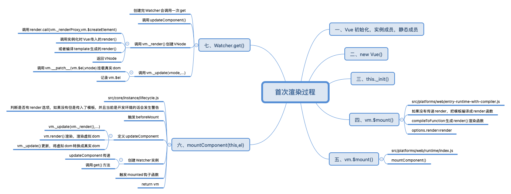
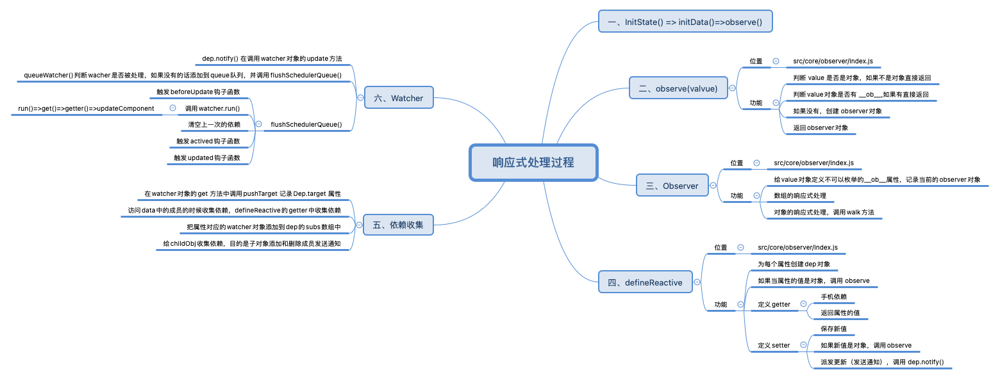

# vue2源码解析-响应式原理

## vue源码获取

项目地址: [https://github.com/vuejs/vue](https://github.com/vuejs/vue)

## 首次渲染过程

Vue的初始化已经完毕后，才开始进行首次渲染



## 响应式处理的入口

- src/core/instance/init.js 
  - initState(vm) vm 状态的初始化 
  - 初始化了 _data、_props、methods 等 
- src/core/instance/state.js

```js
if (opts.data) {
	initData(vm)
} else {
	observe(vm._data = {}, true /* asRootData */)
}
```
- initData(vm)  vm 数据的初始化

```js
function initData (vm: Component) {
  let data = vm.$options.data
  // 初始化 _data，组件中 data 是函数，调用函数返回结果 // 否则直接返回 data
  data = vm._data = typeof data === 'function'
    ? getData(data, vm)
    : data || {}
  if (!isPlainObject(data)) {
    data = {}
    process.env.NODE_ENV !== 'production' && warn(
      'data functions should return an object:\n' +
      'https://vuejs.org/v2/guide/components.html#data-Must-Be-a-Function',
      vm
    )
  }
  // proxy data on instance
  // 获取 data 中的所有属性
  const keys = Object.keys(data)
  const props = vm.$options.props
  const methods = vm.$options.methods
  let i = keys.length
  // 判断 data 上的成员是否和 props/methods 重名
  while (i--) {
    const key = keys[i]
    if (process.env.NODE_ENV !== 'production') {
      if (methods && hasOwn(methods, key)) {
        warn(
          `Method "${key}" has already been defined as a data property.`,
          vm
        )
      }
    }
    if (props && hasOwn(props, key)) {
      process.env.NODE_ENV !== 'production' && warn(
        `The data property "${key}" is already declared as a prop. ` +
        `Use prop default value instead.`,
        vm
      )
    } else if (!isReserved(key)) {
      proxy(vm, `_data`, key)
    }
  }
  // observe data
  // 响应书处理 入口
  observe(data, true /* asRootData */)
}
```
- src/core/observer/index.js
  - observe(value, asRootData)  
负责为每一个 Object 类型的 value 创建一个 observer 实例

```js
export function observe (value: any, asRootData: ?boolean): Observer | void {
  // 判断 value 是否是对象
  if (!isObject(value) || value instanceof VNode) {
    return
  }
  let ob: Observer | void
  // 如果 value 有 __ob__ 属性
  if (hasOwn(value, '__ob__') && value.__ob__ instanceof Observer) {
    // 有 __ob__ 属性代表已经进行了响应式处理，就不需要再进行处理
    ob = value.__ob__
  } else if (
    shouldObserve &&
    !isServerRendering() &&
    (Array.isArray(value) || isPlainObject(value)) &&
    Object.isExtensible(value) &&
    !value._isVue
  ) { // 判断是否可以进行响应式处理
    // 创建一个 Observer 对象
    ob = new Observer(value)
  }
  if (asRootData && ob) {
    ob.vmCount++
  }
  return ob
}
```

## Observer

- src/core/observer/index.js
  - 对对象做响应化处理 
  - 对数组做响应化处理

```js
export class Observer {
  // 观测对象
  value: any;
  // 依赖对象
  dep: Dep;
  // 实例计数器
  vmCount: number; // number of vms that have this object as root $data

  constructor (value: any) {
    // 被观察的对象
    this.value = value
    // dep 对象
    this.dep = new Dep()
    // 初始化实例 vmCount 为0
    this.vmCount = 0
    // 将实例挂在到观察对象的 __ob__ 属性
    def(value, '__ob__', this)
    if (Array.isArray(value)) {
      // 数组的响应式处理
      /**
       * hasProto 的目的主要用来，判断当前浏览器是否支持__proto__，也就是用来处理浏览器的兼容性问题，
       * 如果当前浏览器支持__proto__原型这个属性则会调用protoAugment函数，否则调用copyAugment函数
       */
      if (hasProto) { 
        // 修改原型__proto__
        protoAugment(value, arrayMethods)
      } else {
        copyAugment(value, arrayMethods, arrayKeys)
      }
      // 为数组的每一个对象创建一个 observe 实例
      this.observeArray(value)
    } else {
      // 对象的响应式处理
      // 遍历对象中的每个属性，转换成 getter和setter
      this.walk(value)
    }
  }

  /**
   * Walk through all properties and convert them into
   * getter/setters. This method should only be called when
   * value type is Object.
   */
  walk (obj: Object) {
    // 获取观察对象的每个属性
    const keys = Object.keys(obj)
    // 遍历属性 设置为响应式数据
    for (let i = 0; i < keys.length; i++) {
      defineReactive(obj, keys[i])
    }
  }

  /**
   * Observe a list of Array items.
   */
  observeArray (items: Array<any>) {
    // 遍历当前数组中的所有成员，通过observe方法把数组里面的成员如果是对象的转换为响应式的对象
    for (let i = 0, l = items.length; i < l; i++) {
      observe(items[i])
    }
  }
}
```

### 对象响应式处理 ——defifineReactive() 

- src/core/observer/index.js

```js
// 为一个对象定义一个响应式属性
export function defineReactive (
  obj: Object,
  key: string,
  val: any,
  customSetter?: ?Function,
  shallow?: boolean
) {
  // 收集依赖 
  const dep = new Dep() // 负责收集所有属性的依赖
  // 获取 obj 的属性描述符对象
  const property = Object.getOwnPropertyDescriptor(obj, key)
  if (property && property.configurable === false) { // 不可配置的 —— 不可删除、不可修改
    return
  }

  // 提供预定义的存取器函数
  // cater for pre-defined getter/setters
  const getter = property && property.get
  const setter = property && property.set
  if ((!getter || setter) && arguments.length === 2) {
    val = obj[key]
  }

  // 判断是否递归观察子对象，并将子对象属性都转换成 getter、setter，返回子观察对象
  let childOb = !shallow && observe(val)
  Object.defineProperty(obj, key, {
    enumerable: true,
    configurable: true,
    get: function reactiveGetter () {
      // 如果预定于的 getter 存在则 value 等于getter 调用的返回值 否则直接赋予属性值
      const value = getter ? getter.call(obj) : val

      // 如果存在当前依赖目标，即 watcher 对象，则建立依赖
      if (Dep.target) { // 收集依赖
        dep.depend()
        // 如果子观察目标存在，建立子对象的依赖关系
        if (childOb) {
          childOb.dep.depend()
          // 如果属性是数组，则特殊处理收集数组对象依赖
          if (Array.isArray(value)) {
            dependArray(value)
          }
        }
      }
      // 返回属性值
      return value
    },
    set: function reactiveSetter (newVal) {
      // 如果预定于的 getter 存在则 value 等于getter 调用的返回值 否则直接赋予属性值
      const value = getter ? getter.call(obj) : val
      /* eslint-disable no-self-compare */
      // 如果新值等于旧值或者新值旧值为NAN则不执行
      if (newVal === value || (newVal !== newVal && value !== value)) {
        return
      }
      /* eslint-enable no-self-compare */
      if (process.env.NODE_ENV !== 'production' && customSetter) {
        customSetter()
      }
      // #7981: for accessor properties without setter
      // 如果没有 setter 直接返回
      if (getter && !setter) return
      // 如果预定义 setter 存在则调用，否则直接更新值
      if (setter) {
        setter.call(obj, newVal)
      } else {
        val = newVal
      }
      // 如果新值是对象，观察子对象并返回 子的observer对象
      childOb = !shallow && observe(newVal)
      // 派发更新
      dep.notify()
    }
  })
}
```
- 总结：
  - 为一个对象定义一个响应式的属性，每一个属性对应一个 dep 对象 
  - 如果该属性的值是对象，继续调用 observe 
  - 如果给属性赋新值，继续调用 observe 
  - 如果数据更新发送通知 

### 数组响应式处理

首先看下 Observer 构造函数里面的代码块

```js
if (Array.isArray(value)) {
  // 数组的响应式处理
  /**
   * hasProto 的目的主要用来，判断当前浏览器是否支持__proto__，也就是用来处理浏览器的兼容性问题，
   * 如果当前浏览器支持__proto__原型这个属性则会调用protoAugment函数，否则调用copyAugment函数
   */
  if (hasProto) { 
    // 修改原型__proto__
    protoAugment(value, arrayMethods)
  } else {
    copyAugment(value, arrayMethods, arrayKeys)
  }
  // 为数组的每一个对象创建一个 observe 实例
  this.observeArray(value)
} else {
  // 对象的响应式处理
  // 遍历对象中的每个属性，转换成 getter和setter
  this.walk(value)
}
```

```js
// 重新设置当前数组的原型属性，
function protoAugment (target, src: Object) {
  /* eslint-disable no-proto */
  // 将目标的__proto__原型直接修改为src
  target.__proto__ = src
  /* eslint-enable no-proto */
}

/**
 * Augment a target Object or Array by defining
 * hidden properties.
 */
/* istanbul ignore next */
function copyAugment (target: Object, src: Object, keys: Array<string>) {
  for (let i = 0, l = keys.length; i < l; i++) {
    const key = keys[i]
    // 给当前对象重新定义keys里面的函数
    def(target, key, src[key])
  }
}
```

- 处理数组修改数据的方法 
  - src/core/observer/array.js

```js
/*
 * not type checking this file because flow doesn't play well with
 * dynamically accessing methods on Array prototype
 */

import { def } from '../util/index'

const arrayProto = Array.prototype

// 克隆数组的原型
export const arrayMethods = Object.create(arrayProto)

// 修改数组的方法
const methodsToPatch = [
  'push',
  'pop',
  'shift',
  'unshift',
  'splice',
  'sort',
  'reverse'
]

/**
 * Intercept mutating methods and emit events
 */
methodsToPatch.forEach(function (method) {
  // cache original method
  const original = arrayProto[method]
  // 给arrayMethods重新设置修改数组的方法
  def(arrayMethods, method, function mutator (...args) {
    // 执行数组的原始方法
    const result = original.apply(this, args)
    // 获取数组对象的 ob 对象
    const ob = this.__ob__
    let inserted
    switch (method) {
      case 'push':
      case 'unshift':
        inserted = args
        break
      case 'splice':
        inserted = args.slice(2)
        break
    }
    // 对插入的新元素，重新遍历数组元素，设置为响应式数据
    if (inserted) ob.observeArray(inserted)
    // notify change
    // 调用了修改数组方法，调用数组的ob 对象进行发送通知
    ob.dep.notify()
    return result
  })
})
```

  - 修改数组的解读：
  a. 先调用pop，push这些原有数组的方法
  b. 然后找到可能会给数组新增元素的方法
  c. 如果新增了元素，那么调用 ob.observeArray(inserted) 方法遍历数组中新增元素并转换为响应式对象
  d. 然后调用notify方法进行发送通知
  e. 返回结果

```vue
<div id="app">
  <h1>数组响应式</h1>
{{arr}}
</div>
<script src="../../dist/vue.js"></script>
<script>
  const vm = new Vue({
    el: '#app',
    data: {
      arr: [2,3,4]
    }
  })
</script>
```

- 控制台依次输入：
■ vm.arr.push(222)
■ vm.arr[0] = 345
■ vm.arr.length = 0
- 结果：第一个输入是更新了；第二个、第三个没有更新

- 源码角度出发进行分析：
1.输入 vm.arr 查看数组里面的原型，是因为只修改了数组的'push','pop','shift','unshift','splice','sort','reverse'方法，进行了派发更新的操作；
2.查看源码，在处理数组的响应式的时候，并没有对数组的方法进行响应式处理，而是对数组里面的元素为对象的进行了响应式处理


## Dep依赖收集

- src/core/observer/dep.js 
  - 依赖对象 
  - 记录 watcher 对象 
  - depend() -- watcher 记录对应的 dep 
  - 发布通知

在 defineReactive() 的 getter 中创建 dep 对象，并判断 Dep.target 是否有值, 调用 dep.depend() 

```js
get: function reactiveGetter () {
  // 如果预定于的 getter 存在则 value 等于getter 调用的返回值 否则直接赋予属性值
  const value = getter ? getter.call(obj) : val

  // 如果存在当前依赖目标，即 watcher 对象，则建立依赖
  /**
   * Dep.target什么时候设置的？？？？？
   * 是在调用 mountComponent() 方法的时候，创建了渲染 watcher 对象，执行 watcher 中的 get() 方法
   * 在get方法里调用了 pushTarget(this),将watcher赋值给 Dep.target `Dep.target = target`
   */
  if (Dep.target) { // 收集依赖
    dep.depend()
    // 如果子观察目标存在，建立子对象的依赖关系
    if (childOb) {
      childOb.dep.depend()
      // 如果属性是数组，则特殊处理收集数组对象依赖
      if (Array.isArray(value)) {
        dependArray(value)
      }
    }
  }
  // 返回属性值
  return value
}
```

- src/core/observer/dep.js

### Dep类

```js
export default class Dep {
  static target: ?Watcher;
  id: number;
  // dep 实例对应的watcher对象、订阅者数组
  subs: Array<Watcher>;

  constructor () {
    this.id = uid++
    this.subs = []
  }

  // 添加新的订阅者 watcher 对象
  addSub (sub: Watcher) {
    this.subs.push(sub)
  }

  // 移除订阅者
  removeSub (sub: Watcher) {
    remove(this.subs, sub)
  }

  // 将观察对象和watcher 简历依赖
  depend () {
    if (Dep.target) {
      // 如果 target存在，把dep对象添加到 watcher的依赖中
      Dep.target.addDep(this)
    }
  }

  // 发布通知
  notify () {
    // stabilize the subscriber list first
    const subs = this.subs.slice()
    if (process.env.NODE_ENV !== 'production' && !config.async) {
      // subs aren't sorted in scheduler if not running async
      // we need to sort them now to make sure they fire in correct
      // order
      subs.sort((a, b) => a.id - b.id)
    }
    for (let i = 0, l = subs.length; i < l; i++) {
      subs[i].update()
    }
  }
}

// Dep.target 用来存放目前正在使用的 watcher；全局唯一 并且一次也只能有一个watcher被使用
// The current target watcher being evaluated.
// This is globally unique because only one watcher
// can be evaluated at a time.
Dep.target = null
const targetStack = []
// targetStack 要放入栈中的目的是？
// 因为vue2中，每个组件都会对应一个watcher对象，每个组件都会有 mountcomponent，
// 在实际开发中，组件中会调用子组件，那么就需要先将父组件的watcher先挂载起来，
// 等子组件渲染完毕后，再把父组件对应的 watcher 出栈，父组件继续渲染
export function pushTarget (target: ?Watcher) {
  targetStack.push(target)
  // 将watcher赋值给 Dep.target
  Dep.target = target
}

// 出栈
export function popTarget () {
  targetStack.pop()
  Dep.target = targetStack[targetStack.length - 1]
}
```

### Watcher类

```js
export default class Watcher {
  vm: Component;
  expression: string;
  cb: Function;
  id: number;
  deep: boolean;
  user: boolean;
  lazy: boolean;
  sync: boolean;
  dirty: boolean;
  active: boolean;
  deps: Array<Dep>;
  newDeps: Array<Dep>;
  depIds: SimpleSet;
  newDepIds: SimpleSet;
  before: ?Function;
  getter: Function;
  value: any;

  constructor (
    vm: Component,
    expOrFn: string | Function,
    cb: Function,
    options?: ?Object,
    isRenderWatcher?: boolean
  ) {
    this.vm = vm
    if (isRenderWatcher) {
      vm._watcher = this
    }
    vm._watchers.push(this)
    // options
    if (options) {
      this.deep = !!options.deep
      this.user = !!options.user
      this.lazy = !!options.lazy
      this.sync = !!options.sync
      this.before = options.before
    } else {
      this.deep = this.user = this.lazy = this.sync = false
    }
    this.cb = cb
    this.id = ++uid // uid for batching
    this.active = true
    this.dirty = this.lazy // for lazy watchers
    this.deps = []
    this.newDeps = []
    this.depIds = new Set()
    this.newDepIds = new Set()
    this.expression = process.env.NODE_ENV !== 'production'
      ? expOrFn.toString()
      : ''
    // parse expression for getter
    if (typeof expOrFn === 'function') {
      this.getter = expOrFn
    } else {
      // expOrFn 是字符串的时候，例如 watch: {'person.name': function...}
      // parsePath('person.name') 返回一个函数获取 person.name 的值
      this.getter = parsePath(expOrFn)
      if (!this.getter) {
        this.getter = noop
        process.env.NODE_ENV !== 'production' && warn(
          `Failed watching path: "${expOrFn}" ` +
          'Watcher only accepts simple dot-delimited paths. ' +
          'For full control, use a function instead.',
          vm
        )
      }
    }
    this.value = this.lazy
      ? undefined
      : this.get()
  }

  /**
   * Evaluate the getter, and re-collect dependencies.
   */
  get () {
    pushTarget(this)
    let value
    const vm = this.vm
    try {
      value = this.getter.call(vm, vm)
    } catch (e) {
      if (this.user) {
        handleError(e, vm, `getter for watcher "${this.expression}"`)
      } else {
        throw e
      }
    } finally {
      // "touch" every property so they are all tracked as
      // dependencies for deep watching
      if (this.deep) {
        traverse(value)
      }
      popTarget()
      this.cleanupDeps()
    }
    return value
  }

  /**
   * Add a dependency to this directive.
   */
  addDep (dep: Dep) {
    const id = dep.id
    if (!this.newDepIds.has(id)) {
      this.newDepIds.add(id)
      this.newDeps.push(dep)
      if (!this.depIds.has(id)) {
        dep.addSub(this)
      }
    }
  }

  /**
   * Clean up for dependency collection.
   */
  cleanupDeps () {
    let i = this.deps.length
    while (i--) {
      const dep = this.deps[i]
      if (!this.newDepIds.has(dep.id)) {
        dep.removeSub(this)
      }
    }
    let tmp = this.depIds
    this.depIds = this.newDepIds
    this.newDepIds = tmp
    this.newDepIds.clear()
    tmp = this.deps
    this.deps = this.newDeps
    this.newDeps = tmp
    this.newDeps.length = 0
  }

  /**
   * Subscriber interface.
   * Will be called when a dependency changes.
   */
  update () {
    /* istanbul ignore else */
    if (this.lazy) {
      this.dirty = true
    } else if (this.sync) {
      this.run()
    } else {
      queueWatcher(this)
    }
  }

  /**
   * Scheduler job interface.
   * Will be called by the scheduler.
   */
  run () {
    if (this.active) {
      const value = this.get()
      if (
        value !== this.value ||
        // Deep watchers and watchers on Object/Arrays should fire even
        // when the value is the same, because the value may
        // have mutated.
        isObject(value) ||
        this.deep
      ) {
        // set new value
        const oldValue = this.value
        this.value = value
        if (this.user) {
          const info = `callback for watcher "${this.expression}"`
          invokeWithErrorHandling(this.cb, this.vm, [value, oldValue], this.vm, info)
        } else {
          this.cb.call(this.vm, value, oldValue)
        }
      }
    }
  }

  /**
   * Evaluate the value of the watcher.
   * This only gets called for lazy watchers.
   */
  evaluate () {
    this.value = this.get()
    this.dirty = false
  }

  /**
   * Depend on all deps collected by this watcher.
   */
  depend () {
    let i = this.deps.length
    while (i--) {
      this.deps[i].depend()
    }
  }

  /**
   * Remove self from all dependencies' subscriber list.
   */
  teardown () {
    if (this.active) {
      // remove self from vm's watcher list
      // this is a somewhat expensive operation so we skip it
      // if the vm is being destroyed.
      if (!this.vm._isBeingDestroyed) {
        remove(this.vm._watchers, this)
      }
      let i = this.deps.length
      while (i--) {
        this.deps[i].removeSub(this)
      }
      this.active = false
    }
  }
}
```
此Watcher是属于渲染Watcher 

渲染 watcher 的执行过程 
- 当数据更新，defifineReactive 的 set 方法中调用 dep.notify() 
- 调用 watcher 的 update() 
- 调用 queueWatcher()，把 wacher 存入队列，如果已经存入，不重复添加 
- 循环调用 flflushSchedulerQueue() 
  - 通过 nextTick()，在消息循环结束之前时候调用 flflushSchedulerQueue() 
- 调用 wacher.run() 
  - 调用 wacher.get() 获取最新值 
  - 如果是渲染 wacher 结束 
  - 如果是用户 watcher，调用 this.cb()


## Watcher种类

Watcher分为三种：
- Computed Watcher：我们的计算属性就是使用watcher实现的；在initState时初始化
- 用户 Watcher：侦听器和vm.$watch方法都是属于用户 Watcher；在initState时初始化
- 渲染 Watcher：数据更新时；在mountComponent 函数中创建的

创建顺序：计算属性 Watcher、用户 Watcher (侦听器)、渲染 Watcher

### 渲染 Watcher 的创建时机 

- src/core/instance/lifecycle.js

```js
export function mountComponent (
  vm: Component,
  el: ?Element,
  hydrating?: boolean
): Component {
  vm.$el = el
  if (!vm.$options.render) {
    vm.$options.render = createEmptyVNode
    if (process.env.NODE_ENV !== 'production') {
      /* istanbul ignore if */
      if ((vm.$options.template && vm.$options.template.charAt(0) !== '#') ||
        vm.$options.el || el) {
        warn(
          'You are using the runtime-only build of Vue where the template ' +
          'compiler is not available. Either pre-compile the templates into ' +
          'render functions, or use the compiler-included build.',
          vm
        )
      } else {
        warn(
          'Failed to mount component: template or render function not defined.',
          vm
        )
      }
    }
  }
  callHook(vm, 'beforeMount')

  let updateComponent
  /* istanbul ignore if */
  if (process.env.NODE_ENV !== 'production' && config.performance && mark) {
    updateComponent = () => {
      const name = vm._name
      const id = vm._uid
      const startTag = `vue-perf-start:${id}`
      const endTag = `vue-perf-end:${id}`

      mark(startTag)
      const vnode = vm._render()
      mark(endTag)
      measure(`vue ${name} render`, startTag, endTag)

      mark(startTag)
      vm._update(vnode, hydrating)
      mark(endTag)
      measure(`vue ${name} patch`, startTag, endTag)
    }
  } else {
    updateComponent = () => {
      vm._update(vm._render(), hydrating)
    }
  }

  // we set this to vm._watcher inside the watcher's constructor
  // since the watcher's initial patch may call $forceUpdate (e.g. inside child
  // component's mounted hook), which relies on vm._watcher being already defined
  new Watcher(vm, updateComponent, noop, {
    before () {
      if (vm._isMounted && !vm._isDestroyed) {
        callHook(vm, 'beforeUpdate')
      }
    }
  }, true /* isRenderWatcher */)
  hydrating = false

  // manually mounted instance, call mounted on self
  // mounted is called for render-created child components in its inserted hook
  if (vm.$vnode == null) {
    vm._isMounted = true
    callHook(vm, 'mounted')
  }
  return vm
}
```

响应式处理过程总结

